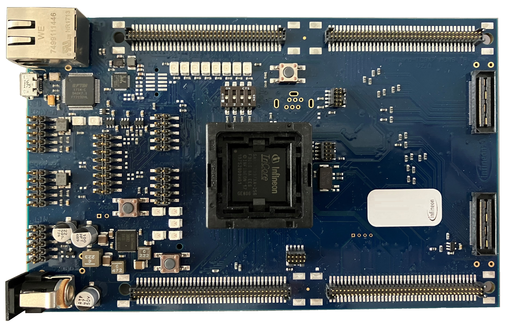
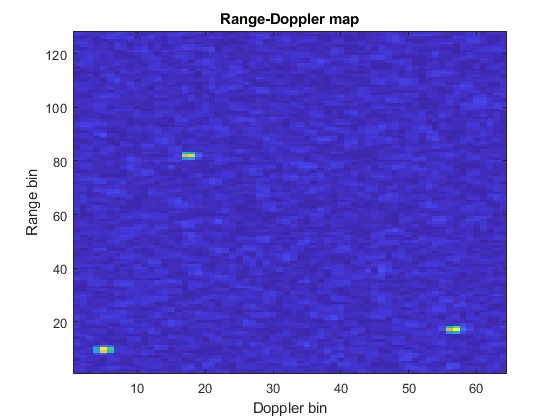
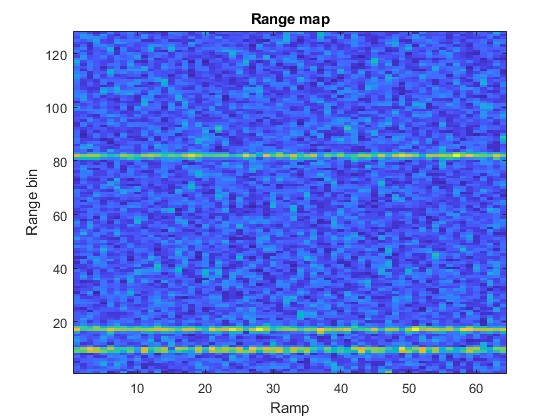
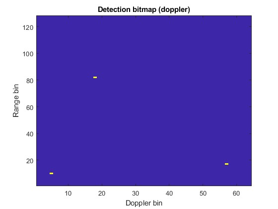
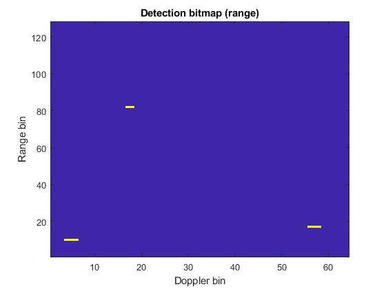
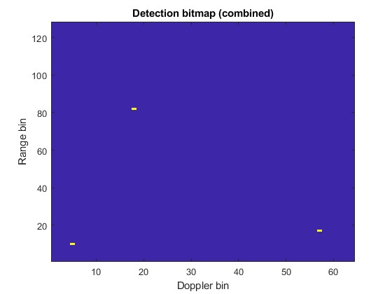

  

# iLLD_TC397X_ADS_SPU_Basics
**This code example shows the basic usage of the Signal Processing Unit (SPU), implementing a basic radar data processing flow.**  

## Device  
The device used in this example is AURIX™ TC397XA. 

## Board  
The board used for testing is the AURIX™ TC397 ADAS TriBoard V2.0 (KIT_A2G_TC397XA_TRB_S).

## Scope of work   

This project shows a basic radar data processing flow implemented on the Signal Processing Unit (SPU) hardware. The processing flow includes range-doppler processing of a raw data cube and subsequent target detection using CFAR.
This code example uses a simulated dataset as input, Radar interface (RIF) configuration is not shown.

Basic understanding of FMCW radar range-doppler signal processing is presumed to follow this code example.

## Introduction  
AURIX™ 2nd generation radar microcontrollers (TC3x) use a hardware accelerator called the Signal Processing Unit (SPU) to extract information from radar data. 
This example utilizes various functions offered by the SPU to implement a basic processing flow consisting of the following steps:
1. Windowing + range FFT
2. Transpose, windowing + doppler FFT
3. Non-coherent integration (NCI) across the four RX antennas
3. CFAR of the NCI data in doppler dimension 
4. CFAR the NCI data in range dimension 
5. Combination of the two detection bitmaps

The radar data cube and both intermediate and final results are stored in the Extension memory (EMEM) during processing. This is a dedicated memory for radar data.

## Hardware setup  
This code example was developed for the AURIX™ TC3x7 ADAS TH V2.0 TriBoard, using a AURIX™ TC397XA microcontroller.

  

## Implementation  
**Simulated radar data in data.c/h **

The file data.c contains the simulated input dataset. The simulation data was based on a setup of 4 RX antennas, 64 ramps and 256 samples per ramp, hence the raw data cube has a size of 64x4x256.The dataset (raw data cube) shows three radar targets with the following properties:
Target 1: range=1m, speed=5.6km/h
Target 2: range=3m, speed=-11.1km/h
Target 3: range=11m, speed=22.2km/h  

The following image shows the data after range-doppler processing, with the three targets clearly visible as peaks.

**Program flow**

*core0_main()* starts by initializing the necessary hardware, that is the MTU (Memory Test Unit, to clear SRAMs), the EMEM (Extension memory, where the radar data is stored during processing) and the SPU (Signal Processing Unit, the radar signal processing accelerator).

After the hardware components have been initialized, the SPU processing flow is set up. The desired processing flow is broken down into three "configurations". Each "configuration" represents a specific set of SPU functionality that is enabled during one pass of data through the SPU. The three configurations are saved to the SPU config RAM, and a linked list is generated that automatically executes the three configurations in sequence (see *Spu0_cfg_init()*).

Here is a detailed overview of the signal processing steps performed by each of the three configurations:

CONFIG1: IfxSpu0_Cfg1_rangeFFT
- Load raw data cube from EMEM (<-rangeMap.adc_raw)
- Apply window 
- Compute range FFT
- Bin rejection: drop symmetric half of FFT output
- Store FFT output to EMEM, overwriting raw data (->rangeMap.rMap) 

CONFIG2: IfxSpu0_Cfg2_dopplerFFT 
- Load range FFT data from EMEM (<-rangeMap.rMap)
    --(Data is transposed during load to load it in the correct order for further processing)
- Apply window
- Compute doppler FFT
- Store doppler FFT output to EMEM (->rdMap)
- Compute NCI across the four RX and store to EMEM (->nci)
- Perform local maximum search & CFAR in doppler dimension on NCI result
- Store result of lclmax/CFAR to EMEM (->lclMaxVMap)

CONFIG3: IfxSpu0_Cfg3_rLclMax
- Load 'rdMap' from EMEM (data load is transposed in comparison to Config2) (<-rdMap)
- Compute NCI across the four RX
- Perform local maximum search & CFAR in range dimension on NCI result
- Store result of lclmax/CFAR to EMEM (->lclMaxRMap)

After setting up the configurations and the linked list, the function *IfxSpu_reloadConfig()* is called. This loads the first configuration of the linked list and triggers the SPU to start processing. Once the SPU is done with all configurations, the SPU attention interrupt is generated. 
Inside the interrupt service routine *ISR_spu0_attn()*, the two detection bitmaps are combined into a single detection bitmap (overwriting *lclMaxRMap*) by applying a logical AND operator .

After the two bitmaps have successfully be combined, the *g_rdr.spuOk* variable is incremented from 0 to 1 to indicate the end of the data processing.

## Compiling and flashing
Before testing this code example:  
+ Power the board through the dedicated power connector 
+ Build the project using the dedicated Build button  or by right-clicking the project name and selecting "Build Project"
+ To flash the device and immediately run the program, click on the dedicated Flash button  

## Run and Test   

Flash and run the code example.
Next, check the value of the g_rdr.spuOk variable. A value of "1" indicates that the SPU has processed the data successfully.
After processing, the results (and intermediate results) are stored in EMEM (see g_rdr.emem.x) . The following figures show visualizations of the radar data cube and the detection bitmaps during the different processing steps:

The result of the range FFT (g_rdr.emem.rangeMap.rMap, only data from first RX antenna shown):

  

The range-doppler map (g_rdr.emem.rdMap, only data from first RX shown)

  

The detection bitmap in doppler dimension:

  

The detection bitmap in range dimension:

  

The combined detection bitmap:

  

## References  

AURIX™ Development Studio is available online:  
- <https://www.infineon.com/aurixdevelopmentstudio>  
- Use the "Import..." function to get access to more code examples  

More code examples can be found on the GIT repository:  
- <https://github.com/Infineon/AURIX_code_examples>  

For additional trainings, visit our webpage:  
- <https://www.infineon.com/aurix-expert-training>  

For questions and support, use the AURIX™ Forum:  
- <https://community.infineon.com/t5/AURIX/bd-p/AURIX>  
