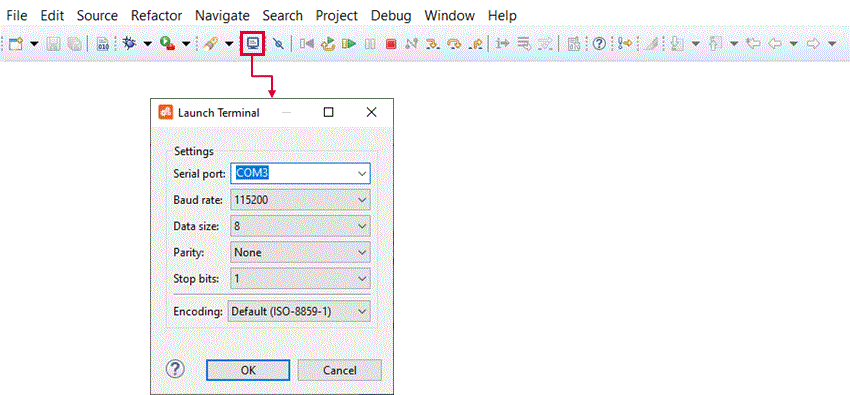
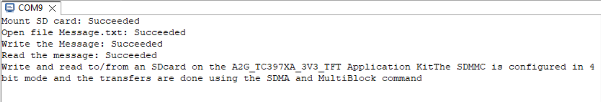

# iLLD_TC397_3V3_ADS_SDCard_SDMMC_Read_Write
**Write and read a text file in an SD_Card connected to the SDMMC peripheral.**

## Device 
The device used for this code example is the AURIX&trade; TC39xXX_B-Step.

## Board
Board used for testing is the AURIX&trade; TC397 application Kit (KIT_A2G_TC397_3V3_TFT), The 3V3 version of the application kit have the SDMMC connected to the SDCard slot.

## Scope of work
The SDMMC is initialized in 4 bit configuration with SDMA mode.
Using the FatFs file system the SDCard is mounted and a message is written into text file "Message.txt" (the file is created if inexistent).
The text file is then read and the message is displayed on the serial terminal.

## Introduction
The SDCard can be used to log data and easily transfer it to your PC, when reading and writing big files it is more convenient to use the SDMA multi block transfer modes for better performance.  

## Hardware setup
This code example has been developed for the APPLICATION KIT TC397 V2.0 (KIT_A2G_TC397XA_3V3_TFT).
The board should be connected to the PC via USB, in order to allow the UART connection.

  

A microSD card shall be installed in the SD slot of the board.  
The card must be formatted as FAT32.

## Implementation  
**Configure the Project**  
Two libraries are required, which can be found in the *Libraries* folder:
- *serialio*, which overrides the standard *printf()* function to redirect the output to the serial terminal.
- *FatFS*, which contains the library to read the file system from the SD card.

**Low level disk interface**  
Low level disk I/O module for FatFs is provided in the file *Libraries/FatFS/mmc_sdmmc.c*

**Periodically servicing the SD**  
The *FatFS* library requires periodically calling the function *disk_timerproc()* to generate timing and to service the SD card.
This is done using an *IFX_INTERRUPT* generated by the System Timer Module (STM).

**Configure the ASCLIN**  
The ASCLIN (Asynchronous/Synchronous Interface) module is necessary to implement the serial communication with the terminal.

**Mounting the SD Card**  
Mounting the SD card is done by calling the *FatFS* function *f_mount()*. This function takes a reference to a *FATFS* variable, which represents the whole
file system contained in the SD card.

**Opening the Message.txt file**  
Once the file system is successfully mounted, it is possible to read its content. In particular, the program searches for the file *Message.txt*, which is 
created if not found within the SDCard.  
This is done by calling the function *f_open()*. It allows the user also to specify which mode to use to open a file:
- FA_READ	            Specifies read access to the file. Data can be read from the file.
- FA_WRITE	        Specifies write access to the file. Data can be written to the file. Combine with FA_READ for read-write access.
- FA_OPEN_EXISTING	Opens a file. The function fails if the file is not existing. (Default)
- FA_CREATE_NEW	    Creates a new file. The function fails with FR_EXIST if the file is existing.
- FA_CREATE_ALWAYS	Creates a new file. If the file is existing, it will be truncated and overwritten.
- FA_OPEN_ALWAYS  	Opens the file if it is existing. If not, a new file will be created.
- FA_OPEN_APPEND	    Same as FA_OPEN_ALWAYS except the read/write pointer is set end of the file.

**Writing to the file**  
The SDMMC is configured to use the SDMA and MultiBlock commands to send the data, this is more efficient with big amout of data.
The function *f_write()* writes the data to the file, sizeof(&txData) is the number of data to be written and Nb_Data return the number of data successfully written.
If Nb_Data is equal to sizeof(&txData) then the write operation is a success.

**Closing the file**  
After the write function, the file is closed with *f_close()* this operation is needed to flush any cached data to the SD card.

**Reading the file**  
The SDMMC is configured to use the SDMA and MultiBlock commands to read the data, this is more efficient with big amout of data.
The function *f_read()* reads the data from the file, sizeof(&rxData) is the number of data to be read and Nb_Data return the number of data successfully written.
If Nb_Data is equal to sizeof(&rxData) then the read operation is a success.
 
## Compiling and programming
Before testing this code example:
- Power the board through the dedicated power connector
- Connect the board to the PC through the USB interface
- Build the project using the dedicated Build button  or by right-clicking the project name and selecting "Build Project"
- To flash the device and immediately run the program, click on the dedicated Flash button 

## Run and Test  
For this example, a serial terminal is required for visualizing the text. The terminal can be opened inside the AURIX&trade; Development Studio using the following icon:  

  

The serial terminal must be configured with the following parameters to enable the communication between the board and the PC:  
- Speed (baud): 115200
- Data bits: 8
- Stop bit: 1

After code compilation and flashing the device, check the open terminal window on AURIX&trade; Development Studio, which looks like the following:  

  

## References  

AURIX&trade; Development Studio is available online:  
- <https://www.infineon.com/aurixdevelopmentstudio>  
- Use the "Import..." function to get access to more code examples  

More code examples can be found on the GIT repository:  
- <https://github.com/Infineon/AURIX_code_examples>  

For additional trainings, visit our webpage:  
- <https://www.infineon.com/aurix-expert-training>  

For questions and support, use the AURIX&trade; Forum:  
- <https://community.infineon.com/t5/AURIX/bd-p/AURIX> 
