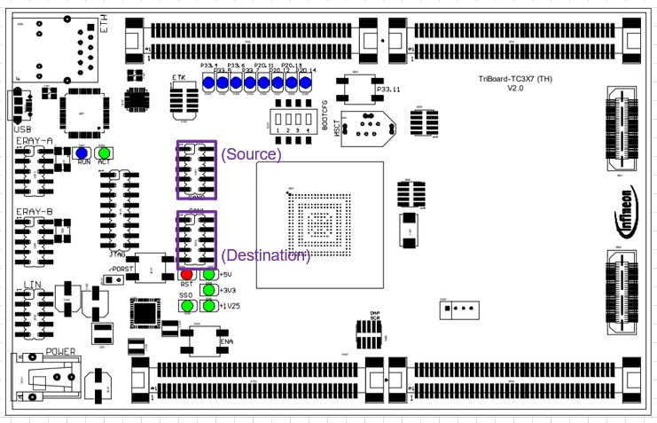

<imp src="./Images/IFX_LOGO_600.gif" align="right" width="150" /> 

# iLLD_TC397_ADS_CAN_Gateway_ISR

**This example shows how to use the ISR for routing CAN frame received on one bus to another bus**

## Device 
The device used in this example is AURIX™ TC39xB-step

## Board 
The board used for testing is AURIX™ TC397 ADAS TriBoard (KIT_A2G_TC397XA_TRB).

## Scope of work 
Some applications require an automatic CAN frames re-routing between two different CAN busses without CPU interaction.
Such a "gateway" feature is not available in MCMCAN module of TC3xx family devices.
This example shows how to implement a "SW gateway“ for routing CAN frame by using the ISR (Interrupt service routine).

CAN0 (CAN0 node0) is configured as "gateway source" and CAN1 (CAN1 node0) as "gateway destination".
The defined messages restored in the RxFIFO on the "gateway source" will be rerouted to "gateway destination" by using the ISR.
In order to avoid message losing due to CPU latency the RxFIFO is configured on the source node; while TxFIFO is configured on
the destination node in order to avoid delayed transmission due to higher load on the destination bus.

## Introduction 
MCMCAN is the CAN interface in the AURIX™ TC3xx family and supports Classical CAN and CAN FD according to the ISO 11898-1
There are 3 MCMCAN modules consists of 4 CAN nodes. Each CAN node communicates over two pins (TXD and RXD). Additionally, there is an internal Loop-Back Mode functionality available for test purposes.
A configurable Message RAM is used to store the messages to be transmitted or received. The message RAM is shared by all the CAN nodes within a MCMCAN module.

## Hardware setup 
This code example has been developed for the AURIX™ TC3X7 ADAS TH V2.0 TriBoard (KIT A2G TC397XA TRB), but should as well work on any other AURIX™ 2nd generation microcontroller with minor modifications. To run this example an additional external hardware (the CAN tool, e.g. CANalyzer from Vector or PCAN from PEAK ) is needed to connect to both CAN interfaces on the TriBoard.

 

## Implementation 
**MCMCAN** Module initialization:

A default CAN module configuration is loaded into the configuration structure by using the function *IfxCan_Can_initModuleConfig()*. Afterwards, the initialization of the CAN module with the user configuration is done with the function *IfxCan_Can_initModule()*.

Source node initialization:
- A default CAN node configuration is loaded into the configuration structure by using the function *IfxCan_Can_initNodeConfig()*. Source node (CAN0) uses the CAN node 0 of the module 0 for CAN/CANFD reception with 500K/2M baud rate in RxFIFO mode. The RxFIFO buffers are used to receive the CAN messages with expected IDs and the filter elements are configured respectively. CAN0 is initialized by calling *IfxCan_Can_initNode()* function.
- The configuration structure of the CAN filter assigns the CAN filter 0 to the RxFIFO1. The acceptance criteria in this case are the matching message ID values. Afterwards, the initialization of the CAN filter with the user configuration is done with the function *IfxCan_Can_setStandardFilter()*
- Interrupt for each successful receive (Rx FIFO 1 New Message) is enabled and assigned CPU service.  

Destination node initialization:
- A default CAN node configuration is loaded into the configuration structure by using the function *IfxCan_Can_initNodeConfig()*. Destination node (CAN1) uses the CAN node 0 of the module 1 for CAN/CAN FD transmission with 500K/1M baud rate. TxFIFO is used for transmission. CAN1 initialized by calling *IfxCan_Can_initNode()*function.

**Reception and routing CAN messages**

When a message is accepted by the acceptance filtering, *can0IsrRxHandler()* ISR is triggered.
In the RxFIFO ISR: 
- Clear Interrupt flag
- Read all messages from the RxFIFO and release RxFIFO element by call *IfxCan_Can_readMessage()* 
- Modify (ID, DLC, etc., note: here only changing ID from 0x7B to ox55) the Rx message according your needs, get the next free TxFIFO buffer via *IfxCan_Node_getTxBufferElementAddress()*
- Write the Tx frame message in to the HW TxBuffer and give the Tx trigger to transmit it on the destination bus 

## Compiling and programming

Before testing this code example: 
- Power the board through the dedicated power connector 
- Connect the board to the PC through the USB interface
- Build the project using the dedicated Build button  or by right-clicking the project name and selecting "Build Project"
- To flash the device and immediately run the program, click on the dedicated Flash button  
- To start a debug session, click on the Debug button  and create a configuration for a debugger (double clicking on the debugger name, a default configuration is created)

## Run and Test 
After code compilation and flashing the device, perform the following steps:
1. Start the CAN tool box, set channel 1(connected to the source node)  to 500K/2M and channel 2 (connected to the destination node) to 500K/1M
(or load the configuration file *..\CANalyzer_tool\CANaylzerV16_test.cfg* in case Vector CANalyzer tool is used)
2. From the CAN tool box send a message with ID 0x7B (on the Bus 1), In the CAN trace window observe a routed CAN message with ID 0x55 having the same DLC and data is transmitted on the Bus 2

In this example the source node (CAN0) and destination node (CAN1) both are configured in CAN FD with the max. 64 data bytes for reception/transmission, so it can be used for routing message in Classical CAN as well as in CAN FD   
 
** CAN/CANFD Trace ** 

 

## References 

AURIX&trade; Development Studio is available online: 
- <https://www.infineon.com/aurixdevelopmentstudio> 
- Use the "Import..." function to get access to more code examples 

More code examples can be found on the GIT repository: 
- <https://github.com/Infineon/AURIX_code_examples> 

For additional trainings, visit our webpage: 
- <https://www.infineon.com/aurix-expert-training> 

For questions and support, use the AURIX&trade; Forum: 
- <https://community.infineon.com/t5/AURIX/bd-p/AURIX> 