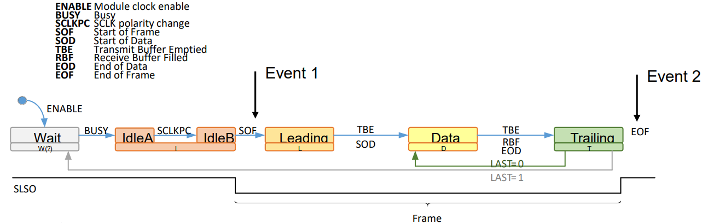
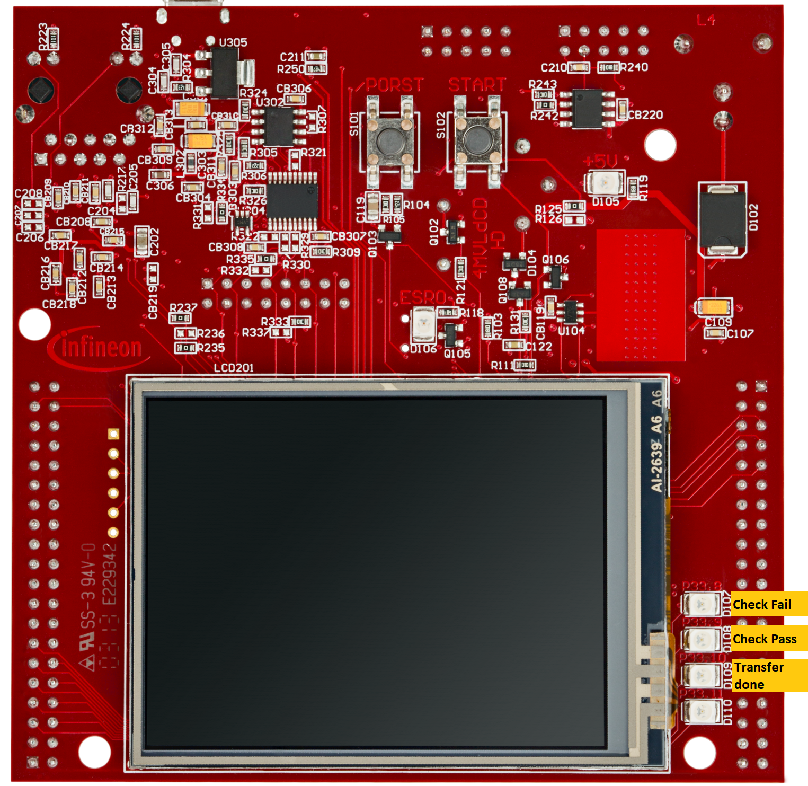
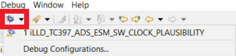
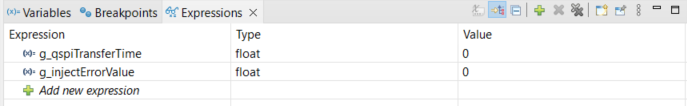
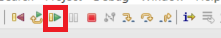
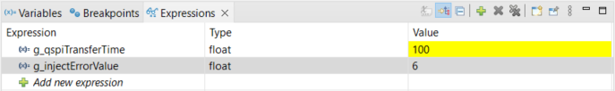

# iLLD_TC397_ADS_ESM_SW_CLOCK_PLAUSIBILITY  
**This code example presents the implementation of software based Clock Plausibility.**

## Device  
The device used in this example is AURIX™ TC39xXX_B-Step 

## Board  
The board used for testing is the AURIX™ APPLICATION KIT TC397 V2.0 (KIT_A2G_TC397_5V_TFT)

## Scope of work 
The scope of this project is to understand how to implement a software based clock plausibility
ESM (External Safety Mechanism). Application Software (SW) shall evaluate the different clock frequencies
provided by Peripheral PLL Configuration 1 register (PERPLLCON1.K2, PERPLLCON1.K3) with a time measurement
based on System PLL Configuration 1 register (SYSPLLCON1.K2) clock frequency, where K2 and K3 are divider
values. If the measured and expected clock frequency values does not match, the application SW shall
trigger an alarm.

## Introduction
The Safety Mechanism (SM) is defined as a technical implementation or safety measure to avoid or control fault in a system, SMs are internal to Microcontroller (MUC) either in SW or HW (Hardware), while ESM is the technical implementation which should be implemented on system level by the system integrator. Top-Level Safety Requirement (TLSR) are functional safety goals which are defined to reduce risk. One of the TLSR is Avoidance or Detection of Common Cause Failure (CCF) with ASIL D, where software based clock plausibility ESM is also part of it. To implement this ESM, Queued Synchronous Peripheral Interface (QSPI) module is used, time measurement is done via System Timer (STM) module and LEDs are used as replacement of an alarm trigger.

**Note:** There is no legal binding or no Automotive Safety Integrity Level (ASIL) claim, it is just a code example.

## Hardware setup  
The hardware used is Application Kit TC397 (KIT_A2G_TC397_5V_TFT) from Infineon.

 

## Implementation

__Theoretical Calculation__

As the application SW need to compare the measured value to expected value, therefore the following theoretical calculation is done to get the expected value. 
This expected value is put then in code as macro named *"EXPECTED_TIME"*. The following figure show the flow of QSPI frame transfer.

 

The steps needed to calculate the expected value are as below

- A QSPI frame starts with activating a **SL**ave **S**elect **O**utput (SLSO) signal and ends with its deactivation. It is a sequence of three 
phases: leading delay, data phase and trailing delay (above figure):
    - **Tframe** = **Tleading** + **Tdata** + **Ttrailing**, where
      - Tleading is the time taken by leading delay
      - Ttrailing is the time taken by trailing delay
      - Tdata is the amount of time taken by data transfer
    
      
- Minimum value for leading and trailing delays is TQSPI. Assuming a QSPI clock frequency of 200 MHz:
    - **Tleading** = **Ttrailing** = TQSPI = 1/fQSPI = 1/200MHz = 0.005µs
   
    
- Assuming that data length is 125 bytes (1000 bits) and baud rate is 10 MHz:
    - **Tdata** = 1000 * 1/10MHz = 100 µs
    
    
- The Tframe will be: 
    - **Tframe** = 0.005 + 100 +0.005 = 100.01 µs
      - This value of **Tframe** is defined as macro *EXPECTED_TIME*  in source code 
      - Maximum (in code as *"TRANSFER_TIME_MAX_LIMIT"*) and Minimum (in code as *"TRANSFER_TIME_MIN_LIMIT"*) limits of +-5% are calculated with *EXPECTED_TIME*
      - The clock plausibility is checked according to these limits in the function *"checkClockPlausibility(void)"* in source code
     
     
- Start Of Frame (SOF) and End Of Frame (EOF) interrupts can be used to measure the length of a frame
    - Configure and enable QSPI Phase Transition (PT) events. 
    - ‘Event 1’ is configured as SOF, ‘event 2’ is configured as EOF

- STM timer is read on both PT events. In this way it is possible to measure the duration of the frame

- Extra-large (XXL) mode is used to send long frames. Direct Memory Access (DMA) shall be used to minimize data transfer delays

- Recommended to use QSPI interrupt and DMA channels with highest priority

__Measurement via Source Code__

QSPI5 is used for this implementation and following steps are used: 

- Initialize QSPI5 module with following configuration

    - QSPI Clock Frequency 200MHz
    - Master mode
    - XXL mode (125 Bytes)
    - DMA enabled
    - Baud rate 10MHz
    - Enable Phase Transition (PT) interrupt

- Fill data into transmit buffer of size 125 Bytes

- Capture the time via STM timer on two PT interrupt
 
    - First interrupt occur at the Start of Frame (SOF) 
    - Second interrupt occur at the End of Frame (EOF)

- Calculate the difference EOF time and SOF time taken via STM timer

- Check the resulting value if it is within the range of theoretical values limit and react accordingly 

## Compiling and programming

Before testing this code example:  
- Power the board through the dedicated power connector 
- Connect the board to the PC through the USB interface
- Build the project using the dedicated Build button  or by right-clicking the project name and selecting "Build Project"
- To flash the device and immediately run the program, click on the dedicated Flash button 

## Run and Test

After code compilation and flashing the device, The following attributes can be seen.

Three LEDs are used as reaction: 
- D107, LED is on, if the measured value is not in the range of theoretical calculated value (Check Fail)
- D108, Toggling with 500ms, if the value is under the range (Check Pass)
- D109, Toggling with 500ms, every time the QSPI data transfer is done 

 

__Debug__

if you want to insert an error (value above the limit), follow the following steps:
- Connect the USB cable to Board and to PC 
- Go to debug mode of AURIX™ Development Studio (ADS)

 
 
- Add "g_qspiTransferTime" and "*g_injectErrorValue*" to the watch expressions window

 

- Resume/run the code, D108 and D109 will be toggling at 500ms

 

- Now pause program to see the value of "*g_qspiTransferTime*" and "*g_injectErrorValue*"

 

- To inject error, change "*g_injectErrorValue* = 6 " in Expressions window and resume program again

 

- D107 will be On (D108 will be off) indicating that the Clock Plausibility check has failed and the value has exceeded the limit
- To remove error, set "*g_injectErrorValue* = 0 ", D107 will be off and D108 will be toggling again

## References 

AURIX™ Development Studio is available online:  
- <https://www.infineon.com/aurixdevelopmentstudio>  
- Use the "Import..." function to get access to more code examples  

More code examples can be found on the GIT repository:  
- <https://github.com/Infineon/AURIX_code_examples>  

For additional trainings, visit our webpage:  
- <https://www.infineon.com/aurix-expert-training>  

For questions and support, use the AURIX™ Forum:  
- <https://community.infineon.com/t5/AURIX/bd-p/AURIX> 
