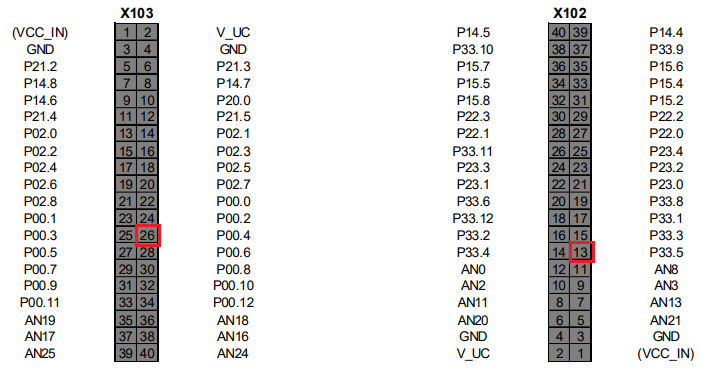
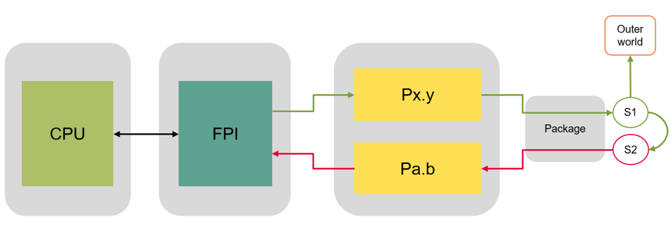

# iLLD_TC397_ADS_PORT_LOOPBACK
**This code example presents the implementation of port loopback safety mechanism**

## Device 
The device used in this example is AURIX™ TC39xXX_B-Step 

## Board 
The board used for testing is the AURIX™ APPLICATION KIT TC397 V2.0 (KIT_A2G_TC397_5V_TFT)

## Scope of work 
The scope of this project is to understand how to implement a software based Port loopback 
Safety Mechanism (SM). The application Software (SW) shall configure and use redundant General Purpose 
Input Output (GPIO) to detect faults when receiving or transmitting the information. 

## Introduction
The Safety Mechanism (SM) is defined as a technical implementation or safety measure to avoid or control fault in a system, the microcontroller (MUC) has SMs internally either in SW or HW (Hardware), while there are SMs which should be implemented on system level by the system and application engineer. Port loopback is one of the SMs which need to be implemented by system integrators in their application. 

**Note:** There is no legal binding or no Automotive Safety Integrity Level (ASIL) claim, it is just a code example.

## Hardware setup 
The hardware used is Application Kit TC397 (KIT_A2G_TC397_5V_TFT) from Infineon.

 

The pinout of the two connectors of AURIX™ APPLICATION KIT TC397 V2.0 are given below, the highlighted (red) pins are used in this code example. Please connect the two pins with each other through connecting wires. 

## Implementation

The port loopback is implemented in the way that the mission channel S1 is a safety critical output signal which is going toward outer world via general purpose output pin Px.y (P00.4). Meanwhile a general purpose input pin "Pa.b(P33.5) " capture the output data by using loopback mechanism and this signal is called monitor signal S2. The application software is then comparing both signals, S1 and S2, with 100ms cycle and if there is mismatch, then appropriate reaction shall be taken. The following figure illustrate the port loopback mechanism

 

The application software shall avoid the common cause failures (CCF) on the port level by selecting mission port signal (i.e. P00.4) to use in valid region by taking into account the region of the monitor signal (i.e. P33.5). 

## Compiling and programming

Before testing this code example: 
- Power the board through the dedicated power connector 
- Connect the board to the PC through the USB interface
- Build the project using the dedicated Build button  or by right-clicking the project name and selecting "Build Project"
- To flash the device and immediately run the program, click on the dedicated Flash button 

## Run and Test

After code compilation and flashing the device, the following attributes can be seen.

Two LEDs are used for status check: 
- **D107**, LED is on, if the signal S1 is equal to signal S2. This can be observed when the P00.4 is connected to P33.5 (Check Pass)
- **D108**, LED is on, if the signal S1 is not equal to signal S2 which mean there is mismatch. This can be observed when the P00.4 is disconnected to P33.5 (Check Fail)

To inject the error and see the mismatch, disconnect the mission pin from monitor pin. It mean what is emitting from output is not capturing by input pin, hence there is fault in the system. An appropriate reaction shall be taken by application software i.e. trigger software alarm.

## References 

AURIX™ Development Studio is available online:  
- <https://www.infineon.com/aurixdevelopmentstudio>  
- Use the "Import..." function to get access to more code examples  

More code examples can be found on the GIT repository:  
- <https://github.com/Infineon/AURIX_code_examples>  

For additional trainings, visit our webpage:  
- <https://www.infineon.com/aurix-expert-training>  

For questions and support, use the AURIX™ Forum:  
- <https://community.infineon.com/t5/AURIX/bd-p/AURIX> 
