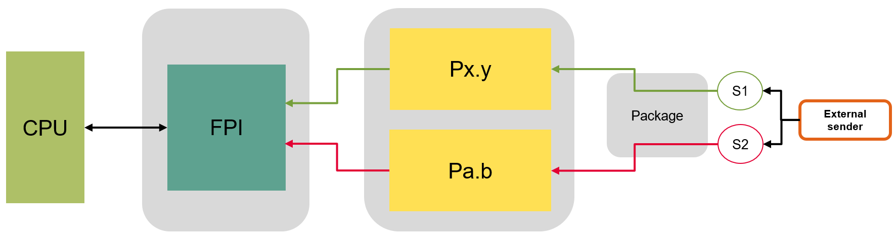

# iLLD_TC397_ADS_PORT_REDUNDANCY
**This code example presents the implementation of port redundancy safety mechanism**

## Device 
The device used in this example is AURIX&trade; TC39xXX_B-Step 

## Board 
The board used for testing is the AURIX&trade; APPLICATION KIT TC397 V2.0 (KIT_A2G_TC397_5V_TFT)

## Scope of work 
The scope of this code example is to understand how to implement a software based port redundancy 
safety mechanism (SM). The application software (SW) shall configure and use redundant General Purpose 
Input Output (GPIO) to detect faults when receiving or transmitting the information. 

## Introduction
The safety mechanism (SM) is defined as a technical safety measure to avoid or control fault in a system, the microcontroller (MUC) has SMs internally either in software (SW) or Hardware (H)W , while there are SMs which should be implemented on system level by the system and application engineer. Port redundancy is one of the SMs which need to be implemented by system integrators in their application. This SM can be implemented with two different assumption scenario

1.  The application software sends a safety critical output value called as mission signal S1 on pin Px.y to an external receiver.  To detect fault on the signal S1, the application software drives a redundant signal called monitor signal S2 carry the same information on pin Pa.b to the receiver. 
2.  The application software receives a safety critical input value called as mission signal "S1" on pin Px.y from an external sender. To detect fault on S1, it receive the same signal on pin Pa.b. The information on signal S1 and S2 are compared cyclically and react accordingly in case of fault. 
    
The second scenario is implement in this code example. 

**Note:** There is no legal binding or no Automotive Safety Integrity Level (ASIL) claim, it is just a code example.

## Hardware setup 
The hardware used is Application Kit TC397 (KIT_A2G_TC397_5V_TFT) from Infineon.

 

The pinout of the two connectors of AURIX&trade; APPLICATION KIT TC397 V2.0 are given below, the highlighted pins are used in this code example. Connect the two pins i.e. mission signal and monitor signal (highlighted as green) to the external sender (highlighted as red) through connecting wires. 

## Implementation

The port redundancy is implemented in the way that a safety critical input value (called mission signal as S1) on the pin Px.y (P02.3) from external sender (in this example it is V_UC). In order to detect fault in the mission signal S1, the same information is provided on another pin Pa.b (P23.2) and this signal is called as monitor signal S2. The application software is then comparing both signals, S1 and S2, cyclically with 100ms cycle and if there is any mismatch, then appropriate reaction shall be taken. The following figure illustrate the port redundancy mechanism

 

The application software shall avoid the common cause failures (CCF) on the port level by selecting mission port signal (i.e. P02.3) and monitor port signal (i.e. P23.2), sufficiently separated.

## Compiling and programming

Before testing this code example: 
- Power the board through the dedicated power connector 
- Connect the board to the PC through the USB interface
- Build the project using the dedicated Build button  or by right-clicking the project name and selecting "Build Project"
- To flash the device and immediately run the program, click on the dedicated Flash button 

## Run and Test

After code compilation and flashing the device, The following attributes can be seen.

Two LEDs are used for status check: 
- **D107**, LED is on, if the signal S1 is equal to signal S2. This can be observed when the P02.2 and P23.2 are connect to external signal (V_UC) (Check Pass)
- **D108**, LED is on, if the signal S1 is not equal to signal S2 which mean there is mismatch. This can be observed when the P02.3 signal value is not equal to  P23.2 signal value (Check Fail)

To inject the error and see the mismatch, disconnect the monitor signal i.e. S2 from external sender. Therefore when it is compared by application software, the mission signal which connected V_UC will not be equal to monitor signal and hence there is fault. An appropriate reaction shall be taken by application software i.e. trigger software alarm.

## References 

AURIX&trade; Development Studio is available online:  
- <https://www.infineon.com/aurixdevelopmentstudio>  
- Use the "Import..." function to get access to more code examples 

Application Kit AURIX&trade; TC397 V2.0:  
- <https://www.infineon.com/cms/en/product/evaluation-boards/kit_a2g_tc397_5v_tft/> 

More code examples can be found on the GIT repository:  
- <https://github.com/Infineon/AURIX_code_examples>  

For additional trainings, visit our webpage:  
- <https://www.infineon.com/aurix-expert-training>  

For questions and support, use the AURIX&trade; Forum:  
- <https://community.infineon.com/t5/AURIX/bd-p/AURIX> 
