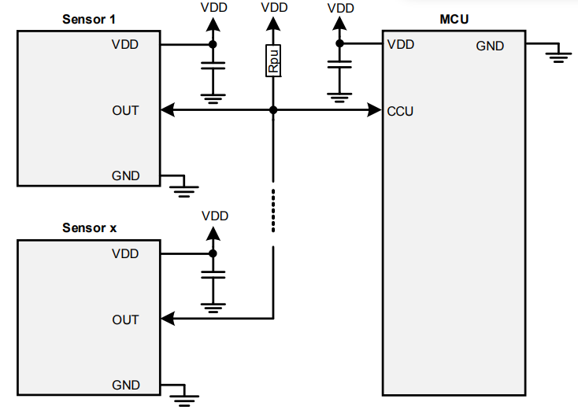
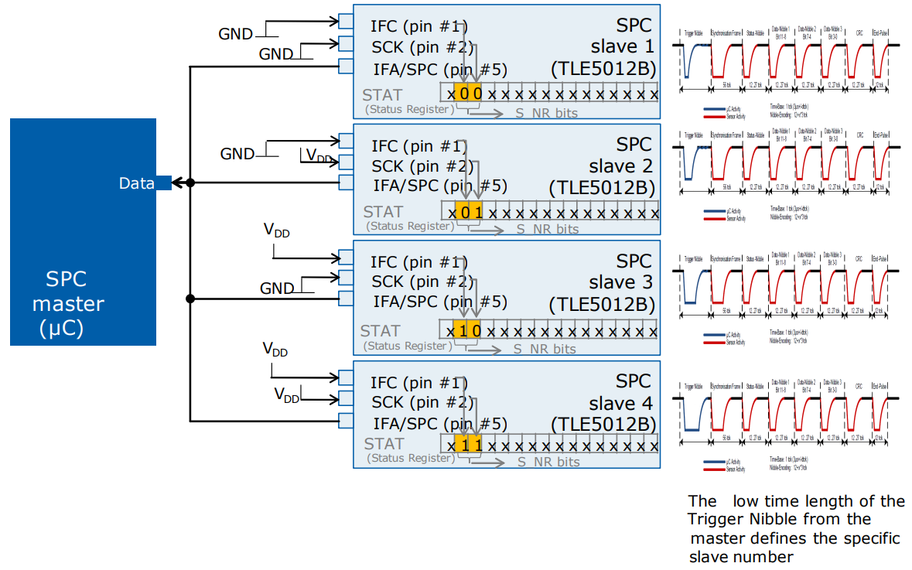
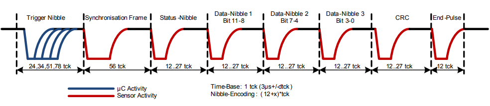
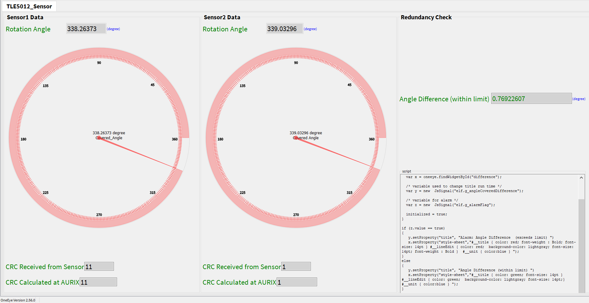
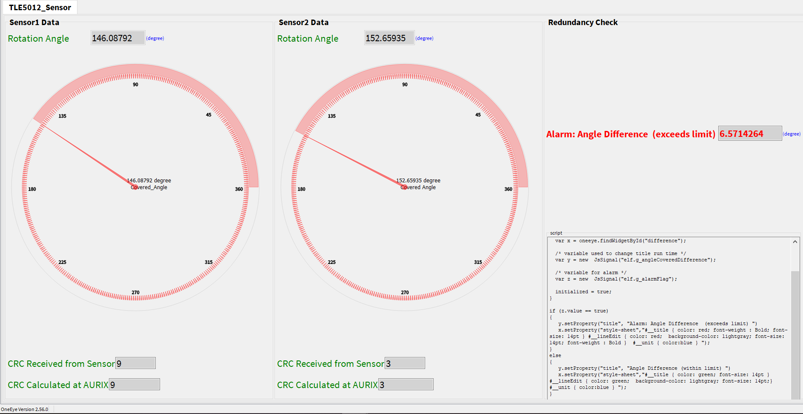
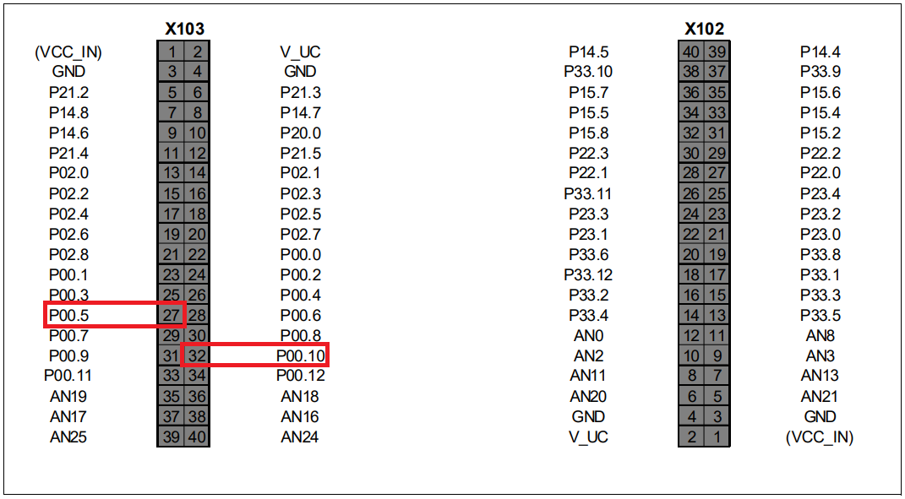
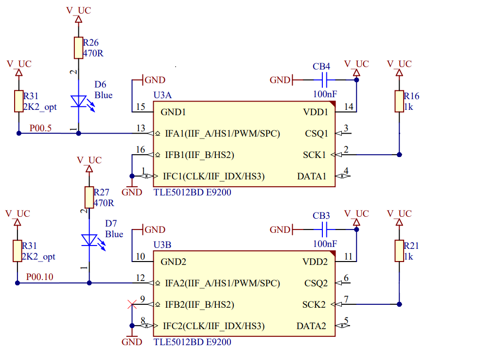

  

# iLLD_TC397_ADS_SENT_Redundancy_SPC_Trig_TLE5012_GTM_TOM
**Example of SENT SPC communication to interface TLE5012 GMR angle sensor.**  

## Device  
The device used in this example is AURIX™ TC39xXX_B-Step

## Board  
The board used for testing is the AURIX™ APPLICATION KIT TC3X7 V2.0 (KIT_A2G_TC397_5V_TFT) 

## Scope of work   
This example demonstrates the Short PWM Code (SPC) protocol by interfacing an AURIX™ TC3xx Device
as master with a TLE5012 angle sensor as slave. The SPC pulse which needs to be sent by the master to
the slave is periodically triggered on each rising edge of a PWM signal generated by the Generic Timer
Module (GTM) using the Timer Output Module (TOM).

## Introduction  
The SPC protocol and the angle sensor which are used for this example are briefly explained below.

**SENT** 

The SAE J2716 SENT (**S**ingle **E**dge **N**ibble **T**ransmission) protocol is a point-to-point scheme for transmitting signal values from a sensor to a controller. It is intended to allow transmission of high resolution data with a low system cost. The SENT interface provides a serial communication link typically used to connect sensors or other off-board devices with ECU. SENT protocol allows transmission of up to 6 nibbles (1 Nibble= 4 bits) of payload data together with other protocol package data within a single fast channel frame. Each of such fast channel frame also contains one bit of slow serial data.

**SPC** 

The Short PWM Code (SPC) is a synchronized data transmission SENT based protocol defined by SAE J2716. As opposed to SENT, which implies a continuous transmission of data, the SPC protocol transmits data only after receiving a specific trigger pulse from the microcontroller. The required length of the trigger pulse depends on the sensor number, which is configurable. Thereby, SPC allows the operation of up to four sensors on one bus line. SPC enables the use of enhanced protocol functionality due to the ability to select between various sensor slaves (ID selection). The slave number (S_NR) can be given by the external circuit of SCK and IFC pin. The TLE5012 is by default in SPC mode and the detailed description of pins are given in user manual of sensor. The figure below shows a typical implementation of a bus mode using SPC interface. 

  
**TLE5012BD E9200** 

Infineon XENSIV™ offers TLE501BD E9200 digital GMR (**G**iant **M**agneto **R**esistance) angle sensors. TLE5012 GMR sensor comes in four different interface variants SPC, PWM, SENT as well as SPI. 
For this particular example TLE5012BD-E9200 is used and it is configured, by default, with following configurations:
- Preconfigured for SPC interface
- Unit time (UT) of 3 us
- Angle update time is 85.4 us
- Autocalibration, Prediction and Hysteresis are disabled
- SPC interface is set to open-drain output

Four sensors can be connected with different ID selections and ID selection is done with the connection of SCK pin and IFC pin of sensor to GND or VCC as given in figure below:

As redundancy check is also part of this example, therefore, for redundancy it is required to have two different signals. Due to this reason, two different SPC/SENT lines are used. The sensor ID for both sensors is the same i.e. ID1 = 24 * 3 us(Unit Time) = 72 us (two different IDs can be used too). 

The following picture shows the message format from the TLE5012 sensor:  
  

  
**AURIX™ TC3x SENT Peripheral**  

AURIX™ TC3x Devices implement the SENT peripheral with multiple instances. Each SENT module instance implements up to 15 channels. Please note that SENT channels also support SPC (**S**hort **P**WM **C**ode) protocol.

With this code example two SENT channels of AURIX™ TC3x are configured to interface with the dual die TLE5012BD sensor which means on one die there are two sensors available.
  
In this code example, all required functionalities to interface with the sensors are implemented within the files *TLE5012BD_SENT_SPC_Redundancy.c* and *TLE5012BD_SENT_SPC_Redundancy.h*. List of functionalities are:
- Initialization of SENT module and SENT channel with SPC mode enabled
- Initialization of GTM TOM for PWM generation to trigger SPC pulse every rising edge
- Receive interrupts for each SENT channel
- Processing of Angle Data from the sensor
- Processing of Errors
- CRC calculation
- Angle difference calculation for redundancy

This example also provides a Graphical User Interface (GUI) to observe the angle information through One-Eye Interface. The component or widget used in One-Eye GUI can be seen in the below figure. 

A script in One-Eye is written which trigger whenever the angles of two sensors exceed threshold hold. When the angle difference exceed threshold value, the Angle Difference (within limit) colored green will change to Alarm: Angle Difference (exceeds limit) colored red as shown in the below figure.

## Hardware setup  

This code example has been developed for the board AURIX™ APPLICATION KIT TC397 V2.0 (KIT_A2G_TC397_5V_TFT) and an external TLE5012BD-E9200 sensor circuit.   

    

The pinout of the two connectors of AURIX™ APPLICATION KIT TC397 V2.0 are given below, The highlighted pins are used to connect AURIX™ APPLICATION KIT TC397 V2.0 to an external TLE5012BD-E9200 sensor. 

The figure below shows the schematic circuit design of the external TLE5012BD-E9200 circuitry to the Application Kit TC397 V2.0. As the TLE5012BD is a dual die, one sensor is connected to P00.5 SENT/SPC pin and the other one is connected to P00.10 SENT/SPC pin. The ID selected for both the sensors is exactly the same, as it can be observed by the connection of SCK to VCC and IFC to GND sensor's pins (this is not mandatory, two different IDs can be used as well). 

   

## Implementation  
**Initialization of the SENT and GMT module and Channel**

Initialization of SENT is called at *Cpu0_Main.c::core0_main*. The initialization is done with the following resources and parameters. 
 
__Resources:__ 
- Sensor 1
    - SENT Module: 0, channel: 4B, SPC 4B
    - Pin: P00.5 (connected to SENT4 input B/SPC 4B)
    - GTM Module to trigger SPC Pulse: TOM2, Channel 6
    - Pin: 16.4 (TOM out) 
- Sensor 2
    - SENT Module: 0, channel: 9B, SPC 9B
    - Pin: P00.10 (connected to SENT9 input B/ SPC 4B)
    - GTM Module to trigger SPC Pulse: TOM0, Channel 6
    - Pin: 20.0 (TOM out) 

__Parameters:__  
- Unit Tick Time: 3 us
- Pause Pulse: Enabled
- CRC check: Enabled
- Slow Serial Data processing: Disabled
- SPC Mode: Enabled
- Frame data size is 3
- Nibble Swapping as:
    - Out Nibble 0 : In Nibble 2
    - Out Nibble 1 : In Nibble 1
    - Out Nibble 2 : In Nibble 0
  
Above nibble swapping arrangement is necessary because Data nibbles comes with Most Significant Nibble First.

## Compiling and programming

Before testing this code example:  
- Power the board through the dedicated power connector 
- Connect the board to the PC through the USB interface
- Build the project using the dedicated Build button  or by right-clicking the project name and selecting "Build Project"
- To flash the device and immediately run the program, click on the dedicated Flash button 

## Run and Test   
 
With a HW setup as explained earlier, the SW is deployed and the system is running: 
- If the angle difference of two sensor is greater than the threshold value or if the received CRC and the calculated CRC mismatch, then LED D107 switches On (normally it is Off). 
- The user could observe the behavior of the  sensor with One Eye tool as in the below video. To vary the angle, the user must turn the magnet knob on the sensor surface and accordingly observe the variation on One-Eye GUI. When the angle difference exceeds threshold value, the Angle Difference (within limit) colored green will change to Alarm: Angle Difference (exceeds limit) colored red as shown in the below video.

<video width="600" controls>
  <source src="Images/iLLD_TC397_ADS_SENT_Redundancy_SPC_Trig_TLE5012_GTM_TOMOneEye.mp4" type="video/mp4" />
</video>

## References

AURIX™ Development Studio is available online:  
- <https://www.infineon.com/aurixdevelopmentstudio>  
- Use the "Import..." function to get access to more code examples  

More code examples can be found on the GIT repository:  
- <https://github.com/Infineon/AURIX_code_examples>  

For additional trainings, visit our webpage:  
- <https://www.infineon.com/aurix-expert-training>  

For questions and support, use the AURIX™ Forum:  
- <https://community.infineon.com/t5/AURIX/bd-p/AURIX>

TLE5012BD-E9200 GMR angle sensor user manual and data sheet 
- <https://www.infineon.com/cms/en/product/sensor/magnetic-sensors/magnetic-position-sensors/angle-sensors/tle5012bd-e9200/>
 
