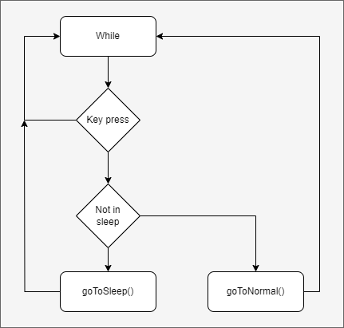
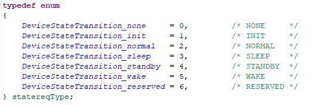
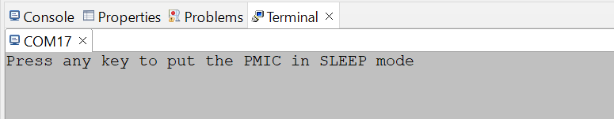

  

# iLLD_TC397_APPKIT_5V_ADS_PMIC_SLEEP_MODE  
**This code example send a request to put the Power Management IC (PMIC) TLF35584 in Sleep mode or Normal mode.**  

## Device  
The device used in this example is AURIX&trade; TC39xXX_B-Step.

## Board  
The board used for testing is the APPLICATION KIT TC3x7 V2.0 (KIT_A2G_TC397_5V_TFT).

## Scope of work  
This code example uses the Queued Synchronous Peripheral Interface (QSPI) and the Asynchronous/Synchronous Interface (ASCLIN) module to communicate with the on board PMIC and put the board in sleep mode. The CPU communicates with the PMIC via QSPI, an ASCLIN interrupt triggers the PMIC state transition to sleep or normal mode.

## Introduction  

**PMIC**  

The PMIC (Power Management IC) or PMU (Power Management Unit), is an IC used for the AURIX&trade; microcontrollers power management. With the TC3xx board, the PMIC is able to control the supply voltage applied to the board. The PMIC and microcontroller have several operational states that impact power consumption. Changing the PMIC state to low power mode (STANDBY or SLEEP) reduces the microcontroller's current consumption.

When the PMIC is in low power mode, it can be wake up by 2 different digital signals (WAK and ENA).

The state transition is done following the PMIC state machine:

**Transition prerequisites**

Before going in sleep mode the PMIC needs to respect some prerequisites:

• Before going sleep the PMIC needs to be in the NORMAL state (cf state machine). (1)

• The WAK and the ENA signal should remain low and shouldn’t be triggered during the process. (2)

• The LDO_µC current should drop under his treshold value during the state transition. (3)

 

## Hardware setup  

This code example has been developed for the board KIT_A2G_TC397_5V_TFT_BD_Step (AURIX&trade; TC375 Application Kit 5V) 

  

    Application kit front side

  

    Application kit back side   

## Implementation 

**Project overview**  

The main program and its functionalities are located in the *Cpu0_main.c* and *Sleep_conf.c* files. The *SPI_init.c* and *TLF35584.c* files are used to communicate with the PMIC and configure it. The *I2C_Read_Ext_Device.c* file is used to configure the I2C communication between the CPU and the RTC.

**Initialization of the modules**  

TriCore™ *Cpu0_Main.c* initializes the QSPI module, the ASCLIN module, I2C module and the PMIC. 

**QSPI module**

The *initQSPI()* function configures the QSPI2 module as a master and initializes the master channel and buffer. The *transferDataTLF35584(cmd, addr, data)* function is used to transmit or receive data from the PMIC's register (either a write or read command).

**ASCLIN module**

The ASCLIN Module configure the asclin0 RX interrupt on P14.1 (**USB**). When user press a key in the terminal, the interrupt is triggered for the state transition.

**I2C module**

The WAK signal needs to be set to 0 during the code execution to avoid unwanted wake up. The WAK signal is controlled by the Real Time Clock (RTC) on the board, the RTC communicates with the CPU via I2C. The I2C module is initialized by the *init_I2C_module()* function (*I2C_Read_Ext_Device.c* file) and the *read_ext_device_address()* function send a request to the RTC to disable the WAK signal.

**Prerequisites validation**  

The Button is directly linked to the ENA signal, it should remain low while not pressed. 

Before going into sleep mode the current consumption of the microcontroller needs to be lowered. The *lowPower()* function, found in the *StandBy_conf.c* file, can decrease current consumption by reducing the PLL frequency, putting all CPUs except CPU0 in idle mode, and disabling all peripherals except ASCLIN and QSPI. The *highPower()* function (*Sleep_conf.c* file) will put the board in normal consumption mode, as it was before *lowPower()*.

**Transition function**  

In the *StandBy_conf* file there are 2 functions related to state transition which send request to the PMIC: 

-   The *goToNormal()* function checks if the microcontroller is in low power mode and sets it in normal power consumption (*highPower()*). The PMIC's status flags are cleared, and a request to transition to the normal state is sent to the PMIC using the *setStateTransitionTLF35584(device, state)* function. If the transition fails, the program becomes stuck in a *while()* loop.

-   The *goToSleep()* function put the microcontroller in low power mode (*lowPower())*. The PMIC's satus flags are cleared, and a request to transition to the sleep state is send to the PMIC using the *setStateTransitionTLF35584(device, state)* function. If the transition fails the program is stucked in *while()* loop. 
  
**Main loop**

The *coreConf()* function in the *Sleep_conf.c* file contains the main loop. While no key on the keyboard has been pressed, the program is stucked in a *while()* loop. When a key is pressed, if the PMIC was in normal mode it goes into sleep mode, else it goes into normal mode. After each state transition the new state is displayed in the terminal.

After each state transition, the current state is display in the terminal, according to the following type:

## Compiling and programming

Before testing this code example:  

- Power the board through the dedicated power connector 
- Connect the board to the PC through the USB interface
- Build the project using the dedicated Build button  or by right-clicking the project name and selecting "Build Project"
- To flash the device and immediately run the program, click on the dedicated Flash button   

## Run and Test  

Before code compilation and flashing the device open the terminal.

The serial terminal must be configure with the following parameter:
- Baud rate: 19200
- Data bits: 8
- Stop bit: 1
 
After compiling and flashing the device, you can see the following message in the terminal.

 

press any key on the keyboard to start the program and you will see the state changing. 
 
## References

AURIX&trade; Development Studio is available online:

-<https://www.infineon.com/aurixdevelopmentstudio>
(Use the "Import..." function to get access to more code examples)
 
More code examples can be found on the GIT repository:

-<https://github.com/Infineon/AURIX_code_examples>

For additional trainings, visit our webpage:

-<https://www.infineon.com/aurix-expert-training> 
  
For questions and support, use the AURIX&trade; Forum:

-<https://community.infineon.com/t5/AURIX/bd-p/AURIX>