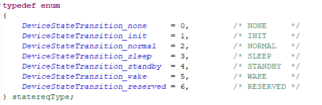
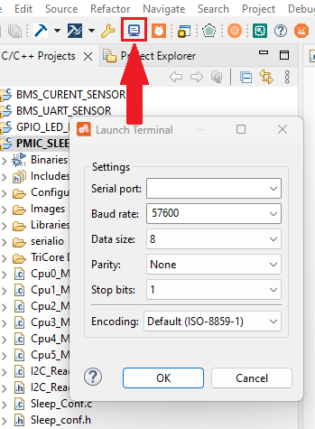

  

# iLLD_TC397_TRIBOARD_ADS_PMIC_STANDBY_MODE

**This code example send a request to put the board and STANDBY mode with the Power Management IC (PMIC).**  

## Device  

The device used in this example is AURIX&trade; TC39xXX_B-Step.

## Board  

The board used for testing is the APPLICATION KIT TC3x7 V2.0 (KIT_A2G_TC397_5V_TFT).

## Scope of work  

 
This code example uses the Queued Synchronous Peripheral Interface (QSPI) and the Asynchronous/Synchronous Interface (ASCLIN) module to communicate with the on board PMIC and put the board in standby mode, the wake-up is done by the Standby Controller (SCR). The CPU communicates with the PMIC via QSPI, an ASCLIN interrupt triggers the PMIC state transition to standby, then the board directly transits into standby mode.    

## Introduction  

**PMIC**  

The PMIC (Power Management IC) or PMU (Power Management Unit), is an IC used for the AURIX&trade; microcontrollers power management. With the TC3xx board, the PMIC is able to control the supply voltage applied to the board. The PMIC and microcontroller have several operational states that impact power consumption. Changing the PMIC state to low power mode (STANDBY or SLEEP) reduces the microcontroller's current consumption. 

When the PMIC is in low power mode, it can be wake up by 2 different digital signals (WAK and ENA).

The state transition is done following the PMIC state machine:

**Transition prerequisites**

Before going in standby mode the PMIC needs to respect some prerequisites:

• Before going standby the PMIC needs to be in the NORMAL state (cf state machine). (1)

• The WAK and the ENA signal should remain low and shouldn’t be triggered during the process. (2)

• The LDO_µC current should drop under his treshold value during the state transition. (3)

 
**SCR**

The standby controller  (SCR) is  8-bit microcontroller inside the CPU which can operate while the board is in standby. During standby, the SCR can handle the pins P33 of the TC397. To wake up the PMIC, it is possible to use the pin P33.10 link to the WAK signal. The SCR interrupt (**EXIN T6B**), which is triggered by the button (P33.11), controls the pin P33.10 (WAK signal) to wake up the board during standby.

 

## Hardware setup  

This code example has been developed for the board TC3X7_TH_V2_SN (AURIX&trade; TC375 Triboard) and the PMIC used is the TLF35584QVHS.

      

## Implementation 

**Project overview** 
 
The main program and its functionalities are located in the *Cpu0_main.c* and *StandBy_conf.c* files. The *SPI_init.c* and *TLF35584.c* files used to communicate with the PMIC and configure it. The *SCR* file and folder are used for the SCR.   

**Initialization of the modules**  

TriCore™ *Cpu0_Main.c* initializes the QSPI module, the ASCLIN module, the SCR and the PMIC. 

**QSPI module**

The *initQSPI()* function configures the QSPI2 module as a master and initializes the master channel and buffer. The *transferDataTLF35584(cmd, addr, data)* function is used to transmit or receive data from the PMIC's register (either a write or read command).

**ASCLIN module**

The ASCLIN Module configures the asclin0 RX interrupt on P14.1 (**USB**). When user press a key in the terminal, the interrupt is triggered for the state transition.

**SCR**

The SCR is initialized with the function *standbyControllerInit()* (*Standby_conf.c* file). The main SCR program (in the *SCR* folder) initializes the external interrupt and the pin state (LED, Button, WAK). The interrupt function *ex6_interrupt()* toggles the state of the LED and the pin P33.10 (WAK).

**Standby configuration**

The function *standbyInit()* (*StandBy_conf* file) allows the board to go into standby mode when the PMIC goes to standby state (VEXT ramp down) by modifying **PMSWCR0** register. 

**Prerequisites validation** 
 
The function *SLEEPConfig()* in *TLF35584.c* file let the SCR control the WAK signal with the pin P33.10.

 

The Button ENA is directly link to the ENA signal, it should remains low while not pressed. 

Before going into standby mode the current consumption of the microcontroller needs to be lowered. The *lowPower()* function, found in the *StandBy_conf.c* file, can decrease current consumption by reducing the PLL frequency, putting all CPUs except CPU0 in idle mode, and disabling all peripherals except ASCLIN and QSPI. The *highPower()* function(*StandBy_conf.c* file) will put the board in normal consumption mode, as it was before *lowPower()*.

**Transition function**  

In the *StandBy_conf* file there are 2 functions related to state transition which send request to the PMIC: 

-   The *goToNormal()* function checks if the microcontroller is in low power mode and sets it in normal power consumption (*highPower()*). The PMIC's status flags are cleared, and a request to transition to the normal state is sent to the PMIC using the *setStateTransitionTLF35584(device, state)* function. If the transition fails, the program becomes stuck in a *while()* loop.

-   The *goToStandby()* function put the microcontroller in low power mode (*lowPower()*. The PMIC's status flags are cleared, and a request to transition to the standby state is sent to the PMIC using the *setStateTransitionTLF35584(device, state)* function. 

**Main loop**

The *CoreConf()* function in the *StandBy_conf.c* file contains the main loop. While no key on the keyboard has been pressed, the program is stucked in a *while()* loop. When a key is pressed, the PMIC changes his state to standby, then the microcontroller enters into standby mode too. To wake up the microcontroller the button ENA can be pressed or the button p33.11 (using SCR). When The PMIC wakes up a reset is performed on the board.

After each state transition, the current state is display in the terminal, according to the following type:

nb: The button only toggles the WAK pin. If the LED is not ON the device can’t go into standby mode, the button needs to be press another time.

## Compiling and programming

Before testing this code example:  
- Power the board through the dedicated power connector 
- Connect the board to the PC through the USB interface
- Build the project using the dedicated Build button  or by right-clicking the project name and selecting "Build Project"
- To flash the device and immediately run the program, click on the dedicated Flash button   

## Run and Test  

Before compiling and flashing the device open the terminal.

The serial terminal must be configure with the following parameter:
- Baud rate: 19200
- Data bits: 8
- Stop bit: 1
 
After compiling and flashing the device, you can see the following message in the terminal.

 

press any key on the keyboard to start the program and you will see the state transition. 

The Button (P33.11) is used to wake up the board from standby, when the LED on the board is ON the board can go to standby mode.
 
## References

AURIX&trade; Development Studio is available online:

-<https://www.infineon.com/aurixdevelopmentstudio>
(Use the "Import..." function to get access to more code examples)
 
More code examples can be found on the GIT repository:

-<https://github.com/Infineon/AURIX_code_examples>

For additional trainings, visit our webpage:

-<https://www.infineon.com/aurix-expert-training> 
  
For questions and support, use the AURIX&trade; Forum:

-<https://community.infineon.com/t5/AURIX/bd-p/AURIX>