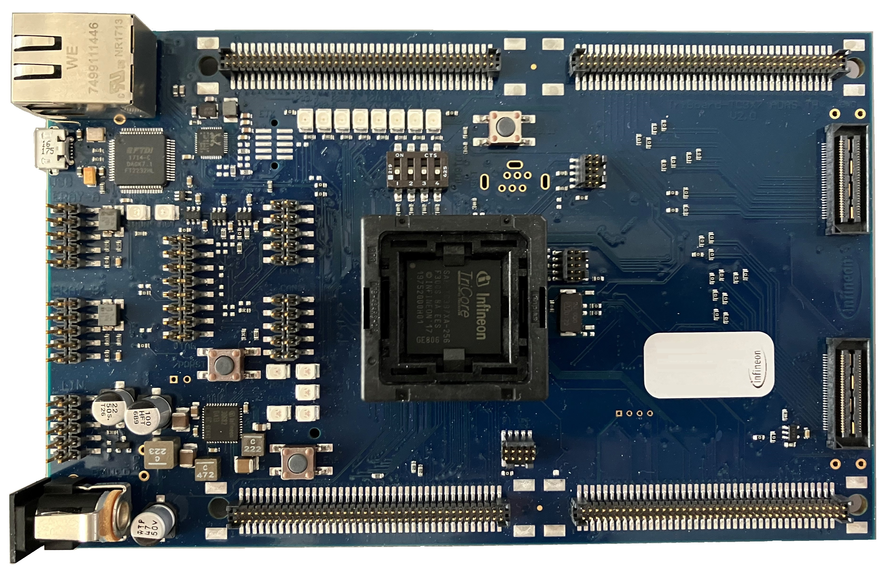
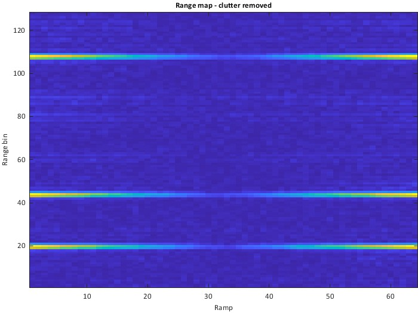

  

# iLLD_TC397x_ADS_SPU_Clutter_Removal 
**This code example illustrates the configuration of the Signal Processing Unit (SPU) for implementing clutter suppression, a standard step in radar data processing for in cabin monitoring systems (ICMS).**  

## Device  
The device used in this example is AURIX™ TC397XA. 

## Board  
The board used for testing is the AURIX™ TC397 ADAS TriBoard V2.0 (KIT_A2G_TC397XA_TRB_S).

## Scope of work   

This project shows a basic radar data processing flow for clutter suppression implemented on the Signal Processing Unit (SPU) hardware. Clutter suppression is used to remove static targets from the dataset. The processing flow includes clutter removal on the range FFT data cube and doppler FFT both on a range map with and without clutter. This code example uses a simulated dataset as input, Radar interface (RIF) configuration is not shown.

Basic understanding of FMCW radar range-doppler signal processing is presumed to follow this code example.

## Introduction  
AURIX™ 2nd generation radar microcontrollers (TC3x) use a hardware accelerator called the Signal Processing Unit (SPU) to extract information from radar data. 
This example utilizes various functions offered by the SPU to implement a basic processing flow for clutter suppression consisting of the following steps:
1. Windowing + range FFT
2. Calculate average across different ramps
3. Reformat from 32 bit to 16 bit data
4. Extend average data in ramp dimension
5. Subtract average value matrix from each ramp

The radar data cube and both intermediate and final results are stored in the Extension memory (EMEM) during processing. This is a dedicated memory for radar data.

## Hardware setup  
This code example was developed for the AURIX™ TC3x7 ADAS TH V2.0 TriBoard, using a AURIX™ TC397XA microcontroller.

  

## Implementation  
**Simulated radar data in IfxRadar_cfg.c/h **

The file *IfxRadar_cfg.c* contains the simulated input dataset. The simulation data was based on a setup of 4 RX antennas, 64 ramps and 256 samples per ramp, hence the raw data cube has a size of 64x4x256.The dataset (raw data cube) shows five radar targets with the following properties:

<table border="1">
    <tbody>
        <tr>
            <td><b>Target</b></td>
            <td><b>range [m]</b></td>
            <td><b>speed [km/h]</b></td>
       </tr>
        <tr>
            <td>1</td>
            <td>0.7</td>
            <td>0.0833</td>
       </tr>
        <tr>
            <td>2</td>
            <td>0.6</td>
            <td>0.0000</td>
       </tr>
        <tr>
            <td>3</td>
            <td>1.6</td>
            <td>0.0833</td>
       </tr>
       <tr>
            <td>4</td>
            <td>1.7</td>
            <td>0.0000</td>
       </tr>
       <tr>
            <td>5</td>
            <td>4</td>
            <td>0.0833</td>
       </tr>
    </tbody>
</table>

Static targets (clutter) can be removed from the radar data cube by subtracting the response from static targets. This can be achieved in two major steps: first the mean of range FFT results across ramps is calculated for each range bin and each antenna (see picture below).

In a second step the calculated mean value is subtracted from the radar data cube for each ramp (see picture below).

**Program flow**

*core0_main()* starts by initializing the necessary hardware, that is the MTU (Memory Test Unit, to clear SRAMs), the EMEM (Extension memory, where the radar data is stored during processing) and the SPU (Signal Processing Unit, the radar signal processing accelerator).

After the hardware components have been initialized, the SPU processing flow is set up. The desired processing flow is broken down into seven "configurations". Each "configuration" represents a specific set of SPU functionality that is enabled during one pass of data through the SPU. The five configurations are saved to the SPU config RAM, and a linked list is generated that automatically executes the seven configurations in sequence (see *Spu0_cfg_init()*). 

Here is a detailed overview of the signal processing steps performed by each of the seven configurations:

CONFIG1: *IfxSpu_Cfg1_rangeFFT.c*
- Load raw data cube from EMEM (*rangeMap.adc_raw*)
- Apply window 
- Compute range FFT
- Bin rejection: drop symmetric half of FFT output
- Store FFT output to EMEM, overwriting raw data (*rangeMap.rMap*) 

CONFIG2: *IfxSpu_Cfg2_avg.c*
- Load range FFT data from EMEM (*rangeMap.rMap*) (Data is transposed during load to load it in the correct order for further processing)
- Apply 180deg phase shift to data (to subtract via addition in CONFIG5)
- Calculate mean across ramps for each range bin and each antenna
- Store average output to EMEM with 32 bit precision (*average32*) 

CONFIG3: *IfxSpu_Cfg3_avg32to16.c*[^1]
- Load average data (32 bit precision) (*average32*)
- Store average output to EMEM with 16 bit precision (*average16*) 

CONFIG4: *IfxSpu_cfg4_reshape.c*[^2]
- Load average data (16 bit precision) (*average16*)
- Repeat for RADAR_NUM_RAMPS to extend average data cube to original data cube size
- Store average output to EMEM with 16 bit precision (*average16*) 

CONFIG5: *IfxSpu_cfg5_sub.c*
- Load average data (16 bit precision) (*<-average16*) and range FFT data (*rangeMap.rMap*)
- Add average data to range FFT data for each ramp (subtraction due to 180deg phase shift in CONFIG2)
- Repeat for RADAR_NUM_RAMPS 
- Store clutter removal output to EMEM with 16 bit precision (*rmapCR*) 

[^1]:reformatting from 32 to 16 bit is required as summation across FFT results can only output with 32 bit precision

[^2]: average data extension in ramp dimension is required for subsequent subtraction with original range FFT result*

The table below provides an overview on the data stored in EMEM by the different SPU configurations and their size.

<table border="1">
    <tbody>
        <tr>
            <td><b>SPU config</b></td>
            <td><b>Data created by config</b></td>
            <td><b>Data type</b></td>
            <td><b>Data size</b></td>
            <td><b>comment</b></td>
        </tr>
        <tr>
            <td>prior to SPU run</td>
            <td>rangeMap.adc_raw[64][4][256]</td>
            <td>sint16</td>
            <td>131kB</td>
            <td><i>is overwritten by config 1</i></td>
        </tr>
       <tr>
            <td>IfxSpu_Cfg1_rangeFFT</td>
            <td>rangeMap.rmap[64][4][128]</td>
            <td>csint16</td>
            <td>131kB</td>
            <td></td>
        </tr>
       <tr>
            <td>IfxSpu_cfg2_avg</td>
            <td>average32[4][128]</td>
            <td>csint32</td>
            <td>4kB</td>
            <td></td>
        </tr>
        <tr>
            <td>IfxSpu_cfg3_avg32to16</td>
            <td>average16[4][128]</td>
            <td>csint16</td>
            <td>2kB</td>
            <td></td>
        </tr>
        <tr>
            <td>IfxSpu_cfg4_reshape</td>
            <td>average16[64][4][128]</td>
            <td>csint16</td>
            <td>131kB</td>
            <td></td>
        </tr>
         <tr>
            <td>IfxSpu_cfg5_sub</td>
            <td>rmapCR[64][4][128]</td>
            <td>csint16</td>
            <td>131kB</td>
            <td><i>this can be written to same memory location as rangeMap.rmap</i></td>
        </tr>
    </tbody>
</table>

After setting up the configurations and the linked list, the function *IfxSpu_reloadConfig()* is called. This loads the first configuration of the linked list and triggers the SPU to start processing. Once the SPU is done with all configurations, the SPU attention interrupt is generated. 
Inside the interrupt service routine *ISR_spu0_attn()*, the *g_rdr.spuOk* variable is incremented from 0 to 1 to indicate the end of the data processing.

## Compiling and programming
Before testing this code example:  
+ Power the board through the dedicated power connector 
+ Build the project using the dedicated Build button  or by right-clicking the project name and selecting "Build Project"
+ To flash the device and immediately run the program, click on the dedicated Flash button  

## Run and Test   

Flash and run the code example.
Next, check the value of the *g_rdr.spuOk variable*. A value of "1" indicates that the SPU has processed the data successfully.
After processing, the results (and intermediate results) are stored in EMEM (see *g_rdr.emem.x*) . The following figures show visualizations of the radar data cube during the different processing steps:

The following image shows the data after range-FFT processing (without clutter removal), with the five targets clearly visible as lines (*g_rdr.emem.rangeMap.rMap*, only data from first RX antenna shown). Static targets are marked with orange arrows:

  

Static targets are removed by clutter suppression as shown in the following image. It shows the data after range-FFT processing and clutter removal, with the three moving targets clearly visible as lines (*g_rdr.emem.rmapCR*, only data from first RX antenna shown):

  

## References  

AURIX™ Development Studio is available online:  
- <https://www.infineon.com/aurixdevelopmentstudio>  
- Use the "Import..." function to get access to more code examples  

More code examples can be found on the GIT repository:  
- <https://github.com/Infineon/AURIX_code_examples>  

For additional trainings, visit our webpage:  
- <https://www.infineon.com/aurix-expert-training>  

For questions and support, use the AURIX™ Forum:  
- <https://community.infineon.com/t5/AURIX/bd-p/AURIX>  
