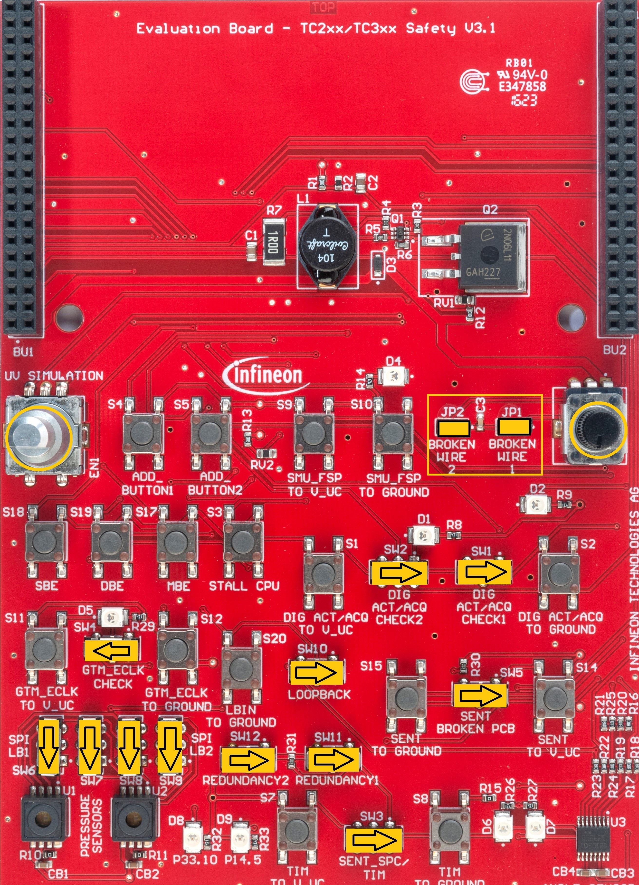
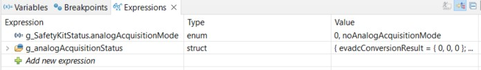

# iLLD_TC39B_ADS_SAFETY_KIT  
**This source code is the first and easy step to start and understand the functional safety aspects**

## Device  
The device used in this example is AURIX&trade; TC39xXX_B-Step 

## Board  
The board used for testing is the AURIX&trade; APPLICATION KIT TC397 V2.0 (KIT_A2G_TC397_5V_TFT) 

## Scope of work  
 This project is written for system and software engineers and functional safety managers involved in
 the design or development of a safety-related system who are considering integrating the AURIX&trade;
 TC3xx micro-controller hardware as a safety element out of context (SEooC) into their system.

## Introduction  
The development of a safe application can be a challenge when it comes to following strict safety rules. In order 
to ease the development of such applications, Infineon provides the TC3xx Safety Manual. The Safety Manual 
defines so called safety mechanisms as an activity or a technical solution to avoid or control systematic failures 
and to detect or control random hardware failures. Safety mechanisms are classified in two main types:

   - The technical solution internal to the MCU by hardware (HW) or software (SW)
   - The technical solution either in HW or SW, implemented at System level by the system integrator.
    
During the design phase of AURIX&trade;, most common use cases have been taken and from these safety 
requirements have been derived. For the implementation of these specific Safety Related Functions different 
SMs shall to be implemented according to the specification in the Safety Manual. Which specific SM is 
required depends on the used modules and the required safety level. 

Hence, the intention of this project is to provide implementation hints and code examples for many of 
these Safety Related Functions and safety mechanisms. This example software optimized for the Safety Kit 
hardware which is composed of an Application Kit TC397 (KIT_A2G_TC397_5V_TFT) from Infineon and the add-on shield 
Evaluation Board AURIX&trade; TC3xx Safety(EVABOARD_A2G_SAFETY). The Safety Kit is demonstrating the implementation of the 
SMs and other diagnostics. Additionally, to the  touchscreen and an ASCLIN shell interface, the add-on shield provides
several buttons and switches to trigger the injection of faults. For detail description of the kit and how to use it, 
please have a look to application note AP32597 on <https://www.infineon.com/aurixsafetykit>

**Note:** 

This code is provided for demonstration purpose only and acts as training example. It is not intended to be used for legally binding, 
functional safety classified (ASIL/SIL) code development and for productive systems.

## Hardware setup  
The Safety kit hardware which is composed of an Application Kit TC397(KIT_A2G_TC397_5V_TFT) from Infineon and the add-on shield Evaluation Board AURIX&trade; TC3xx Safety(EVABOARD_A2G_SAFETY) 
and is called Application Kit - AURIX&trade; TC3xx Safety (APPKIT_A2G_SAFETY).

 

The functionalities and component available on Evaluation Board AURIX&trade; TC3xx Safety(EVABOARD_A2G_SAFETY) given below 

The default state of different switches, jumpers, encoder and poti available on Evaluation Board AURIX&trade; TC3xx Safety(EVABOARD_A2G_SAFETY) must be as given below to avoid any issue and unintended alarm pop up.

## Implementation

The software is developed in the free of charge Integrated Development Environment (IDE) AURIX&trade;
Development Studio (ADS). The project structure as the six CpuX_Main.c (x=0...5) files, the relevant application 
software is stored in the AppSw folder which is consisting of the two folders AppKit and SafetyKit and the two 
*Stm_Scheduler* files are used as System Timer (STM) timer for basic periodic task scheduling. While the AppKit folder contain 
specific software for the display, touch application and ASCLIN shell Interface. The SafetyKit folder includes all the code 
of the safety features of AURIX&trade; TC3xx. 

**Key Features**

The key features implemented and supported are listed in the following list:
- Boot and Startup Procedure including all safety mechanisms involved
- Full Safety Management Unit (SMU) driver implementation including 
    - SMU core and SMU stdby 
    - Fault Signaling Protocol (FSP) 
    - Emergency Stop (ES)  
    - Recovery Timer (RT)   
- Implementation of Top-Level Safety Requirements (TLSRs) and the required safety mechanisms
    - All TLSR from Safety Manual implemented except “ADAS Processing ASIL C” and “Safe Computation ASIL B”
    - Implementation of required Safety Mechanisms(SM) i.e. More than 100 SM showcased  
- Fault injection for testing of various safety mechanisms
    - PFlash ECC error injection
    - DMA error injection 
    - Analog and digital Acquisition error injection
    - Undervoltage error injection
    - Broken Wire etc
- TFT touch screen driver
- TLF35584 PMIC driver including
    - including Error Pin Monitoring
    - Window Watchdog 
    - Functional Watchdog 
- ASCLIN Shell Interface
- System Timer Module (STM) used for basic task scheduling

**Supported SM**  

Please refer to the TriCore&trade; Application note AP32597 (<https://www.infineon.com/aurixsafetykit>) which describe in detail the implementation of many SMs.
The below given is the list of all SMs which are currently implemented in this kit.

- SM:LBIST_CFG
- SM:MONBIST_CFG
- SM:MBIST
- SM:CLOCK:OSC_MONITOR
- SM:DTS_CFG
- SM:FCE:CRC_CFG
- SM:GTM_CONFIG_FOR_ATOM
- SM:GTM_CONFIG_FOR_GTM
- SM:IOM_CONFIG_FOR_GTM
- SM:IR:FFI_CONTROL
- SM:PMS:MON_REDUNDANCY_CFG
- SM:PMS:VX_MONITOR_CFG
- SM:SCU:ERU_CONFIG
- SM:SMU:CONFIG

- SM:AMU.LMU_DAM:REG_MONITOR_TEST
- SM:CIF.RAM:REG_MONITOR_TEST
- SM:CPU.DCACHE:REG_MONITOR_TEST
- SM:CPU.DLMU:REG_MONITOR_TEST
- SM:CPU.DSPR:REG_MONITOR_TEST
- SM:CPU.DTAG:REG_MONITOR_TEST
- SM:CPU.PCACHE:REG_MONITOR_TEST
- SM:CPU.PSPR:REG_MONITOR_TEST
- SM:CPU.PTAG:REG_MONITOR_TEST
- SM:DMA.RAM:REG_MONITOR_TEST
- SM:EMEM.RAM:REG_MONITOR_TEST
- SM:ERAY.RAM:REG_MONITOR_TEST
- SM:GETH.RAM:REG_MONITOR_TEST
- SM:GTM.RAM:REG_MONITOR_TEST
- SM:HSPDM.RAM:REG_MONITOR_TEST
- SM:LMU.RAM:REG_MONITOR_TEST
- SM:MCMCAN.RAM:REG_MONITOR_TEST
- SM:PSI5.RAM:REG_MONITOR_TEST
- SM:SCR.RAM:REG_MONITOR_TEST
- SM:SDMMC.RAM:REG_MONITOR_TEST
- SM:SPU.BUFFER:REG_MONITOR_TEST
- SM:SPU.CONFIG:REG_MONITOR_TEST
- SM:SPU.FFT:REG_MONITOR_TEST
- SM:TRACE.TRAM:REG_MONITOR_TEST
- SM:SMU:REG_MONITOR_TEST

- SM:LBIST_MONITOR
- SM:LBIST_RESULT
- SM:MONBIST_RESULT
- SM:SMU:ALIVE_ALARM_TEST
- SM:MCU_FW_CHECK
- SM:MCU_STARTUP
- SM:MBIST

- SM:CONVCTRL:CONFIG_CHECK
- SM:EDSADC:DIVERSE_REDUNDANCY
- SM:EDSADC:PLAUSIBILITY
- SM:EDSADC:VAREF_PLAUSIBILITY
- SM:EVADC:CONFIG_CHECK
- SM:EVADC:DIVERSE_REDUNDANCY
- SM:EVADC:PLAUSIBILITY
- SM:EVADC:VAREF_PLAUSIBILITY

- SM:CCU6_CAPTURE_MON_BY_GPT12
- SM:GTM_CCU6_REDUNDANCY
- SM:GTM_TIM_REDUNDANCY
- SM::TIM_CLOCK_MONITORING
- SM:CCU6_GPT12_MONITORING
- SM:IOM_ALARM_CHECK
- SM:TIM_CLOCK_MONITORING
- SM:TOM_TIM_MONITORING

- SM:QSPI:SAFE_COMMUNICATION
- SM:SENT:CHANNEL_REDUNDANCY

- SM:PMS:VEXT_VEVRSB_ABS_RATINGS
- SM:PMS:VEXT_VEVRSB_OVERVOLTAGE
- SM:PMS:VX_FILTER
- SM:WATCHDOG_FUNCTION
- SM:CLOCK:PLAUSIBILITY
- SM:DTS_RESULT
- SM:MONBIST_RESULT
- SM:PORT:LOOPBACK
- SM:PORT:REDUNDANCY

- SM:FSP_ERROR_PIN_MONITOR
- SM:SW_ERROR_PIN_MONITOR
- SM:SMU:ALIVE_ALARM_TEST
- SM:IR:ISR_MONITOR
- SM:CONVCTRL:ALARM_CHECK
- SM:APPLICATION_SW_ALARM

- SM:AMU.LMU_DAM:DATA_INTEGRITY
- SM:DMA:ADDRESS_CRC
- SM:DMA:DATA_CRC
- SM:DMA:ERROR_HANDLING
- SM:DMA:SUPERVISION
- SM:DMA:TIMESTAMP
- SM:EMEM:DATA_INTEGRITY
- SM:PFLASH:INTEGRITY_CHECK
- SM:PFLASH:UPDATE_CHECK
- SM:PFLASH:WL_FAIL_DETECT
- SM:SRI:ERROR_HANDLING
- SM:STM:MONITOR
- SM::MBIST

## Compiling and programming

Before testing this code example:  
- Power the board through the dedicated power connector 
- Connect the board to the PC through the USB interface
- Build the project using the dedicated Build button  or by right-clicking the project name and selecting "Build Project"
- To flash the device and immediately run the program, click on the dedicated Flash button 

## Run and Test

The detail description can be found in a dedicated Application note Ap32597 for this specific project.
After code compilation, successfully build and flashing the device, The following attributes can be seen

**Application Kit LEDs Uses**

The Application Kit offers four LEDs (D107 to D110) which can be used by the application software. For the 
Safety Kit they are used for the following purposes:

   - **LED0 (D107):** This LED is used to signal the successful initialization of the application software
   - **LED1 (D108):** Life hold indication, blinking serviced by CPU5
   - **LED2 (D109):** A background task is running the infinite while loop to determine if any bit of an SMU
     alarm status register is set. If yes, which means an SMU alarm is active this LED is turned on
   - **LED3 (D110):** Port Emergency stop, LED ”off” when ES is activated

**Touch Display Interface Presentation**

The Application Kit TC397 features a touchscreen display which is used to visualize status information or to trigger different actions. The default TFT view and an alarm pop-up window can be visualized in below figure. The alarm pop-up has four option to select:

   - **Reset Alarm:**  User can reset the generated alarm 
   - **Ignore Alarm:** User can ignore the alarm
   - **Reset SMU:**    User can reset the SMU which will reset all alarm
   - **Reset System:** User can reset the whole system and the kit will be reset to default condition

  

**Asynchronous Synchronous Interface (ASCLIN)**

Terminal can be used to observe some the functionality of safety kit using ASCLIN interface. The following configuration shall be added 

   - Serial Port: COMx (x is to which port USB is connected)
   - Baud rate : 115200
   - Data size : 8
   - Parity bit: none
   - stop bit  : 1
   - Encoding  : Default (ISO-8859-1)
 
 Terminal is also available in ADS as shown below
 

- After the successful USB connection, the following messages will be displayed in the terminal window 
 
~~~
Hello World
I am the Safety Application kit TC397  ADS SW 3V1  with HW 3V1...

Enter 'help' to see the available commands

Shell>
~~~

- Type help to know what functionalities are available via this interface, once you type help and press enter, the following option will come in terminal as shown below

~~~
Shell>help
standby    : Switch TLF35584 to standby or TLF30682 to disable state
showtlf    : Show status of TLF register
trigAlarm    : Trigger an SMU alarm
help     : Display command list, and command help.
Shell>
~~~

- If user want to a command but doesn’t know the syntax of command and user put a wrong syntax, error message will pop up. To navigate the correct command, then type the command name and pass argument as question mark, then right syntax of command will be shown as below. 

~~~
Shell>trigAlarm
Syntaxerror : invalid node 
Shell>trigAlarm ?
Syntax     : trigAlarm AG AN
           > Trigger the SMU alarm AN of group AG
Shell>
~~~

- After writing the correct command in correct format, the according reaction can be seen in terminal view e.g., trig Alarm. The same way other command can be used, and result will be shown in terminal accordingly

~~~
Shell>trigAlarm 8 23
Shell>
Default IGCS0 SMU Alarm!
See alarm status regs

Default IGCS0 SMU Alarm!
See alarm status regs
~~~

**Debugger View** 

The third option is to view the run time data via debugger. 
To use the debugger option , please follow the steps below

- Once the project is build successfully, go to debug icon and create new debug configuration (if it is not already created)

 

- New debug configuration window will popup, right click on TASKING C/C++ Debugger and click new configuration.(in this example Tasking debugger is used, same can be done for winIDEA Debuggerr)

- the default configuration will popup, then select Debug

- Confirm Perspective Switch window will popup, click Switch, which will switch to Tasking debugger window 

- The Tasking debugger window will look like as below 

- Now select global variable (which user want to observe), right click and then select Add Watch Expression

- The add variable will show up in Expressions window, in this example *g_SafetyKitStatus.analogAcquisitionMode* and *g_analogAcquisitionStatus* are added

- Now start debugging 

- and then pause debugging (or apply breakpoint] to see the update value of the add global variables

- the added global variable update values are shown below

## References  
AURIX&trade; Application Kit - TC3xx Safety
- <https://www.infineon.com/aurixsafetykit> 

AURIX&trade; Development Studio is available online:  
- <https://www.infineon.com/aurixdevelopmentstudio>  
- Use the "Import..." function to get access to more code examples  

More code examples can be found on the GIT repository:  
- <https://github.com/Infineon/AURIX_code_examples>  

For additional trainings, visit our webpage:  
- <https://www.infineon.com/aurix-expert-training>  

For questions and support, use the AURIX&trade; Forum:  
- <https://community.infineon.com/t5/AURIX/bd-p/AURIX>
