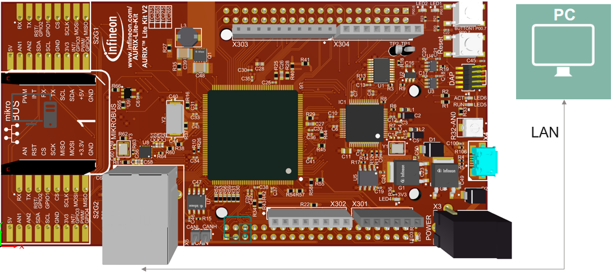
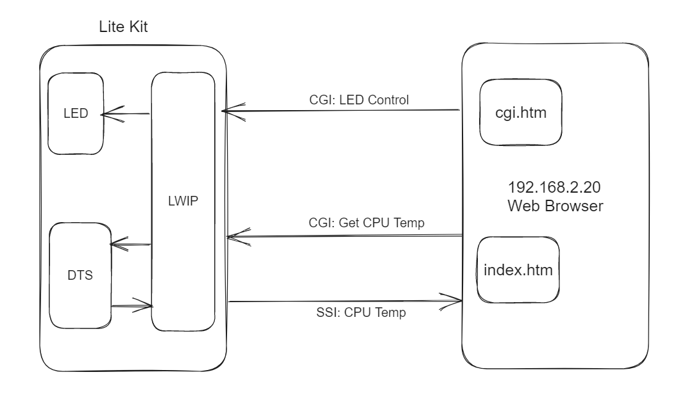
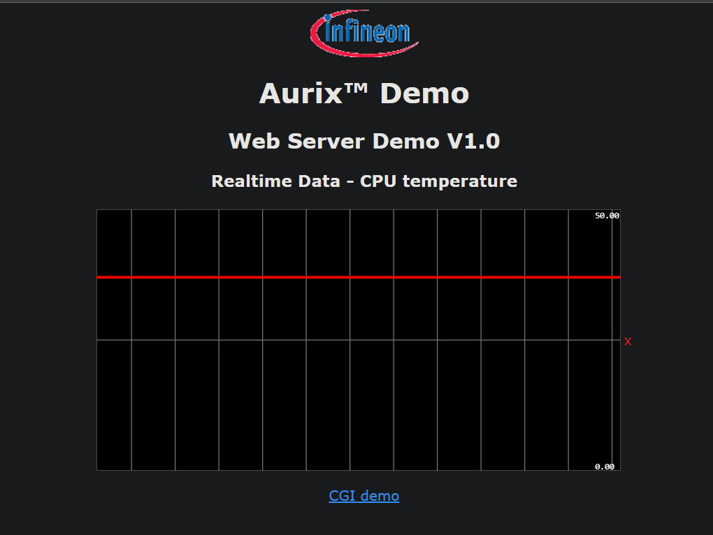
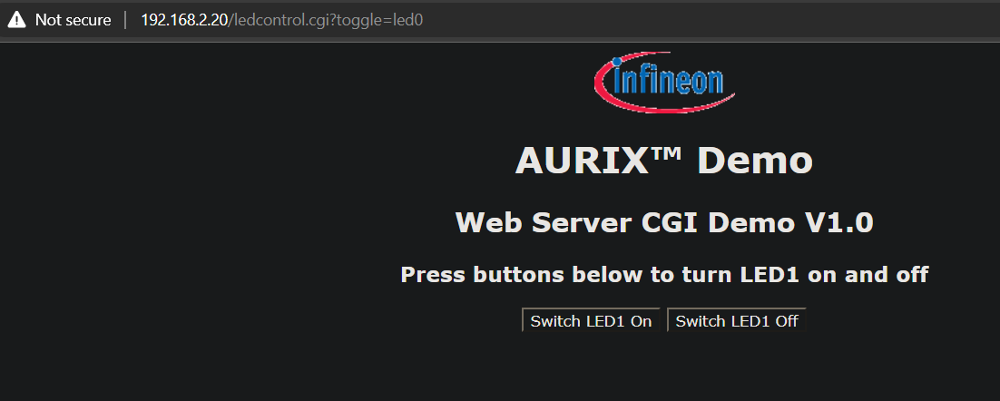
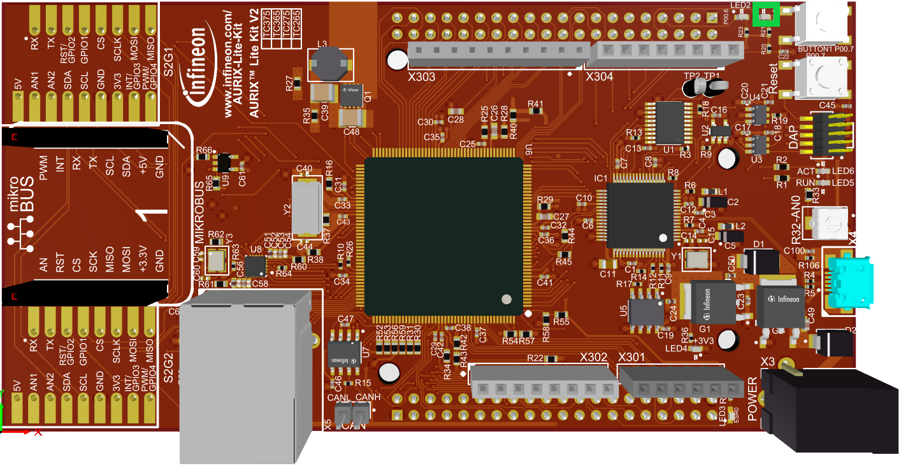

  

# iLLD_TC3XX_ADS_GETH_LWIP_HTTP
**The Gigabit Ethernet is used to run an open source TCP/IP stack with an HTTP Server toggling LEDs and visualizing the temperature of the device read from the Die Temperature Sensor (DTS)**  

## Device  
The device used in this example is AURIX™ TC37xTP_A-Step

## Board  
The board used for testing is the AURIX™ TC375 lite Kit (KIT_A2G_TC375_LITE)  

## Scope of work   
The internal Die Temperature Sensor (DTS) is continuously read in an infinite loop.  
The measure is converted in Celsius and visualized in the Lightweight IP (LWIP) HTTP server. 
In addition the webserver provides 2 buttons to turn a Lite Kit LED ON and OFF.  

## Introduction  
- The Die Temperature Sensor in the Power Management System (PMS) indicates the local junction temperature in the PMS subsystem  
- The Ethernet (GETH) provides connection to a standard IT network using an Realtek PHY and running a TCP/IP stack on the Lite Kit

**Third-party Packages**
* This software package includes the LWIP - A Lightweight TCP/IP stack(2.1.2)

## Hardware setup  
This code example has been developed for the AURIX™ TC375 Lite Kit (KIT_A2G_TC375_LITE).  

   

## Implementation  

**Architecture**  

**Configure the static IP address**  
The default static IP address is: 192.168.2.20. This can be adapted in the *Libraries/Ethernet/lwip/port/src/Ifx_Lwip.c* file. 

**Generating the Web Page to be served**
 - The *index.htm* and *cgi.htm* files in *Apps/http/fs* define the web page served by the HTTP server
 - Run *makefsdata.exe* in *Apps/http/makefsdata*,paste the newly generated (in the same folder) *fsdata.h* in *Apps/http* and perform a clean build of the code example

**Scheduling the LWIP Stack**
 - For the stack to run the IP suite of protocols, the stack entry function *Ifx_Lwip_onTimerTick()* must be called periodically
 - In this code example, it is called every 1ms via System Timer (STM) generated interrupt *update_lwip_stack_isr()* in *Cpu0_Main.c*

**Data Exchange between Web Browser and Board over HTTP**
 - The HTTP server on the board and the web browser talk to each other using Server Side Includes (SSI) which is just a simple text exchange over HTTP
 - The CPU Die temperature is sent to the browser over SSI periodically. The periodic request to get temperature is created by Javascript in *index.htm*
 - The requests to turn LED1 ON or OFF are sent to the board from the web browser over the Central Gateway Interface (CGI) protocol which is also a simple text based request and reply protocol
 - The user defined functions to be called by the LWIP stack on a CGI or SSI request are made known to the stack by configuring them as function pointer callbacks
 - The function pointer callbacks are set by using the LWIP functions *http_set_ssi_handler()* in *ssi_init()* and *http_set_cgi_handlers()* in *cgi_init()*
 - The function *ssi_handler()* in *Httpd_SSI_CGI.c* is called by the LWIP stack on any SSI request. It converts the periodically updated (via the function *dts_measurement()* in *Die_Temp_Sensor.c*) Die Temperature *g_cpu_temperature* to Celsius and sends it over HTTP to the web browser
 - The function *ledcontrol_handler()* in *Httpd_SSI_CGI.c* is called by the LWIP stack on any CGI request. Based on the text contained in the CGI request (defined in *cgi.htm*) a simple switch case logic is implemented to turn LED1 ON or OFF
  
  

## Run and Test   
For this example, a standard RJ45 network cable is needed and must be connected to the Ethernet port of the Lite Kit. In addition a 
serial terminal can be connected to the USB connector, to watch status messages.
After connecting the Lite Kit to a Laptop/PC ensure that the IP address of the Laptop/PC matches the IP subnet of the Lite Kit. 
Finally, open a web browser and type the IP address of the Lite Kit into the Browser.   

**The internal Die temperature should be displayed as shown below:**

  

**The web page to control LED1 of the Lite Kit would be displayed as shown:**  

  

**The LED highlighted in green would turn ON or OFF**

## References  

AURIX™ Development Studio is available online:  
- <https://www.infineon.com/aurixdevelopmentstudio>  
- Use the "Import..." function to get access to more code examples  

More code examples can be found on the GIT repository:  
- <https://github.com/Infineon/AURIX_code_examples>  

For additional trainings, visit our webpage:  
- <https://www.infineon.com/aurix-expert-training>  

For questions and support, use the AURIX™ Forum:  
- <https://community.infineon.com/t5/AURIX/bd-p/AURIX>  