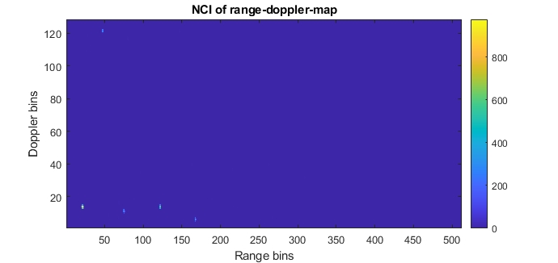
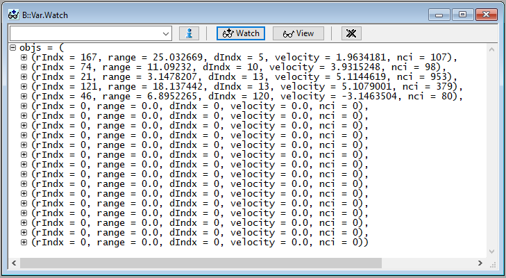

  

# iLLD_TC3XX_ADS_RDmap_conversion 
**This example shows how to combine two radar detection bitmaps and how to convert the index of a radar target in the range-doppler map to target distance and velocity.**  

## Device  
The device used in this example is AURIX™ TC397XA. 

## Board  
The board used for testing is the AURIX™ TC397 ADAS TriBoard (KIT_A2G_TC397XA_TRB_S).

## Scope of work   

Two pre-computed detection bitmaps (results of local maximum searches of a Non-Coherent-Integration (NCI) range-doppler map in range and doppler dimension) are combined bitwise and the range and velocity of the detected targets are calculated and stored.

## Introduction  
AURIX™ 2nd generation radar microcontrollers use a signal processing unit to extract information from radar data. While most functions (Fourier transformations, integrations, ...) can be executed by the dedicated hardware, some post processing functionality require computations on the CPU.
This example shows two post processing steps most frequently performed by the CPU: The combination of detection bitmaps from local maximum searches in range and doppler direction of the range-doppler map, and the subsequent conversion of range-doppler-map indices to actual target distance and velocity.  

## Hardware setup  
This code example has been developed for the AURIX™ TC3x7 ADAS TH V2.0 TriBoard, but should as well work on any other AURIX™ 2nd generation microcontroller with minor modifications. This example does not need additional external hardware connections.

  

## Implementation  
**Simulated radar data in *data.c/h***

The files data.c/h contains the simulated data and radar system parameters that are relevant for the further processing:
- *uint16 rdmap_nci[512][128]*: the range-doppler map
- *uint32 lclMaxRMap[128][16]*: the local maximum detection bitmap of the range-doppler map in **range** direction
- *uint32 lclMaxVMap[512][4]*: the local maximum detection bitmap of the range-doppler map in **doppler** direction
- Macros for important radar acquisition parameters such as
    - radar ADC sampling frequency (*RADAR_FREQ_SAMPLE*)
    - frequency ramp count (*RADAR_NUM_RAMPS*)
    - samples per ramp (*RADAR_NUM_SAMPLES*) 
    - radar pulse repetition interval (*RADAR_PRI*)

The data used for this example contains five radar targets which differ in velocity, distance and radar cross section. The targets can easily be identified visually in the range-doppler map NCI plot:

**Program flow**

Inside *core0_main()*, the function *AnalyzeDetectionBitmaps()* is called. This function loops over each range and doppler bin in the range-doppler map and evaluate the associated bits of the two detection maps. If both detection bitmaps indicate a local maximum (indicated by a '1' bit), then a valid target has been detected.

For each detected target, the target distance and velocity are calculated using the functions *CalculateDistance()* and *CalculateVelocity()*. The distance and velocity are calculated based on the index of the target in the range-doppler-map and the parameters defined by the *RADAR_\** macros. The calculation results are stored in the *objs[]* array. This array of the type *Objects* stores the original range and doppler indices, the calculated distance and velocity and the NCI value of the target. The number of detections is tracked using the variable *num_objects*. 

## Compiling and programming
Before testing this code example:  
+ Power the board through the dedicated power connector 
+ Build the project using the dedicated Build button or by right-clicking the project name and selecting "Build Project"
+ Flash the device and run the program

## Run and Test   

Flash and run the code example.
Next, observe the value of the *num_objects* variable. Since the provided sample data contains five valid targets, the value of the *num_objects* variable has also changed to five. 
The speed and velocity data which are stored in *objs[0]* to *objs[num_objects]* can be viewed using a debugger:

  

The original velocities and distances of the simulated radar targets are as follows:

| Target index | Distance in meters | Velocity in km/h |
|--------------|--------------------|------------------|
| 1            | 25                 | 2                |
| 2            | 11                 | 4                |
| 3            | 3                  | 5                |
| 4            | 18                 | 5                |
| 5            | 7                  | -3               |

## References  

AURIX™ Development Studio is available online:  
- <https://www.infineon.com/aurixdevelopmentstudio>  
- Use the "Import..." function to get access to more code examples  

More code examples can be found on the GIT repository:  
- <https://github.com/Infineon/AURIX_code_examples>  

For additional trainings, visit our webpage:  
- <https://www.infineon.com/aurix-expert-training>  

For questions and support, use the AURIX™ Forum:  
- <https://community.infineon.com/t5/AURIX/bd-p/AURIX>  
