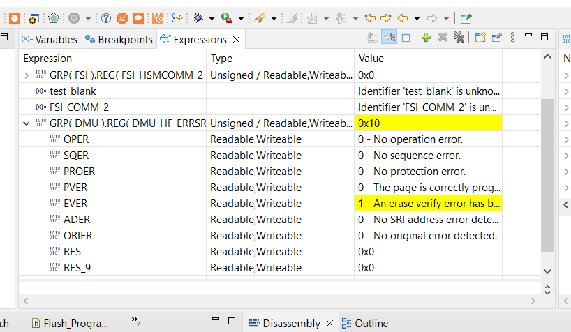

  

# iLLD_TC3XX_ADS_Verify_PFlash_Erase
**Checks if a given address sector in Program Flash is erased**

## Device  
The device used in this example is AURIX™ TC37xTP_A-Step

## Board  
The board used for testing is the AURIX™ TC375 lite Kit (KIT_A2G_TC375_LITE)  

## Scope of work  
A sector in Program Flash (PFLASH) is erased. The erasure verification service is invoked and the DMU_HF_ERRSR.EVER register bitfield is examined.  
The same sector is then programmed with data. The erasure verification service is invoked and the DMU_HF_ERRSR.EVER register bitfield is examined.

## Introduction  
- The *Program Flash:* Divided into one or more banks each connected to a CPU. It is used by the application to store program code and data constants
- The Data Memory Unit (DMU) controls command sequences executed on the Program and Data Flash memories (PFLASH and DFLASH), interfacing with the Flash Standard Interface (FSI) and the Program Flash Interface (PFI)

## Hardware setup  
This code example has been developed for the AURIX™ TC375 Lite Kit (KIT_A2G_TC375_LITE).  

   

## Implementation  
 
- The function *writeProgramFlash()* in *Flash_Programming.c* calls *erasePFLASH()* which erases the PFLASH sector at address defined by the macro *PFLASH_STARTING_ADDRESS*  
- The function *eraseVerifySector()* is called afterwards to verify successful erasure of the sector  
- The function *writeFlash()* called post verification writes the magic constant defined by *DATA_TO_WRITE* to the sector  
- The function *eraseVerifySector()* is called again to check if the sector is still detected as successfully erased

## Compiling and programming
Before testing this code example:
- Power the board through the dedicated power connector
- Connect the board to the PC through the USB interface
- Build the project using the dedicated Build button  or by right-clicking the project name and selecting "Build Project"
- To flash the device and immediately run the program, click on the dedicated Flash button   

## Run and Test  
In the debug view, add the *DMU_HF_ERRSR* register to the the watch view and examine the *EVER* bitfield. The field will be 0 when erasure verification is called the first time and would change to 1 when erasure verification is called the next time (after the flash sector has been written to).
THis can be checked by setting a break point at line 233 that executes *g_commandFromPSPR.eraseVerifySector(PFLASH_STARTING_ADDRESS);* in *Flash_Programming.c* in the function *writeProgramFlash*.
After this line is executed the *EVER* bitfield will be zero.

Set another breakpoint at line 239 that eexcutes *g_commandFromPSPR.eraseVerifySector(PFLASH_STARTING_ADDRESS);* in *Flash_Programming.c* in the function *writeProgramFlash*. After this line is executed the *EVER* bitfield will be one.  

  

## References  

AURIX™ Development Studio is available online:  
- <https://www.infineon.com/aurixdevelopmentstudio>  
- Use the "Import..." function to get access to more code examples  

More code examples can be found on the GIT repository:  
- <https://github.com/Infineon/AURIX_code_examples>  

For additional trainings, visit our webpage:  
- <https://www.infineon.com/aurix-expert-training>  

For questions and support, use the AURIX™ Forum:  
- <https://community.infineon.com/t5/AURIX/bd-p/AURIX>  
