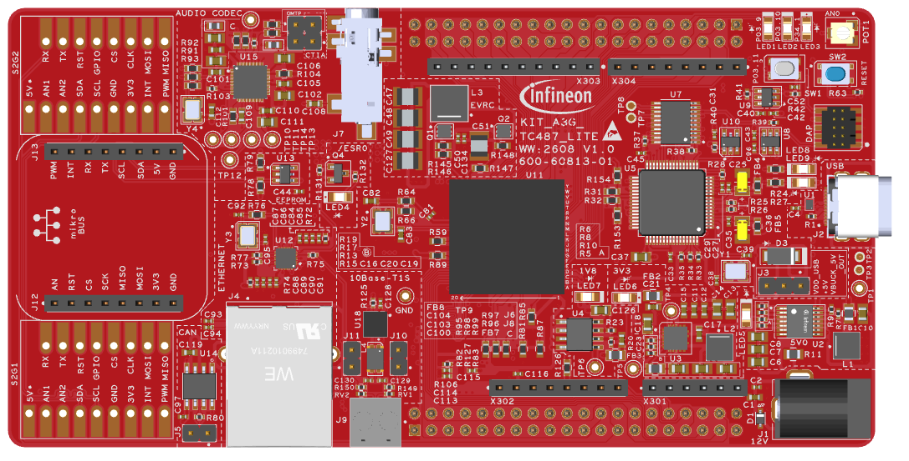

  

# iLLD_TC487_LK_ADS_PRRAM_Alarm_IR

**PRRAM Alarm triggering with NVMCON3 register.**  

## Device  
The device used in this example is AURIX&trade; TC487QE_A-Step_MC_COM

## Board  
The board used for testing is the AURIX&trade; TC487 lite Kit (KIT_A3G_TC487_LITE)

## Scope of work  
PRRAM alarm reaction is configured as interrupt request and triggered using the NVMCON3 PMUR register

## Introduction  
The PNVMR is a program non-volatile memory based on RRAM technology, used mainly to store the user application.
The PMUR (Program Memory Unit) detects a certain set of errors and forwards them to the SMU as alarms, the SMU can be configured to react to these alarms depending on the safety goals of the application.
Since the PMUR cannot inject memory errors into the RRAM, an alternative to test the alarms is by using the NVMCON3 and directly trigger them.

## Hardware setup  
This code example has been developed for the board AURIX&trade; TC487 lite Kit (KIT_A3G_TC487_LITE)

    

## Implementation  
**Initialization**
User led1 is initiated and turned off.
The PMUR1B ECC error alarm reaction is configured in the SMU as an interrupt request and the SMU is started and put in run mode.

**Alarm trigger**
Using the PMUR NVMCON register, the ECC error alarm is triggered, and the interrupt handler is executed.

## Compiling and programming
Before testing this code example:  
- Power the board through the dedicated power connector 
- Connect the board to the PC through the USB interface
- Build the project using the dedicated Build button  or by right-clicking the project name and selecting "Build Project"
- To flash the device and immediately run the program, click on the dedicated Flash button  

## Run and Test   
Run the application and observe the LED on the lite kit turning on indicating that the interrupt handler is executed

## References  

AURIX&trade; Development Studio is available online:  
- <https://www.infineon.com/aurixdevelopmentstudio>  
- Use the "Import..." function to get access to more code examples  

More code examples can be found on the GIT repository:  
- <https://github.com/Infineon/AURIX_code_examples>  

For additional trainings, visit our webpage:  
- <https://www.infineon.com/aurix-expert-training>  

For questions and support, use the AURIX&trade; Forum:  
- <https://community.infineon.com/t5/AURIX/bd-p/AURIX>  
