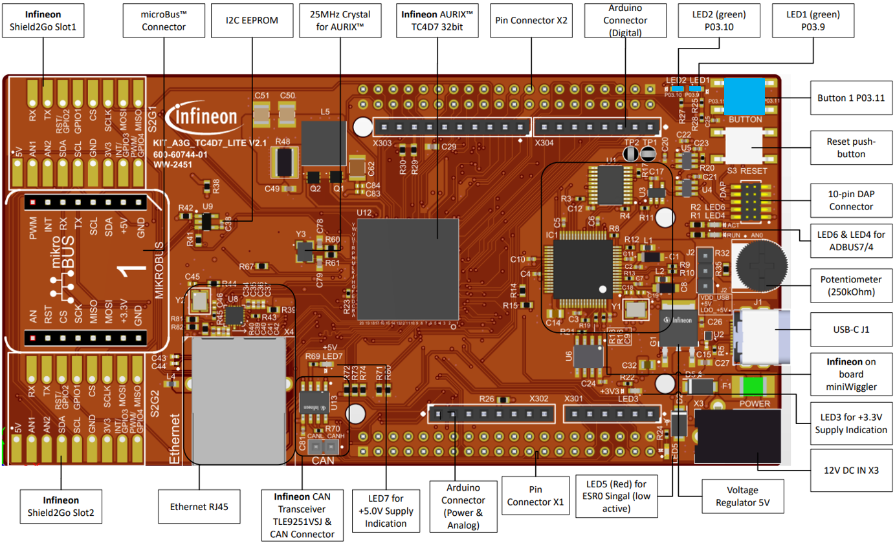
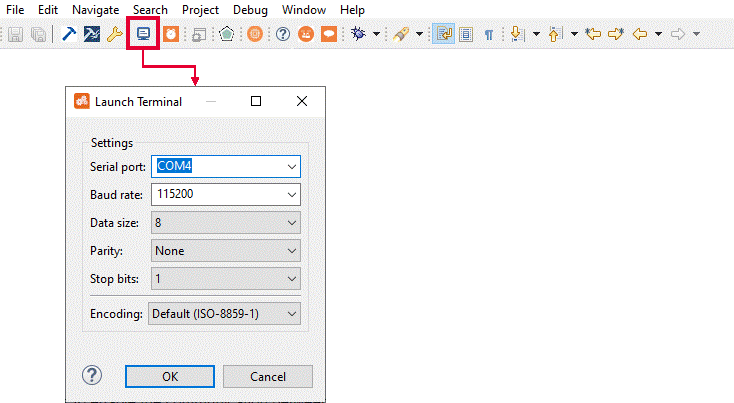

  

# iLLD_TC4D7_ADS_FreeRTOS_EGTMTOM_PRINTF

**This code example shows the GNU Compiler Collection (GCC) FreeRTOS port running on the TC4D7 Lite Kit. CPU0 starts the FreeRTOS scheduler, blinks LEDs, polls a user button, and uses an enhanced Generic Timer Module (eGTM) Timer Output Module (TOM) periodic interrupt to notify a task that prints a message over the debug Universal Asynchronous Receiver-Transmitter (UART).**  

## Device  
The device used in this example is AURIX&trade; TC4D7XP_A-Step_MC_COM    

## Board  
AURIX&trade; TC4D7 lite Kit (KIT_A3G_TC4D7_LITE)

## Scope of work  
GCC FreeRTOS on TC4D7 Lite kit: CPU0 starts the scheduler, blinks LEDs, polls a user button, and uses an eGTM TOM periodic interrupt to notify a task that prints via the debug UART.

## Introduction  
The code example entry point is implemented in *core0_main()* in *Cpu0_Main.c*. After disabling the watchdogs, the code initializes the board pins and the debug UART, creates the LED/button task and the print task, initializes the eGTM TOM timer through a dedicated module, and starts the scheduler.  

The runtime behavior is split as follows:  
- *handle_led_and_button_task()* runs periodically every 20 ms. It toggles LED1 every 500 ms and polls BUTTON1. Each new button press toggles LED2  
- *handle_print_notification_task()* blocks on a task notification. The notification is sent by the eGTM TOM ISR once per second, and the task prints a status message over UART  
- *egtm_tom_timer_isr()* clears the TOM interrupt flag and wakes the print task using a FreeRTOS ISR-safe API 

The LED and button runtime logic is implemented in *demo_led_button.c*, while the print task, eGTM TOM timer configuration, and ISR are implemented in *demo_print_timer.c*.  

The FreeRTOS kernel tick is provided by the GCC TriCore&trade; port in *freertos/ports/GCC/port.c*, which uses the CPU System Timer Module (CPU-STM) timer on CPU0. The eGTM TOM timer in this example is independent from the kernel tick and is used only to demonstrate interrupt-to-task synchronization. 

**Note: The GCC compiler for this FreeRTOS port is the free build-in tricore-GCC compiler.**

Although startup code is present for CPU0 to CPU5, only CPU0 runs the FreeRTOS. The remaining cores disable their watchdog and stay in an idle loop.  

The following AURIX&trade; hardware subsystems are used by this code example:

- **CPU System Timer Module (CPU-STM)**  
  The CPU-STM provides a CPU-related system timer on the TC4Dx device. In this example, the FreeRTOS TriCore&trade; GCC port uses the CPU0 STM service request to generate the FreeRTOS kernel tick. The kernel tick is configured to 1 kHz and provides the time base for scheduling and APIs such as `vTaskDelayUntil()`.

- **Enhanced Generic Timer Module (eGTM) Timer Output Module (TOM)**  
  eGTM is an enhanced version of the GTM, a universal timer architecture provided by Bosch AE. The Timer Output Module (TOM), a submodule of the eGTM, provides timer channels that can generate periodic timing events. In this example, TOM cluster 0 channel 0 is configured as a 1 Hz interrupt source routed to CPU0. The TOM interrupt is routed to CPU0 and is used only to wake the print task through a FreeRTOS task notification.

- **Asynchronous/Synchronous Interface (ASCLIN) UART**  
  The Asynchronous/Synchronous Interface (ASCLIN) is used in UART mode as the debug serial interface. In this example, ASCLIN0 is initialized through the reusable *retarget_io* library, which has been published in other code examples, to route standard `printf()` output to the debug UART at 115200 baud. 

## Hardware setup  
The example can be run directly on the TC4D7 Lite Kit without additional external circuitry. Required hardware:  
- AURIX&trade; TC4D7 Lite Kit  
- USB cable for power, programming, and debug access  
- personal computer (PC) with AURIX&trade; Development Studio or an equivalent GCC-based debug/programming setup  

Board resources used by the code example:  
- LED1: user LED on P03.9  
- LED2: user LED on P03.10  
- BUTTON1: user button on P03.11  
- Debug UART TX: ASCLIN0 P14.0  
- Debug UART RX: ASCLIN0 P14.1  

  

## Implementation  
The implementation is intentionally small so the interaction between the RTOS, board support package, and interrupt sources is easy to follow.  

1. **Board initialization:** *init_board_io()* configures the two user LEDs as outputs and the user button as input with pull-up. *init_debug_uart()* initializes the retarget I/O UART at 115200 baud
2. **Task creation:** CPU0 creates two tasks:
    - **Blinky** running *handle_led_and_button_task()* with priority *tskIDLE_PRIORITY + 1* and stack size *configMINIMAL_STACK_SIZE*
    - **Print** running *handle_print_notification_task()* with priority *tskIDLE_PRIORITY + 2* and stack size *configMINIMAL_STACK_SIZE x 2*
3. **eGTM TOM Timer configuration:** *demo_print_timer_init()* enables the eGTM module, enables the FX clock, selects TOM cluster 0 channel 0, and configures a periodic zero-match interrupt at 1 Hz. The service request is routed to CPU0 with interrupt priority 31, which is valid for calling FreeRTOS ISR APIs in this port configuration. For more details about eGTM TOM timer configuration, please refer to the **AURIX&trade; TC4Dx user manual**, which users can easily find from the "Quick Links" bar in the ADS windows  
4. **Interrupt-to-task communication:** The ISR does not print directly. Instead, it notifies *handle_print_notification_task()* with *vTaskNotifyGiveFromISR()*. This keeps the ISR short and moves the blocking I/O operation into task context. The print task handle is created in *Cpu0_Main.c* and passed to the timer module so that the ISR can notify the correct task  
5. **FreeRTOS configuration:** The code example uses a 1 kHz tick rate, preemptive scheduling, and 32 KB heap space. *configCHECK_FOR_STACK_OVERFLOW* is enabled, and software timers are enabled although they are not used by this code example  
  
**Note: FreeRTOS kernel source usage**  
  The code example uses FreeRTOSv202404.06-LTS from *freertos/freertoskernel*. The current generated GCC Debug build compiles *tasks.c*, *list.c*, *queue.c*, *timers.c*, *event_groups.c*, *stream_buffer.c*, *croutine.c*, and *portable/MemMang/heap_1.c* (heap_1 is chosen here as an example, users can also select other available heap implementation to compiler as they want), together with the TriCore&trade; GCC port in *freertos/ports/GCC/port.c*. The code example itself directly uses task creation, scheduler startup, periodic task delay, and task notification APIs. It does not directly use FreeRTOS queues, software timers, event groups, stream buffers, message buffers, or co-routines; those source files are included by the generated build configuration rather than by the code example logic. The eGTM TOM timer used by this code example is a hardware timer interrupt and is independent from FreeRTOS software timers.

## Compiling and programming
Before testing this code example:  
- Connect the board to the PC through the USB interface
- Open a serial terminal inside the AURIX&trade; Development Studio using the following icon, or use any external serial terminal tool:  

    

  The serial terminal must be configured with the following parameters to enable the communication between the board and the PC:
  - Serial port: Select the COM port assigned to your hardware
  - Baud rate: 115200 baud
  - Data bits: 8
  - Stop bits: 1
  - Parity: none

- Build the project using the dedicated Build button  or by right-clicking the project name and selecting "Build Project"
- To flash the device and immediately run the program, click on the dedicated Flash button   
- To flash the device and start a debug session, click on the Debug button  and create a configuration for a debugger if needed  

## Run and Test   
After programming the board, verify the following behavior:  

1. After reset, the UART terminal prints the following message:
  `******** TC4D7_lite_kit: FreeRTOS eGTM TOM Printf Code Example ********`
2. LED1 toggles continuously with a period of 500 ms
3. Each press of BUTTON1 toggles LED2 once
4. The UART terminal prints the following message once per second: 
  `eGTM TOM timer interrupt notified print task`  
5. The system remains responsive while LED control, button polling, and UART output are running concurrently under FreeRTOS  

This confirms that the following blocks are working together correctly:  
- FreeRTOS scheduler startup on CPU0  
- FreeRTOS tick interrupt via STM  
- eGTM TOM interrupt generation  
- ISR-to-task notification path  
- Board GPIO access  
- Retargeted UART output  

## References  

AURIX&trade; Development Studio is available online:  
- <https://www.infineon.com/aurixdevelopmentstudio>  
- Use the "Import..." function to get access to more code examples  

More code examples can be found on the GIT repository:  
- <https://github.com/Infineon/AURIX_code_examples>  

For additional training, visit our webpage:  
- <https://www.infineon.com/aurix-expert-training>  

For questions and support, use the AURIX&trade; Forum:  
- <https://community.infineon.com/t5/AURIX/bd-p/AURIX>  
