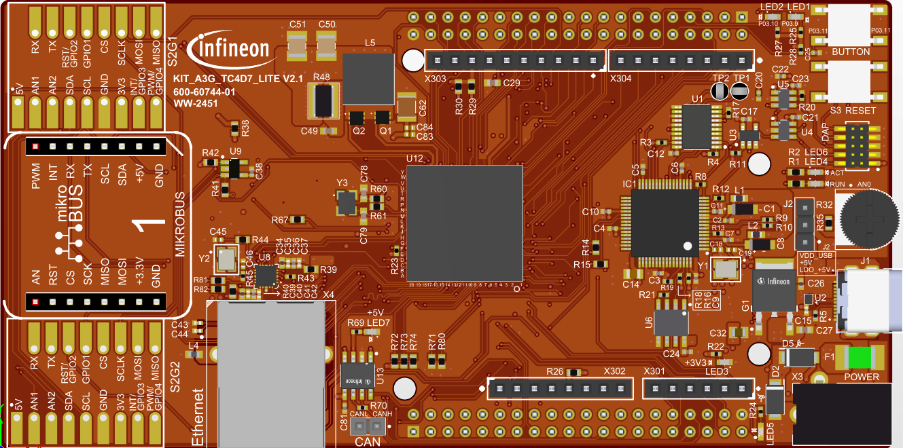
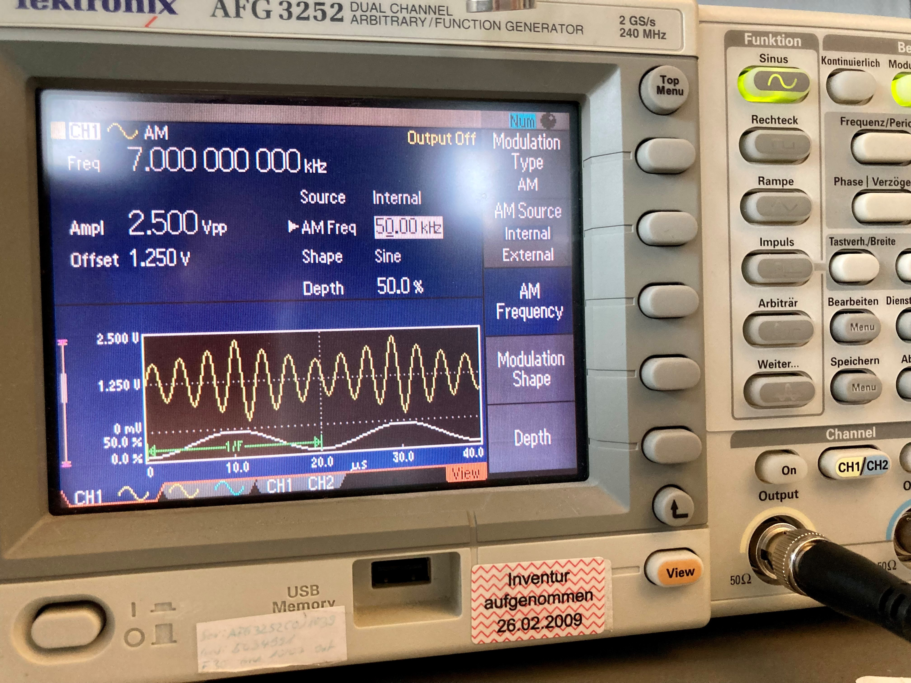
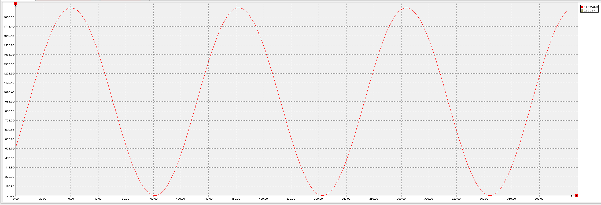
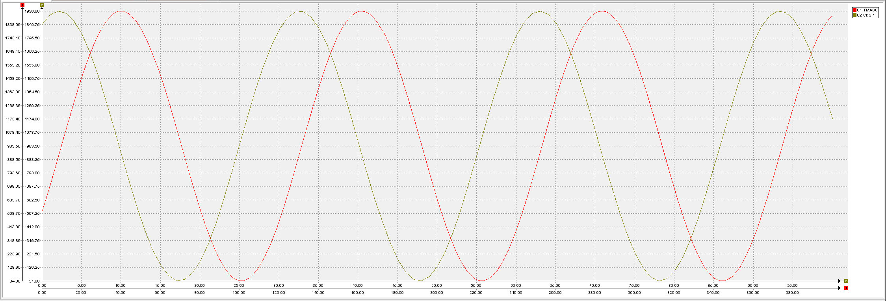
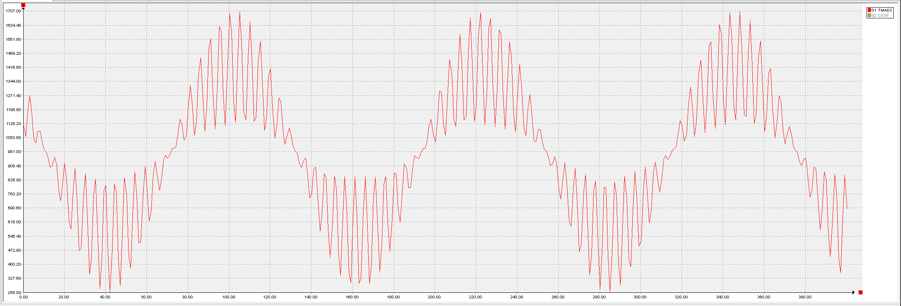
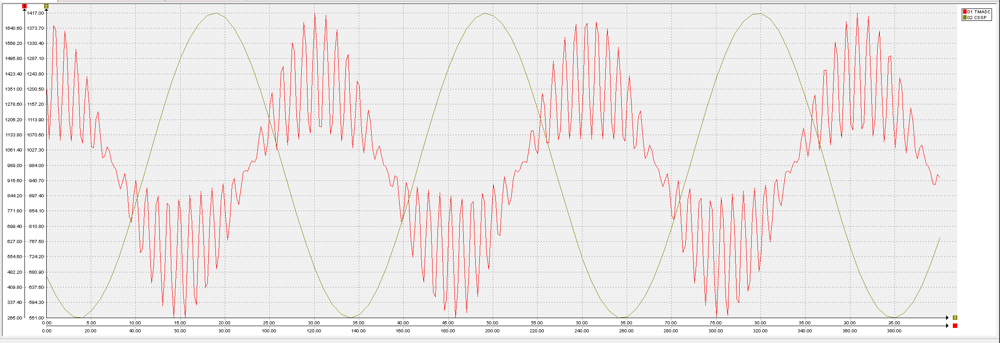

  

# iLLD_TC4D7_LK_ADC_CDSP_TMADC_Filtering

**The CDSP filters out high frequency components of the signal sampled by TMADC**  

## Device  
The device used in this example is the AURIX&trade; TC4D7XP_A-Step_CC_COM    

## Board  
The board used for testing is the AURIX&trade; TC4D7 Lite Kit (KIT_A3G_TC4D7_LITE)    

## Scope of work  
An amplitude modulated sine wave is fed to the Time-Multiplexed ADC (TMADC) as input.
The Converter Digital Signal Processor (CDSP) as a FIR filter removes high frequency harmonics from the
TMADC output signal. TMADC output is fed as input to the CDSP. During their respective service request
events, the CDSP and TMADC outputs are stored in an array and traced.

## Introduction  
**CDSP**

Converter Digital Signal Processor (CDSP) is a module used for post processing of data coming from Delta Sigma ADC (DSADC), External Modulator (EXMOD), Time Multiplexed ADC (TMADC), Carrier Pattern Magnitude
(CARMAG) or General Purpose (GP) registers using various filter chains.

These filter chains are configurable and the behavior of the filter chains can be adapted
to the requirements of an application. CDSP offers flexibility to serve different applications and change the
frequency response because of its fully programmable characteristic.

CDSP core is a 32-bit architecture with a highly efficient three-stage pipeline.

CDSP is connected to DSADC, EXMOD, TMADC, CARMAG and General Purpose (GP) registers to process the
results coming from different sources using different types of filter chains. The digital filter chain result values are available
at a configurable output rate.  
The elements of the filter chain can be activated according to the requirements of the application.  
The filter chain configuration determines the attenuation and delay properties of the filter.  
The configuration of the filter chains in terms of number of coefficients, taps or decimation rate allows effective
signal shaping or offset compensation.

The CDSP gives the option to use timestamping operation. The time-stamp information can be accessed through the result registers.  
The results can be read through FIFO mode or non FIFO mode.  
The CDSP has a service request generator which can generate interrupts on different events like on timestamps, boundary flag events or results availability in the result register.  
The CDSP features an in-built comparator that supports limit checking, for example for over-current detection.  

**TMADC** 

The Time-Multiplexed Analog-to-Digital Converter (TMADC) is based on a Successive Approximation Register (SAR) concept and provides 12-bit analog to digital conversion of up-to 16 external analog input channels using 2 SAR cores supporting a maximum output sample-rate of 4 MSPS.

The following features describe the functionality of the TMADC module:
- Analog supply voltage 5.0 V or 3.3 V
- Reference voltage monitoring support
- Input voltage range from analog reference ground (VAGND) up to analog reference supply voltage (VAREF)
- Flexible trigger source selection
- One shot or continuous conversion modes supported on single or multiple input channels
- Powerful result handling
- Configurable checking against programmable limits
- Service request generation based on result events and error events
- External analog multiplexer control support
- Built-in diagnostic features

More details can be found in User Manual and Data Sheet.

## Hardware setup

This code example has been developed for the AURIX&trade; TC4D7 Lite Kit board (KIT_A3G_TC4D7_LITE):   

  

Furthermore, a standard signal generator is used to provide the TMADC signal input.

 

## Implementation  

**Configuring the TMADC**

The *initTMADC()* configuration sequence is the following (see *TMADC_Single_Channel.c*):
- Enabling of the ADC Module with the *IfxAdc_enableModule()* Infineon Low Level Driver (iLLD) Library function
- Initial initialization of the TMADC configuration with *IfxAdc_Tmadc_initModuleConfig()*
- Update the TMADC configuration in accordance to the project
- Initialization of the TMADC interrupt service request configuration
- Initialization TMADC module 0 with updated configuration with the *IfxAdc_Tmadc_initModule()*
- Initial initialization of the TMADC channel 0
- Update the TMADC channel 0 configuration in accordance to the project
- Initialization TMADC channel 0 with updated configuration with the *IfxAdc_Tmadc_initChannel()*
- Run of the TMADC Module with *IfxAdc_Tmadc_runModule()*

The following TMADC configuration are enabled/configured with this example:

<table>
    <tbody>
        <tr>
            <td><b>TMADC Module</b></td>
            <td>0</td>
        </tr>
        <tr>
            <td><b>TMADC event Service request</b></td>
            <td>on result event</td>
        </tr>
        <tr>
            <td><b>Interrupt provider</b></td>
            <td>TriCore&trade; Core 0</td>
        </tr>
        <tr>
            <td><b>TMADC Service Request</b></td>
            <td>Service request generation on each event</td>
        </tr>
        <tr>
            <td><b>TMADC Channel</b></td>
            <td>CH2</td>
        </tr>
        <tr>
            <td><b>SAR Core</b></td>
            <td>0</td>
        </tr>
        <tr>
            <td><b>Conversion Mode</b></td>
            <td>one-shot conversion</td>
        </tr>
        <tr>
            <td><b>Read Result Mode</b></td>
            <td>Wait-for-Read enabled</td>
        </tr>
        <tr>
            <td><b>Service Request Result Node</b></td>
            <td>Service request 0</td>
        </tr>
        <tr>
            <td><b>Sampling time</b></td>
            <td>4000ns</td>
        </tr>
        <tr>
            <td><b>Channel conversion request</b></td>
            <td>on rising edge</td>
        </tr>
    </tbody>
</table>

TMADC Channel 2 is used as it has wide band filter on the AURIX&trade; TC4D7 Lite Kit that allows to pass input signals up to 4 MHz. As TMADC has sufficiently shorter conversion time than CDSP, its sampling period is set to 4000 ns to provide the proper TMADC result processing. The sampling period is defined by the *TMADC_SAMPLE_TIME_NS* macro.

The TMADC Interrupt Service Routine (ISR)

The TMADC ISR (function *TMADC0SR0ISR()*) implemented in this example reads a new TMADC result value by calling the iLLD function *IfxAdc_Tmadc_readChannelResult()* (iLLD source file *IfxAdc_Tmadc.c*). All result values are stored into the *g_resultsTmAdc[]* array to provide their visualization in debugger. The array size is defined by the *RESULT_TABLE_SIZE* macro. When the array is full, the new results are stored from the beginning, overwriting the old ones.

**Configuring the CDSP**

The CDSP configuration firmware is contained in source file *IfxAdcCdspFw_cfg.c* supplied by the iLLD Library.

The constant structure *cdspFc0Dccm* inside *IfxAdcCdspFw_cfg.c* contains the configuration for the CDSP like its decimation rate (4), the filter chain selected (FIR filter) and the CDSP input source (TMADC Channel 0).

Functions *TMADC0SR0ISR()*, *CDSP0SR0ISR()*, *CDSP0SR1ISR()* and *CDSP0SR2ISR()* are installed as interrupt service routines. They are invoked on TMADC result event, CDSP result event, CDSP service event and CDSP alarm events respectively.

The *initCDSP0()* configuration sequence is the following (see *CDSP_TMADC_Filtering.c*):
- Loads the CDSP instruction and data firmware into the structure *memoryCfg*
- Populates a set of default configuration values using *IfxAdc_Cdsp_initModuleConfig()* into the structure *g_cdspConfig*
- Initializes the CDSP module (with the default configuration values in this case) using *IfxAdc_Cdsp_initModule()*
- Populates a set of default configuration values using *IfxAdc_Cdsp_initDspCoreConfig()* into the structure *g_dspConfig*
- Initializes CDSP core 0 using *IfxAdc_Cdsp_initDspCore()*
- Finally, waits for the CDSP core to sleep status

The following CDSP configuration are enabled/configured with the example:

<table>
    <tbody>
        <tr>
            <td><b>CDSP core</b></td>
            <td>0</td>
        </tr>
        <tr>
            <td><b>Wakeup Input Selection</b></td>
            <td>TMADC channel 0</td>
        </tr>
        <tr>
            <td><b>Boundary check</b></td>
            <td>Disabled</td>
        </tr>
        <tr>
            <td><b>Trigger configuration</b></td>
            <td>Default</td>
        </tr>
        <tr>
            <td><b>FIFO mode</b></td>
            <td>Disabled</td>
        </tr>
        <tr>
            <td><b>CDSP input data width</b></td>
            <td>16 bits</td>
        </tr>
        <tr>
            <td><b>Conversion Mode</b></td>
            <td>one-shot conversion</td>
        </tr>
        <tr>
            <td><b>Read Result Mode</b></td>
            <td>Wait-for-Read enabled</td>
        </tr>
        <tr>
            <td><b>Service Request Result Node</b></td>
            <td>Service request 0</td>
        </tr>
        <tr>
            <td><b>Sampling time</b></td>
            <td>4000ns</td>
        </tr>
        <tr>
            <td><b>Channel conversion request</b></td>
            <td>on rising edge</td>
        </tr>
    </tbody>
</table>

**CDSP Signal Filtering**
- The interrupt service routine *TMADC0SR0ISR()* is executed when TMADC channel 0 has new output data
- The TMADC0 output data is stored into the global array *g_resultsTmAdc[]* for tracing and visualization in the debugger
- In this example, the CDSP decimates the data rate of the sampled TMADC output by 4
- The interrupt service routine *CDSP0SR0ISR()* is executed when the CDSP has new output data
- The CDSP0 output data is stored into the global array *g_resultsCdsp[]* for tracing and visualization in the debugger
- The interrupt service routine for CDSP output data *CDSP0SR0ISR()* is invoked only on non decimated CDSP input samples

## Compiling and programming

Before testing this code example:  
- Power the board through the dedicated power connector 
- Connect the board to the PC through the USB interface
- Build the project using the dedicated Build button  or by right-clicking the project name and selecting "Build Project"
- To flash the device and immediately run the program, click on the dedicated Flash button   
 
## Run and Test   

After code compilation and flashing the device, feed an external signal to Analog Input 2 (TMADC channel 2), view the TMADC and CDSP Output results global array in a trace chart window using a debugger. 

- The external signal in this example is an Amplitude modulated sine wave with base voltage 2.5V peak to peak and frequency 2 Khz
- The modulating signal is a sine wave with base voltage 1.25V peak to peak and frequency 50 Khz 
- When just the base signal is fed to the TMADC, the CDSP output does not filter out the base signal
- When the modulated signal is fed to the TMADC, the CDSP output removes the high frequency modulating signal

**Unmodulated Base Frequency Signal as TMADC Input**

**Unmodulated Base Frequency Signal as TMADC Input and Filtered Signal as CDSP Output**

**High Frequency Modulated Signal as TMADC Input**

**High Frequency Modulated Signal as TMADC Input and  Filtered Signal as CDSP Output**

## References  

AURIX&trade; Development Studio is available online:  
- <https://www.infineon.com/aurixdevelopmentstudio>  
- Use the "Import..." function to get access to more code examples  

More code examples can be found on the GIT repository:  
- <https://github.com/Infineon/AURIX_code_examples>  

For additional trainings, visit our webpage:  
- <https://www.infineon.com/aurix-expert-training>  

For questions and support, use the AURIX&trade; Forum:  
- <https://community.infineon.com/t5/AURIX/bd-p/AURIX>  