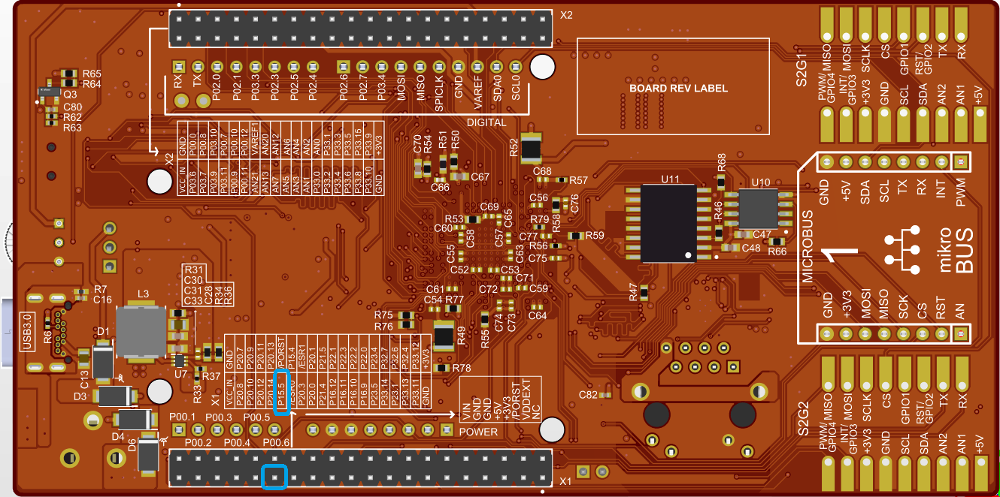
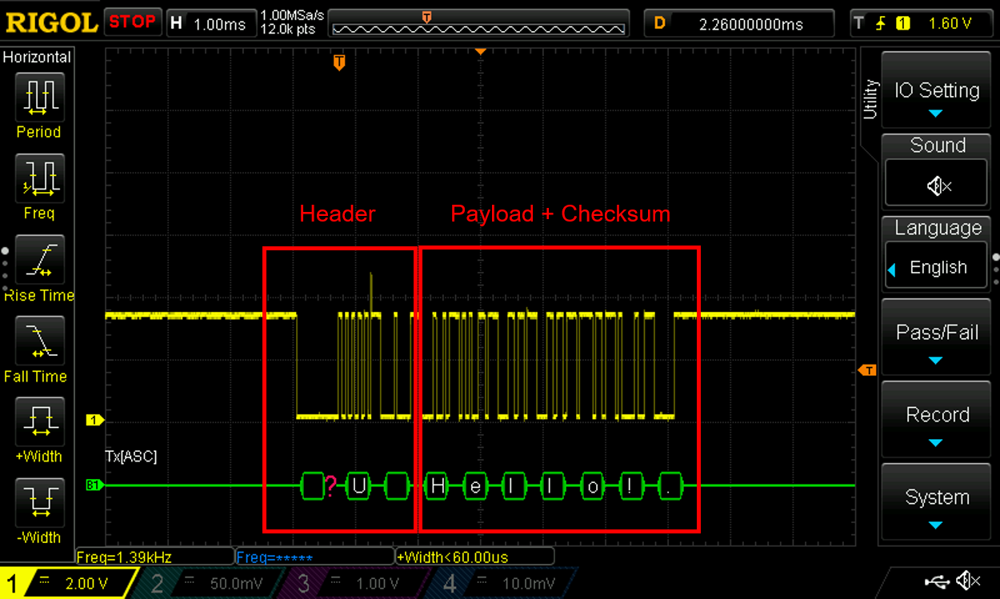

  

# iLLD_TC4D7_LK_ADS_ASCLIN_LIN_Send
**An ASCLIN module is configured as LIN master to send "Hello!"**  

## Device  
The device used in this example is AURIX&trade; TC4D7XP_A-Step_CC_COM  

## Board  
The board used for testing is the AURIX&trade; TC4D7LITE (KIT_A3G_TC4D7_LITE)  

## Scope of work  
The string "Hello!" is sent via an ASCLIN module configured as LIN master.  
The signal can be visualized using an oscilloscope. 
  
## Introduction  
The Asynchronous/Synchronous Interface (ASCLIN) module provides asynchronous serial communication with external devices, using data-in and data-out signals only.  

A LIN bus consists of one master and typically up to 15 slaves which are communicating together.  

The LIN protocol configured as a master supports three transactions:  
- TxH – Transmission of Header
- TxR – Transmission of Message  
- RxR – Reception of Message  
  
A LIN frame consists of two parts:  
- The header, which is always sent by the LIN Master  
- The response, which is sent either by the LIN Master or the addressed LIN Slave  

## Hardware setup  
This code example has been developed for the board TC4D7LITE (AURIX&trade; KIT_A3G_TC4D7_LITE).  
The port pin P15.5 (LIN-TX/RX) should be connected to an oscilloscope probe.  

  

## Implementation  
**Configuration of the ASCLIN module:**  

The function *init_ASCLIN_LIN_master()* is used to configure the ASCLIN module in master mode and is called once by CPU0. It contains the following steps:  
 
1. The module configuration is created with the structure *IfxAsclin_Lin_Config* and filled in with default values using the function *IfxAsclin_Lin_initModuleConfig()*
2. The LIN module is configured to operate as master by setting the *linMode* parameter
3. The desired baudrate is selected with the parameter *brg.baudrate*
4. The pin configuration is set using the predefined structure *IfxAsclin_Lin_Pins*
5. The ASCLIN module is initialized with IfxAsclin_Lin_initModule()  

All functions required for the configuration of the ASCLIN module are provided 
by the iLLD header *IfxAsclin_Lin.h*.  

**Transmission of header and data payload by the master:**  

Sending the string "Hello!" is implemented inside the function *send_ASCLIN_LIN_message()* which is called once after initialization of the ASCLIN module:  
1. The ID byte is set to send data after the header
2. The payload "Hello!" is defined
3. The correct header is sent with the function *IfxAsclin_Lin_sendHeader()*
4. The transmission of header is checked by using the parameter *txHeaderEnd* of the structure *acknowledgmentFlags*
5. The payload together with its checksum is sent with the function *IfxAsclin_Lin_sendResponse()*

The functions above are provided by the iLLD header *IfxAsclin_Lin.h*.  

## Compiling and programming
 
Before testing this code example: 
- Connect the board to the PC through the USB interface
- Build the project using the dedicated Build button  or by right-clicking the project name and selecting "Build Project"
- To flash the device and immediately run the program, click on the dedicated Flash button  

## Run and Test   

After code compilation and flashing the device, perform the following steps:  

- Connect the oscilloscope probe to the TX/RX pin (P15.5)  
- Reset and run the program by pressing the PORST push button  
- Check the oscilloscope for the LIN message:  

  

In the signal both the header and the payload "Hello!" can be observed.

## References  

AURIX&trade; Development Studio is available online:  
- <https://www.infineon.com/aurixdevelopmentstudio>  
- Use the "Import..." function to get access to more code examples  

More code examples can be found on the GIT repository:  
- <https://github.com/Infineon/AURIX_code_examples>  

For additional trainings, visit our webpage:  
- <https://www.infineon.com/aurix-expert-training>  

For questions and support, use the AURIX&trade; Forum:  
- <https://community.infineon.com/t5/AURIX/bd-p/AURIX>  
