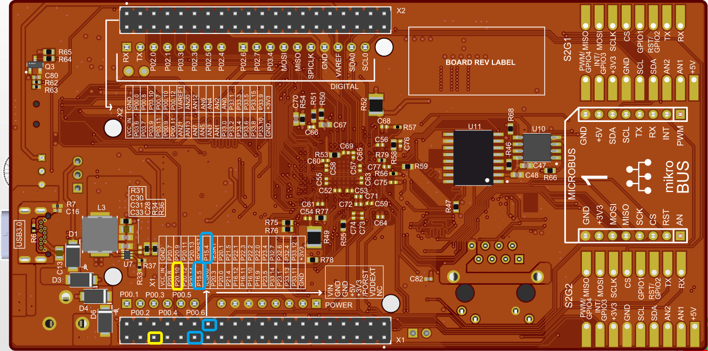
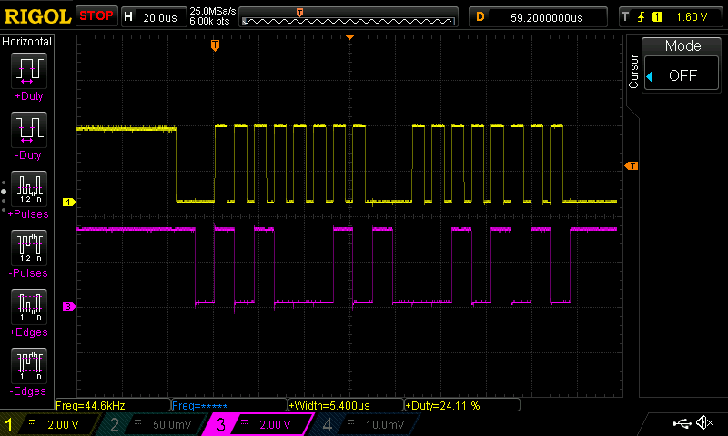

  

# iLLD_TC4D7_LK_ADS_ASCLIN_SPI_Master
**An ASCLIN module configured as SPI master sends a two byte message.**  

## Device  
The device used in this example is AURIX&trade; TC4D7XP_A-Step_CC_COM  

## Board  
The board used for testing is the AURIX&trade; TC4D7LITE (KIT_A3G_TC4D7_LITE)  

## Scope of work  
An ASCLIN module configured as SPI master sends a two byte message. The two byte message is sent through MTSR (MOSI) port pin P15.4 with SCLK on port P20.10 in loopback mode.  
This signal can be visualized on the oscilloscope screen.  

## Introduction  
The Asynchronous/Synchronous Interface (ASCLIN) module provides synchronous serial communication like SPI with external devices, using data-in and data-out signals only.  

The ASCLIN module in SPI configuration can support master mode only with four-wire or three-wire (without slave select output signal) and up to
16-bit data width.  

## Hardware setup  
This code example has been developed for the board TC4D7LITE (AURIX&trade; KIT_A3G_TC4D7_LITE).  
The port pin P15.4 (SPI-MTSR) should be connected to the port pin P15.5 (SPI-MRST) in order to form an external loopback.  
The port pin P20.10 outputs the SPI SCLK signal.  
Those pins can also be connected to an oscilloscope probe for observing the SPI signals.  
 
  

## Implementation  
**Configuration of the ASCLIN module:**  

Configuration of the ASCLIN module for SPI communication is done in the setup phase by initializing an instance of the *IfxAsclin_Spi_Config* structure with the following parameters:  
- *baudrate* – structure to set the actual communication speed in bit/s  
- *interrupt* – structure to set:  
    - transmit and receive interrupt priorities (*txPriority*, *rxPriority*)
    - *typeOfService* – defines which service provider is responsible for handling the interrupt, which can be any of the available CPUs, the CSRM, the DMA, the GTM or the PPU  
- *pins* – structure to set which GPIO port pins are used for the communication  

 
The function *IfxAsclin_Spi_initModuleConfig()* fills the configuration structure with default values and *IfxAsclin_Spi_initModule()* initializes the module with the user configuration.  
 
All the above functions can be found in the iLLD header *IfxAsclin_Spi.h*.  

**The SPI message exchange function:**  

The two byte message is sent via the function *exchange_ASCLIN_SPI_message()* which is called once after initialization of the ASCLIN module.  

The two byte message is sent from the *g_spiTxBuffer* to the *g_spiRxBuffer* using the function *IfxAsclin_Spi_exchange()* from the *IfxAsclin_Spi.h* header file, only if the external loopback is in place.

## Compiling and programming
 
Before testing this code example: 
- Connect the board to the PC through the USB interface
- Build the project using the dedicated Build button  or by right-clicking the project name and selecting "Build Project"
- To flash the device and immediately run the program, click on the dedicated Flash button  

## Run and Test   
After code compilation and flashing the device, perform the following steps:  
- Connect the oscilloscope probes to the MTSR (P15.4) and to the SCLK (P20.10) pins
- Reset and run the program by pressing the PORST push button  
- Check the oscilloscope for the SPI signals:  

   

An additional test without using an oscilloscope can be performed with the debugger.  

- Before transmission, the buffer *g_spiTxBuffer* is filled with a two byte message and the buffer *g_spiRxBuffer* is empty  

- After transmission, both buffers hold the same message:  
    - By using a debugger, you can watch the content of both buffers before and after transmission by setting a breakpoint to *exchange_ASCLIN_SPI_message()*  
    - When reaching this breakpoint, check the content of both buffers (it is different)  
    - After stepping over this function, the content of the buffers must be equal

## References  

AURIX&trade; Development Studio is available online:  
- <https://www.infineon.com/aurixdevelopmentstudio>  
- Use the "Import..." function to get access to more code examples  

More code examples can be found on the GIT repository:  
- <https://github.com/Infineon/AURIX_code_examples>  

For additional trainings, visit our webpage:  
- <https://www.infineon.com/aurix-expert-training>  

For questions and support, use the AURIX&trade; Forum:  
- <https://community.infineon.com/t5/AURIX/bd-p/AURIX>  
