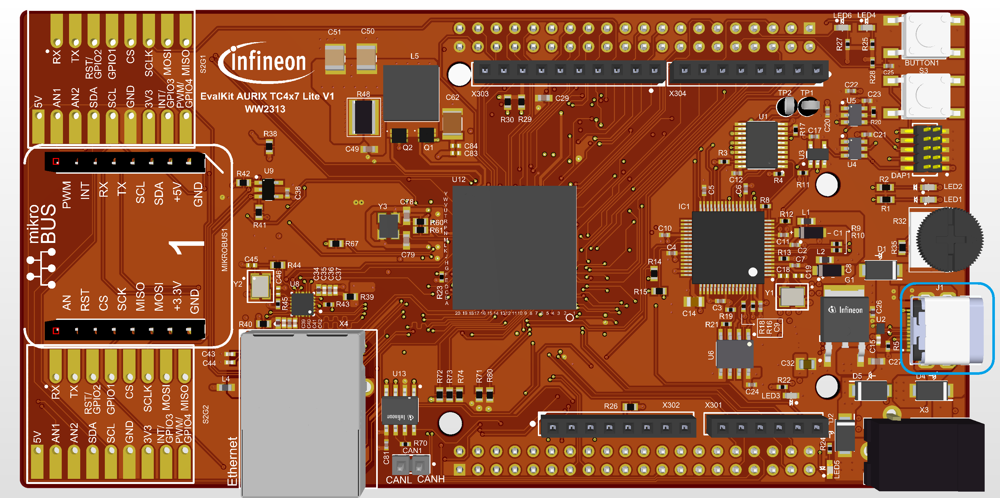

  

# iLLD_TC4D7_LK_ADS_ASCLIN_Shell_UART
**Shell is used to parse a command line and call the corresponding command execution. The ASCLIN module is used to interface with the Shell through the USB port via UART.**  

## Device  
The device used in this example is AURIX&trade; TC4D7XP_A-Step_CC_COM   

## Board  
The board used for testing is the AURIX&trade; TC4D7LITE (KIT_A3G_TC4D7_LITE)    

## Scope of work   
The ASCLIN module is configured for UART communication.  
The Shell from iLLDs exploits the ASCLIN module to interpret and manage commands from the user like "info", "toggle [x]" or "help".  

## Introduction  
The Asynchronous/Synchronous Interface (ASCLIN) module provides serial communication with external devices.  
In this example, it is used to interface with the PC through the USB port via UART communication.  

A Shell is a user interface for parsing commands and accessing services.  

## Hardware setup  
This code example has been developed for the board AURIX&trade; TC4D7LITE (KIT_A3G_TC4D7_LITE)    

The board should be connected to the PC through the USB port.  

  

## Implementation  
**Configure the ASCLIN module**  

The configuration of the ASCLIN module is done by initializing an instance of the *IfxAsclin_Asc_Config* structure, which contains the following fields:  

- *baudrate* – a structure that allows to set
    - *baudrate* – the communication speed in bit/s
    - *oversampling* – the division ratio of the baud rate for reaching higher frequencies to ensure oversampling
- *bitTiming* – a structure that allows to set the sampling mode with
    - *medianFilter* – the number of samples per bit
    - *samplePointPosition* – the first sample point position
- *interrupt* – a structure that allows to set   
    - *txPriority*, *rxPriority* and *erPriority* – the interrupt priorities for transmission, reception and error events
    - *typeOfService* – the service provider responsible for handling the interrupt, which can be any of the available CPUs, the CSRM, the DMA, the GTM or the PPU
- *pins* – a structure that allows to set which port pins are used for the communication  
- *rxBuffer*, *rxBufferSize*, *txBuffer*, *txBufferSize* – parameters that allow to configure the buffers that will hold the incoming/outgoing data  

The function *IfxAsclin_Asc_initModuleConfig()* fills the configuration structure with default values and *IfxAsclin_Asc_initModule()* function initializes the module with the user configuration.  
Both the functions can be found in the iLLD header *IfxAsclin_Asc.h*.  

**Configure the Shell**  

To configure the Shell, it is needed to firstly initialize a Standard Interface and a console from the iLLDs.  
This is done by the functions *IfxAsclin_Asc_stdIfDPipeInit()* and *Ifx_Console_init()*, that can be found respectively in the iLLDs headers *IfxAsclin_Asc.h* and *Ifx_Console.h*.  

The Shell is configured inside the function *initShellInterface()* by initializing an instance of the *Ifx_Shell_Config* structure with default values through the function *Ifx_Shell_initConfig()*.  
Then, the following parameters are modified:  

- *standardIo* – that allows to set the module used for serial communication  
- *commandList* – that allows to set the list of commands supported by the shell  
The command list is an array of structures of the type Ifx_Shell_Command, that contains:  
    - *commandLine* – the actual command which will be sent to the shell by the user  
    - *help* – a small description of the command that is shown when help command is given  
    - *data* – a link to the shell  
    - *call* – the function called when the command is given  

The *Ifx_Shell_init()* function initializes the shell with the user configuration.  

The functions *Ifx_Shell_initConfig()* and *Ifx_Shell_init()* can be found in the iLLD header *Ifx_Shell.h*, while the function *initShellInterface()* is defined in the header *ASCLIN_Shell_UART.h*.  

**Run the Shell**  

The Shell is continuously run through the function *runShellInterface()* called inside the infinite while loop in the *Cpu0_Main.c* file.  

It continuously reads the incoming data and evaluates it when the carriage return character is entered.  

**Configure and control the LEDs**

The LEDs are toggled by controlling the port pins to which they are connected using methods from the iLLD headers *IfxPort.h*.  
The LED port pins have to be configured to output push-pull mode using the function *IfxPort_setPinMode()*.  

During program execution, the LEDs are switched on and off using the function *IfxPort_setPinState().*  

**Configure the Interrupt Service Routine (ISR)**  

The function implementing the ISR needs to be assigned a priority via the macro *IFX_INTERRUPT(isr, vectabNum, priority)*.  

Since the Shell uses the ASCLIN module to interface with the user, three ISRs are needed to be configured for transmission, reception and error events.  

Each ISR should call the handler for the respective operation (transmit, receive or error) by passing the ASC handle.  

## Compiling and programming
 
Before testing this code example: 
- Connect the board to the PC through the USB interface
- Build the project using the dedicated Build button  or by right-clicking the project name and selecting "Build Project"
- To flash the device and immediately run the program, click on the dedicated Flash button  

## Run and Test  
For this example, a serial terminal is required for  using the Shell. The terminal can be opened inside the AURIX&trade; Development Studio using the following icon:  

  

The serial terminal must be configured with the following parameters to enable the communication between the board and the PC:  
- Speed (baud): 115200
- Data bits: 8
- Stop bit: 1

After code compilation open the serial terminal with the above configuration and flash the device, then perform the following steps:  
- Type "help" to see the list of available commands  
- Type "toggle [0/1/2]" to respectively: turn on all LEDs, toggle LED P03.9, P03.10
- Check command execution  

  

## References  

AURIX&trade; Development Studio is available online:  
- <https://www.infineon.com/aurixdevelopmentstudio>  
- Use the "Import..." function to get access to more code examples  

More code examples can be found on the GIT repository:  
- <https://github.com/Infineon/AURIX_code_examples>  

For additional trainings, visit our webpage:  
- <https://www.infineon.com/aurix-expert-training>  

For questions and support, use the AURIX&trade; Forum:  
- <https://community.infineon.com/t5/AURIX/bd-p/AURIX>  
