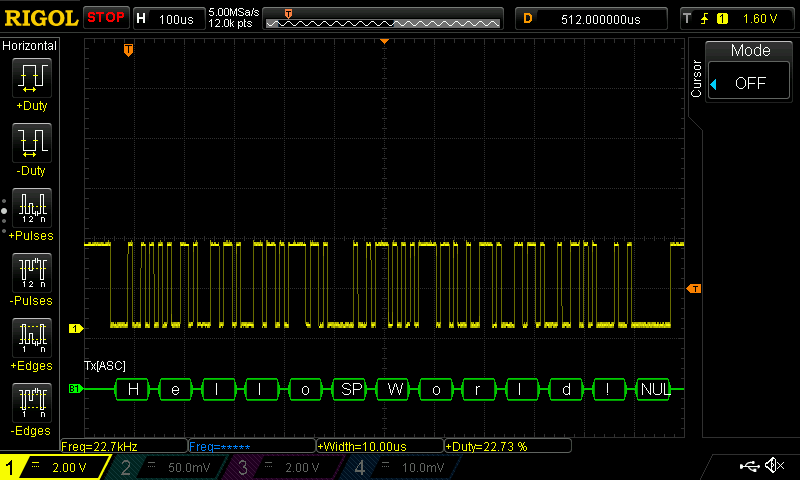

  

## iLLD_TC4D7_LK_ADS_ASCLIN_UART
**An ASCLIN module configured for UART communication sends "Hello World!" and receives the string back via the internal loopback.**  

## Device  
The device used in this example is  AURIX&trade; TC4D7XP_A-Step_CC_COM  

## Board  
The board used for testing is the  AURIX&trade; TC4D7LITE (KIT_A3G_TC4D7_LITE)  

## Scope of work   
The string "Hello World!" is sent and received via UART through one pin due to the internal loopback.  
The data can be visualized using an oscilloscope.  

## Introduction  
The Asynchronous/Synchronous Interface (ASCLIN) module enables asynchronous/synchronous serial communication with external devices.  

Among others, it supports asynchronous reception/transmission (UART) for communication.  

For test purposes, the transmit pin (TX) and receive pin (RX) can be shorted internally on-chip (loopback mode).
 
## Hardware setup  
This code example has been developed for the board TC4D7LITE (AURIX&trade; KIT_A3G_TC4D7_LITE).  
The port pins P15.0 and 15.1 (UART-TX/RX) can be connected to an oscilloscope probe.
 
  

## Implementation 
**Configuration of the ASCLIN module:**  

Configuration of the ASCLIN module for UART communication is done in the setup phase by initializing an instance of the *IfxAsclin_Asc_Config* structure with the following parameters:  
- *baudrate* – structure to set the actual communication speed in bit/s  
- *interrupt* – structure to set:  
    - transmit and receive interrupt priorities (*txPriority*, *rxPriority*)  
    - *typeOfService* – defines which service provider is responsible for handling the interrupt, which can be any of the available CPUs, the CSRM, the DMA, the GTM or the PPU  
- *pins* – structure to set which GPIO port pins are used for the communication  
- *rxBuffer*, *rxBufferSize*, *txBuffer*, *txBufferSize* – to configure the buffers that will hold
the incoming/outgoing data

The function *IfxAsclin_Asc_initModuleConfig()*  fills the configuration structure with default values and *IfxAsclin_Asc_initModule()* initializes the module with the user configuration.  

All the above functions can be found in the iLLD header *IfxAsclin_Asc.h*.  

**The UART send/receive function:**  

Sending the string "Hello World!" is implemented inside the function *send_receive_ASCLIN_UART_message()* which is called once after initialization of the ASCLIN module.  

This function calls *IfxAsclin_Asc_write()* and *IfxAsclin_Asc_read()* which are provided by the iLLD header *IfxAsclin_Asc.h*.  

**The UART send/receive function:**  

The UART frame configured for 115200/8-N-1 consists of different parts:  
- One start bit which is "0"  
- Eight bits of data  
- One stop bit which is "1"  

Each time the last byte is taken out of the transmit FIFO (size is 16-bytes), the Transmit FIFO Level (TFL) flag is set and the interrupt service routine *asclin0TxISR()* is entered.  
The ISR calls *IfxAsclin_Asc_isrTransmit()* which refills the FIFO with the remaining bytes to be transmitted and clears the interrupt flag.  

Each time an UART byte is received, the Receive FIFO Level (RFL) flag is set and the interrupt service routine *asclin0RxISR()* is entered.  
The ISR calls *IfxAsclin_Asc_isrReceive()* which moves the received byte to the global array *g_ascRxBuffer* and clears the interrupt flag.

## Compiling and programming
 
Before testing this code example: 
- Connect the board to the PC through the USB interface
- Build the project using the dedicated Build button  or by right-clicking the project name and selecting "Build Project"
- To flash the device and immediately run the program, click on the dedicated Flash button  

## Run and Test   
An oscilloscope probe must be connected to the UART TX pin (P15.0) to observe the UART signal.  

After code compilation and flashing the device, perform the following steps:  
- Connect the oscilloscope probe to the TX pin (P15.0)  
- Reset and run the program by pressing the PORST push button  
- Check the oscilloscope for the UART signal:  

  

An additional test without using an oscilloscope can be performed with a debugger.  

Before transmission, the buffer *g_txData* is filled with the message "Hello World!" and the buffer *g_rxData* is empty.  
After transmission, both buffers hold the same message:  
- By using the debugger, you can watch the content of both buffers before and after transmission by setting a breakpoint to *send_receive_ASCLIN_UART_message()*
- When reaching this breakpoint, check the content of both buffers (it is different)
- After stepping over this function, the content of the buffers must be equal  

## References  

AURIX&trade; Development Studio is available online:  
- <https://www.infineon.com/aurixdevelopmentstudio>  
- Use the "Import..." function to get access to more code examples  

More code examples can be found on the GIT repository:  
- <https://github.com/Infineon/AURIX_code_examples>  

For additional trainings, visit our webpage:  
- <https://www.infineon.com/aurix-expert-training>  

For questions and support, use the AURIX&trade; Forum:  
- <https://community.infineon.com/t5/AURIX/bd-p/AURIX>  
