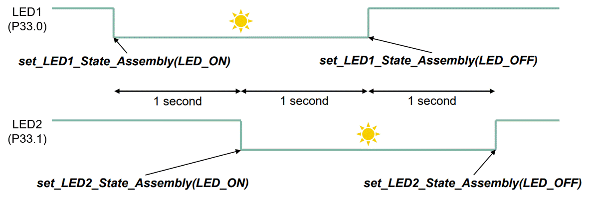

  

# iLLD_TC4D7_LK_ADS_Assembly_C_Code

**Inline assembler and assembler files are used in combination in a C project.**  

## Device  
The device used in this example is AURIX&trade; TC4D7XP_A-Step_CC_COM  

## Board  
The board used for testing is the AURIX&trade; TC4D7XP_A-Step_CC_COM (KIT_A3G_TC4D7_LITE)  

## Scope of work   
Two LEDs are switched on then switched off using assembly code functions.

## Introduction  
- The TASKING compiler within the AURIX&trade; Development Studio offers the possibility to use the assembly language inside the project code
- The assembly language is based on implementing code with the CPU instruction set, TriCore&trade; in this case
- This hardware oriented method allows the application to be memory efficient and faster in term of execution time comparing to higher level programming languages (C, C++, …)
- Assembly code can be implemented both inside dedicated source files " _*.s " and in C source files using the  *___asm()__* *volatile*  keyword
- Useful Documentation:
    - TriCore&trade; instruction set    
    - GCC compiler assembly language user guide

## Hardware setup  
This code example has been developed for the board AURIX&trade; TC4D7XP_A-Step_CC_COM (KIT_A3G_TC4D7_LITE):  
 
  

## Implementation    
**LED1 state control**  

LED1 driven by port 03 pin 9 can be switched ON/OFF by calling the assembly function *set_LED1_State_Assembly()*, implemented in the assembly source file *Assembly_Code.s*.

This functionality is ensured by the following steps:
- Check the value passed to the function:
    - If 0 (LED_OFF): write 0x20 to D0 data register
    - Else 1 (LED_ON): write 0x20 to D0 data register
- Load the Port 03 Output Modification Register (OMR) into A0 address register
- Store D0 value into A0 address register (Port 03 OMR register)
- Return from function, needed to restore the context of the caller function

**LED2 state control**  

LED2 driven by port 03 pin 10 can be switched ON/OFF by calling the assembly function *set_LED2_State_Assembly()*, implemented in the C source *Assembly_C_Code.c* file using the *__asm()__* *volatile* keyword.

This functionalty is ensured by the following steps:
- Check the value passed to the function:
    - If 0 (LED_OFF): write 0x20 to D0 data register
    - Else 1 (LED_ON): write 0x20 to D0 data register
- Load the Port 33 OMR register into A0 address register
- Store D0 value into A0 address register (Port 03 OMR register)

**Note**: the return instruction is not needed in this case, because the assembly code is called inside a C code, this means the C compiler is handling restoring the context.

**Scenario:**
- P03.9 and P03.10 are used to drive the LED1 and LED2 
- The port pin mode is set using the *IfxPort_setPinMode()* iLLD function
- Then both LED1 and LED2 are switched off using the *IfxPort_setPinHigh()* iLLD function, please note that the LEDs are low-level active
- Afterwards the following scenario is implemented:

  

## Compiling and programming

Before testing this code example:  
- Power the board through the dedicated power connector 
- Connect the board to the PC through the USB interface
- Build the project using the dedicated Build button  or by right-clicking the project name and selecting "Build Project"
- To flash the device and immediately run the program, click on the dedicated Flash button  

## Run and Test  
After code compilation and flashing the device, check the following behavior:
- Firstly, LED1 (P03.9) is switched on
- One second after, LED2 (P03.10) is switched on
- One second after, LED1 (P03.9) is switched off
- One second after, LED2 (P03.10) is switched off
  
  

## References  

AURIX&trade; Development Studio is available online:  
- <https://www.infineon.com/aurixdevelopmentstudio>  
- Use the "Import..." function to get access to more code examples  

More code examples can be found on the GIT repository:  
- <https://github.com/Infineon/AURIX_code_examples>  

For additional trainings, visit our webpage:  
- <https://www.infineon.com/aurix-expert-training>  

For questions and support, use the AURIX&trade; Forum:  
- <https://community.infineon.com/t5/AURIX/bd-p/AURIX>  
