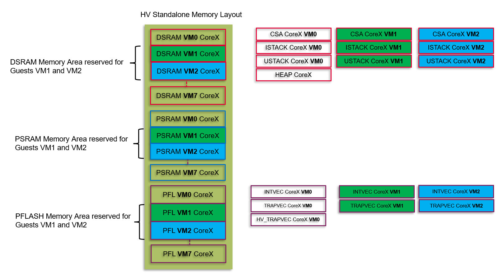
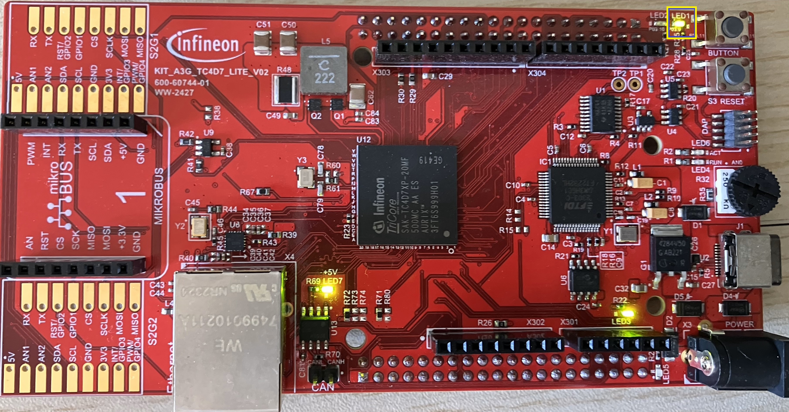

  

# iLLD_TC4D7_LK_ADS_Blinky_LED_Virtualized

**An LED is blinking based on the timing given by a wait function.**  

## Device  
The device used in this example is AURIX&trade; TC4D7XP_A-Step_CC_COM

## Board  
The board used for testing is the AURIX&trade; TC4D7XP_A-Step_CC_COM (KIT_A3G_TC4D7_LITE)

## Scope of work   
Demo project to show how to adapt an existing LED Blinky ADS project in order to execute the same application inside a Virtual Machine (VM).

## Introduction  
- This demo project provides user with information on how to implement a project to make it runnable within a Virtual Machine (VM) 
- For this reason an existing Blinky_LED AURIX&trade; TC4xx code example is modified so that it can be executed on Virtual Machine of CPU0 (e.g. CPU0-VM1)
- The resulting "virtualized" Blinky_LED project will behave exactly like the original ADS iLLD_TC4D7_LK_ADS_Blinky project but it could be used also with Hypervisor Scheduler offered by the ADS project iLLD_TC4D7_LK_ADS_Virtualization_Hypervisor
- As the functionality is not changed, this demo will help user understand what needs to be changed in SW and in linker files of an existing project to make it runnable in a VM
- The virtualized Blinky_LED project can be built independently (e.g. symbols used here will not conflict with other VMs or Hypervisor Software), which is a major change when compared to all VMs and Hypervisor (HV) built together

As there is no change in the functionality, request the user to refer the original project documentation for Introduction.

The project could be configured in 2 ways in order to be executed:

- as hosted VM (e.g. VM1): by enabling VM compilation by setting *IFX_CFG_COMPILE_AS_VM = 1* into file *Ifx_Cfg.h* and by selecting the VM by setting *LCF_LINKASVM = X (e.g. X = 1)*  into linker file *Lcf_Gcc_Tricore_Tc_Virtualized.lsl* OR *Lcf_Tasking_Tricore_Tc_Virtualized.lsl*
- as stand-alone application: by setting *IFX_CFG_COMPILE_AS_VM = 0* into file *Ifx_Cfg.h* and *LCF_LINKASVM = 0* into linker file *Lcf_Gcc_Tricore_Tc_Virtualized.lsl* OR *Lcf_Tasking_Tricore_Tc_Virtualized.lsl*

**NOTE** Please contact IFX representative for *Lcf_Tasking_Tricore_Tc_Virtualized.lsl*. By default only Gcc linker is available for the user.

The "hosted VM" configuration must be executed in combination of a hypervisor software available with the project iLLD_TC4D7_LK_ADS_Virtualization_Hypervisor.

The "stand-alone" configuration could be directly executed as described in "Run and Test" section.

The project is released by default with "stand-alone" configuration.

**Add on feature for better testability**

When compared to the original project, an System Timer (STM) based interrupt is implemented which interrupts VM1 at regular intervals.

## Hardware setup  
This code example has been developed for the board KIT_TC4D7 Lite KIT (AURIX&trade; TC4D7 Lite KIT Board)

    

## Implementation  
As there is no change in the functionality, request the user to refer the original project Blinky_LED_1_KIT_TC499_COM_TRB documentation for Implementation. However, parts are repeated here for user convenience.

**Initialization of the LED - copied from original project as is**
- The LED is switched off with the function *IfxPort_setPinHigh()* from the iLLD *IfxPort.h*  
- The LED is initialized with the function *IfxPort_setPinModeOutput()* from the iLLD *IfxPort.h*

**Toggling of the LED - copied from original project as is**
- The state of the LED is toggled with the function *IfxPort_togglePin()* from the iLLD *IfxPort.h*
- This state is held for 500 milliseconds with the function *waitTime()* from the iLLD *Bsp.h*

**New features introduced**
- An STM timer is implemented to interrupt VM1 at 1s rate
- Inside the ISR a global variable is incremented which can be used for test purposes 

**Modifications to project files to virtualize the original Blinky_LED_1_KIT_TC499_COM_TRB project**

Following changes shall be performed to make the original Blinky_LED application runnable inside a VM1, and to be able to independently compile it: 

<table class="tg">
<thead>
  <tr>
    <th class="tg-qvuz">#</th>
    <th class="tg-qvuz">File</th>
    <th class="tg-qvuz">Change</th>
    <th class="tg-qvuz">Reason</th>
  </tr>
</thead>
<tbody>
  <tr>
    <td class="tg-0thz">1</td>
    <td class="tg-za14"><i>Ifx_Cfg.h</i></td>
    <td class="tg-za14">Updated configuration symbol <i>IFX_STM_RESOLUTION</i></td>
    <td class="tg-za14">This configuration symbol is used for setting the STM resolution during ISR configuration. 
      New set is <i>IFX_STM_RESOLUTION</i> = 400000000 (400 MHz).  This change is needed since the STM frequency used by the project is 400 MHz, but it's not strictly mandatory for virtualization. </td>
  </tr>
    <tr>
    <td class="tg-0thz">2</td>
    <td class="tg-za14"><i>Ifx_Cfg.h</i></td>
    <td class="tg-za14">Added configuration symbol <i>IFX_CFG_COMPILE_AS_VM</i></td>
    <td class="tg-za14">This configuration symbol is used for compiling the application to be hosted as VM or to be executed alone without a hypervisor. 
      By setting <i>IFX_CFG_COMPILE_AS_VM</i> = 1, the application is built to be hosted as VM.   By setting <i>IFX_CFG_COMPILE_AS_VM</i> = 0, the application is built to be executed alone without a hypervisor. </td>
  </tr>
  <tr>
    <td class="tg-j6zm">3</td>
    <td class="tg-7zrl"><i>iLLD</i></td>
    <td class="tg-7zrl">Used iLLD version 2.3.0</td>
    <td class="tg-7zrl">New iLLD function is needed in case of usage new TC1.8 instructions needed for support virtualization.</td>
  </tr>
  <tr>
    <td class="tg-j6zm">4</td>
    <td class="tg-7zrl"><i>Ifx_Ssw_Tc0.c</i> <i>Ifx_Ssw_TcX.c</i></td>
    <td class="tg-7zrl">W.r.t. iLLD version 2.3.0 new start-up functions <i>_STARTX1</i> have been added <i>_STARTX1()(X=1,...,5)</i></td>
    <td class="tg-7zrl">This is an important change to ensure virtualization.   These new start-up functions are needed as hook to a Hypervisor scheduler aimed to trigger the VM1 of each cores.
      _STARTX1 function initializes the context save area, trap, interrupt vector tables, stack-pointer and global variables for each CPUX-VM1, X=0,1,...,5.</td>
  </tr>
  <tr>
    <td class="tg-j6zm">5</td>
    <td class="tg-7zrl"><i>Blinky_LED.c</i></td>
    <td class="tg-7zrl">Added debug global debug counter</td>
    <td class="tg-7zrl">A new debug counter "<i>g_vm1MainCounterBlink</i>" has been added to monitor the CPU0-VM1 activity when scheduled by Hypervisor. It's not a mandatory change for supporting virtualization.</td>
  </tr>
  <tr>
    <td class="tg-j6zm">6</td>
    <td class="tg-7zrl"><i>Blinky_LED.c</i></td>
    <td class="tg-7zrl">Added debug Interrupt Service routine</td>
    <td class="tg-7zrl">A new debug Interrupt Service routine "<i>Cpu0_Vm1_stm0_Isr()</i>" has been added to trigger a periodic ISR to monitor the CPU0-VM1 activity when scheduled by Hypervisor. It's not a mandatory change for supporting virtualization.</td>
  </tr>
  <tr>
    <td class="tg-j6zm">7</td>
    <td class="tg-7zrl"><i>Cpu1_Main.c</i></td>
    <td class="tg-7zrl">Added debug global debug counter</td>
    <td class="tg-7zrl">A new debug counter "<i>g_Tc1vm1MainCounterBlink</i>" has been added to monitor the CPU1-VM1 activity when scheduled by Hypervisor. It's not a mandatory change for supporting virtualization.</td>
  <tr>
    <td class="tg-j6zm">8</td>
    <td class="tg-7zrl"><i>Cpu5_Main.c</i></td>
    <td class="tg-7zrl">Added debug global debug counter</td>
    <td class="tg-7zrl">A new debug counter "<i>g_Tc5vm1MainCounterBlink</i>" has been added to monitor the CPU5-VM1 activity when scheduled by Hypervisor. It's not a mandatory change for supporting virtualization.</td>    
 </tr>
 <tr>
 <td class="tg-j6zm">9</td>
 <td class="tg-7zrl"><i>Lcf_Gcc_Tricore_Tc_Virtualized.lsl</i> </td>
 <td class="tg-7zrl">Added new linker file to be used with a Hypervisor environment</td>
 <td class="tg-7zrl">This is an important change to ensure virtualization.  The linker has been added to properly allocating memory space needed by selected VM (e.g. VM1 if configuration symbol is <i>LCF_LINKASVM</i> = 1, see next line for details). 
   The linker file script shall produce an ELF/HEX binary file by using space in RAM and FLASH to be used only by selected Virtual Machine.  The linker file script is crucial for allocating properly the code/data of selected Virtual Machine without interfering with other areas dedicated to other VMs or Hypervisor.
   Summary of relevant changes respect to original linker file:
     1- Updated definitions value of <i>LCF_DSPRX_START</i> and <i>LCF_DSPRX_SIZE, X= 0,...,5</i> for reducing RAM area to be used by selected VM (e.g. VM1 if configuration symbol is <i>LCF_LINKASVM</i> = 1, see next line for details)  
     2- Updated definitions value of <i>LCF_INTVECX_START</i>, X= 0,...,5 for allocating Interrupt Tables to be used by selected VM (e.g. VM1 if configuration symbol is <i>LCF_LINKASVM</i> = 1, see next line for details)
     3- Updated definitions value of <i>LCF_TRAPVECX_START</i>, X= 0,...,5 for allocating TRAP Tables to be used by selected VM (e.g. VM1 if configuration symbol is <i>LCF_LINKASVM</i> = 1, see next line for details)
     4- Added new definitions value of <i>LCF_STARTPTR_NC_CPUXY, X= 0,...,5; Y= 0,1</i> for handling the start-code start address to be used by selected VM and by Hypervisor
     5- Created new memory groups for partitioning the RAM and FLASH area and reserving area for selected VM (e.g. VM1 if configuration symbol is <i>LCF_LINKASVM</i> = 1, see next line for details) (and see Figure below)
     6- Used new memory groups definitions for handling ustack, istack, csa, data/code for selected VM (e.g. VM1 if configuration symbol is <i>LCF_LINKASVM</i> = 1, see next line for details) </td>
 </tr>
  <tr>
 <td class="tg-j6zm">10</td>
 <td class="tg-7zrl"><i>Lcf_Tasking_Gcc_Tc_Virtualized.lsl</i></td>
 <td class="tg-za14">Added configuration symbols <i>LCF_LINKASVM</i></td>
    <td class="tg-za14">This configuration symbol is used for configuring the memory layout when the application shall be linked as VM. 
      By setting <i>LCF_LINKASVM</i> = x (e.g. x= 1), the application memory is linked for hosting VMx (e.g. VM1.   By setting <i>LCF_LINKASVM</i> = 0, the application memory is linked to be executed alone without a hypervisor. </td>
 </tr>
</tbody>
</table>

**Note**

No PROT/APU mechanisms has been applied in this project.

**Memory Allocation**

The linker file script is crucial for allocating properly the code/data of VM1 without interfering with other areas dedicated to other VMs (e.g. VM2) or Hypervisor (HV).
Figure below shows in green the memory regions used by this application once this application will be executed as VM1 and other VMs are running and scheduled by an HV.

  

##Important summary note

Above table shows that no major changes to existing application are needed, except for: 
1. Changes to **startup** (listed in point 4 of above table) 
2. Changes to **linker file** (listed in points 9 and 10 of above table)

With these changes we are able to successfully convert an existing code example to run it inside a VM.

## Compiling and programming

Before testing this code example:   
- Connect the board to the PC through the USB interface. If you are using an external debugger then addition +12V power supply must be provided along with appropriate debug connector. 
- Build the project using the dedicated Build button  or by right-clicking the project name and selecting "Build Project"
- To flash the device and immediately run the program, click on the dedicated Flash button 

**Note**

This version of the Blinky-LED project is a "virtualized" project which means that it needs also a Hypervisor project to be programmed. Please use ADS *illd_tc4d7_lk_ads_virtualization_hypervisor* project as "stand-alone" mode. Refer "Compiling and programming" section of the earlier mentioned hypervisor project.    

## Run and Test   
The test procedure is same as original Blinky_LED project. After code compilation and flashing the device, observe the LED P03.9 (LED1), which is blinking at a frequency of approximately 2 Hz.

However, please refer to ADS project illd_tc4d7_lk_ads_virtualization_hypervisor "stand-alone" mode, "Run and Test" section, in the "stand-alone" mode section, to follow the recommended flashing procedure and test observations.

  

## References  

AURIX&trade; Development Studio is available online:  
- <https://www.infineon.com/aurixdevelopmentstudio>  
- Use the "Import..." function to get access to more code examples  

More code examples can be found on the GIT repository:  
- <https://github.com/Infineon/AURIX_code_examples>  

For additional trainings, visit our webpage:  
- <https://www.infineon.com/aurix-expert-training>  

For questions and support, use the AURIX&trade; Forum:  
- <https://community.infineon.com/t5/AURIX/bd-p/AURIX>  
