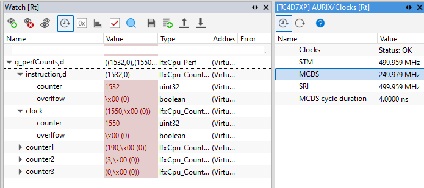
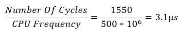

  

# iLLD_TC4D7_LK_ADS_CPU_Perf_Counters

**Measure code performance via the CPU performance counters**  

## Device  
The device used in this example is AURIX&trade; TC4D7XP_A-Step_CC_COM  

## Board  
The board used for testing is the AURIX&trade; TC4D7XP_A-Step_CC_COM (KIT_A3G_TC4D7_LITE)  

## Scope of work  
The CPU performance counters are counting the number of instructions, clock ticks and multi counters ticks. 
They are used to measure the run-time of a c-function. The result is stored in a global variable.

## Introduction  
The CPU performance counters are part of the TriCore&trade; CPU core and need to be accessed via the On-Chip Debug Support (OCDS) module, which is used for debugging and performance optimization.

## Hardware setup  
This code example has been developed for the board KIT_A3G_TC4D7_LITE (AURIX&trade; TC4D7XP_A-Step_CC_COM).  
 
  

## Implementation    
**Running CPU performance counters**

The function  _runCpuPerfCounters()_  measures the run-time of the function *loop()*, which is placed between the *IfxCpu_resetAndStartCounters()* and *IfxCpu_stopCounters()*:
- *IfxCpu_resetAndStartCounters()* to start CPU performance counters. A parameter is specifying the counter mode:
    - *Normal* mode: The counters increment on their respective triggers.
    - *Task* mode: Allow an additional gating from the debug unit which can filter data based on specific criteria.
- *IfxCpu_stopCounters()* to stop and return counters values.   

## Compiling and programming

Before testing this code example:  
- Power the board through the dedicated power connector 
- Connect the board to the PC through the USB interface
- Build the project using the dedicated Build button  or by right-clicking the project name and selecting "Build Project"
- To flash the device and immediately run the program, click on the dedicated Flash button  

## Run and Test  
After code compilation and flashing the device, perform the following steps:

- Add the result of the measurement (*g_perfCounts*) to the Watch View of the debugger (for the below test run ADS integrated winIDEA debugger has been used for demonstration purpose only. Any other debugger can also be used to achieve the similar results):
       

- Check the performance of the function *loop()* through the values stored in the structure *g_perfCounts* displayed in the Watch View:
    - *instruction* counter: 1532 assembly instructions are processed by the CPU0 within the *loop()* function.
    - CPU *clock* cycle counter: 1550 clock cycles are needed to process the *loop()* function.
       
    - Multi-Counter *counter1*, *counter2* and *counter3* purposes are not covered in this example. They can be configured to count events such as CPU stalls, cache hits/misses, branch predictions etc.

## References  

AURIX&trade; Development Studio is available online:  
- <https://www.infineon.com/aurixdevelopmentstudio>  
- Use the "Import..." function to get access to more code examples  

More code examples can be found on the GIT repository:  
- <https://github.com/Infineon/AURIX_code_examples>  

For additional trainings, visit our webpage:  
- <https://www.infineon.com/aurix-expert-training>  

For questions and support, use the AURIX&trade; Forum:  
- <https://community.infineon.com/t5/AURIX/bd-p/AURIX>  
