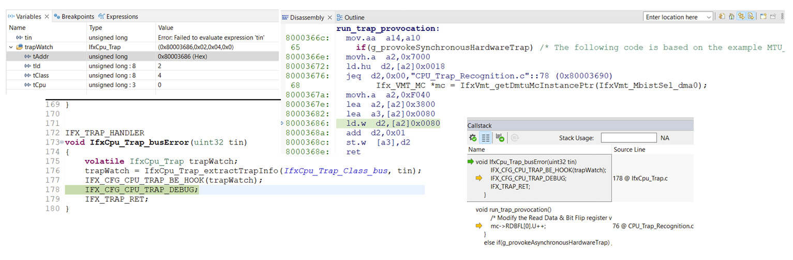
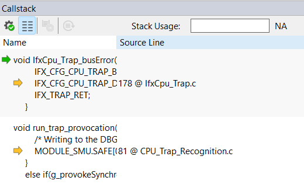

  

# iLLD_TC4D7_LK_ADS_CPU_Trap_Recognition 
**This example shows how to identify the root cause of a trap.**

## Device  
The device used in this example is AURIX&trade; TC4D7XP_A-Step_CC_COM

## Board  
The board used for testing is the AURIX&trade; TC4D7 lite Kit (KIT_A3G_TC4D7_LITE)

## Scope of work  
The tutorial describes what types of traps are supported by the AURIX&trade; microcontroller, their root causes and how to identify them. AURIX&trade; architecture supports different types of traps. Three different traps can be provoked with this example and the tutorial guides the user through the needed steps to observe the root cause of each trap.

## Introduction  
A trap occurs as a result of an event such as a Non-Maskable Interrupt (NMI), an instruction exception, a memory management exception or an illegal access. Traps are always active; they cannot be disabled by software.
- The TriCore&trade; architecture specifies eight general classes for traps. Each trap class has its own trap handler. Within each class, specific traps are distinguished by a Trap Identification Number (TIN)
- Traps can be further classified as synchronous or asynchronous and as hardware or software generated
- Three different combinations of trap types are supported:
    - Synchronous and hardware generated
    - Asynchronous and hardware generated
    - Synchronous and software generated

## Hardware setup  
The board used for testing is the AURIX&trade; TC4D7 lite Kit (KIT_A3G_TC4D7_LITE).

  

## Implementation
**Supported Traps**  

Please refer to the TriCore&trade; TC1.8 Core Architecture Manual and the AURIX&trade; TC4xx User's
Manual for detailed information about each trap.

  

  

**Trap types**
- **Synchronous traps**:
    - Synchronous traps are associated with the execution or attempted execution of specific instructions or with attempts to access a virtual address that requires the intervention of the memory-management system
    - The trap is triggered and serviced immediately
- **Asynchronous traps**:
    - Since asynchronous traps are associated with hardware conditions, they are similar to interrupts
    - They are routed via the trap vector
    - Some asynchronous traps are triggered indirectly from instructions that have been previously executed, but the direct association with the instructions causing the trap is lost
- **Hardware traps**:
    - Hardware traps are generated in response to exception conditions detected by the hardware
    - In most, but not all cases, the exception conditions are associated with the attempted execution of a particular instruction
- **Software traps**:
    - Software traps are generated as an intentional result of executing a system call or an assertion instruction

**Trap handling**
- When a trap occurs, a trap identifier is generated by hardware. The trap identifier has two components that can be used to determine more information about the trap and why it was caused (refer to the section "Supported traps"):
    - The Trap Class Number (TCN)
    - The Trap Identification Number (TIN)
- In most cases, the debugger will stop the code execution within one of the trap handlers (implemented in the iLLD header *IfxCpu_Trap.c*)
- An instance of the structure *IfxCpu_Trap* is declared within each trap handler. When a trap occurs, the instance provides four information fields about the trap:
    - *tCpu*: Which CPU caused the trap
    - *tClass*: TCN, Class of the trap (please refer to section "Supported traps")
    - *tId*: TIN, Id of the trap (please refer to section "Supported traps")
    - *tAddr*: Return Address (RA) (explained in the next section)

**Return Address**
- The Return Address (RA) might help to locate the specific line of code which caused the trap
- The return address, which is stored in the instance of the *IfxCpu_Trap* structure, is read from the return address register A[11]
- Depending on the trap type, the return address is different:
    - For most of the **synchronous** traps, the return address is the 32-bit Program Counter (PC) of the instruction that caused the trap (the PC holds the address of the instruction which is currently running when the core is halted)
    - On a **System Call (SYS)** trap, triggered by the SYSCALL instruction, the return address points to the instruction immediately following SYSCALL
    - A **Free Context List Depletion (FCD)** trap is generated after a context save operation that causes the free context list becoming "almost empty". The  FCD trap can be caused by a hardware interrupt or a trap handler. The operation responsible for the context save normally is completed before the FCD trap is executed. Because of this, the return address of the FCD trap is the first instruction of the trap/interrupt/called routine or the instruction following a Save Lower Context (SVLCX) or Begin Interrupt Service Routine (BISR) instruction
    - For an **asynchronous** trap, the return address is the address of the instruction that would have been executed next, if the asynchronous trap had not been triggered

**Additional debug information**
- The bit field *ERROR_ADDRESS* of the Data Error Address Register (DEADD) contains the trap address information or the data memory. The content of the DEADD register is valid if the Data Synchronous Trap Register (DSTR) or the Data Asynchronous Trap Register (DATR) registers are non-zero (depending on the trap type). The bit fields in the DSTR and the DATR registers can provide additional information about the trap (refer to the TC4xx User's Manual).
- This information is valid in case of traps such as:
    - Data Address Alignment (ALN)
    - Data Access Synchronous Error (DSE)
    - Data Access Asynchronous Error (DAE)
    - Invalid Local Memory Address (MEM)
    - Memory Protection Write (MPW)
    - Memory Protection Read (MPR)
    - Memory Protection Peripheral Access (MPP)
    - Memory Protection Null Address (MPN)
- The Program Memory Interface Synchronous Trap Register (PSTR) contains synchronous trap information for the program memory system. The register is updated with trap information for Program Fetch Synchronous Error traps (PSE)
- The Program (or Data) Integrity Error Address Register (PIEAR / DIEAR) and the Program (or Data) Integrity Error Trap Register (PIETR / DIETR) can be read to determine the source of the Program (or Data) Memory Integrity Error (PIE / DIE) more precisely

**Trap provocation**
- Three different combinations of trap types can be provoked in this example:
    - Synchronous Hardware Trap
    - Asynchronous Hardware Trap
    - Synchronous Software Trap
- The trap provocation is implemented in the function *run_trap_provocation()* and can be started by setting one of the three *g_provokeXYTrap* (X = Synchronous / Asynchronous; Y = Hardware / Software) variables
- The first trap (Synchronous HW Trap) can be provoked by setting the *g_provokeSynchronousHardwareTrap* global variable to `1`
    - This trap is triggered by writing to the Read Bit-Flip (*RDBFL*) register of an *SSH* (SRAM Support Hardware) instance without enabling the corresponding *VMT* (Volatile Memory Test) unit
    - In this example, the SSH for *DMA0* is being used, which is contained in *VMT0*
- The second trap (Asynchronous HW Trap) can be provoked by setting the *g_provokeAsynchronousHardwareTrap* global variable to `1`
    - This trap is provoked by triggering a bus error (*BE*) by writing to the debug register (*SAFEx_DBG*) register of *SMU0*
- The third trap can be provoked by setting the *g_provokeSynchronousSoftwareTrap* global variable to `1`
    - An overflow condition is triggered after which *trapv* is invoked (the *trapv* instruction will trigger a trap if the overflow bit is set)
- Where applicable, additional code (nested inside the *AVOID_PROVOCATION* conditional group) is provided to demonstrate how these traps can be avoided. Set *AVOID_PROVOCATION* to *TRUE* and observe the behavior of the code.

**Note**: *__mtcr()* is an intrinsic function of the Tasking compiler, which moves contents of a data register to the addressed Core Special Function Register (*CSFR*). *__mtcr()* performs a Move to Core Register (*MTCR*) TriCore&trade; instruction and is followed by an *ISYNC* instruction.
For further information on these instructions, please refer to the TriCore&trade; TC1.8 Core Architecture Manual - Instruction Set Manual

## Compiling and programming
Before testing this code example:  
- Power the board through the dedicated power connector 
- Connect the board to the PC through the USB interface
- Build the project using the dedicated Build button  or by right-clicking the project name and selecting "Build Project"
- To flash the device and immediately run the program, click on the dedicated Flash button   

## Run and Test
After code compilation and flashing the device, perform the following steps:
- Add a breakpoint before the infinite *while* loop inside *core0_main()* in *Cpu0_Main.c*
- Add the three variables "*g_provokeSynchronousHardwareTrap*", "*g_provokeAsynchronousHardwareTrap*" and "*g_provokeSynchronousSoftwareTrap*" in the "Watch" window of the debugger
- Add the three CPU0 registers *DEADD*, *DATR* and *DSTR* in the "Watch" window (search for the respective registers in the "SFRs" window and drag them to the Watch window)

  

For a more detailed view, some debuggers can create a custom SFR watch window, for instance:

  

**Synchronous Hardware Trap**
- Press the "Run" button to start the program, the debugger stops at the breakpoint in *Cpu0_Main.c*
- Provoke the synchronous hardware trap by setting the value of "*g_provokeSynchronousHardwareTrap*" in the "Watch" window to `1`
- Press the "Run" button to resume the program and provoke the trap
- Observe the following information:
    - The debugger stopped in the *IfxCpu_Trap_busError()* function (*IfxCpu_Trap.c*)
    - The "Locals" window of the debugger displays the "*trapWatch*" structure and the value of its
    parameters. The trap is provoked by CPU0 (*tCpu*), it is a trap of class `4` (*tClass*), the trap id is `2` (*tId*) and the return address (*tAddr*) is `0x80003686`
    - It is a Data Access Synchronous Error, i.e. class `4` and tin `2` (for more details, please refer to the Trap table in section "Supported traps")
    - The "Callstack" window displays the function which was called before the trap occurred (in this case the function *run_trap_provocation()*
    - Clicking this function will make the debugger jump to the specific code line in the *CPU_Trap_Recognition.c* file and to the corresponding assembly line in the "Disassembly" window. The address of the assembly line equals the return address

  

- Observe the *DSTR* and *DEADD* registers:
    - The *LBE* bit field in the *DSTR* register is set (Load Bus Error - Data load from bus causing error, refer to AURIX&trade; TC4xx User's Manual)
    - The *DEADD* register displays the address `0xF0403880`, which is the address of the modified
register which caused the trap
    - The address of the register can be verified by searching for the corresponding register in the SFR window or in the Libraries of the project.  
    i.e. DMA0 SSH is at number 20 in VMT0 and the code is writing to the first Read Bit-Flip register, therefore it can be searched for *VMT0_MC20_RDBFL0* or the address `0xF0403880`

  

**Asynchronous Hardware Trap**
- Restart the program by pressing the "Reset" button in the debugger
- Press the "Run" button to start the program, the debugger stops at the breakpoint in *Cpu0_Main.c*
- Provoke the asynchronous hardware trap by setting the value of "*g_provokeAsynchronousHardwareTrap*" in the "Expressions" window to `1`
- Press the "Run" button to resume the program and provoke the trap
- Observe the following information:
    - The debugger stopped in the *IfxCpu_Trap_busError()* function (*IfxCpu_Trap.c*)
    - The "Locals" window of the debugger displays the "trapWatch" structure and the values of its parameters
    - The trap is provoked by CPU0, it is a trap of class `4`, the trap id is `3` and the return address is `0x800036A8`
    - It is a Data Access Asynchronous Error i.e. class `4` and tin `3` (for more details, please refer to the Trap table in section "Supported traps")
    - The "Callstack" window displays the function which was called before the trap occurred (in this case the function *run_trap_provocation()*
    - Clicking this function will make the debugger jump to the specific code line in the *CPU_Trap_Recognition.c* file and to the corresponding assembly line in the "Disassembly" window. The address of the assembly line equals the return address
    - Because it is an asynchronous trap, it is possible that the specific code line is not pointing to the line which is causing the trap. It can point to the code line of the instruction that would have been executed next, if the asynchronous trap had not been triggered. In this case, it would not be possible to find the line of code by using the Return Address (RA)

 

  
 

  

- Due to the fact that the Return Address (RA) cannot be used, the following information might help to locate the cause of the trap:
    - The *SBE* bit field in the *DATR* register is set (Store Bus Error - Data store to bus causing error, refer to AURIX&trade; TC4xx User's Manual)
    - The *DEADD* register displays the address `0xF0029020`, which is the address of the modified register that caused the trap
    - Searching the SFRs (or the Libraries of the project) for the register associated with address `0xF0029020` will show that the register in question is *SMU_SAFE0_DBG*, which is the register modified in the example to trigger this trap. The name of the register can be used to identify which parts of the code might be modifying it

 

  
 

  

**Synchronous Software Trap**
- Restart the program by pressing the "Reset" button in the debugger
- Press the "Run" button to start the program, the debugger stops at the breakpoint in *Cpu0_Main.c*
- Provoke the synchronous software trap by setting the value of "*g_provokeSynchronousSoftwareTrap*" in the "Watch" window to `1`
- Press the "Run" button to resume the program and provoke the trap
- Observe the following information:
    - The debugger stopped in the *IfxCpu_Trap_assertion()* function (*IfxCpu_Trap.c*)
    - The "Locals" window of the debugger displays the "*trapWatch*" structure and the value of its parameters
    - The trap is provoked by CPU0, it is a trap of class `5`, the trap id is `1` and the return address is `0x800036CC`
    - It is an Arithmetic Overflow Error i.e. class `5` and tin `1` (for more details, please refer to the Trap table in section "Supported traps")

- Observe the following additional information:
    - The "Callstack" window displays the function which was called before the trap occurred (in this case, the *run_trap_provocation()* function
    - Clicking this function will make the debugger jump to the specific code line in the *CPU_Trap_Recognition.c* file and to the corresponding assembly line in the "Disassembly" window. The address of the assembly line equals the return address.

 

  
 

  

## References  

AURIX&trade; Development Studio is available online:  
- <https://www.infineon.com/aurixdevelopmentstudio>  
- Use the "Import..." function to get access to more code examples  

More code examples can be found on the GIT repository:  
- <https://github.com/Infineon/AURIX_code_examples>  

For additional trainings, visit our webpage:  
- <https://www.infineon.com/aurix-expert-training>  

For questions and support, use the AURIX&trade; Forum:  
- <https://community.infineon.com/t5/AURIX/bd-p/AURIX>  
