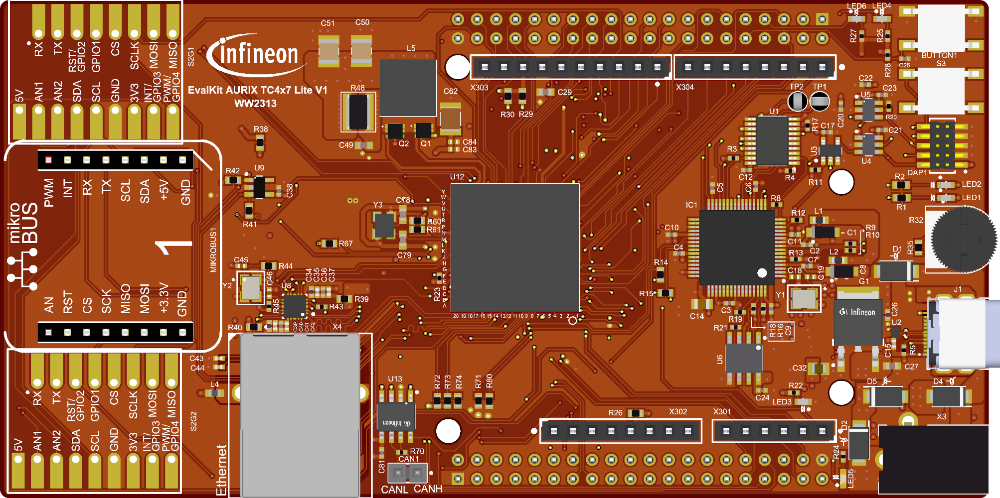

  

# iLLD_TC4D7_LK_ADS_DFLASH_Multi_Data_Programming

**This example shows how to flash the Data Flash memory**

## Device  
The device used in this example is AURIX&trade; TC4D7XP_A-Step_MC_COM    

## Board  
The board used for testing is the AURIX&trade; TC4D7 lite Kit (KIT_A3G_TC4D7_LITE)

## Scope of work  
This C code for AURIX™ MCUs manages the Data Flash (DFLASH). 
 The “writeDataFlash” function erases a sector, converts multi float values to integers, and writes them. 
 The “readDataFlash” function reads the multi data data back and reconverts it to float for verification.

## Introduction  
The Data Memory Unit (DMU) controls command sequences executed on the Program and Data Flash memories (PFLASH and DFLASH), interfacing with the Flash Standard Interface (FSI) and the Program Flash Interface (PFI).

The FSI executes erase, program and verify operations on all flash memories.

The PFI provides a unique point-to-point fast connection for each PFLASH bank to a CPU.

The AURIX™ TC4D7 device features:

2 Program Flash Banks (PFx)
2 Data Flash Banks (DFx)
The AURIX™ TC3xx devices feature PFLASH Banks PFx based on the same sector structure. PFx banks may vary in size:

3 Mbyte Program Flash Bank
2 Mbyte Program Flash Bank
1 Mbyte Program Flash Bank
AURIX™ TC4D7 features two Program Flash banks (PF0, PF1) with dimension of 3 Mbyte. Each Program Flash bank is divided into Physical Sectors with dimension of 1024 Kbytes and each Physical Sector is divided into 64 Logical Sectors with dimension of 16 Kbytes.

AURIX™ TC4D7 features two Data Flash banks, DFLASH0 and DFLASH1. Both include multiple EEPROM sectors commonly used for EEPROM emulation. Only DFLASH0 includes User Configuration Blocks (UCBs) for data protection and a Configuration Sector (CFS), which is not directly accessible by the user.

The DFLASH EEPROM can be either configured in single ended mode (default) or in complement sensing. Depending on the selected mode, the size of each sector is set to 4 Kbytes and respectively 2 Kbytes.

The minimum amount of data that can be programmed in a flash memory is a page :

Program Flash pages are made of 32 Bytes
Data Flash pages are made of 8 Bytes
A page can be programmed only after an erase operation.

The smallest unit on which an erase operation can be performed is a Logical Sector.

All the flash operations are performed with command sequences.

The DMU has a Command Sequence Interpreter (CSI) to process command sequences.

A minimum sequence of commands for programming the Program Flash memory or the Data Flash memory, is the following:

Erase the Logical Sectors to be programmed afterwards
Wait until the flash memory is ready (not busy)
Enter page mode
Wait until the flash memory is ready (not busy)
Load data to be written in a page
Write the page
Wait until the flash memory is ready (not busy)
Note: Code that performs PFLASH programming or erasing should not be executed from the same PFLASH.

Hardware setup

## Hardware setup  
This code example has been developed for the board KIT_A3G_TC4D7_LITE   

  

## Implementation  
GENERAL REQUIREMENTS
This feature covers the entire preparation of the TMADC module for conversions.

The software shall provide functionality to erase, program, and verify sections of the Data Flash (DFLASH) memory.

The software shall use the Infineon Low-Level Driver (iLLD) functions for all hardware abstraction and peripheral interactions.

PROGRAM DFLASH AND MEMORY OPERATIONS

The software shall provide a `writeDataFlash` function that manages the erase and write sequence for the DFLASH.

Before writing, the software shall erase a configurable number of logical sectors (`DFLASH_NUM_SECTORS`) starting from a configurable address (`DFLASH_STARTING_ADDRESS`) .

The software shall write a configurable number of pages (`DFLASH_NUM_PAGE_TO_FLASH`) into the DFLASH..

For each page to be written, the software shall first enter page mode (`IfxFlash_enterPageMode`) and wait for the DFLASH to be in that mode (`IfxFlash_isDflashInPageMode`).

The software shall load the page buffer (`IfxFlash_loadPage2X32`) with a predefined data pattern (`DATA_TO_WRITE`).

The software shall execute the write page command (`IfxFlash_writePage`) .

The software shall wait for the completion of each erase and write command by monitoring the request execution status (`IfxFlash_isRequestExecuted`) .

The software shall clear the Flash status flags (`IfxFlash_clearStatus`) after each operation.

VERIFICATION 

The software shall provide a `readDataFlash` function to verify the data written in the DFLASH.

## Compiling and programming
Before testing this code example:  
- Power the board through the dedicated power connector 
- Connect the board to the PC through the USB interface
- Build the project using the dedicated Build button  or by right-clicking the project name and selecting "Build Project"
- To flash the device and immediately run the program, click on the dedicated Flash button  

## Run and Test   
The function iterates 20 times to write each element the user put into an array.
Data Conversion: For each float value, the code converts it into two 32-bit integers ( integer_part_write and fractional_part_write ). 
This conversion is necessary because floating-point values cannot be written directly to flash memory; they must be represented as integers.

A second function reads the data previously written from the DFLASH and uses it to verify the written array.

## References  

AURIX&trade; Development Studio is available online:  
- <https://www.infineon.com/aurixdevelopmentstudio>  
- Use the "Import..." function to get access to more code examples  

More code examples can be found on the GIT repository:  
- <https://github.com/Infineon/AURIX_code_examples>  

For additional trainings, visit our webpage:  
- <https://www.infineon.com/aurix-expert-training>  

For questions and support, use the AURIX&trade; Forum:  
- <https://community.infineon.com/t5/AURIX/bd-p/AURIX>  
