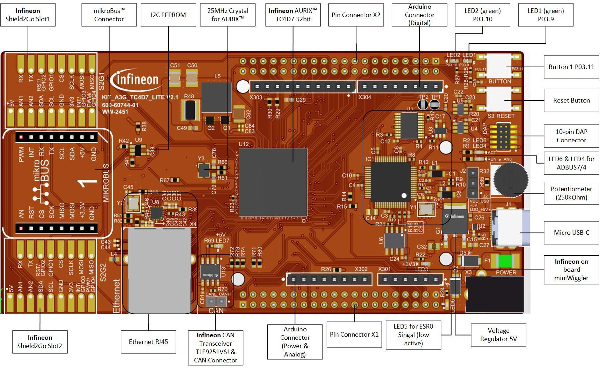
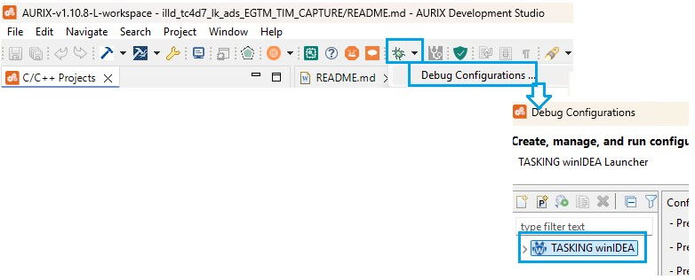

  

# iLLD_TC4D7_LK_ADS_EGTM_TIM_Capture
**A timer is used to capture an external PWM signal and calculate the PWM signal frequency and duty cycle.**  

## Device  
The device used in this example is AURIX&trade; TC4D7XP_A-Step_CC_COM

## Board  
The board used for testing is the AURIX&trade; TC4D7XP_A-Step_CC_COM (KIT_A3G_TC4D7_LITE)

## Scope of work  
The Timer Input Module (TIM) of the Enhanced Generic Timer Module (EGTM) is used in capture mode. The data from the captured PWM signal is used to calculate the PWM signal frequency and duty cycle in software. The frequency and the duty cycle are then stored in variables.
  

## Introduction  
The EGTM is a modular timer unit designed to accommodate many timer applications.

The TIM is responsible for filtering and capturing input signals of the EGTM.

The Clock Management Unit (CMU) is responsible for clock generation of the EGTM. The Configurable Clock Generation Subunit (CFGU) provides eight clock sources for the EGTM submodules: TIM, TBU, MON and ATOM.

The EGTM has an in-built Timer Output Module (TOM) that can offer 16 independent channels to generate output signals.

The Fixed Clock Generation (FXU) is one the EGTM CMU subunits and it provides five predefined non-configurable clocks for EGTM modules, including the TOM.

## Hardware setup  
This code example has been developed for the board KIT_TC4D7 Lite KIT (AURIX&trade; TC4D7 Lite KIT Board)

    

## Implementation  
**Configuring the TIM**

The configuration of the TIM is done by calling the initialization function *initEgtmTim()*, containing the following steps:

- Enable the EGTM by calling the function *IfxEgtm_enable()*

- Enable the CMU clock 0 by calling the function *IfxEgtm_Cmu_enableClocks()*

- Initialize an instance of the *IfxEgtm_Tim_In_Config* structure with the default parameters by calling the iLLD function *IfxEgtm_Tim_In_initConfig()*

- The *IfxEgtm_Tim_In_Config* structure allows the setting of multiple parameters in order to initialize the module, including the following:
    - *inputPin* – Selection of the input port pin of the TIM (port pin P02.0 in this example) 
    - *inputPinMode* – Selection of the input mode for the input port pin of the TIM (*IfxPort_InputMode_pulldown* in this example)

- After setting the configuration parameters, the function *IfxEgtm_Tim_In_init()* applies the user configuration to the module

All the functions used for the configuration of the TIM are provided by the iLLD header *IfxEgtm_Tim_In.h*.

**Configuring the TOM**

The configuration of the TOM is done by calling the function *initEgtmTomPwm()* containing the following steps:

- Enable the FXU clocks by calling the function *IfxEgtm_Cmu_enableClocks()*

- Initialize an instance of the structure *IfxEgtm_Tom_Pwm_Config* with its default values by calling the function *IfxEgtm_Tom_Pwm_initConfig()*

- The *IfxEgtm_Tom_Pwm_Config* structure allows to set the following parameters to initialize the module:
    - *cluster* – Selection of the index of EGTM cluster
    - *tomChannel* – Selection of the channel which is driving the output port pin 
    - *period* – Setting of the period for the PWM signal to the desired value
    - *dutyCycle* – Setting of the duty cycle of the PWM signal to the desired value
    - *pin.outputPin* – Selection of the output port pin
    - *synchronousUpdateEnabled* – Enabling of Synchronous Update of the timer
    - *clock* – Selection of the clock used for the generation of the PWM

- After setting the configuration parameters, the function *IfxEgtm_Tom_Pwm_init()* applies the user configuration to the module

- Start the PWM with the function *IfxEgtm_Tom_Pwm_start()*

All the functions used for the configuration of the TOM are provided by the iLLD header *IfxEgtm_Tom_Pwm.h*.

**PWM generation example**

The FXU clock 1 frequency (ffxclk1) is 7.8125 MHz in this example. The period value to have the desired PWM frequency (fpwm) is calculated with the following formula:

    Period = ffxclk1 / fpwm = 7.8125 MHz / 250 Hz = 31250 ticks -> 4 ms

**Measuring PWM frequency and duty cycle**

The measurement of the PWM frequency and duty cycle is done by calling the function *measurePwm()* containing the following steps:

- Update the measured PWM data by calling the iLLD function *IfxEgtm_Tim_In_update()*

- Get the PWM period in seconds with the iLLD function *IfxEgtm_Tim_In_getPeriodSecond()*

- Calculate the PWM frequency with the formula:  

    frequency[Hz] = 1 / period[s]

- Get the PWM duty cycle by calling the iLLD function *IfxEgtm_Tim_In_getDutyPercent()*

All the iLLD functions above are provided by the iLLD header *IfxEgtm_Tim_In.h*.

## Compiling and programming

Before testing this code example:  
- Power the board through the dedicated power connector 
- Connect the board to the PC through the USB interface
- Build the project using the dedicated Build button  or by right-clicking the project name and selecting "Build Project"
- To flash the device and immediately run the program, click on the dedicated Flash button  

## Run and Test   

The TIM input port pin is P02.0. The TOM output port pin P02.0. Therefore, there is no need for additional connection.

After code compilation and flashing the device, perform the following:

Launch ADS integrated winIDEA for debug purpose (DISCLAIMER: Any other debugger can be used too if offers similar debug deatures):

Click on 'Add new watch' to add variables to the watch window. Add the variables *g_measuredPwmPeriod*, *g_measuredPwmFreqHz* and *g_measuredPwmDutyCycle* to the Watches window and monitor their values. 

Following values will be shown:

    g_measuredPwmPeriod = 0.004
    g_measuredPwmFreqHz = 250
    g_measuredPwmDutyCycle = 50

## References  

AURIX&trade; Development Studio is available online:  
- <https://www.infineon.com/aurixdevelopmentstudio>  
- Use the "Import..." function to get access to more code examples  

More code examples can be found on the GIT repository:  
- <https://github.com/Infineon/AURIX_code_examples>  

For additional trainings, visit our webpage:  
- <https://www.infineon.com/aurix-expert-training>  

For questions and support, use the AURIX&trade; Forum:  
- <https://community.infineon.com/t5/AURIX/bd-p/AURIX>  
