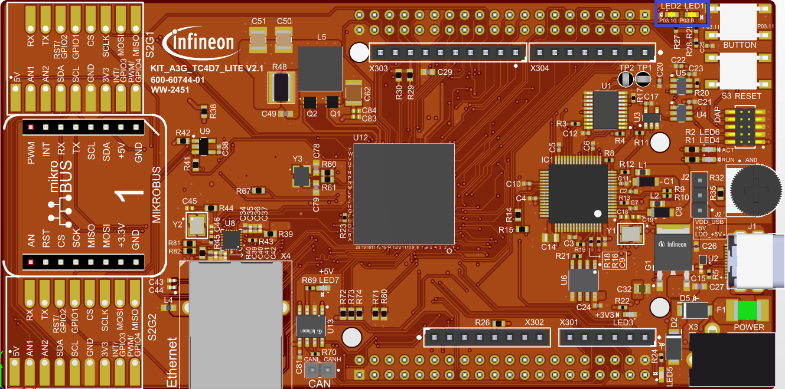
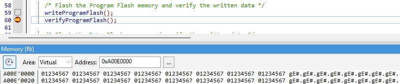

  

# iLLD_TC4D7_LK_ADS_Flash_Programming

**This example shows how to erase, program, and run a verify loop on the PFlash and the DFlash memories of the TC4Dx.**  

## Device  
The device used in this example is AURIX&trade; TC4D7XP_A-Step_CC_COM 

## Board  
The board used for testing is the AURIX&trade; TC4D7XP_A-Step_CC_COM (KIT_A3G_TC4D7_LITE) 

## Scope of work   
Simple example showing the needed steps for Pflash and Dflash erase and programming operations.

## Introduction  
The Data Memory Unit (DMU) controls command sequences executed on the Program and Data Flash memories (PFLASH and DFLASH), interfacing with the Flash Standard Interface
(FSI) and the Program Flash Interface (PFI).  

The FSI executes erase, program and verify operations on all flash memories.  

The PFI provides a unique point-to-point fast connection for each PFLASH bank to a CPU.  

AURIX&trade; TC4D7 features 24 MB of Program Flash divided in six PFLASH Blocks. Each block consists of two Banks, PFxA and PFxB, with dimension of 2 MB each. Each Program Flash Bank is divided
into Physical Sectors with dimension of 512 KB and each Physical Sector is divided into 32 Logical Sectors with dimension of 16 KB.  

AURIX&trade; TC4D9 features 1 MB of Data Flash divided in two DFLASH Banks, DFLASH (HOST) and DFLASH (CSRM). Both include multiple EEPROM sectors commonly used for EEPROM emulation.
Both DFLASH include User Configuration Blocks (UCBs) where System and NVM configuration settings can be stored.  

The DFLASH EEPROM is divided into Physical Sectors with dimension of 128 KB and each Physical Sector is divided into 64 Logical Sectors with dimension of 2 KB.  

The minimum amount of data that can be programmed in a flash memory is a page:  
- Program Flash pages are made of 32 Bytes  
- Data Flash pages are made of 8 Bytes   

The smallest unit on which an erase operation can be performed is a Logical Sector.  

All the flash operations are performed with command sequences.  

The DMU has a Command Sequence Interpreter (CSI) to process command sequences.  

A minimum sequence of commands for programming the Program Flash memory or the Data Flash memory, is the following:  
- Erase the Logical Sectors to be programmed afterwards
- Wait until the flash memory is ready (not busy)
- Enter page mode
- Wait until the flash memory is ready (not busy)
- Load data to be written in a page
- Write the page
- Wait until the flash memory is ready (not busy)

**Note:** Code that performs PFLASH programming or erasing should not be executed from the same PFLASH Bank.

## Hardware setup  
This code example has been developed for the board TC4D7XP_A-Step_CC_COM (KIT_A3G_TC4D7_LITE)
 
  
  
  
## Implementation  

**Flashing the Program Flash memory**  

To perform PFLASH programming, it is recommended to run the code from a memory location different from the PFLASH that is going to be programmed.
For this reason, In this example, the linker file is modified so that the instructions from Flash_Programming.c are executed from PSPR0.
The actual flash programming operations start by erasing the involved logical sectors.  

**Erase of Logical Sectors**    

On AURIX&trade; TC4xx the protection scheme using the "safety_endinit" functions has been replaced by the PROT/APU mechanism, therefore "safety_endinit" functions are not needed anymore.
The erase command sequence for one or more consecutive logical sectors can be executed through the *IfxFlash_eraseMultipleSectors()* function, executed from the PSPR by
the function pointer *eraseSectors()*.
The function *IfxFlash_waitUnbusy()*, called by the function pointer *waitUnbusy()*, stalls until the sector is erased and the PFLASH is ready again.  

**Erase Verify**
Optional step to verify that the sectors are erased and in case of error read the Comm1 register to get the position of first failing sector.

**Write operations**  

After erasing the needed logical sectors, the write operations can start.  

The function *IfxFlash_enterPageMode()* called from the PSPR by the function pointer *enterPageMode()* is used to enter page mode.
Wait for Page Mode has been entered successfully, by checking *IfxFlash_isPflashInPageMode()*.
The function *IfxFlash_loadPage2X32()*, executed from the PSPR with the function pointer *load2X32bits()*.  

The loaded page is then written by calling the function pointer *writePage()*, which executes the *IfxFlash_writePage()* function from the PSPR.
Wait until operation is done by checking the function *IfxFlash_isRequestExecuted()*.
Then the write process can be repeated until all the required data has been successfully written in the PFLASH.  

After the flashing operations, the data is read from the PFLASH exploiting the macro *MEM(address)*, and if it is correct, an LED is turned on.  

All the functions used for executing the command sequences for the flashing operations can be found in the iLLD header *IfxFlash.h*,
while the function pointers are declared and assigned in the *Flash_Programming.c* file.  

**Flashing the Data Flash memory**  

The procedure for flashing the Data Flash memory is the same used for flashing the Program Flash memory.  

After the flashing operations, the data is read from the DFLASH exploiting the macro *MEM(address)*, and, if it is correct, an LED is turned on.  

**Configure and control the LEDs**  

Two LEDs are configured using methods from the iLLD header *IfxPort.h*.  

The port pins to which the LEDs are connected are configured as push-pull output using the function *IfxPort_setPinMode()*.  

To turn on and off the LEDs, the function *IfxPort_setPinState()* is used.  

## Compiling and programming
Before testing this code example:  
- Power the board through the dedicated power connector 
- Connect the board to the PC through the USB interface
- Build the project using the dedicated Build button  or by right-clicking the project name and selecting "Build Project"
- To flash the device and immediately run the program, click on the dedicated Flash button   

## Run and Test   

After code compilation and flashing the device, observe the behavior of the LEDs.  

Check that **LED1** (1) and **LED2** (2) are turned on:  
- **LED1** is turned on to indicate that the PFLASH memory was correctly written
- **LED2** is turned on to indicate that the DFLASH memory was correctly written  

  
  
  
Check the actual PFLASH memory as an additional test:
- Set one breakpoint in the *Flash_Programming.c* file inside the *writeProgramFlash()* function:
    - After calling the *writeFlash()* function
- In the memory view, add the address 0xA00E0000
- Run the debugger
- It stops at the breakpoint right after *writeFlash()*, observe the pattern 0x01234567 in memory view

**Note:** It is not possible to read an erased PFLASH sector. A Bus Error Exception will be raised.

  
  
  
Check the actual DFLASH memory as an additional test:
- Set two breakpoints in the *Flash_Programming.c* file inside the *writeDataFlash()* function:
    - After calling the *IfxFlash_eraseMultipleSectors()* function;
    - After the for loop for writing the DFLASH;
- In the memory view, add the address 0xAE000000
- Run the debugger
- It stops at the first breakpoint right after *eraseFlash()*, observe the pattern 0x00000000 in memory view
- Resume the debugger
- It stops at the second breakpoint right after *writeFlash()*, observe the pattern 0x01234567 in memory view

  
  
  
## References  

AURIX&trade; Development Studio is available online:  
- <https://www.infineon.com/aurixdevelopmentstudio>  
- Use the "Import..." function to get access to more code examples  

More code examples can be found on the GIT repository:  
- <https://github.com/Infineon/AURIX_code_examples>  

For additional trainings, visit our webpage:  
- <https://www.infineon.com/aurix-expert-training>  

For questions and support, use the AURIX&trade; Forum:  
- <https://community.infineon.com/t5/AURIX/bd-p/AURIX>  
