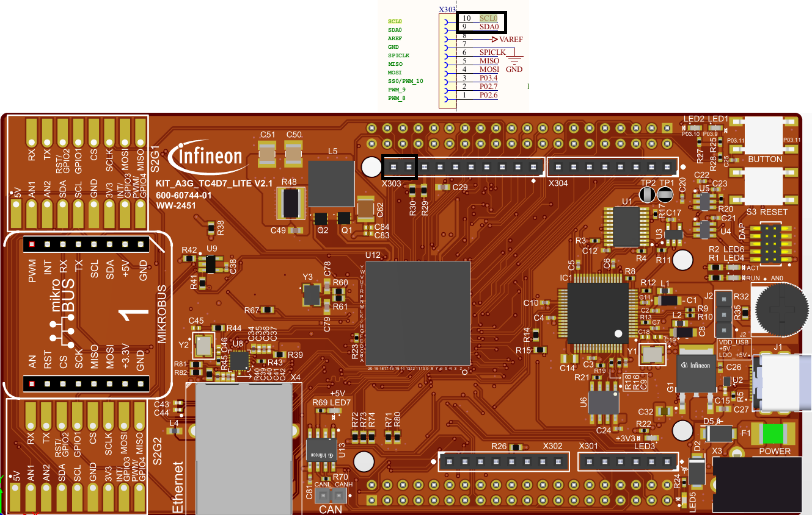
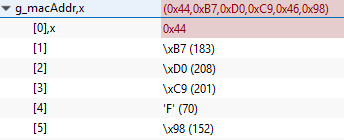
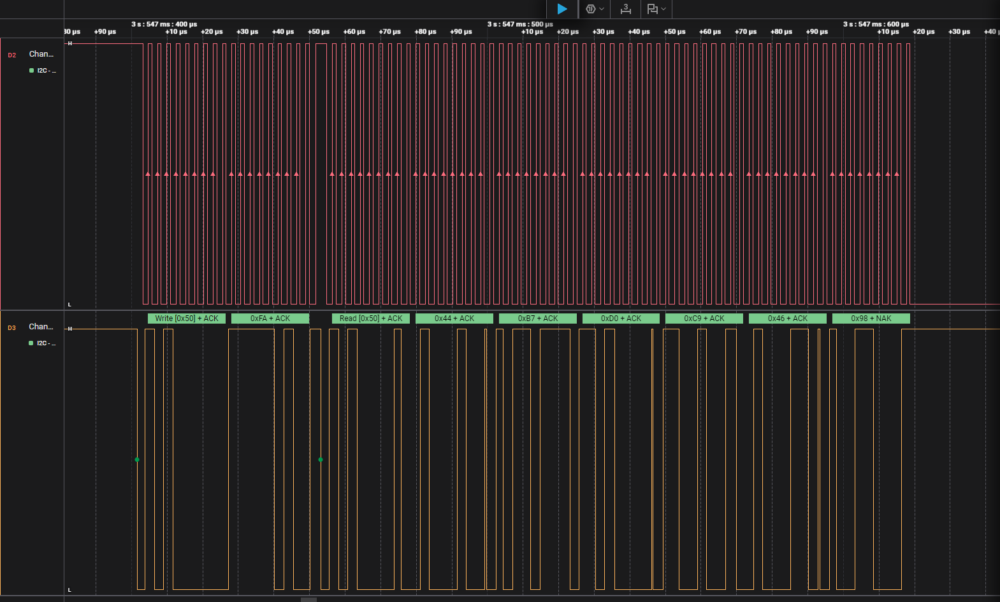

  

# iLLD_TC4D7_LK_ADS_I2C_Read_Ext_Device 

**An I2C module configured as I2C master is used to read a register of an external device.**  

## Device  
The device used in this example is AURIX&trade; TC4D7XP_A-Step_CC_COM  

## Board  
The board used for testing is the AURIX&trade; TC4D7XP_A-Step_CC_COM (KIT_A3G_TC4D7_LITE)  

## Scope of work  
An I2C module configured as I2C master is used to read the MAC address stored in the Microchip 2K I2C Serial EEPROM mounted on the board KIT_A3G_TC4D7_LITE. The AURIX&trade; device reads the MAC address through the I2C module and stores it into a global variable.

## Introduction  
The I2C protocol was developed to provide a simple and efficient data transfer between multiple devices over a short distance.

It uses a bidirectional serial bus with two wires. A serial data line (SDA) and a serial clock line (SCL) are carrying the information between multiple devices.

Both lines are connected to a positive supply voltage via pull-up resistors.

An I2C device can work as a master or as a slave. The master, which is normally a microcontroller, initiates and terminates the transfer and generates the clock pulse.

A specific slave can be addressed by the master via a 7- or 10-bit address. Afterwards the master starts the communication.
* Data can flow in either direction and can be set via a data direction bit, which is transmitted by the master

## Hardware setup  
This code example has been developed for the board KIT_A3G_TC4D7_LITE (AURIX&trade; TC4D7XP_A-Step_CC_COM):

  

## Implementation  

**Configuring the I2C communication** 
   
The configuration of the I2C communication is done once in the setup phase in two different steps: 
* The initialization of the I2C module by initializing an instance of the *IfxI2c_I2c_Config* structure
* The initialization of every device that is connected to the I2C module by initializing an instance of the *IfxI2c_I2c_deviceConfig* structure for each device

**Configuring the I2C module** 
 
The function *IfxI2c_I2c_initConfig()* initializes an instance of the structure *IfxI2c_I2c_Config* with its default values.

The IfxI2c_I2c_Config structure allows setting the parameters to initialize the module:
* *baudrate* – to set the clock speed in bit/s. Typical values are 100 kbit/s in standard mode, 400 kbit/s in fast mode and 3.4 Mbit/s in high-speed mode
* *pins* – a structure to set the port pins used for the communication. 
A serial data line (SDA) and a serial clock line (SCL) carry the information between the devices, therefore two port pins are required

The function *IfxI2c_I2c_initModule()* initializes and activates the I2C module with the user configuration in master mode.
 The functions above are provided by the iLLD header *IfxI2c_I2c.h*.

**Configuring the I2C device** 

The function *IfxI2c_I2c_initDeviceConfig()* initializes an instance of the structure *IfxI2c_I2c_deviceConfig* with its default values.

Afterwards, the 7-bit slave address can be set through the parameter *deviceAddress*.

The function *IfxI2c_I2c_initDevice()* finalizes the I2C initialization by connecting the device configuration with the preconfigured I2C module.

The functions above are provided by the iLLD header *IfxI2c_I2c.h*.

**Establish I2C communication** 

Data transfer between the external device and the microcontroller is divided into two steps:
* Firstly, the microcontroller is transmitting the starting address (0xFA) of the MAC Address inside the EEPROM 
 This is done using the *IfxI2c_I2c_write()* function
* Then, the reading of the MAC address is started with the function *IfxI2c_I2c_read()*

Both the write and read functions are defined in the iLLD header *IfxI2c_I2c.h*.

## Compiling and programming
Before testing this code example:  
- Power the board through the dedicated power connector 
- Connect the board to the PC through the USB interface
- Build the project using the dedicated Build button  or by right-clicking the project name and selecting "Build Project"
- To flash the device and start a debug session, click on the Debug button  and create a configuration for a debugger (double clicking on the debugger name, a default configuration is created)

## Run and Test   

After code compilation and flashing the device, perform the following steps:
* Use the debugger to watch the hexadecimal value of the global array *g_macAddr*. The MAC address is unique for each board

A second test can be performed with an oscilloscope. 
 Two oscilloscope probes can be connected to SDA and SCL pins to observe the generated and received signals.

  

The following waveforms should be seen on the oscilloscope after pressing the PORST push button:
 - **First data section**: device address byte and starting address (0xFA) of the MAC Address inside the EEPROM 
 - **Second data section**: device address byte and six bytes of data

 
 
 
 

 - **First data section**:  To perform a read operation, the master addresses the slave (transmitting the device address (0x50) with the Read/Write bit set to "write") and sends the requested address to read (transmitting 0xFA afterwards)

 - **Second data section**: The reading process is started by transmitting the device address (0x50) setting the Read/Write bit to "read": six bytes from the EEPROM device, containing the MAC address, are then received

## References  

AURIX&trade; Development Studio is available online:  
- <https://www.infineon.com/aurixdevelopmentstudio>  
- Use the "Import..." function to get access to more code examples  

More code examples can be found on the GIT repository:  
- <https://github.com/Infineon/AURIX_code_examples>  

For additional trainings, visit our webpage:  
- <https://www.infineon.com/aurix-expert-training>  

For questions and support, use the AURIX&trade; Forum:  
- <https://community.infineon.com/t5/AURIX/bd-p/AURIX>  
