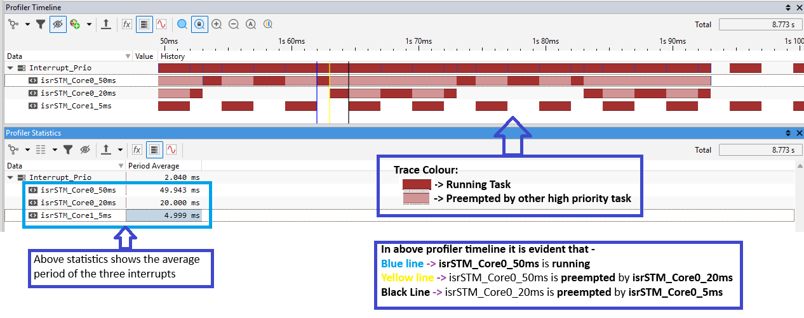
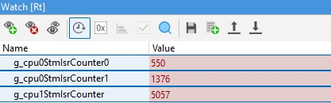
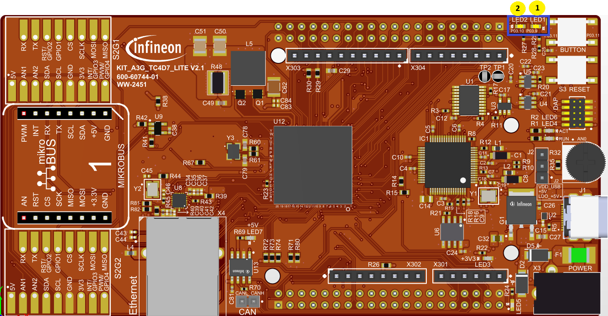

  

# iLLD_TC4D7_LK_ADS_Interrupt_Prio

**Three interrupts with different priorities are used to toggle available two LEDs and incrementing respective ISRs counters.**  

## Device  
The device used in this example is AURIX&trade; TC4D7XP_A-Step_CC_COM  

## Board  
The board used for testing is the AURIX&trade; TC4D7XP_A-Step_CC_COM (KIT_A3G_TC4D7_LITE)

## Scope of work  
On Core 0, two STM interrupts are configured to control the state of two LEDs (P03.9 & P03.10) along with incrementing respective ISRs counters and third interrupt is being generated by Core1 STM to Core 0 which only incrementing respective ISR counter. Based on their priority, the interrupts toggle the appropriate LED and increment counters. In this example, the interrupts are triggered by STM module.  

## Introduction  
**Interrupt Router (IR)** 
- The interrupt system in the AURIX&trade; TC4xx devices is implemented in the Interrupt Router (IR)

- Interrupt Requests (or Service Requests) are serviced by an Interrupt Service Provider (ISP). The ISPs are the functional blocks: CPUs, DMAs, PPU and the GTM

- An interrupt can be triggered by:
    - Each module connected to the IR
    - External peripherals
    - Software via General Purpose Service Requests (GPSR)

- Each Service Provider supports up to 255 service priority levels: 
    - 0 to disable the interrupt
    - 255 for highest priority

**Interrupt Service Routine (ISR)**
- A triggered interrupt can be followed by an Interrupt Service Routine (ISR), a function which is called every time an interrupt is triggered

- Example of ISR configuration:
    - Assign the ISR to a service provider, the vector table number and an interrupt priority
        *IFX_INTERRUPT(functionA, 0, ISR_Priority);* 
    - ISR implementation:
        *void functionA(void)*
        *{*
        *[…]*
        *}*

- By default, an ISR cannot be interrupted by any other interrupt. IR waits until the function is finished before servicing any pending interrupt

- To allow interrupting the execution of ISRs by higher priority service requests, the interrupts must be re-enabled with the following iLLD function at the beginning of the ISR: *IfxCpu_enableInterrupts()*

## Hardware setup  
This code example has been developed for the board (KIT_A3G_TC4D7_LITE) AURIX&trade; TC4D7XP_A-Step_CC_COM.  

The two LEDs that are used in this example are P03.9, P03.10. 

  

## Implementation    
**Configure the LEDs**  
- The two LEDs blink by controlling the port pins to which they are connected, using methods from the iLLD header *IfxPort.h*

- In the setup phase, the port pins of the LEDs have to be configured to *push-pull output mode* using the function *IfxPort_setPinModeOutput()*

- During program execution, the LEDs (low active) are switched on and off using the iLLD functions: 
    - *IfxPort_setPinLow()* > switches on
    - *IfxPort_setPinHigh()* > switches off 

**Configure the STM Module for interrupt generations**  
- Three timers are configured in order to periodically generate three different interrupts. The STM module methods come from the iLLD header *IfxStm.h*
- Two interrupts (*isrSTM_Core0_50ms* and *isrSTM_Core0_20ms*) are configured on Core 0 and third interrupt (*isrSTM_Core0_5ms*) is configured on core 1 whose receiver is core 0.
- Please refer defined functions *initSTM_Core0* & *initSTM_Core1* for detailed configurations in *Interrupt_Prio.c* file.
- The priority of the interrupts are as below by the macros in *Interrupt_Prio.c* file:
    - #define ISR_PRIORITY_STM_INT0        40  (*isrSTM_Core0_50ms*)
    - #define ISR_PRIORITY_STM_INT1        50  (*isrSTM_Core0_20ms*)
    - #define ISR_PRIORITY_STM_INT2        100 (*isrSTM_Core1_5ms*)     
- The counters defined for each respective ISRs are as below:
    - *g_cpu0StmIsrCounter0* for *isrSTM_Core0_50ms*
    - *g_cpu0StmIsrCounter1* for *isrSTM_Core0_20ms*
    - *g_cpu0StmIsrCounter2* for *isrSTM_Core1_5ms*
-  All timers are running with the same frequency

- **All cases are covered**:
    - Higher prioritized ISR **interrupts** lower prioritized ISR already running
    - Lower prioritized ISR **waits** the end of higher prioritized ISR in case of simultaneous or belated trigger

## Compiling and programming

Before testing this code example:  
- Power the board through the dedicated power connector 
- Connect the board to the PC through the USB interface
- Build the project using the dedicated Build button  or by right-clicking the project name and selecting "Build Project"
- To flash the device and immediately run the program, click on the dedicated Flash button  

## Run and Test  
After code compilation and flashing the device, observe the behavior of the LEDs and the defined ISR counters.

P03.9 and P03.10 are blinking sequentially and ISR counters are also incrementing according to the priority level of their related timer interrupt.

The implemented priorities are the following:
- isrSTM_Core0_50ms: 40
- isrSTM_Core0_20ms: 50
- isrSTM_Core0_5ms : 100

The interrupt priority can be visualized by the below trace generated TASKINg winIDEA debugger/trace tool.
 

ISRs counters:

Two LED controlled by Core0 STM interrupts:

  

   **Disclaimer** - The TASKING winIDEA debugger/Trace tool has been used only for demonstration purpose. Similar result can be achieved by any other commercial debugger/trace tool with tools specific configurations which offers similar features.
## References  

AURIX&trade; Development Studio is available online:  
- <https://www.infineon.com/aurixdevelopmentstudio>  
- Use the "Import..." function to get access to more code examples  

More code examples can be found on the GIT repository:  
- <https://github.com/Infineon/AURIX_code_examples>  

For additional trainings, visit our webpage:  
- <https://www.infineon.com/aurix-expert-training>  

For questions and support, use the AURIX&trade; Forum:  
- <https://community.infineon.com/t5/AURIX/bd-p/AURIX>  
