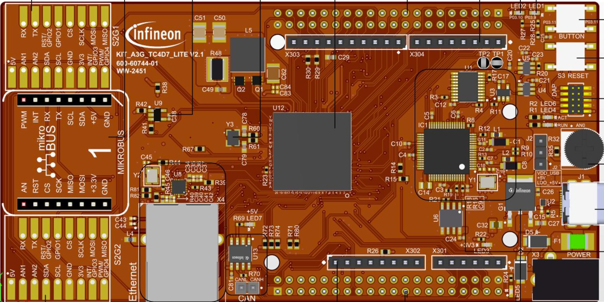
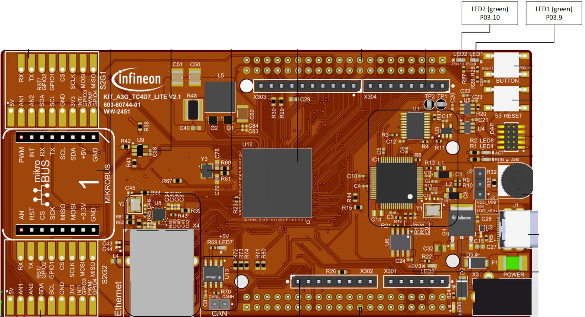

  

# iLLD_TC4D7_LK_ADS_MPU_Memory_Protection
**The MPU is used to protect a part of an array from read/write accesses.**  

## Device  
The device used in this example is AURIX™ TC4D7XP_A-Step_CC_COM    

## Board  
The board used for testing is the AURIX&trade; TC4D7 lite Kit (KIT_A3G_TC4D7_LITE)  

## Scope of work   
The MPU module is configured to enable the first half and protect the second half of an array from read/write accesses.
To test the function of the read protection, each element of the array is read in a loop.
Two LEDs are used to indicate the progression of the CPU read accesses.
When the loop reads the last accessible element, the first LED is turned on.
When the first protected element is read, a trap is raised.
The second LED is only turned on if the CPU reads a protected element.

## Introduction  
Each CPU has a Memory Protection Unit (MPU) that can restrict what memory ranges are
allowed for its access.

In AURIX&trade; TC4xx, the MPU supports:
- 24 data ranges that specify which memory ranges a master is allowed to access for
data. Read and write permissions can be specified for each range
- 16 code ranges that specify which memory ranges the CPU is allowed to access
for instructions
- The CPU has 8 different protection sets (PRS) that specify which
combination of data ranges and code ranges are active

When the MPU is enabled, an instruction or data access outside of the specified MPU
ranges selected by the active protection set immediately causes a CPU trap.
The CPU Memory Protection Unit is one of the many AURIX&trade; safety mechanisms that
help to protect against random hardware faults as well as systematic faults.

The SRAMs monitored by the MPU are:
- Program Scratch-Pad SRAM (PSPR) of each CPU
- Data Scratch-Pad SRAM (DSPR) of each CPU
- Local Bus Memory Unit (LMU), when available in the device

Protection Ranges are defined by a Lower Boundary and an Upper Boundary.
An address belongs to the range if:
- Lower Boundary <= Address < Upper Boundary

The granularity of the memory protection ranges differ for data and code:
- Data protection ranges have a granularity of 8 bytes
- Code protection ranges have a granularity of 32 bytes
- The permission to access a memory location is the logical "OR" of the memory range
permissions. Where ranges intersect, the MPU grants the most permissive access.
PRS0 automatically becomes active whenever a CPU interrupt or trap is triggered.
For this reason, it is commonly reserved for OS usage and PRS0 is typically configured
to allow access to all valid code and data ranges
- It is possible for software to reconfigure the MPU range registers during runtime, but
this takes more time than simply selecting a different active protection set
- A task that is not running in supervisor mode will not be able to change its active
protection set, update the protection ranges, or disable the MPU monitoring.
This ensures that user level tasks cannot circumvent the protection in any way

**Note:** Masters in AURIX&trade; devices have different levels of privileges, where supervisor
mode is the highest. This is a safety measure to ensure that no unintended changes are
done to "sensitive" registers or memory areas.

**Note:** To ensure deterministic behavior in all implementations of TriCore&trade;, a region at
least twice the size of the largest memory accesses, minus one byte, should be left as a
buffer between each memory protection region.

## Hardware setup  

This code example has been developed for the board AURIX&trade; TC4D7 lite Kit (KIT_A3G_TC4D7_LITE)  

  

## Implementation  
**Configuration of the MPU**  

To enable memory protection, the following steps have to be followed:
- Define the Data/Code Protection Ranges where access must be granted
- Define the type of access to grant in a defined Protection Set
- Enable read and/or write in case of definition of a Data Protection Range (DPR)
- Enable code execution in case of definition of a Code Protection Range (CPR)
- Select the active Protection Set
- Enable the memory protection

**Definition of Data Protection Ranges**
- The definition of a Data Protection Range is done through the function
*define_data_protection_range()*, which sets the lower and upper boundaries of the given CPU
Data Protection Range number
- The lower and upper boundaries are set by calling the intrinsic function *__mtcr()*, which moves contents of a data register to the addressed Core Special Function Register (CSFR)
    - *__mtcr()* performs a Move To Core Register (MTCR) TriCore&trade; instruction and is followed by
an ISYNC instruction
    - The ISYNC instruction ensures that the effects of the Core Special Function Register (CSFR)
update are correctly seen by all following instructions. An ISYNC must always be performed
after an MTCR instruction
    - The Tasking intrinsic function *__mtcr()* automatically generates an ISYNC instruction after
calling MTCR; when using different compilers the ISYNC instruction call is ensured by the
*__isync()* function called between the #if - #endif directives
 
**Definition of Code Protection Ranges**
- The definition of a Code Protection Range is done through the function
*define_code_protection_range()*, which sets the lower and upper boundaries of the given
CPU Code Protection Range number
- The lower and upper boundaries are set by calling the intrinsic function *__mtcr()*

**Configuration of Read Access for a Data Protection Range**
- The read access to a Data Protection Range (DPR) is provided with the function
*enable_data_read()*, which enables the read access to the given DPR on the addressed
Protection Set
- To enable the read access, first the CPU Data Protection Read Enable register *(CPU_DPRE)* is
read with the intrinsic function *__mfcr()*, the bit corresponding to the given DPR is set, and
finally the modified value is stored back to the register with the intrinsic function *__mtcr()*
(essentially, a load-modify-store operation, which ensures that previously made changes are not
overwritten)
- *__mfcr()* moves contents of the addressed Core Special Function Register (CSFR) into a data
register by calling the TriCore&trade; instruction Move From Core Register (MFCR)

**Configuration of Write Access for a Data Protection Range**
- The write access to a Data Protection Range is provided with the function *enable_data_write()*,
which enables the write access to the given DPR on the addressed Protection Set
- To enable the write access, first the CPU Data Protection Write Enable register (CPU_WPRE) is
read with the intrinsic function *__mfcr()*, the bit corresponding to the given DPR is set, and
finally the modified value is stored back to the register with the intrinsic function *__mtcr()*

**Configuration of Code Execution Access for a Code Protection Range**
- The code execution access to a Code Protection Range (CPR) is provided with the function
*enable_code_execution()*, which enables the code execution access of the given CPR on the
addressed Protection Set
- To enable code execution access, first the CPU Code Protection Execute Enable register
(CPU_CPXE) is read with the intrinsic function *__mfcr()*, the bit corresponding to the given CPR
is set, and finally the modified value is stored back to the register with the intrinsic function
*__mtcr()*

**Selection of the Active Protection Set**
- The active protection set is selected with the function *set_active_protection_set()*, which sets
the PRS bitfield of the Program Status Word (PSW) register accordingly to the given parameter.
- The *set_active_protection_set()* function needs to be declared as inline because the PSW is
one of the registers automatically saved to the Context Save Area (CSA) when a function is
called.  
If this function was not declared as inline, the Upper Context (16 registers including the PSW)
would be automatically saved to the CSA and re-loaded when the function returns, thus losing
the change to the PSW
- By default, the active Protection set is the Protection Set 0

**Activation of Memory Protection**
- The memory protection is enabled with the function *enable_memory_protection()*, which turns
on the memory protection by setting the *PROTEN* bitfield of the Core Configuration
(*CORECON*) register

**Configuration and Control of the LEDs**
- The LEDs are turned on and off by controlling the port pins to which they are connected using
methods from the iLLD headers *IfxPort.h*
- In the function *init_LEDs()* the LED port pins are configured to output push-pull mode using the
function *IfxPort_setPinModeOutput()*, then they are immediately turned off with the function
*IfxPort_setPinHigh()*
- During program execution, the LEDs are turned on in case the first and second half of the array
are accessible. The port pins are controlled with the function *switch_LED_ON()* which calls the
iLLD function *IfxPort_setPinLow()* for the addressed LED port pin

## Compiling and programming
Before testing this code example:  
- Power the board through the dedicated power connector 
- Connect the board to the PC through the USB interface
- Build the project using the dedicated Build button  or by right-clicking the project name and selecting "Build Project"
- To flash the device and immediately run the program, click on the dedicated Flash button   

## Run and Test   
After code compilation and flashing the device, perform the following checks:
- LED1 (P03.9) is on (meaning that the first half of the array was accessible in the memory)
- LED2 (P03.10) is off (meaning that the second half of the array was NOT accessible in the memory)

  

## References  

AURIX&trade; Development Studio is available online:  
- <https://www.infineon.com/aurixdevelopmentstudio>  
- Use the "Import..." function to get access to more code examples  

More code examples can be found on the GIT repository:  
- <https://github.com/Infineon/AURIX_code_examples>  

For additional trainings, visit our webpage:  
- <https://www.infineon.com/aurix-expert-training>  

For questions and support, use the AURIX&trade; Forum:  
- <https://community.infineon.com/t5/AURIX/bd-p/AURIX>  
