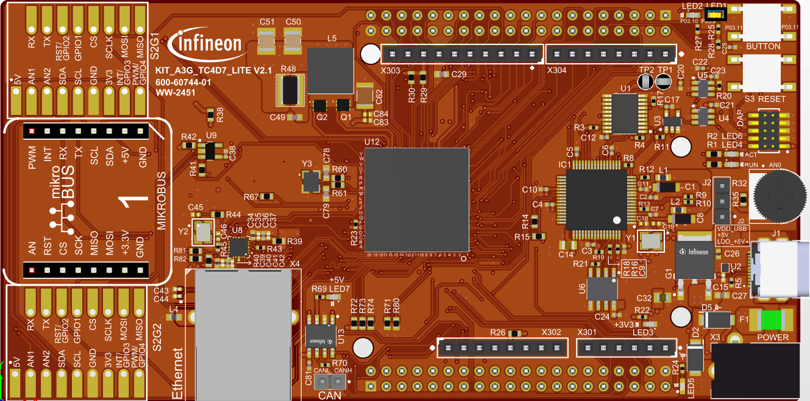

  

# iLLD_TC4D7_LK_ADS_Multicore 

**One LED is controlled by using three different cores.**   

## Device  
The device used in this example is AURIX&trade; TC4D7XP_A-Step_CC_COM   

## Board  
The board used for testing is the AURIX&trade; TC4D7XP_A-Step_CC_COM (KIT_A3G_TC4D7_LITE)  

## Scope of work   
Core 0 is switching on an LED. When the LED flag is set, Core 1 is switching off the LED.
Core 2 is controlling the state of the LED flag. 

## Introduction  
- The AURIX&trade; TC4xx microcontroller architecture features up to six independent processor cores, which allow seamless hosting of multiple applications and operating systems on a unified platform
- Due to the implementation of multiple program Flash modules with independent read interfaces, the architecture supports further real-time capabilities
- AURIX&trade; is built for performance, safety and security, featuring parallel execution of processes, lockstep cores and further enhanced hardware safety mechanisms

## Hardware setup  
This code example has been developed for the board AURIX&trade; TC4D7XP_A-Step_CC_COM (KIT_A3G_TC4D7_LITE)  

   

## Implementation  
**Configure and control the LED**  
An LED is toggled by CPU0 and CPU1. Before using the LED, a port pin to which the LED is connected must be configured during the initialization phase.  
- First step is to provide write access to CPU1 on LED port pin registers using functions *IfxApApu_configWriteRegA()* and *IfxPort_setApuGroupSelection()*. This allows CPU1 to control the LED (to switch off the LED)
- Second step is to set the port pin to level "HIGH"; this keeps the LED turned off as a default state (*IfxPort_setPinHigh()* function) 
- Third step is to set the port pin to push-pull output mode with the *IfxPort_setPinMode()* function

**Note**: By default, CPU0 have write access to the GPIO registers, in this example the write access is explicitly provided for demonstration purpose.
  
Depending on the state of the global variable *g_turnLEDon*, either CPU0 turns the LED on (*IfxPort_setPinlow()*) or CPU1 turns it off (*IfxPort_setPinHigh()*).  
  
The state of the global variable *g_turnLEDon* is changed by CPU2 every second using the *wait()* function from the header *Bsp.h*.  

All functions used to control the port pin are declared in the iLLD header *IfxPort.h*.

## Compiling and programming

Before testing this code example:  
- Power the board through the dedicated power connector 
- Connect the board to the PC through the USB interface
- Build the project using the dedicated Build button  or by right-clicking the project name and selecting "Build Project"
- To flash the device and immediately run the program, click on the dedicated Flash button  

## Run and Test   
After code compilation and flashing the device, observe the behavior of the LED:  
- The state of the LED (P03.9) toggles every second

  

## References  

AURIX&trade; Development Studio is available online:  
- <https://www.infineon.com/aurixdevelopmentstudio>  
- Use the "Import..." function to get access to more code examples  

More code examples can be found on the GIT repository:  
- <https://github.com/Infineon/AURIX_code_examples>  

For additional trainings, visit our webpage:  
- <https://www.infineon.com/aurix-expert-training>  

For questions and support, use the AURIX&trade; Forum:  
- <https://community.infineon.com/t5/AURIX/bd-p/AURIX>  
