  

# iLLD_TC4D7_LK_ADS_ONEEYE_DAS_ALLINONE
**Demonstrate how to implement a graph, oscilloscope, and shell using the Infineon GUI Designer (OneEye) over the DAS interface.**

## Device  
The device used in this example is AURIX&trade; TC4D7XP_A-Step_MC_COM    

## Board  
The board used for testing is the AURIX&trade; TRIBOARD TC4D7 ( KIT_A3G_TC4D7_LITE ).

## Scope of work  
Demonstrate how to implement a graph, oscilloscope, and shell using the Infineon GUI Designer (OneEye) over the DAS interface.

This project showcases how to integrate multiple functionalities— graph, oscilloscope, and shell—using the Infineon GUI Designer (OneEye) over the DAS interface. After configuring the DAS interface in OneEye, three key components are implemented:

1. Graph – This module routes multiple signal sources through the DAS interface, allowing OneEye to visualize and monitor multiple data streams efficiently.

2. Oscilloscope – Signal values are sampled and updated every millisecond, enabling real-time waveform visualization directly within the Infineon GUI Designer.

3. Shell Interface – A shell parser is integrated to interpret command-line inputs and execute corresponding commands, such as info or help, providing a flexible way to interact with the system.

By combining these components, the Infineon GUI Designer becomes a powerful interface for both monitoring and control through the DAS connection.

## Introduction  
**Infineon GUI Designer** is a GUI that enables the creation of interactive Graphical User Interface. Graphical elements can be drag from a toolbox and drop onto the GUI. The behavior of the created GUI can be customized. Different communication interfaces like UART, Ethernet, CAN, DAS can be used to interact with the embedded system

The **DAS** (Device Access Server) can be used in line with Infineon Microcontroller Starter Kits, Application Kits and DAP MiniWiggler to access the micro controller resources. See the Infineon GUI Designer help for more information.

## Hardware setup  
This code example has been developed for the board KIT_A3G_TC4D7_LITE (AURIX&trade; TC4D7 LITE KIT). 

The board should be connected to the PC through the USB port. 

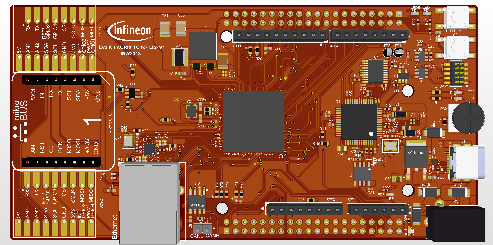     


**Configuration Overview**


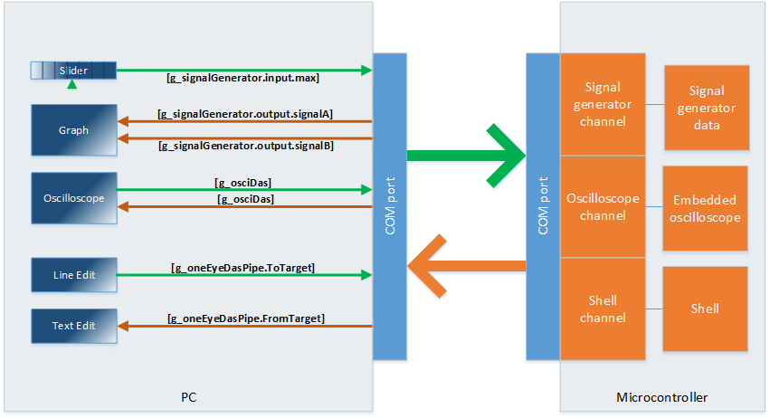     

The DAS interface is used for the communication between Infineon GUI Designer running on the PC and the embedded software
running on the microcontroller.


The DAS protocol interconnects the services (oscilloscope, the shell and data streaming) running on
the microcontroller with the widgets on the GUI. For that purpose it opens point to point communication
channels for the different services (Oscilloscope channel and Shell channel). The
DAS protocol also cares for the integrity of the data transferred over the DAS.


When the slider is moved, the "g_signalGenerator.input.max" signal is set,
the message is filled with the value, and send to the DAS channel of the DAS protocol. 
The DAS protocol streams the message to the counter part on the microcontroller.
The microcontroller can then check for incoming messages and ID, and extract the value.


On the other hand, the microcontroller periodically generates data every 100 ms. For that, 
a message containing the data (Signal A and Signal B) is sent using a C-struct. This message 
is transmitted via the DAS channel of the DAS protocol. Infineon GUI Designer reads the data
directly from the DAS channel and forwards it to the graph widget using the
g_signalGenerator.output.signalA and g_signalGenerator.output.signalB signals.


Similar appends for the Oscilloscope widget. The user can control the oscilloscope service running
on the microcontroller using the oscilloscope widget. On the microcontroller, data are sampled
periodically and, send for display to the oscilloscope widget when the data buffer is full. Data
sampling can be done either from the main loop or from an interrupt


For the shell command line interface, when a key is pressed in the line Edit, the key is forwarded
to the Shell channel using the "console.out" signal, then send to the shell service on the
microcontroller. The library provides API for parsing the string (command and parameter). The microcontroller can send back
text that will be displayed in the Text Edit box, creating an interactive shell interface.


Note that the oneeye_lib library provides the necessary API to enable low integration efforts.

## Implementation

** AURIX&trade; **

The embedded software is setup to:

* Use the Ifx_Oe_DasPipe API to create multiple point-to-point communication channel to transport the oscilloscope, mux/demux, and shell data. 
* Fill a message (C-struct) with the "Signal A" and "Signal B" data, and send it through a DAS data pipe.
* Extract the "Max Value" command received from the slider
* Use the Ifx_Oe_Osci API to sample data on the microcontroller 
* Use the Ifx_Oe_Shell API to create a command line interface


**Enabling the OneEye Library**

The OneEye library must be enabled by adding the following lines to *Ifx_Cfg.h*:
* define IFX_CFG_OE_AL_UC IFX_CFG_OE_AL_UC_AURIX_ILLD
* #define IFX_CFG_OE_AL_UC_VARIANT IFX_CFG_OE_AL_UC_VARIANT_AURIX_ILLD_TC4


**Compiler switches**

The following compiler switches are provided to tune the application:
 

* ENABLE_SHELL: If defined the code related to the shell interface is enabled, else disabled 
* ENABLE_MUX: If defined the code related to the mux/demux for data streaming is enabled, else disabled 
* ENABLE_OSCILLOSCOPE: If defined the code related to the oscilloscope is enabled, else disabled 
* TEST_ECHO & TEST_ECHO_CHAR_VALUE: Those switches are used when ENABLE_BB is not defined. In this configuration, a string representing the time is send periodically to the DAS. If only TEST_ECHO is defined the key stroke are echoed. else if TEST_ECHO_CHAR_VALUE is defined, the key stroke are echoed as hexadecimal value representation. Those test switches can be useful to test / debug the raw DAS feature and time API functionality as when they are enabled the DAS protocol is not used 
* TEST_ECHO_CHAR_VALUE: If TEST_ECHO_CHAR_VALUE is defined, the keystrokes are echoed as hexadecimal value representations. 
Those macro are defined in the Ifx_Cfg.h file. 


**Initialization**

The initialization is done in the main function.


The DAS initialization is done with the following call:

 
```
/* Initialize the OneEye - DAS interface */
OneEyeDas_init();
```

At the end of the DAS initialization, a pipe is created to transfer data through the DAS interface.


```
/* Initialize IfxStdIf_DPipe with the Ifx_OneEyeDasPipe */
Ifx_Oe_DasPipe_stdIfDPipeInit(&g_dPipe, &g_oneEyeDasPipe);
```

The signal generator used to generate dummy signal is initialized with


```
/* Initialize signal generator */
SignalGenerator_init();
```

The shell is initialized with


```
/* Initialize the shell */
OneEyeShell_init();
```

The oscilloscope is initialized with


```
/* Initialize the oscilloscope */
OneEyeOscilloscope_init(UPDATE_INTERVAL);
```


Regarding the oscilloscope initialization, the OneEyeOscilloscope_init() API initializes the oscilloscope
object.
Note that the signals to be sampled are added using the Ifx_Oe_Osci_addSignal() API. 
At the end of the initialization the oscilloscope is started with the Ifx_Oe_Osci_start() API.


**Runtime**
In this example the DAS protocol,
shell (OneEyeShell_process() API), oscilloscope (OneEyeOscilloscope_sample() API),
signal generator (SignalGenerator_process() API) are processed in the background loop.

 
 ```
 while (1)
{
    #ifdef ENABLE_SHELL
        /* Process the shell */
        OneEyeShell_process();
    #endif

    /* Update the signal generator and oscilloscope periodically */
    if (Ifx_Oe_Time_isDeadLine(deadline))
    {
        deadline = Ifx_Oe_Time_add(deadline, Ifx_Oe_Time_getTickForMilliseconds(UPDATE_INTERVAL));

        #if defined(ENABLE_OSCILLOSCOPE) || defined(ENABLE_MUX)
            /* Update the signal generator */
            SignalGenerator_process();
        #endif

        #ifdef ENABLE_OSCILLOSCOPE
            /* Update the oscilloscope */
            /* NOTE: In real application the OneEyeOscilloscope_sample() should may be called
             * from an interrupt to sample data synchronously to  the control loop for example
             */
            OneEyeOscilloscope_sample();
        #endif
     }
     #ifdef ENABLE_TEST
         OneEyeTest_process();
     #endif
}
 ```


 The signals generator SignalGenerator_process() API is called periodically every 10ms
(set by UPDATE_INTERVAL) to generate new dummy signal values.
 The oscilloscope OneEyeOscilloscope_sample() API is also called periodically every 10ms to sample the signal values. Note
that the call can be done from inside an interrupt if required by the application.


The OneEyeShell_process() calls 1 API of the oneeye_lib:
<ul>
<li>Ifx_Oe_Shell_process(): to process the shell commands</li>
</ul>


```
void OneEyeShell_process(void)
{
    /* Process the shell commands */
    Ifx_Oe_Shell_process(&g_shell);
}
```

The shell commands are defined in the g_shellCommands table. This table has a line for each command
defining the shell command itself, a help text and a call back function


```
/* Array that stores the supported Shell commands */
const Ifx_Oe_Shell_Command g_shellCommands[] = {
    { "help", IFX_OE_SHELL_HELP_DESCRIPTION_TEXT, &g_shell, &Ifx_Oe_Shell_showHelp },
    { "info", "     : Dummy info command",        &g_shell, &printShellInfo        },
    IFX_OE_SHELL_COMMAND_LIST_END
};
```


The OneEyeOscilloscope_sample() just forward the call to the oneeye_lib
Ifx_Oe_Osci_step() API to handle the oscilloscope trigger, and data sampling.
 

```
void OneEyeOscilloscope_sample(void)
{
    /* Sample the signals */
    Ifx_Oe_Osci_step(&g_osciDas);
}
```


**Hardware Abstraction layer**


The hardware Abstraction layer specific to  the microcontroller is selected with the IFX_CFG_OE_AL_UC
macro, defined in the Ifx_Cfg.h file.


Note that for the ModusToolbox PDL, and xmclib libraries, the oneeye_lib defines the SysTick_init(),
SysTick_Handler() and SysTick_task() API.


## Compiling and programming  
Before testing this code example:  
- Connect the board to the PC through the USB interface  
- Build the project using the dedicated Build button  or by right-clicking the project name and selecting "Build Project"  
- To flash the device and immediately run the program, click on the dedicated Flash button   

## Run and Test   


**GUI description**


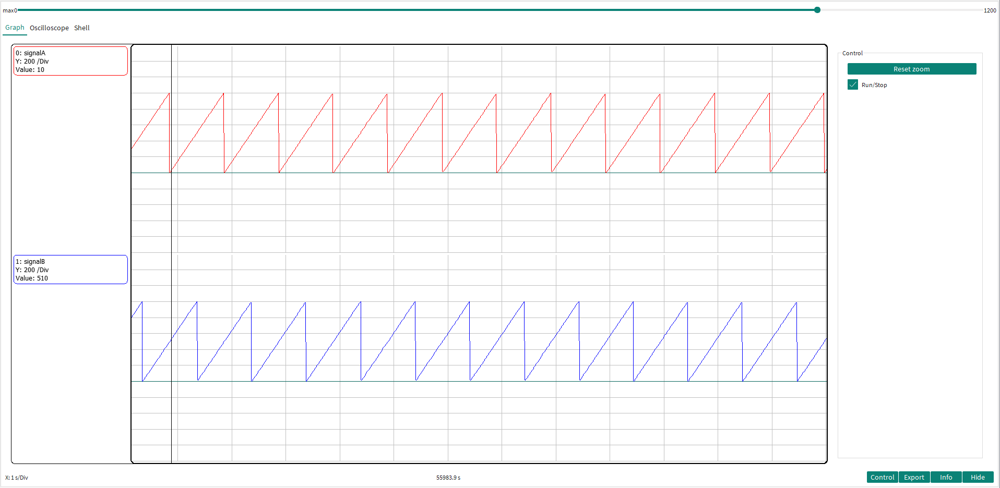

On the GUI top part there is a slider connected to the signal "g_signalGenerator.input.max" which controls the "Signal A" and the "Signal B" variables on the microcontroller.
as explained above.

Below, on the first tab, a graph  displays the "g_signalGenerator.output.signalA" and "g_signalGenerator.output.signalA" data streamed
periodically by the microcontroller.

On the 2nd tab, an oscilloscope widget controls the oscilloscope service running on the microcontroller and
displays the captured signals.

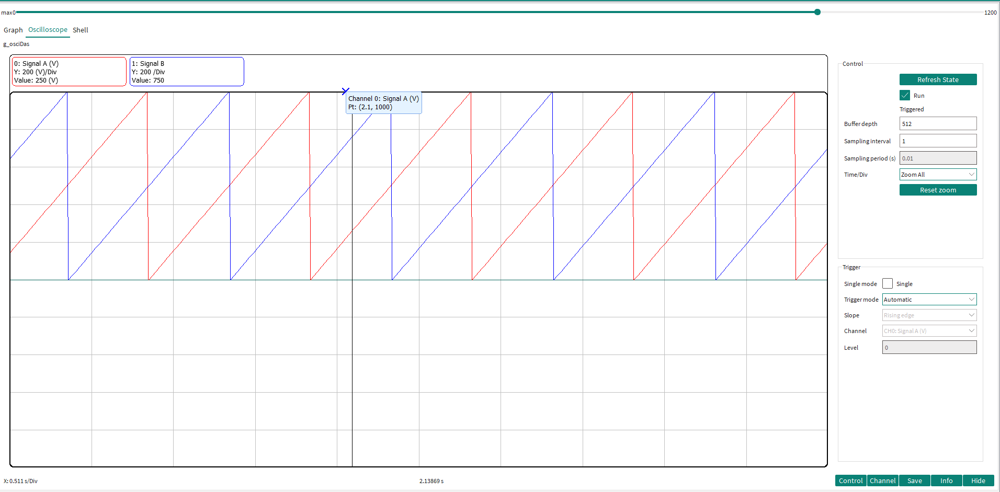

Note that the oscilloscope has a much better timing accuracy than the graph mentioned previously.

On the last tab, two widgets enable the interaction with the shell command line service that runs on the
microcontroller. The top text edit widget displays the text send by the microcontroller whereas, the bottom line edit
sends user key strokes to the microcontroller.

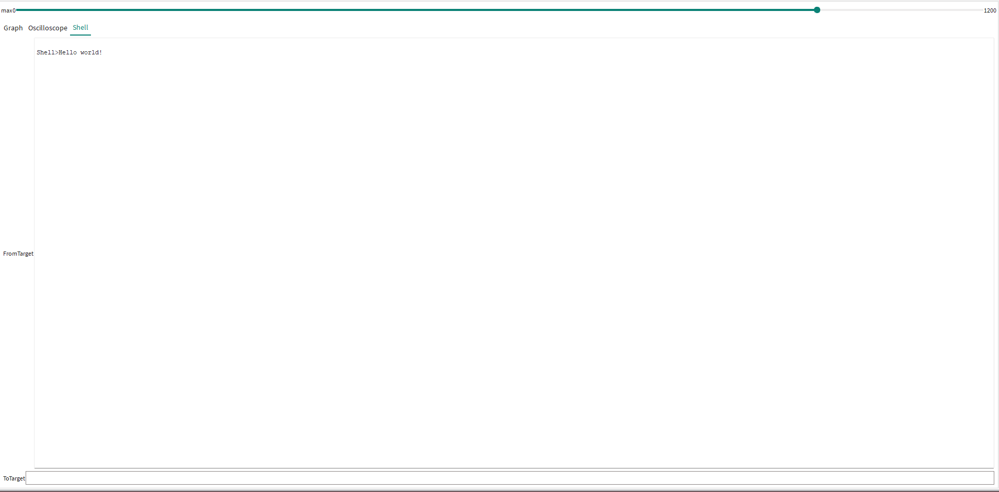


** OneEye ** 

For this training, the OneEye application is required for visualizing the values. OneEye can be opened inside the AURIX&trade; Development Studio using the following icon:

  

Clicking the OneEye icon automatically opens the OneEye configuration for the active project. If no configuration exists, it is created by AURIX&trade; Development Studio 


 

**Setup Infineon GUI Designer for editing**  

Select the Infineon GUI Designer menu *Options &rarr; Edit mode* (if not already checked) to enable the edit mode.
Select the Infineon GUI Designer menu *View &rarr; Browser box*, *View &rarr; Property box*, *View &rarr; Tool box* (if not already checked) to display the browser, property box, and tool box. Note that the box can be moved around.  

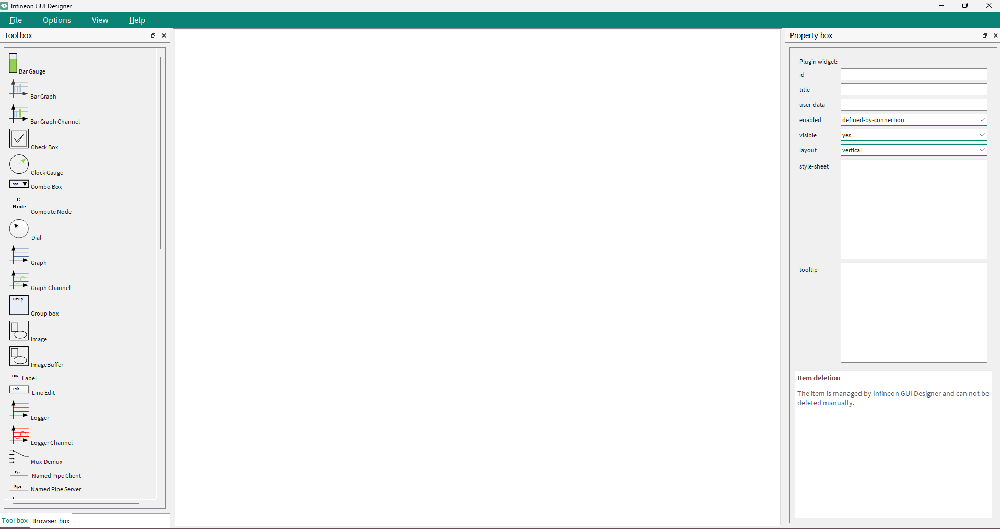  


**Configuring the DAS interface**  

When the OneEye configuration is created by ADS, it is already setup with a DAS interface.  
Select the DAS interface in the Browser box (1).  

Notice the *system-key* {ADS} that enables the connection to the device in parallel with the ADS debugger  

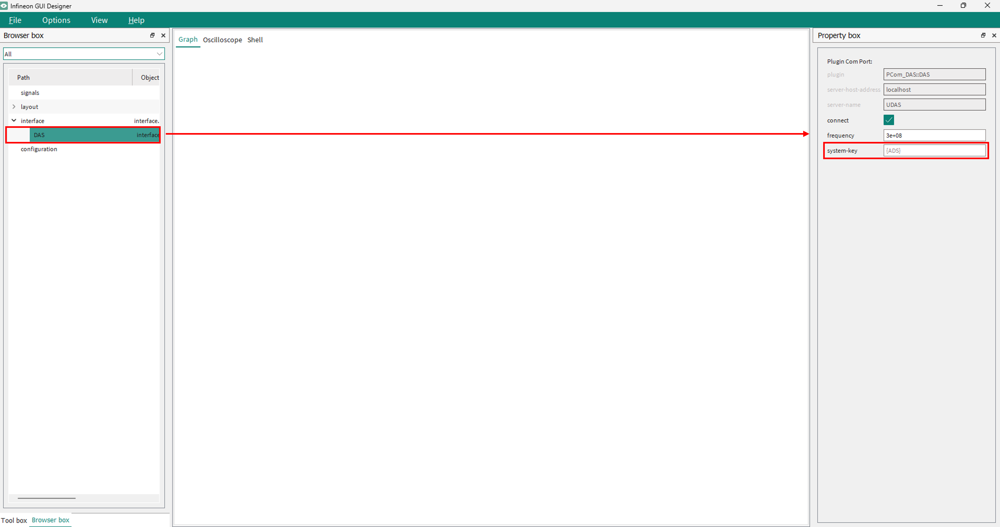  

**Create a debug box to get access to variables from the .elf file**  
A debugBox item is already setup by default when ADS creates the OneEye configuration, preconfigured with the *project elf* file path.  
Select the DAS interface in the Browser box (1).  
Set the id property to *elf*, which enables to group variables into the signal tree later.  
**Note**: this value is not set by default by ADS.  

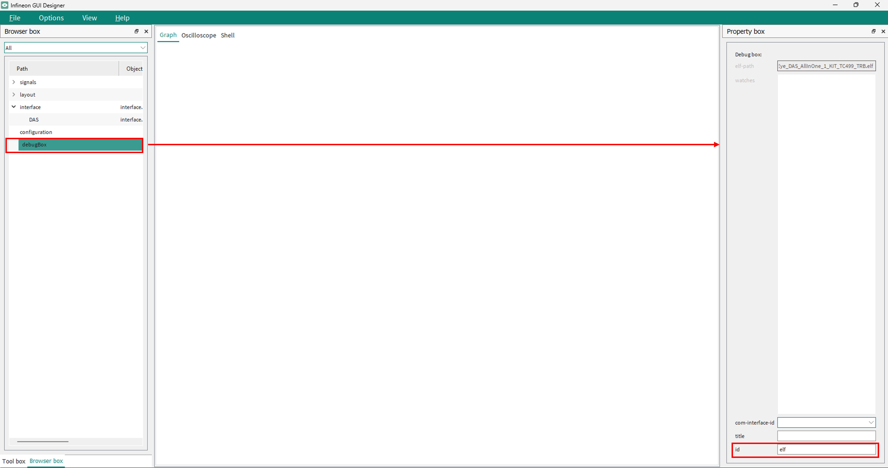  

**Open the debug box viewer and connect to the device**  
Select the OneEye menu *View -> Debug box viewer* (if not already checked) to display the debug box. Select the debug box with the id *(elf)* (1) if not yet selected by default.  
Note that the debug box enables the selection of the *.elf* file to be used to get information about the variables.  
The Filter field (2), enables to filter variables by name. E.g. in this example, entering *g_* will filter for global variables.  

To enable the connection with the microcontroller and have read / write access to variables, check the *DAS connection status* box (3).  

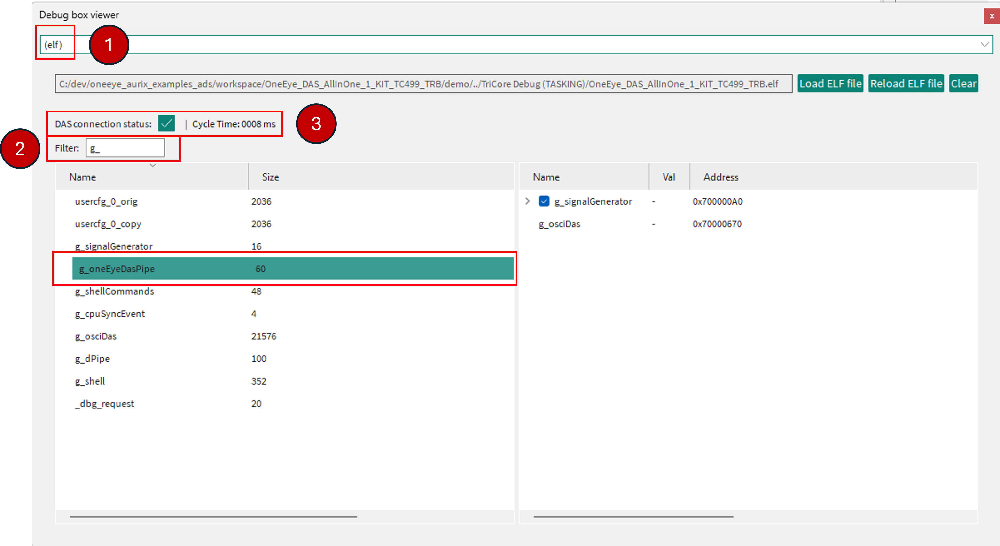  

**Create signals for the Pipe**  
In the debug box, search for the *g_oneEyeDasPipe* (1) variable, right click on it and select *Create pipe for: g_oneEyeDasPipe*. The watch should appear on the right side of the debug box (2). Watches are periodically polled for new values on the micro controller.
Two signals are also automatically created to access the pipe (3), one for the Infineon GUI Designer to microcontroller direction (*ToTarget*), and one for the microcontroller to Infineon GUI Designer direction (*FromTarget*).

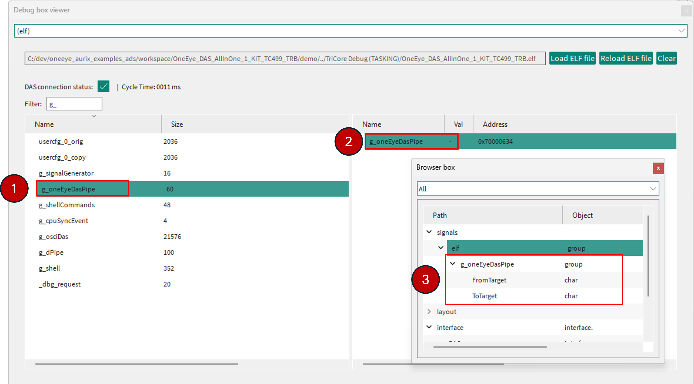  

The created signals should appear in the browser box under the “signals->elf“ group.


**Create the tabPages for Graph, Oscilloscope and Shell** 

For the All In One Example, you need to create a tab with 3 tabPages (Graph, Oscilloscope and Shell) where you will create the widgets as specified below.
Drag and drop a *tab* item from the toolbox onto the layout.
Right click on the tab widget in the browser box, and select Add child → tabPage.
Set title property to Graph, Oscilloscope and Shell and layout property to vertical.

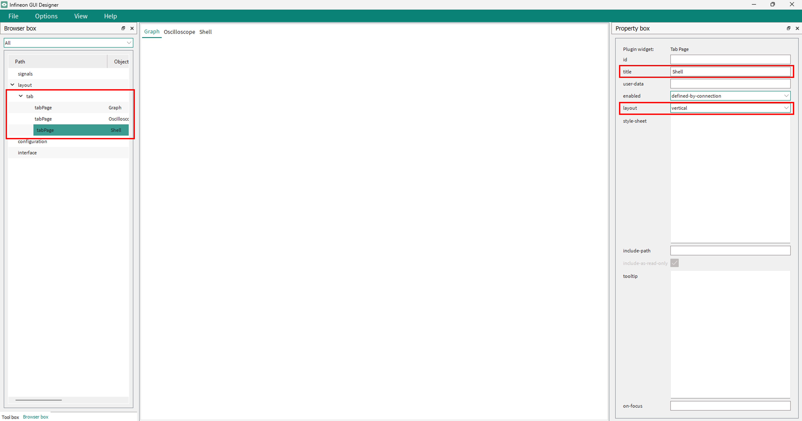 


In this training, the OneEye configuration is provided inside the Libraries folder. The following steps are needed to configure the graph, oscilloscope and shell from a brand-new configuration.  


**Create a text box to display the shell text**
Drag and drop a *textEdit* item from the toolbox onto the page with title "Shell", and set its *data-in* property to *elf.g_oneEyeDasPipe.FromTarget*. Set the update-method to all-on-new-data.

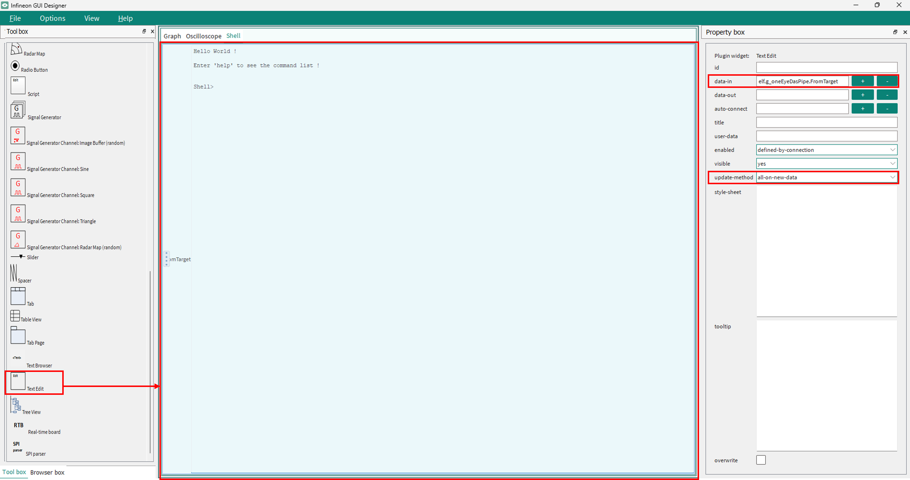  

**Create a line edit to enter key stroke to the shell**

Drag and drop a *lineEdit* item from the toolbox onto the page with title "Shell", and set its data-out property to *elf.g_oneEyeDasPipe.ToTarget*. Check the capture-key property to enable each key stroke to be send.

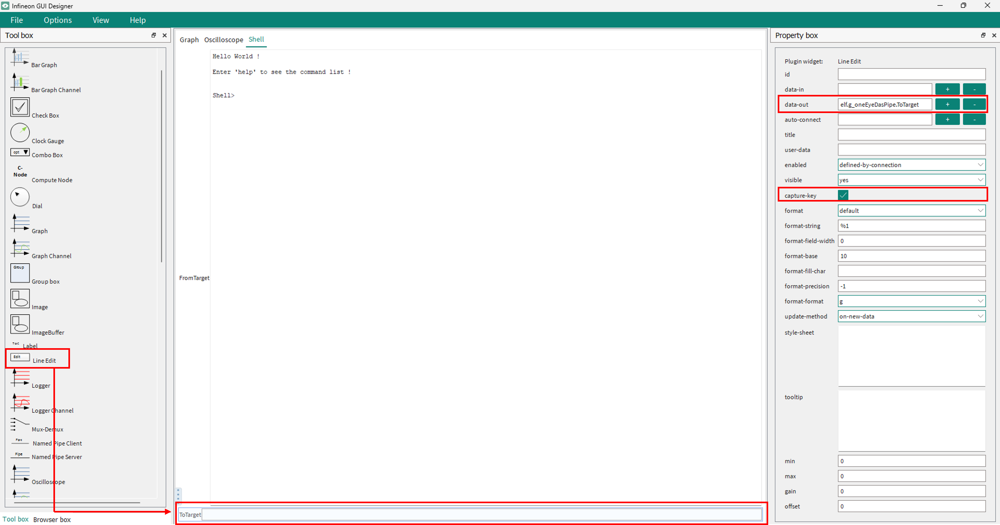  

**Test the shell interface**
The shell textbox should display the *Hello World !* text (1), if it is not the case, check that the *DAS connection status* is checked in the debug box viewer.
Enter *info* in the ToTarget lineEdit field (2) and press *ENTER*, the microcontroller will execute the *printShellInfo()* function and should answer as below to acknowledge the command. 

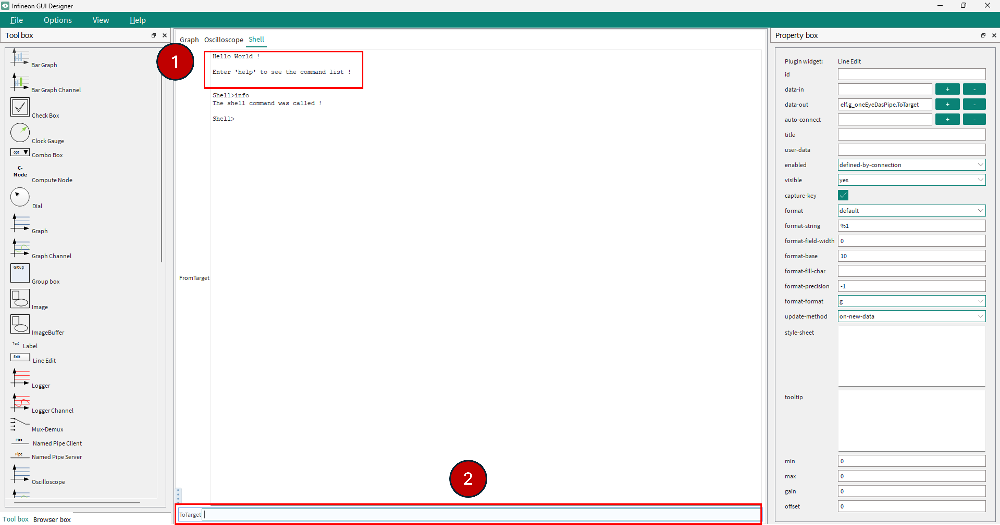  

Save your configuration with CTRL+S.
Exit the edit mode with the Infineon GUI Designer menu *Options -> Edit mode* and close the *Debug box viewer* to only see the GUI (3)

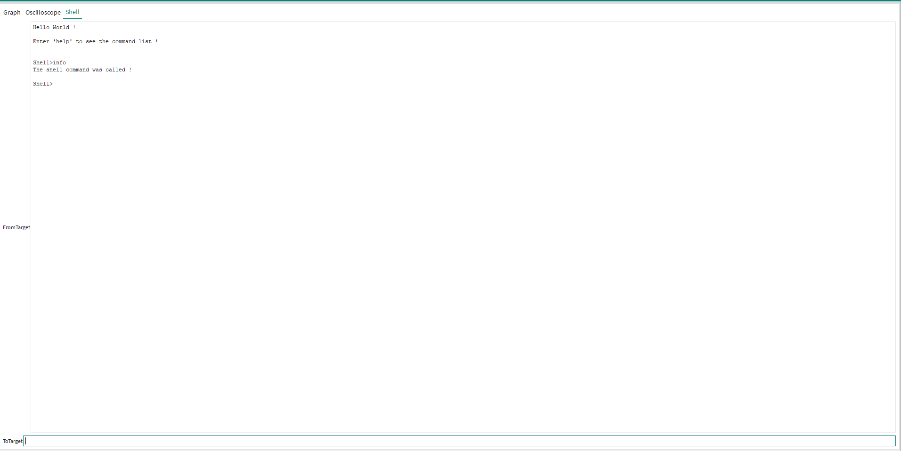  


****
  

**Create signals for the oscilloscope**  
In the debug box, search for the *g_osciDas* variable, right click on it and select *Create oscilloscope watch on: g_osciDas*. The watch should appear on the right side of the debug box (1). Watches are periodically polled for new values on the microcontroller.  
A signal is also automatically created to access the oscilloscope (2).  

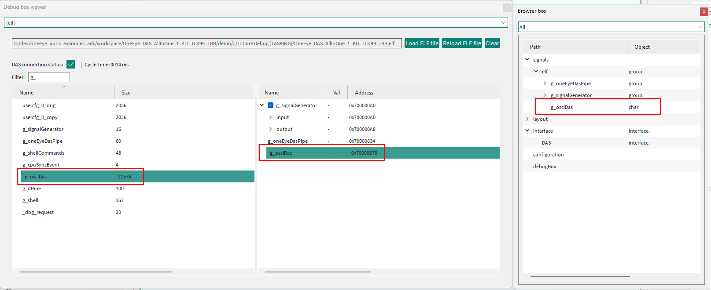  

The created signals should appear in the browser box under the “signals->elf“ group.


**Create the oscilloscope widget**  
Drag and drop the oscilloscope widget from the toolbox onto the page with title "oscilloscope", set the oscilloscope properties data-in and data-out to *elf.g_osciDas*. Set the protocol-type property to ProtocolDma.  

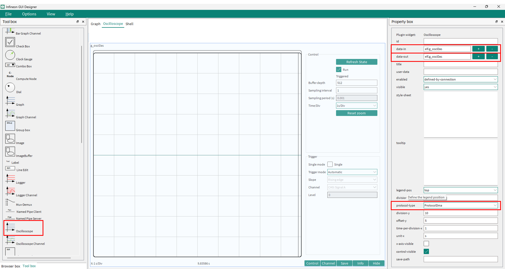  

**Test the oscilloscope**  
In the oscilloscope Channel tab, click on the Channel button (1) and check the visible check box for both CH0: Signal A and CH1: Signal B to display the two channels.  

Set the Unit per div Y to 200 for both CH0: Signal A and CH1: Signal B.  

Select the Pen color red for CH0: Signal A and blue for CH1: Signal B.  

The values for signalA and signalB should be changing in the oscilloscope, if it is not the case check that the *DAS connection status* is checked in the debug box viewer.  

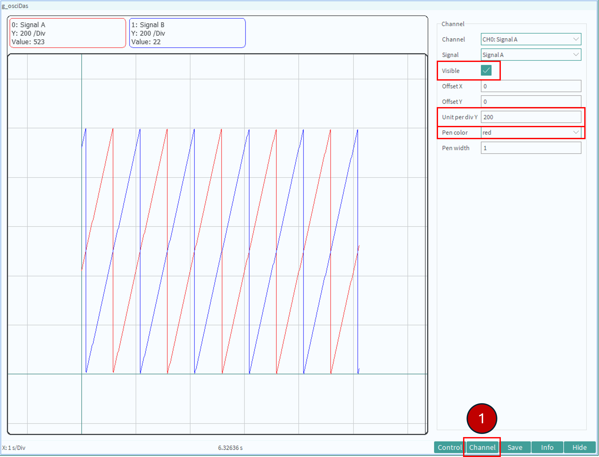  

The oscilloscope Control tab provides configuration for the trigger and information about the oscilloscope state (armed, triggered, uploading).  
Click on the Control button (1) and set the Time/Div value to Zoom All to configure the horizontal scale to use the full screen of the oscilloscope window.  

The Buffer depth, configures the oscilloscope buffer depth, here 512 points are used to fill the buffer. This value can be changed within the limit set by the software.  

The Sampling interval provides the oscilloscope the information whether to sample at each interval (1) or not (>1).  

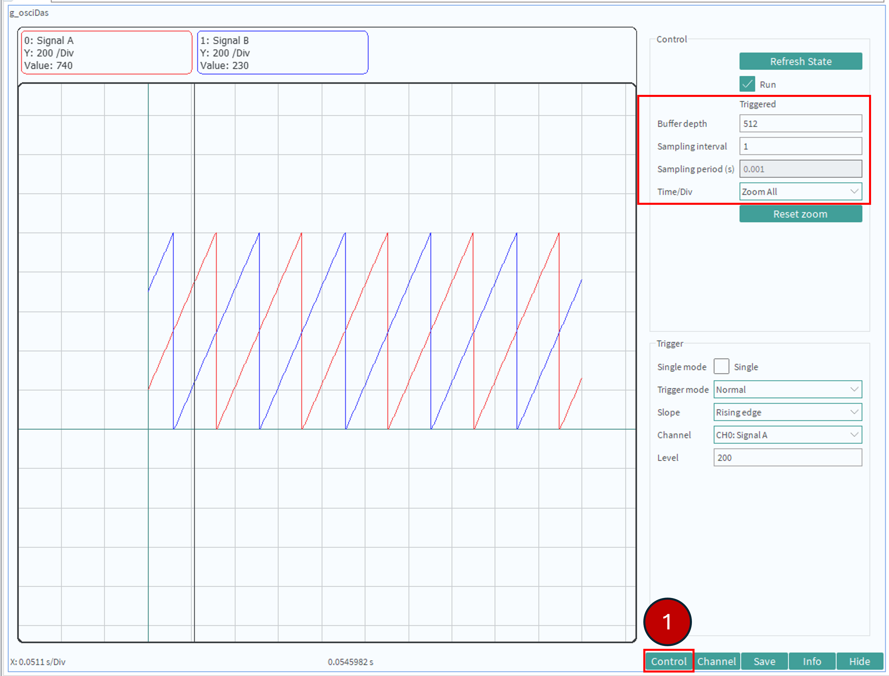  

The final configuration should look like the following:  

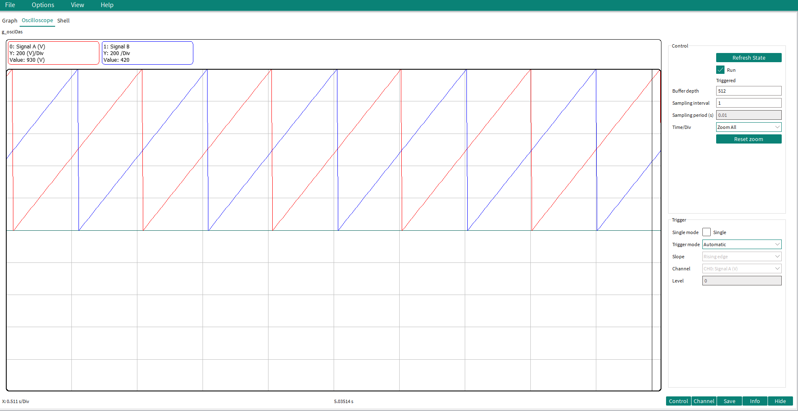  

****


**Create signals for signal generator input parameters**  
In the debug box, search for the *g_signalGenerator* variable, right click on it and select *Add watch on: g_signalGenerator*. The watch should appear on the right side of the debug box. Watches are periodically polled for new values on the microcontroller.  
Expand the *g_signalGenerator* item on the right and right-click on the max and increment variables to create two signals with the option *Create signal for: …*.  

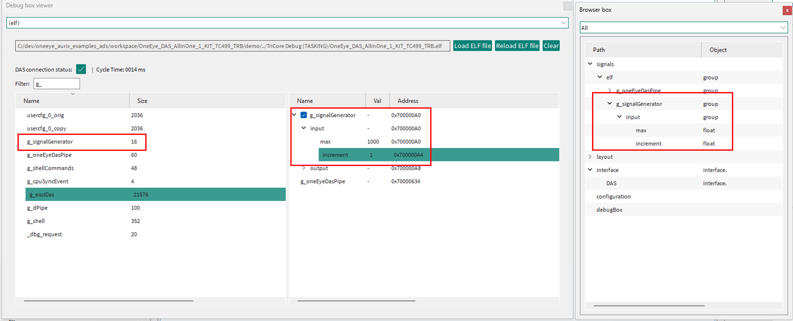  

The created signals should appear in the browser box under the *signals.elf* group.


**Create signals for signal generator output parameters**  

In the debug box, search for the *g_signalGenerator* variable, right click on it and select *Add watch on: g_signalGenerator*. The watch should appear on the right side of the debug box. Watches are periodically polled for new values on the microcontroller.  
Expand the *g_signalGenerator* item on the right and right-click on the signalA and signalB variables to create two signals with the option *Create signal for: …*.  

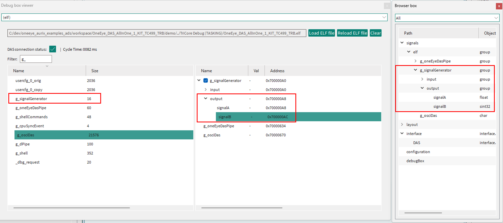  

The created signals should appear in the browser box under the *signals.elf* group.  


**Create the graph widgets to display the signals value**

Drag and drop a graph widget from the toolbox onto the page with title "Graph".

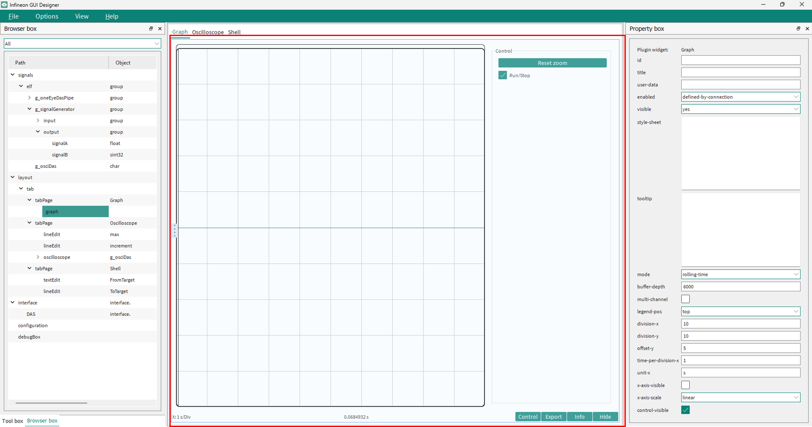  

**Create the graph widgets to display the signals value**

Drag and drop a Graph Channel (channel) widget from the toolbox onto the layout, set the channel properties auto-connect to  *status.signalA*, unit-per-division-y to 200, and color to green. Repeat the operation for a second channel and set the channel properties auto-connect to  *status.signalB*, and color to black.

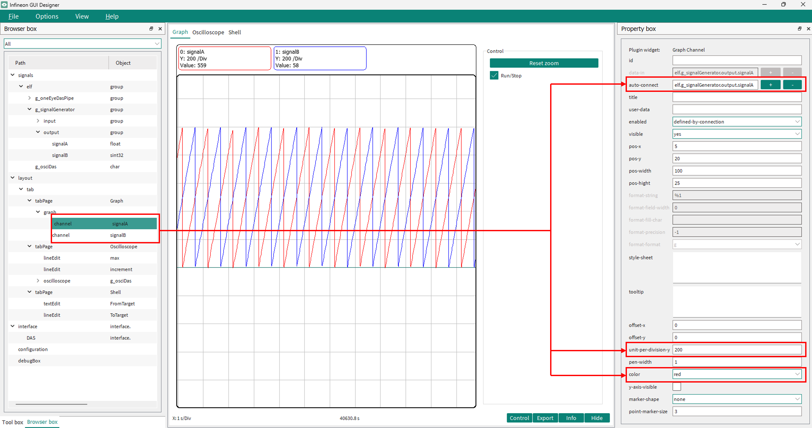  


**Create the slider widget to send command to the AURIX&trade;**

Drag and drop a slider widget from the toolbox onto the layout, set the slider properties auto-connect to  elf.g_signalGenerator.input.max. and max to 1200, 

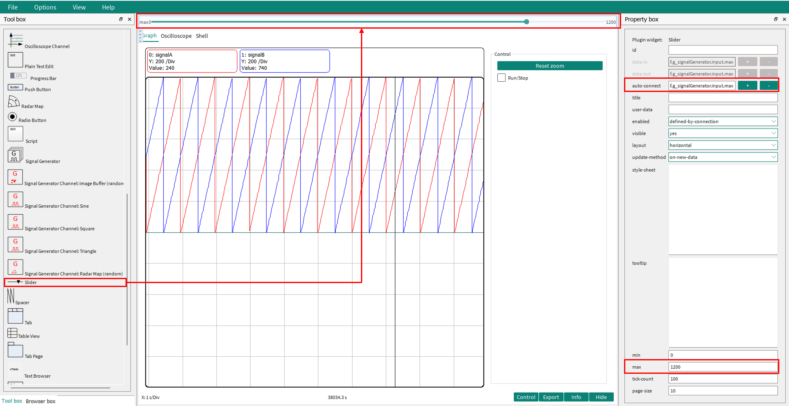  

**Test the Graph**

Save your configuration with CTRL+S and, exit the edit mode with the Infineon GUI Designer menu *Options &rarr; Edit mode* to only see the GUI.

Restart the AURIX&trade; software.

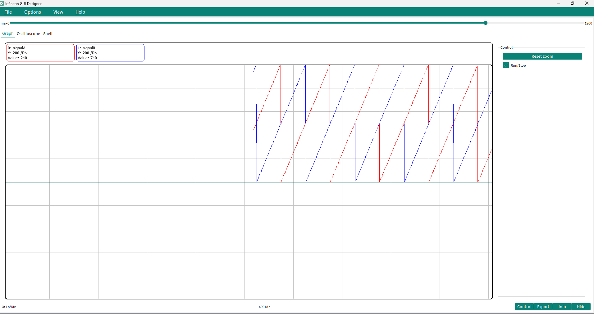  


**Configuration screenshots**

**Layout**

 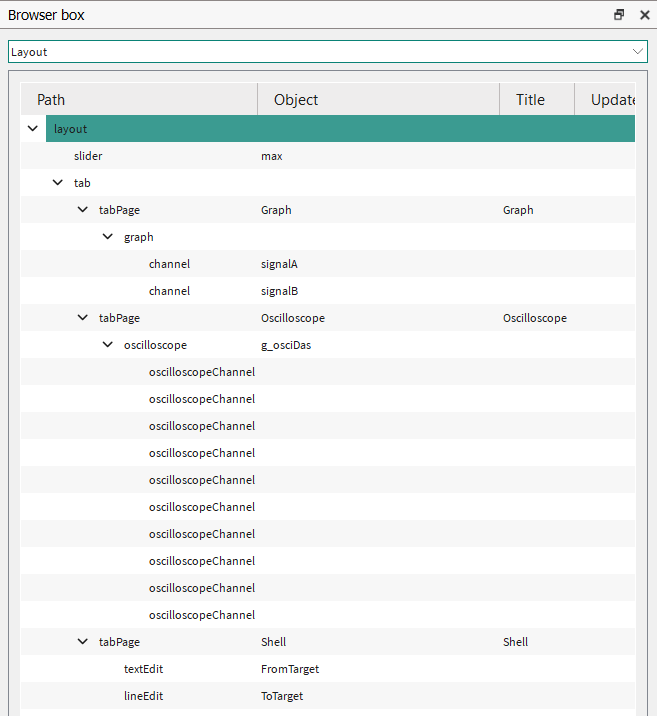 

**interface**
 
 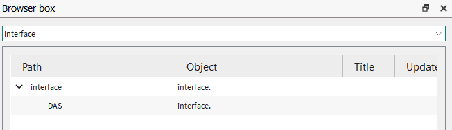 

**signals**
 
 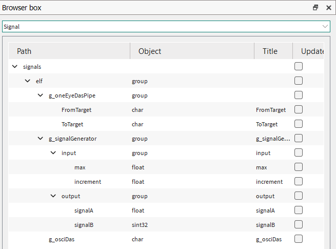 


## References  

AURIX&trade; Development Studio is available online:  
- <https://www.infineon.com/aurixdevelopmentstudio>  
- Use the "Import..." function to get access to more code examples  

More code examples can be found on the GIT repository:  
- <https://github.com/Infineon/AURIX_code_examples>  

For additional trainings, visit our webpage:  
- <https://www.infineon.com/aurix-expert-training>  

For questions and support, use the AURIX&trade; Forum:  
- <https://community.infineon.com/t5/AURIX/bd-p/AURIX>  
