  

# iLLD_TC4D7_LK_ADS_ONEEYE_UART_ALLINONE
 
**Demonstrate how to implement a data multiplexer, oscilloscope, and shell using the Infineon GUI Designer (OneEye) over the UART (USB) interface.**

## Device  
The device used in this example is AURIX&trade; TC4D7XP_A-Step_MC_COM 

## Board  
The board used for testing is the AURIX&trade; TRIBOARD TC4D7 ( KIT_A3G_TC4D7_LITE ).

## Scope of work  
Demonstrate how to implement a data multiplexer, oscilloscope, and shell using the Infineon GUI Designer (OneEye) over the UART (USB) interface.

This project showcases how to integrate multiple functionalities: data multiplexer, oscilloscope, and shell using the Infineon GUI Designer (OneEye) over the UART (USB) interface. After configuring the UART interface in OneEye, three key components are implemented:

1. Data Multiplexer: This module routes multiple signal sources through the UART interface, allowing OneEye to visualize and monitor multiple data streams efficiently.

2. Oscilloscope: Signal values are sampled and updated every millisecond, enabling real-time waveform visualization directly within the Infineon GUI Designer.

3. Shell Interface: A shell parser is integrated to interpret command-line inputs and execute corresponding commands, such as info or help, providing a flexible way to interact with the system.

By combining these components, the Infineon GUI Designer becomes a powerful interface for both monitoring and control through the USB UART connection.

## Introduction  
**Infineon GUI Designer** is a GUI that enables the creation of interactive Graphical User Interface. Graphical elements can be drag from a toolbox and drop onto the GUI. The behavior of the created GUI can be customized. Different communication interfaces like UART, Ethernet, CAN, DAS can be used to interact with the embedded system

**SyncProtocol / ProtocolBB** is a synchronous protocol that enables data streaming between the target microcontroller and Infineon GUI Designer. It enables to open multiple communication channels, provide packet acknowledge and packet checksum. Data are transported within a message with a message ID and a message payload. See the Infineon GUI Designer help for more information.
 

## Hardware setup  
This code example has been developed for the board KIT_A3G_TC4D7_LITE (AURIX&trade; TC4D7 LITE KIT). 

The board should be connected to the PC through the USB port. 

     


**Configuration Overview**


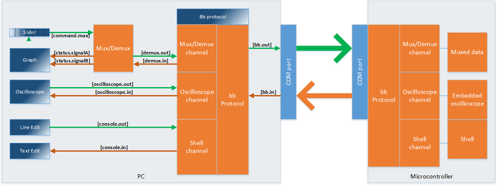     

The UART interface (COM port) is used for the communication between Infineon GUI Designer running on the PC and the embedded software
running on the microcontroller. Note that the signal "bb.out" is used to stream data from the BB
protocol to the UART, and the "bb.in" from the UART to the BB protocol.


The BB protocol interconnects the services (oscilloscope, the shell and data streaming) running on
the microcontroller with the widgets on the GUI. For that purpose it opens point to point communication
channels for the different services (Mux/Demux channel, Oscilloscope channel and Shell channel). The
BB protocol also cares for the integrity of the data transferred over the UART.


A Mux/Demux widget is used to serialize data to be send from the PC to the microcontroller. It works
as follow: when serializing data, the multiplexer functionality of the Mux/Demux is used. For that a
message with the ID 0x4001 in this example, is configured to be used as a data container. Note that
as many messages as required can be defined. When the slider is moved, the "command.max" signal is set,
the message is filled with the value, and send to the Mux/Demux channel of the BB protocol over the
"demux.out" signal. The BB protocol streams the message to the counter part on the microcontroller.
The microcontroller can then check for incoming messages and ID, and extract the value.


On the other hand, the microcontroller sends data periodically every 100ms. For that a message with
the ID 0x4000 in this example is filled with the data to be send (Signal A  and Signal B) using a C-struct. This
message is send using the Mux/Demux channel of the BB protocol. When Infineon GUI Designer receives the data, the
message is forwarded to the Mux/Demux widget that will deserialize it and send the values to the graph
using the status.signalA and status.signalB signals.


Similar appends for the Oscilloscope widget. The user can control the oscilloscope service running
on the microcontroller using the oscilloscope widget. On the microcontroller, data are sampled
periodically and, send for display to the oscilloscope widget when the data buffer is full. Data
sampling can be done either from the main loop or from an interrupt


For the shell command line interface, when a key is pressed in the line Edit, the key is forwarded
to the Shell channel using the "console.out" signal, then send to the shell service on the
microcontroller. The library provides API for parsing the string (command and parameter). The microcontroller can send back
text that will be displayed in the Text Edit box, creating an interactive shell interface.


Note that the oneeye_lib library provides the necessary API to enable low integration efforts.

## Implementation

** AURIX&trade; **

The embedded software is setup to:

* Use the Ifx_Oe_SyncProtocol API (bb protocol) to create multiple point to point communication channel to transport the oscilloscope, mux/demux and shell data 
* Fill a message (C-struct) with the "Signal A" and "Signal B" data, and send it over a BB protocol 
* Extract the "Max Value" command received from the slider
* Use the Ifx_Oe_Osci API to sample data on the microcontroller 
* Use the Ifx_Oe_Shell API to create a command line interface


**Enabling the OneEye Library**

The OneEye library must be enabled by adding the following lines to *Ifx_Cfg.h*:
* define IFX_CFG_OE_AL_UC IFX_CFG_OE_AL_UC_AURIX_ILLD
* define IFX_CFG_OE_AL_UTILS
* #define IFX_CFG_OE_AL_UC_VARIANT IFX_CFG_OE_AL_UC_VARIANT_AURIX_ILLD_TC4


**Compiler switches**

The following compiler switches are provided to tune the application:
 
* ENABLE_BB: If defined the BB protocol is initialized. It is automatically defined if ENABLE_BB_SHELL, ENABLE_BB_MUX or ENABLE_BB_OSCILLOSCOPE is defined 
* ENABLE_BB_SHELL: If defined the code related to the shell interface is enabled, else disabled 
* ENABLE_BB_MUX: If defined the code related to the mux/demux for data streaming is enabled, else disabled 
* ENABLE_BB_OSCILLOSCOPE: If defined the code related to the oscilloscope is enabled, else disabled 
* TEST_ECHO & TEST_ECHO_CHAR_VALUE: Those switches are used when ENABLE_BB is not defined. In this configuration, a string representing the time is send periodically to the UART. If only TEST_ECHO is defined the key stroke are echoed. else if TEST_ECHO_CHAR_VALUE is defined, the key stroke are echoed as hexadecimal value representation. Those test switches can be useful to test / debug the raw UART feature and time API functionality as when they are enabled the BB protocol is not used 
* TEST_ECHO_CHAR_VALUE: If TEST_ECHO_CHAR_VALUE is defined, the keystrokes are echoed as hexadecimal value representations. 
Those macro are defined in the Ifx_Cfg.h file. 


**Memory Configuration**

The heap size has been modified in the LSL file to accommodate the dynamic memory requirements of the application.

Specifically, the heap size was increased from 4 KB to 10 KB.

When using the Tasking compiler, edit the file Lcf_Tasking_Tricore_Tc.lsl, and set the heap to at least 10k bytes 

**#define LCF_HEAP_SIZE 10k** 
  
When using the Hightec compiler, edit the file Lcf_Gnuc_Tricore_Tc.lsl, and set the heap to at least 10k bytes 

**LCF_HEAP_SIZE = 10k;** 

**Initialization**

The initialization is done in the main function.


The UART initialization is done with the following call:

 
```
 /* Initialize the UART */
OneEyeUart_init();
```

At the end of the UART initialization, a pipe is created to transfer data between to the BB protocol and the UART
 

```
/* Initialize the standard interface for the UART */
Ifx_Oe_UartDPipe_initDPipe(&g_OneEyeUart_uart.pipe, &g_OneEyeUart_uart.driver);
```

The signal generator used to generate dummy signal is initialized with


```
/* Initialize signal generator */
SignalGenerator_init();
```

The BB protocol is initialized with


```
/* Initialize the BB protocol */
Ifx_Oe_SyncProtocol_init(&g_oneeyeBb, BB_REMOTE_TIMEOUT, &g_OneEyeUart_uart.pipe);
```

Note that the pipe to the UART is passed as parameter to the Ifx_Oe_SyncProtocol_init() API.


The shell is initialized with


```
/* Initialize the shell */
OneEyeShell_init(&g_oneeyeBb);
```

First a BB protocol channel for the shell is created using the Ifx_Oe_ShellBb_init() API.
The local and remote ports (BB_LOCAL_PORT_SHELL, BB_REMOTE_PORT_SHELL) must match the ports set in
the Infineon GUI Designer configuration (protocolEngine -> protocol-core-bb -> target). 
Regarding the shell initialization, note the 2 parameters passed to Ifx_Oe_Shell_init() API,
a pipe that connects to the BB protocol channel (&amp;g_shellBb._dPipe.stdif), and
the table containing shell commands (&amp;g_shellCommands[0])


The oscilloscope is initialized with


```
/* Initialize the oscilloscope */
OneEyeOscilloscope_init(&g_oneeyeBb, UPDATE_INTERVAL);
```


Regarding the oscilloscope initialization, the Ifx_Oe_Osci_init() API initialises the oscilloscope
object  whereas the Ifx_Oe_OsciBb_init() API creates the required BB protocol channel.
The local and remote ports (BB_LOCAL_PORT_OSCILLOSCOPE, BB_REMOTE_PORT_OSCILLOSCOPE) must match the
ports set in the Infineon GUI Designer configuration (protocolEngine -> protocol-core-bb -> target). 
Note that the signals to be sampled are added using the Ifx_Oe_Osci_addSignal() API. 
At the end of the initialization the oscilloscope is started with the Ifx_Oe_Osci_start() API.


The mux/demux is initialized with


```
/* Initialize the data multiplexer */
OneEyeDataMultiplexer_init(&g_oneeyeBb);
```


For the mux/demux, only a BB protocol channel is created using the Ifx_Oe_SyncProtocol_addClient() API
during initialization.
The local and remote ports (BB_LOCAL_PORT_DEMUX, BB_REMOTE_PORT_DEMUX) must match the ports set in
the Infineon GUI Designer configuration (protocolEngine -> protocol-core-bb -> target).


**Runtime**
In this example the BB protocol (Ifx_Oe_SyncProtocol_execute() API),
shell (OneEyeShell_process() API), oscilloscope (OneEyeOscilloscope_process() API),
Mux/demux (OneEyeDataMultiplexer_process() API) are processed in the background loop.

 
 ```
while (1)
{
    #ifdef ENABLE_BB
            /* Update the sync protocol */
            Ifx_Oe_SyncProtocol_execute(&g_oneeyeBb);
    #endif
    
    #ifdef ENABLE_BB_SHELL
            /* Process the shell */
            OneEyeShell_process();
    #endif
    
    #ifdef ENABLE_BB_OSCILLOSCOPE
            /* Process the Oscilloscope */
            OneEyeOscilloscope_process();
    #endif
    
    #ifdef ENABLE_BB_MUX
            /* Process the data multiplexer */
            OneEyeDataMultiplexer_process();
    #endif
    
            /* Update the signal generator and oscilloscope periodically */
            if (Ifx_Oe_Time_isDeadLine(deadline))
            {
                deadline = Ifx_Oe_Time_add(deadline, Ifx_Oe_Time_getTickForMilliseconds(UPDATE_INTERVAL));
    
    #if defined(ENABLE_BB_OSCILLOSCOPE) || defined(ENABLE_BB_MUX)
                /* Update the signal generator */
                SignalGenerator_process();
    #endif
    
    #ifdef ENABLE_BB_OSCILLOSCOPE
                /* Update the oscilloscope */
                /* NOTE: In real application the OneEyeOscilloscope_sample() should may be called
                 * from an interrupt to sample data synchronously to  the control loop for example
                 */
                OneEyeOscilloscope_sample();
    #endif
            }
    
    
    #ifndef ENABLE_BB
    
                OneEyeTest_process();
    #endif
}
```

 The signals generator SignalGenerator_process() API is called periodically every 10ms
(set by UPDATE_INTERVAL) to generate new dummy signal values.
 The oscilloscope OneEyeOscilloscope_sample() API is also called periodically every 10ms to sample the signal values. Note
that the call can be done from inside an interrupt if required by the application.


The OneEyeShell_process() calls 2 APIs of the oneeye_lib:
<ul>
<li>Ifx_Oe_ShellBb_processMessages(): to handle the data transfer with the BB protocol</li>
<li>Ifx_Oe_Shell_process(): to process the shell commands</li>
</ul>


```
void OneEyeShell_process(void)
{
    /* Process the BB channel for the shell */
    Ifx_Oe_ShellBb_processMessages(&g_shellBb);

    /* Process the shell commands */
    Ifx_Oe_Shell_process(&g_shell);
}
```

The shell commands are defined in the g_shellCommands table. This table has a line for each command
defining the shell command itself, a help text and a call back function


```
/* Array that stores the supported Shell commands */
const Ifx_Oe_Shell_Command g_shellCommands[] = {
    { "help", IFX_OE_SHELL_HELP_DESCRIPTION_TEXT, &g_shell, &Ifx_Oe_Shell_showHelp },
    { "info", "     : Dummy info command",        &g_shell, &printShellInfo        },
    IFX_OE_SHELL_COMMAND_LIST_END
};
```


The OneEyeOscilloscope_process() just forward the call to the oneeye_lib
Ifx_Oe_OsciBb_processMessages() API to handle the communication over the BB protocol.


```
void OneEyeOscilloscope_process(void)
{
/* Process the BB channel for the oscilloscope */
Ifx_Oe_OsciBb_processMessages(&g_osciBb);
}
```

The OneEyeOscilloscope_sample() just forward the call to the oneeye_lib
Ifx_Oe_Osci_step() API to handle the oscilloscope trigger, and data sampling.


```
void OneEyeOscilloscope_sample(void)
{
/* Sample the signals */
Ifx_Oe_Osci_step(&g_osci);
}
```


The OneEyeDataMultiplexer_process() handles the data received from Infineon GUI Designer and send to Infineon GUI Designer
(data streaming).
 

```
void OneEyeDataMultiplexer_process(void)
```

It contains two parts. he first part handles the received data.

The Ifx_Oe_SyncProtocol_isMessageAvailable() checks if an incoming message is available.
 Then the  Ifx_Oe_SyncProtocol_getReadMessageBuffer() gets the pointer to the message data
(payloadRx), the message ID (id) and the message length (length).
 The switch-case handle the message depending on the ID. Note that the ID is defined by the
Mux/Demux widget message.
 In order to access the message data, the pointer is cast to the required data structure (DataStreaming_Data_1).

   
The second part handles the sending of data.

A deadline is checked to send the data at a defined frequency using the Ifx_Oe_Time_isDeadLine() and
Ifx_Oe_Time_add() API.
 Then the Ifx_Oe_SyncProtocol_setSendMessageBuffer() request a message buffer for send, and
returns a pointer to the message in case of success. Note that the Ifx_Oe_SyncProtocol_setSendMessageBuffer()
take the message ID (SYNCPROTOCOL_MESSAGE_ID_DATASTREAMING_DATA_0), and the size of the message
(sizeof(DataStreaming_Data_0)) as parameter.
 In case the returned message pointer is not null, the message pointer is casted to the required
structure (DataStreaming_Data_0) and the payload set.
 Then the Ifx_Oe_SyncProtocol_sendMessage() is called to send the message.


**Hardware Abstraction layer**


The hardware Abstraction layer specific to  the microcontroller is selected with the IFX_CFG_OE_AL_UC
macro, defined in the Ifx_Cfg.h file.


Note that an accurate time in milli second step is required for the BB protocol to function properly.
This is provided by the Ifx_Oe_Time_now() API, that is specific to each microcontroller / library
and provided in the oneeye_lib.


Note that for the ModusToolbox PDL, and xmclib libraries, the oneeye_lib defines the SysTick_init(),
SysTick_Handler() and SysTick_task() API.


The oneeye_lib also provides utilities to interface the UART with the Ifx_Oe_UartDPipe API. This API
is enabled if IFX_CFG_OE_AL_UTILS is defined.


## Compiling and programming  
Before testing this code example:  
- Connect the board to the PC through the USB interface  
- Build the project using the dedicated Build button  or by right-clicking the project name and selecting "Build Project"  
- To flash the device and immediately run the program, click on the dedicated Flash button   


## Run and Test   


** GUI description **

At the top of the GUI, a button "Setup serial interface" is available to configure the COM port on
the PC side (115200 baud).

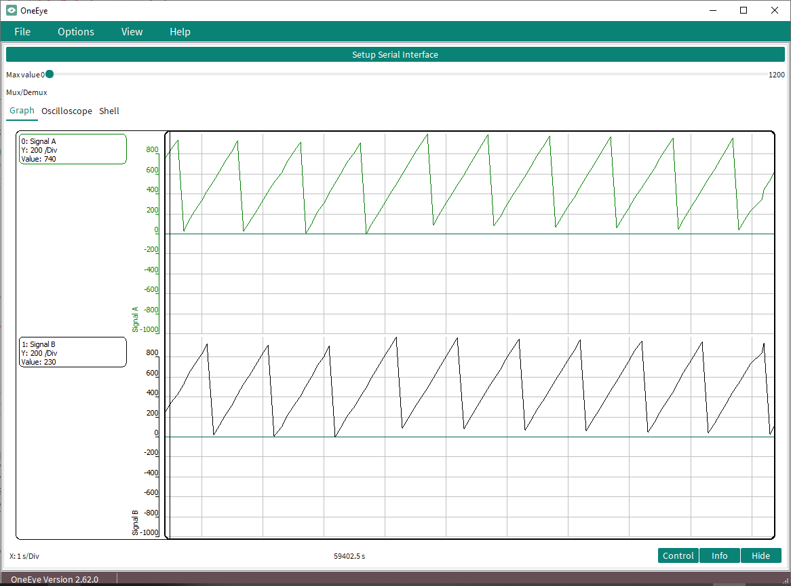

Right below, a slider connected to the signal "command.max" controls the "Signal A" and the "Signal B" variables on the microcontroller
as explained above.

Then comes the Mux/Demux widget that serialize / deserialize the streamed data (max command, signal A and signal B).

Below, on the first tab, a graph  displays the "status.signalA" and "status.signalB" data streamed
periodically by the microcontroller.

On the 2nd tab, an oscilloscope widget controls the oscilloscope service running on the microcontroller and
displays the captured signals.

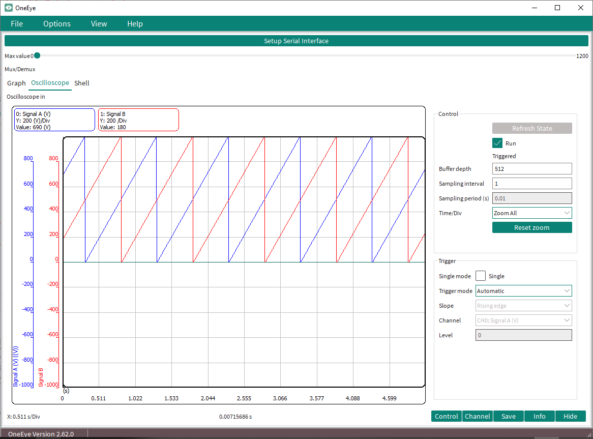

Note that the oscilloscope have a much better timing accuracy than the graph mentioned previously.

On the last tab, two widgets enable the interaction with the shell command line service that runs on the
microcontroller. The top text edit widget displays the text send by the microcontroller whereas, the bottom line edit
sends user key strokes to the microcontroller.

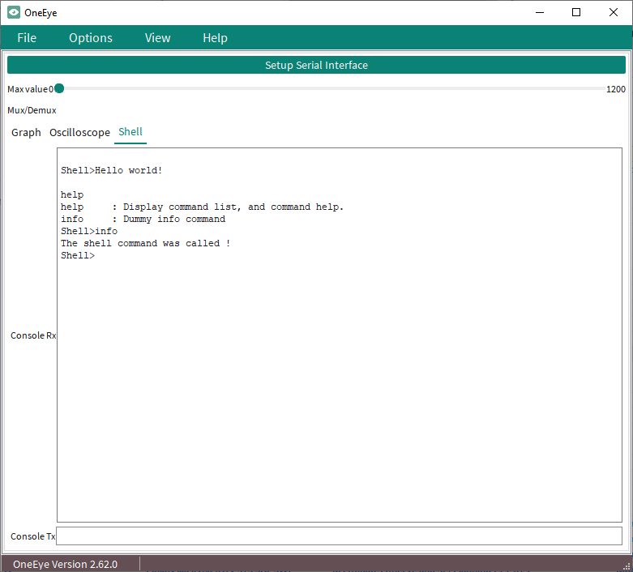


 
** OneEye ** 

For this training, the OneEye application is required for visualizing the values. OneEye can be opened inside the AURIX&trade; Development Studio using the following icon:

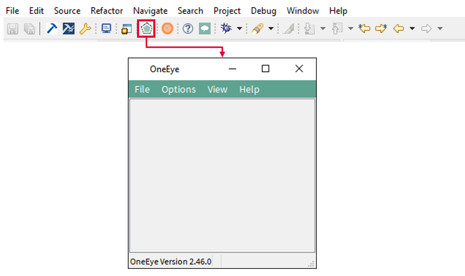  

Clicking the OneEye icon automatically opens the OneEye configuration for the active project. If no configuration exists, it is created by AURIX&trade; Development Studio 


**Setup Infineon GUI Designer for editing**  

Select the Infineon GUI Designer menu *Options &rarr; Edit mode* (if not already checked) to enable the edit mode.
Select the Infineon GUI Designer menu *View &rarr; Browser box*, *View &rarr; Property box*, *View &rarr; Tool box* (if not already checked) to display the browser, property box, and tool box. Note that the box can be moved around.  

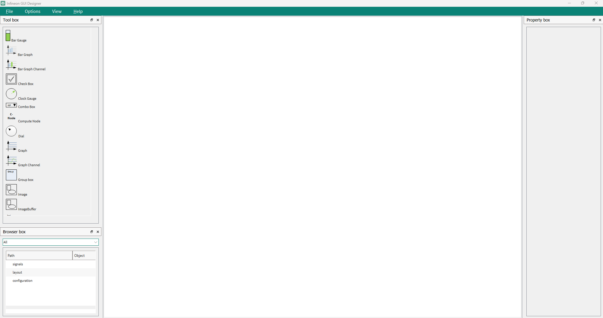  

**Removing the default DAS interface**

When the OneEye configuration is created by ADS, it is already setup with a DAS interface. 
Select the interface in the Browser box (1) and delete it with “right click and remove” as it is not required in this example.

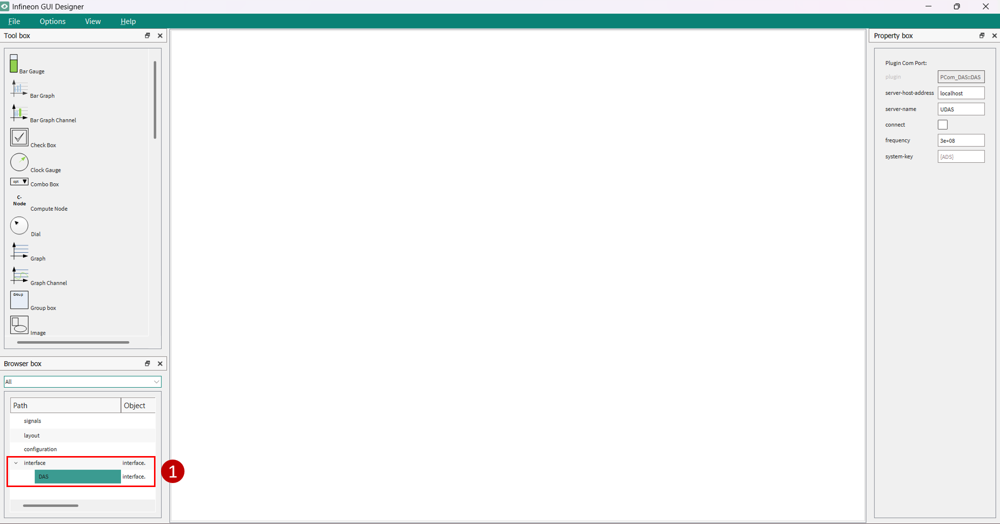  


**Configuring the UART interface: Signal creation**

The first step is to create 2 signals to connect the received and transmit data over the UART.
Create a signal group and set its name property to *bb*. 

  

Add two signals of type char into the bb group, name them in and out, and set their title property to respectively *BB* in and *BB out*.


**Configuring the UART interface: COM port**

Right click in an empty area of the Browser box, and select *Add child &rarr; Interface*. Then right click on the created interface and select *Add child &rarr; com*. Select the com item and set its device property to the COM port connected to the AURIX&trade; board. Set the baudrate property to 115200 and click connect.

The COM port is now opened and ready for communication.

  


**Configuring the UART interface: Transmit stream**

Right click on the interface in the Browser box, and select *Add child &rarr; dataMessageHandler*. Then right click on the created *dataMessageHandler* and select *Add child &rarr; message* to create a message item. 
Configure the message *interval=0.001*, send-on-new-data checked, *dir=tx*, stream checked.

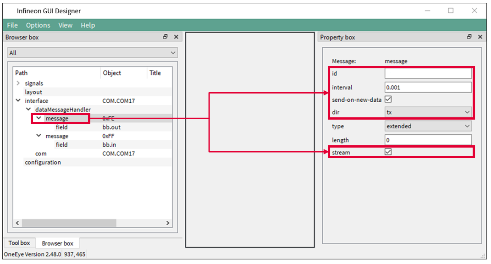  

Right click on the message, and select *Add child &rarr; field*. 
Configure the field with *name=bb.out*, *bit-pos=0*, *buffer=512*.

Now, data will be transmitted over the UART each time the bb.out signal is written with some data.

  

**Configuring the UART interface: Receive stream**

Right click on the dataMessageHandler and select *Add child &rarr; message* to create a second message item. 
Configure the message with the *interval=-1*, *dir=rx*, *stream checked*.

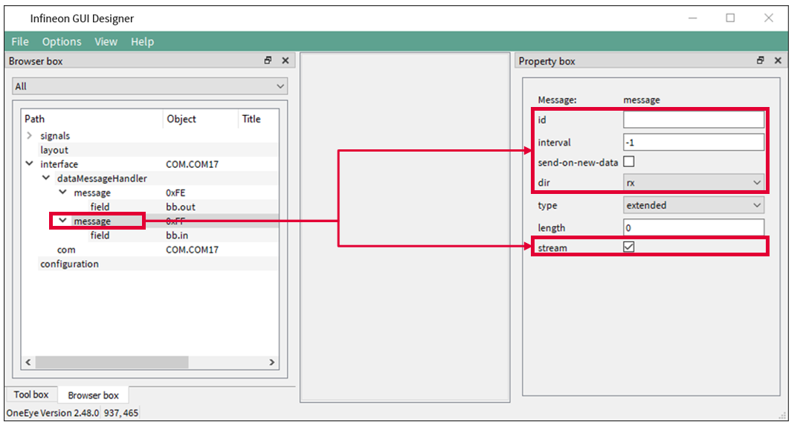  

Right click on the message, and select *Add child &rarr; field*. 
Configure the field with *name=bb.in*, *bit-pos=0*.
Now each time data are received over the UART, the bb.in signal will be updated.

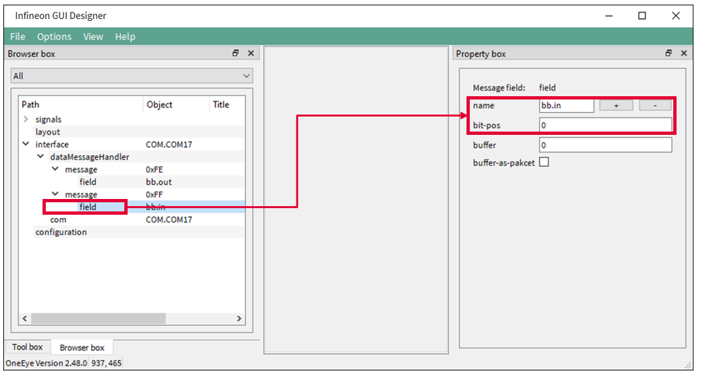  

**Configuring the UART interface: Push button**

Drag and drop a pushButton widget from the toolbox onto the layout, configure it with title=Setup Serial Interface, *on-click={show.connection.ui}*.

Clicking the button now shows the COM port configuration window.

  

**Configuring the BB protocol**

Right click in an empty area of the Browser box, and select *Add child &rarr; protocolEngine*. Then right click on the created protocolEngine and select *Add child &rarr; protocol-core-bb*. Connect the BB protocol stream to the *bb.in* and *bb.out* signals by setting respectively the *data-in* and data-out properties. Set the name property to BB-core. And set the timeout to 2000 ms so that frames are dropped after 2 seconds in case the microcontroller is not answering.

  


**Creating the tabPages for Graph, Oscilloscope and Shell**

For the All In One Example, you need to create a tab with 3 tabPages (Graph, Oscilloscope and Shell) where you will create the widgets as specified below.

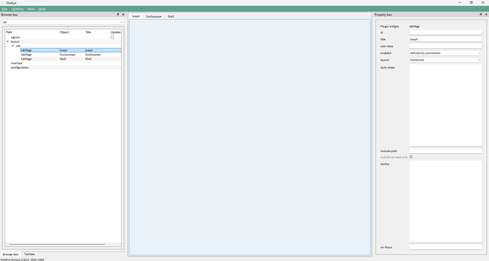  


**Configuring the Oscilloscope: signals creation**

Create a signal group and set its name property to oscilloscope. 

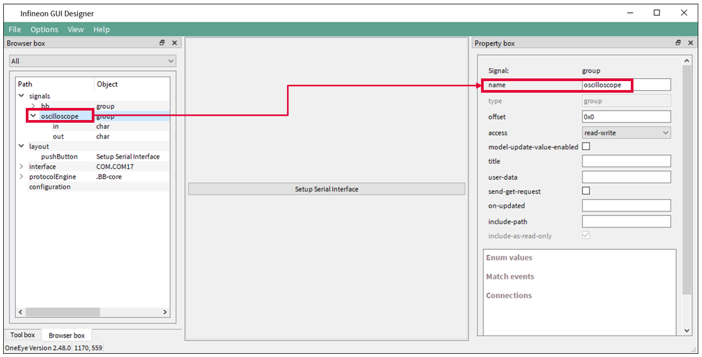  

Add two signals of type char into the oscilloscope group, name them in and out, and set their title property to respectively Oscilloscope in and Oscilloscope out.

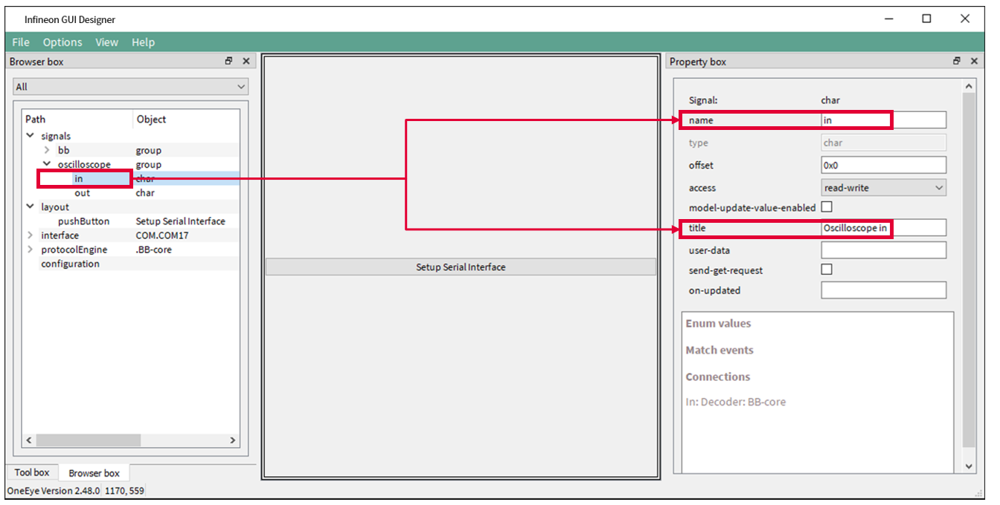  

**Create the oscilloscope widget**

Drag and drop an oscilloscope widget from the toolbox onto the page with title "Oscilloscope", set the oscilloscope properties *data-in* and *data-out* to respectively *oscilloscope.in* and *oscilloscope.out*. Set the protocol-type property to *ProtocolBB*. Set the unit-x property to s.

  

**Connect the oscilloscope widget to the BB protocol**

Right click on the *protocol-core-bb* and select *Add child &rarr; target*. Select the target item and set local-port and remote-port to 3 to match the AURIX&trade; settings, *set signal-in=oscilloscope.out*, *signal-out=oscilloscope.in*, forward=checked.

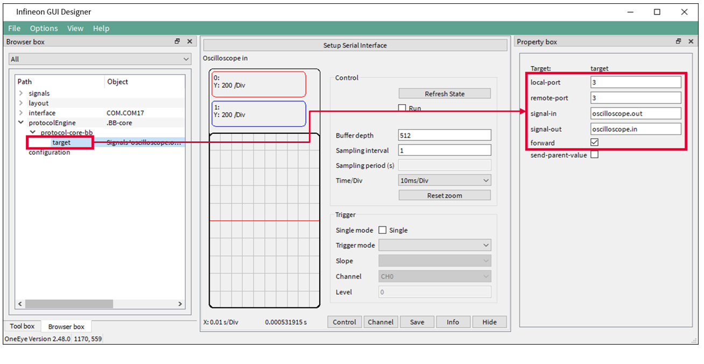  

**Create the oscilloscope widgets to display the signals value**

Drag and drop an Oscilloscope Channel (channel) widget from the toolbox onto the layout, set the channel properties auto-connect to status.signalA, unit-per-division-y to 200, and color to green. Repeat the operation for a second channel and set the channel properties auto-connect to status.signalB, and color to black.

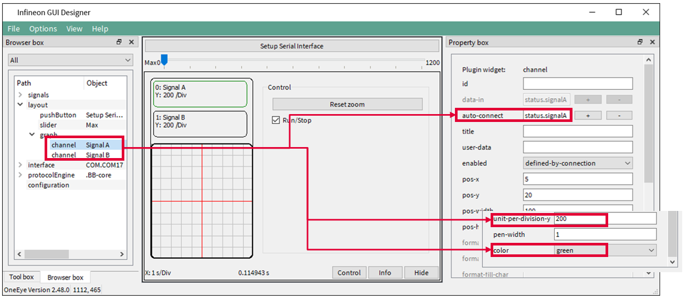  

**Test the oscilloscope**

The oscilloscope Control tab provides configuration for the trigger and information about the oscilloscope state (armed, triggered, uploading). 
Click on the Control button (1) and the Refresh State button to retrieve the oscilloscope settings (channels, timings, …).

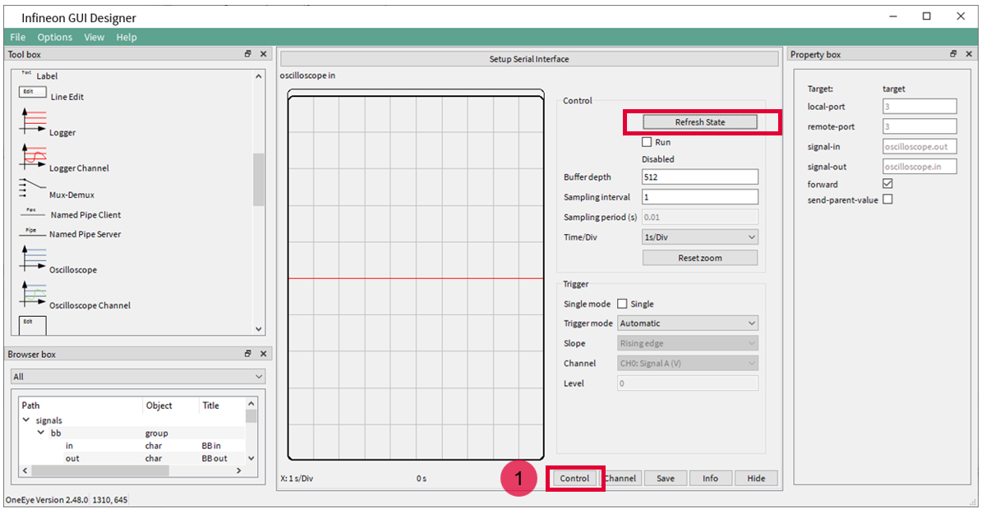  

In the oscilloscope Channel tab, click on the Channel button (1) and check the visible check box for both CH0: Signal A and CH1: Signal B to display the two channels.

Set the Unit per div Y to 200 for both CH0: Signal A and CH1: Signal B.

Select the Pen color red for CH0: Signal A and blue for CH1: Signal B.

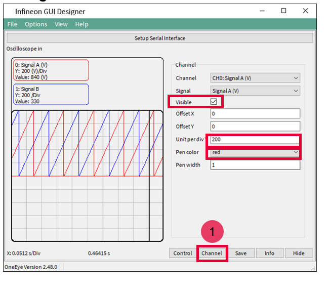  

Click on the Control button (1), check the run button (2), the values for signalA and signalB should be updating in the oscilloscope.

Set the Time/Div value to Zoom All to configure the horizontal scale to use the full screen of the oscilloscope window.

The Buffer depth configures the oscilloscope buffer depth, here 512 points are used to fill the buffer. This value can be changed within the limit set by the software.

The Sampling interval provides the information whether to sample at each interval (1) or every few intervals (>1) to the oscilloscope.

  


**Configuring the Data multiplexer: signals creation**

Create a signal group under the *signals* root and set its name property to mux. 

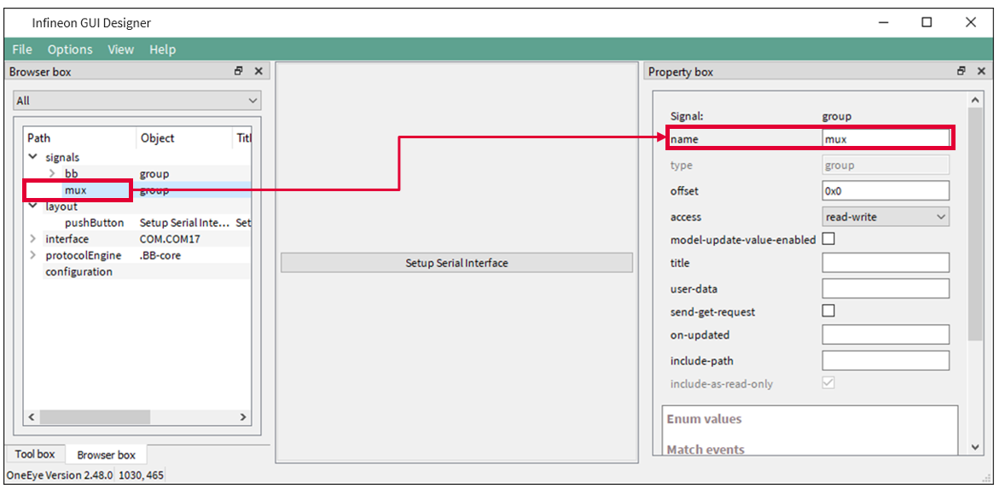  

Add two signals of type char into the mux group, name them in and out, and set their title property to respectively Mux in and Mux out.

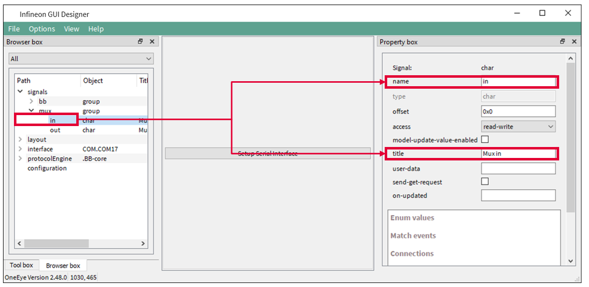  

**Creating signals to send commands to the AURIX&trade;**

Create a signal group under the signals root and set its name property to command. 
Add two signals of type float into the command group, name them max and increment, and set their title property to respectively Max and Increment.

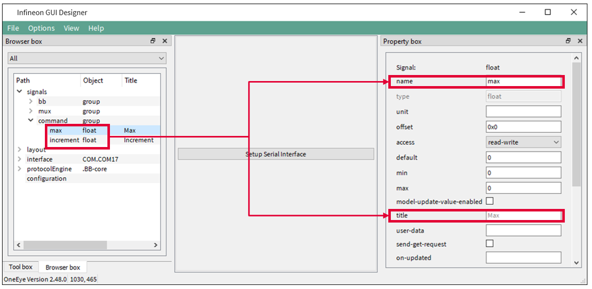  

**Creating signals for the received data**

Create a signal group under the signals root and set its name property to status. 
Add two signals of type float and sint32 into the status group, name them *signalA* and *signalB*, and set their title property to respectively *Signal A* and *Signal B*. Note that the data type must match the one defined in the AURIX&trade; C struct *DataStreaming_Data_0*.

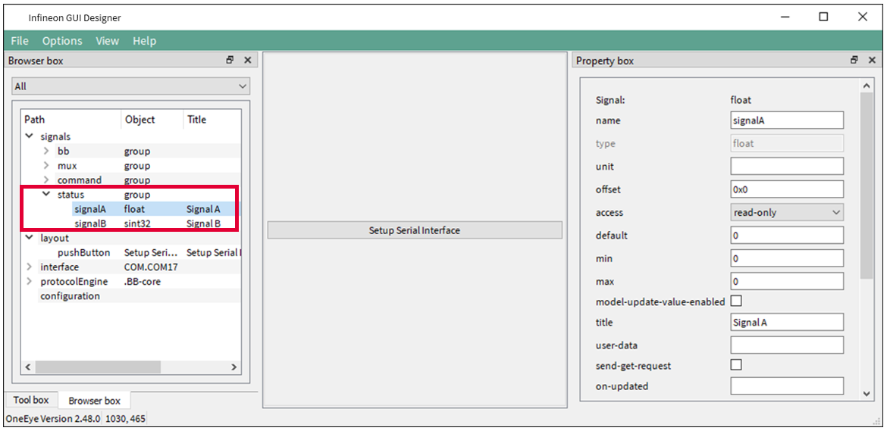  

**Create the slider widgets to send command to the AURIX&trade;**

Drag and drop a slider widget from the toolbox onto the layout, set the slider properties auto-connect to  command.max. and max to 1200, 

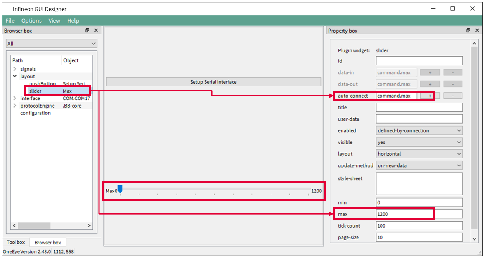  

**Create the graph widgets to display the signals value**

Drag and drop a graph widget from the toolbox onto the page with title "Graph".

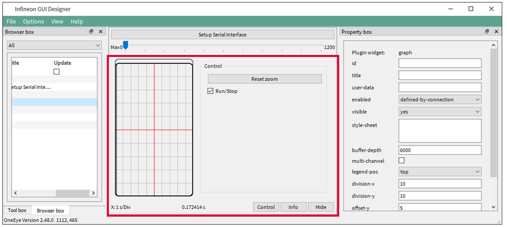  

**Create the graph widgets to display the signals value**

Drag and drop a Graph Channel (channel) widget from the toolbox onto the layout, set the channel properties auto-connect to  *status.signalA*, unit-per-division-y to 200, and color to green. Repeat the operation for a second channel and set the channel properties auto-connect to  *status.signalB*, and color to black.

  

**Create the muxDemux widgets to connect the BB protocol to the graph  and slider widgets**

Drag and drop a Mux-Demux (muxDemux) widget from the toolbox onto the layout, set the muxDemux properties data-in and data-out to respectively *mux.in* and *mux.out*.

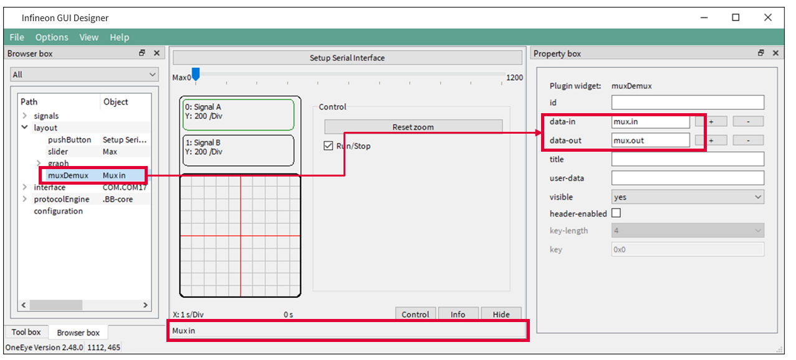  

Right click on the muxDemux widget in the browser box, and select *Add child &rarr; muxDemuxMessage*, set the *muxDemuxMessage* properties id to 0x4000 and dir to demux to decode received messages.

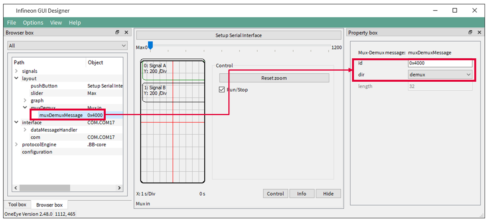  

Right click on the *muxDemuxMessage* in the browser box, and select *Add child &rarr; muxDemuxField*, set the *muxDemuxField* properties name to *status.signalA*, bit-pos to 0.

Repeat the operation for a second signal and set its properties name to status.signalB, bit-pos to 32.

Note: the *status.signalA* and *status.signalB* signal size (32 bits), type (float / sint32) and offset (0 / 32) must match the data member *signalA* and *signalB* of the C struct *DataStreaming_Data_0*.

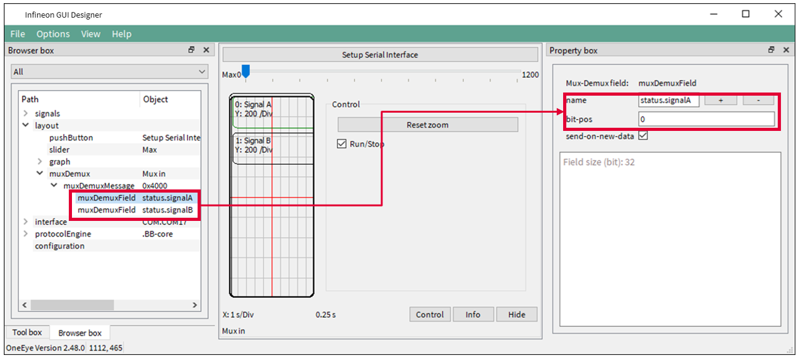  

Right click on the *muxDemux* widget in the browser box, and select *Add child &rarr; muxDemuxMessage*, set the *muxDemuxMessage* properties id to 0x4001 and dir to mux to encode and send messages. Set the length property to 4 bytes, which corresponds of the size of the C struct DataStreaming_Data_1. 

  

Right click on the *muxDemuxMessage* in the browser box, and select *Add child &rarr; muxDemuxField*, set the *muxDemuxField* properties name to command.max, bit-pos to 0, and check send-on-new-data.

Note: the command.max signal size (32 bits), type (float) and offset (0) must match the data member max or the C struct DataStreaming_Data_1.

  

**Connect the Mux-Demux widget to the BB protocol**

Right click on the protocol-core-bb and select *Add child &rarr; target*. Select the *target* item and set *local-port* and remote-port to 1 to match the AURIX&trade; settings, set *signal-in=mux.out*, *signal-out=mux.in*, and forward checked.

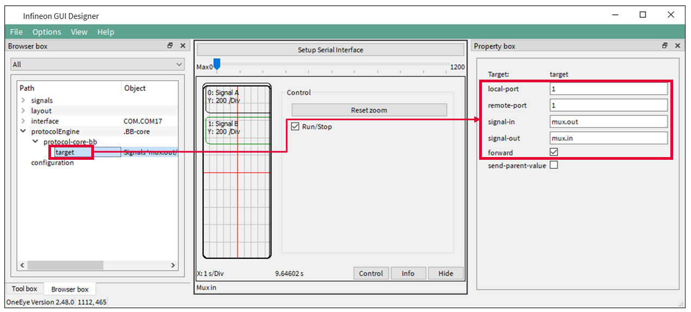  

**Test the data multiplexer interface**

Save your configuration with CTRL+S and, exit the edit mode with the Infineon GUI Designer menu *Options &rarr; Edit mode* to only see the GUI.

Restart the AURIX&trade; software.

Move the slider cursor (1) to change the max value and affect the generated signals value. 

  


**Configuring the console: signals creation**

Create a signal group and set its name property to console. 

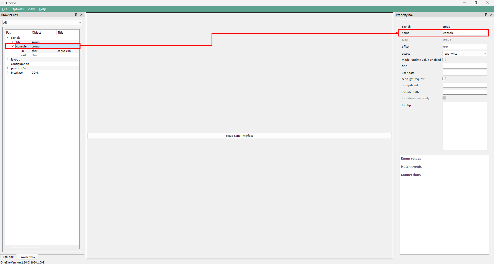  

Add two signals of type char into the console group, name them in and out, and set their title property to respectively Console in and Console out. Set the access property of the in signal to read-only and the access property of the out signal to write-only.

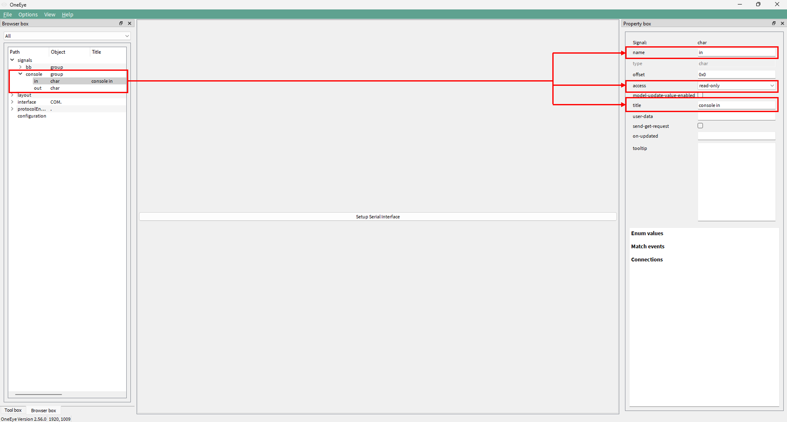 


**Create the Shell widget**

Drag and drop a textEdit widget from the toolbox onto the page with title "Shell", set the textEdit properties auto-connect to  console.in. Set the update-method to all-on-new-data.

  

Drag and drop a lineEdit widget from the toolbox onto the page with title "Shell, set the lineEdit properties auto-connect to  console.out. Check the capture-key property to enable each key stroke to be send.

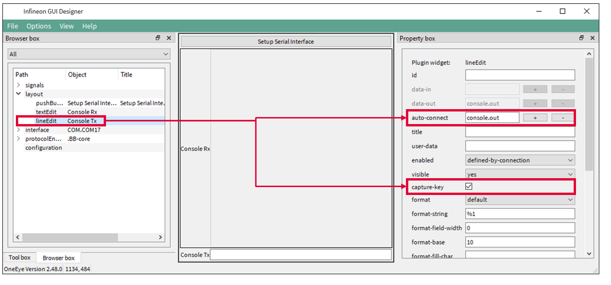  

**Connect the lineEdit and textEdit widget to the BB protocol**

Right click on the protocol-core-bb and select Add child &rarr; target. Select the target item and set local-port and remote-port to 2 to match the AURIX&trade; settings, set *signal-in=console.out*, *signal-out=console.in*.

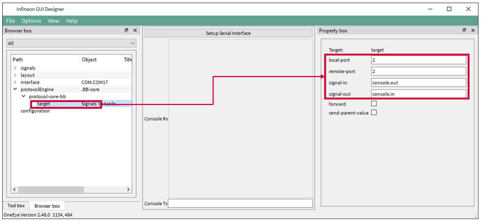  

**Test the shell interface**

Restart the AURIX&trade; software. The shell textbox should display the *Hello World !* text (1). 

Enter “info” in the Console Tx lineEdit field (2) and press ENTER, the microcontroller executes the *printShellInfo()* function and should answer as below to acknowledge the command. 

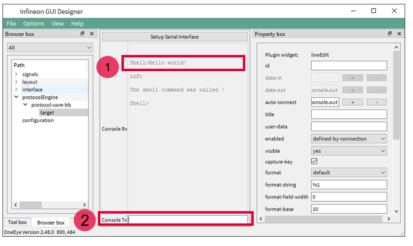  

Save your configuration with CTRL+S.

Exit the edit mode with the Infineon GUI Designer menu *Options &rarr; Edit mode* to only see the GUI (3).

  


** Configuration screenshots ** 

**Layout**

 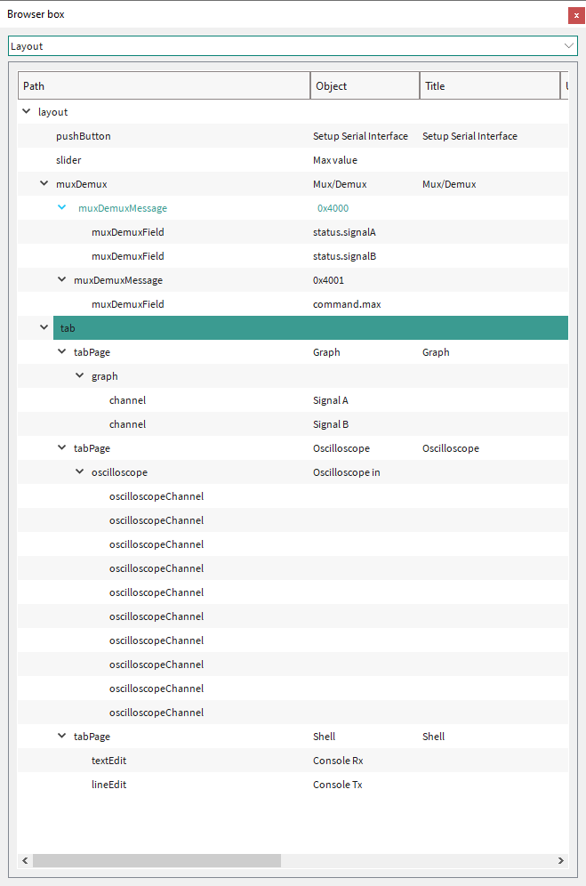 

**interface**
 
 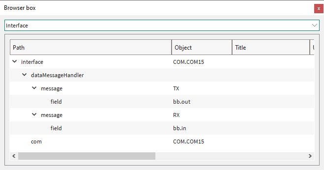 

**protocol**
 
 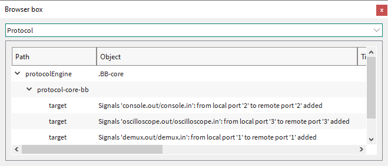 

**signals**
 
 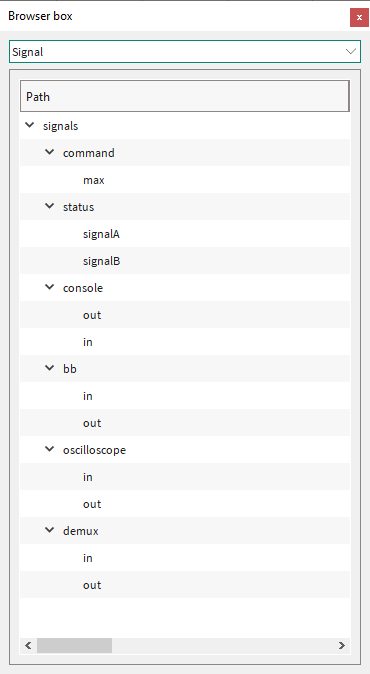 


## References  

AURIX&trade; Development Studio is available online:  
- <https://www.infineon.com/aurixdevelopmentstudio>  
- Use the "Import..." function to get access to more code examples  

More code examples can be found on the GIT repository:  
- <https://github.com/Infineon/AURIX_code_examples>  

For additional trainings, visit our webpage:  
- <https://www.infineon.com/aurix-expert-training>  

For questions and support, use the AURIX&trade; Forum:  
- <https://community.infineon.com/t5/AURIX/bd-p/AURIX>  
