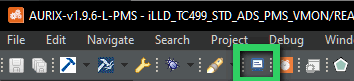
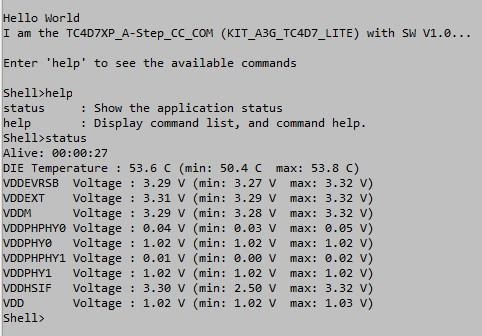

 
 
# iLLD_TC4D7_LK_ADS_PMS_VMON
**The supply voltage values of the MCU are measured by the primary voltage monitors and printed to a terminal application.**  

## Device  
The device used in this example is AURIX&trade; TC4D7XP_A-Step_CC_COM 

## Board  
The board used for testing is the AURIX&trade; TC4D7XP_A-Step_CC_COM (KIT_A3G_TC4D7_LITE)  

## Scope of work   
The Power Management System (PMS) allows the measurement of the AURIX&trade; supply voltage values by using the primary voltage monitors. In this example, a terminal application can be used to display the measured voltage values for each supply rail. CPU0 toggles an LED by using the system timer (STM).

## Introduction  
- The ASClIN interface is used to communicate with the ADS terminal application
- The tracking ADCs of the primary voltage monitors are used to measure the voltage of the supply rails 
- In the terminal window the supply rail voltages of the MCU are printed 

## Hardware setup  
This code example has been developed for the board AURIX&trade; TC4D7XP_A-Step_CC_COM (KIT_A3G_TC4D7_LITE)
 
  
    
## Implementation    

**Configure the ASCLIN**  

Configuration of the ASCLIN module for UART communication is done in the setup phase by initializing an instance of the  _IfxAsclin_Asc_Config_  structure with default values through the function  _IfxAsclin_Asc_initModuleConfig()_ .  
The following parameters are then modified:  
- *baudrate* – structure to set the actual communication speed in bit/s
- *interrupt* – structure to set: 
    - *txPriority* - transmit interrupt priority
    - *typeOfService* – defines which service provider is responsible for handling the interrupt, which can be any of the available CPUs, or the DMA 
- *pins* – structure to set which GPIO port pins are used for the communication
- *txBuffer*, *txBufferSize* – to configure the buffer that holds the outgoing data

Finally, the configuration is applied via the function *IfxAsclin_Asc_initModule()*.
All the above functions can be found in the iLLD header *IfxAsclin_Asc.h*.

**The UART send function**

Sending the string "Hello World!" is implemented inside the function *send_UART_message()* which is called once after initialization of the ASCLIN module.  
This function calls *IfxAsclin_Asc_write()* which is provided by the iLLD header *IfxAsclin_Asc.h*.

**Configuring the system timer to periodically generate interrupts:**  
  
- The configuration of the system timer is done through the function 
*configSystemTimer()*    
    - The system timer immediately runs after power up and needs to be configured
    - Create an instance of the structure *IfxStm_Timer_Config*, which is initialized 
by calling *IfxStm_Timer_initConfig()*. Then configure the following 
components:    
- Set the rate in Hz that refers to interrupt events per second  
- Define the priority for the interrupt (range from 0 to 255)  
- Define the provider for the interrupt service request as one of the CPUs or 
the DMA  
- Specify the comparator register that is used to store the compare value to 
trigger an event when timer and comparator register match  
    - Use the routine *IfxStm_Timer_init()* together with the instance of structure 
*IfxStm_Timer_Config* to initialize the *g_myTimer* handle  
 
**Measurement of the MCU supply rails:**

Calling *measurement_init()* initializes the tracking ADCs of the primary voltage monitors. The tracking ADCs are used for cyclic voltage measurement of each AURIX&trade; supply rails.

**Blink the LED:**

CPU0 runs within the endless loop in *Cpu0_Main.c*. Before it starts a toggle cycle, it waits for approximately 1 million CPU ticks (equals to 0x100000).
  
**Printing the status of the measured rail voltages to the terminal:**

The call *AsclinShellInterface_run()* polls the input from the terminal application. If the command 'status' is written to the prompt after pressing the Enter key the current Die temperature of the AURIX&trade; as well as the measured voltage of each supply rail is printed.  

## Compiling and programming
Before testing this code example:
- Compiler: Tasking Smartcode V10.1. via AURIX&trade; Development Studio limited V1.10.8-L
- Power the board using the dedicated power connector 
- Connect the board to the PC through the USB interface
- Build the project using the dedicated Build button  or by right-clicking the project name and selecting "Build Project"
- To flash the device and immediately run the program, click on the dedicated Flash button  
  
## Run and Test  
For this example, a serial terminal is required for visualizing the text. The terminal can be opened inside the AURIX&trade; Development Studio using the following Terminal button   

  

The serial terminal must be configured with the following parameters to enable the communication between the board and the PC:  
- Speed (baud): 115200
- Data bits: 8
- Stop bit: 1

Connect the board via an USB cable to the PC.

After code compilation and flashing the device, check the open terminal window on AURIX&trade; Development Studio, which looks like the following:  

After code compilation and flashing the device:
- Check if LED 03.9 is blinking
- The terminal can be used to control the board
- Enter 'status' to the terminal prompt to display the supply rail voltages of the AURIX&trade; MCU

## References  

AURIX&trade; Development Studio is available online:  
- <https://www.infineon.com/aurixdevelopmentstudio>  
- Use the Import... function to get access to more code examples  

More code examples can be found on the GIT repository:  
- <https://github.com/Infineon/AURIX_code_examples>  

For additional trainings, visit our webpage:  
- <https://www.infineon.com/aurix-expert-training>  

For questions and support, use the AURIX&trade; Forum:  
- <https://community.infineon.com/t5/AURIX/bd-p/AURIX>  
