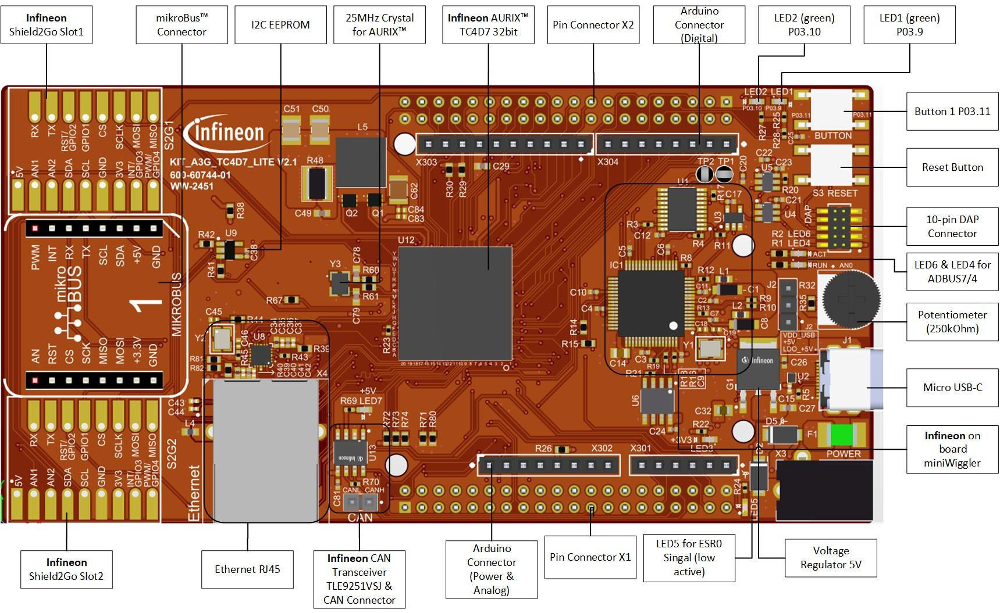
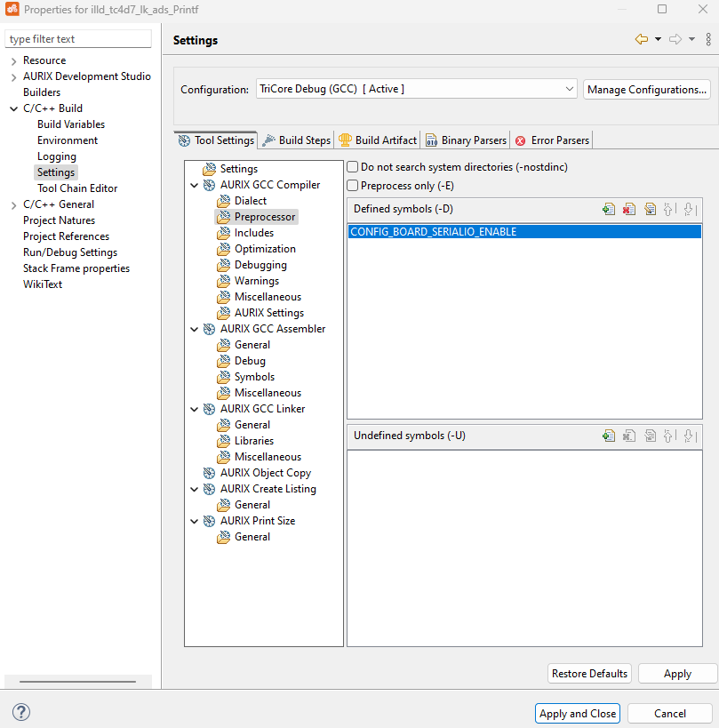
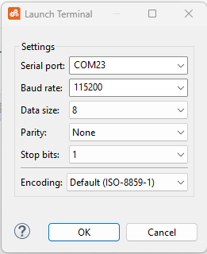
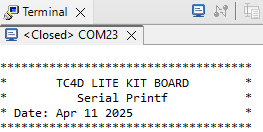

  

# iLLD_TC4D7_LK_ADS_Printf

**The printf is used to send data with ASCLIN.**

## Device  
The device used in this example is AURIX&trade; TC4D7XP_A-Step_CC_COM

## Board  
The board used for testing is the AURIX&trade; TC4D7XP_A-Step_CC_COM (KIT_A3G_TC4D7_LITE)

## Scope of work   
The printf function is retargeted for GCC compiler to send data via ASCLIN in ASC (UART) mode.  
Specific serialio library is provided for the scope.

## Introduction  
- The Asynchronous/Synchronous Interface (ASCLIN) module enables asynchronous/synchronous serial communication with external devices
- For this example, asynchronous reception/transmission (UART) is used for the communication between a PC and an AURIX&trade; device

## Hardware setup  
This code example has been developed for the board TC4D7XP_A-Step_CC_COM (KIT_A3G_TC4D7_LITE).  
The board should be connected to the PC via USB, in order to allow the UART connection.  
 
  

## Implementation  
**Configure the Project**  

This example relies on the board lib files, specific for the AURIX&trade; TC4D7 Lite KIT (they can be found in the *Boards* folder).  
It further requires the component library files, which can be found in the *Components/serialio* folder.  
In order to enable the serial communication, the macro  *CONFIG_BOARD_SERIALIO_ENABLE*  has to be defined in the Preprocessing settings.

  

**Configure the ASCLIN**  

Configuration of the ASCLIN module for UART communication is done in the function *SERIALIO_Init()*, it takes the desired UART baudrate as parameter.  
The desired baudrate can be defined with the macro *UART_BAUDRATE*, whose default value is set to 115200 baud.

The function *SERIALIO_Init()* initializes an instance of the *IfxAsclin_Asc_Config* structure with default values through the function *IfxAsclin_Asc_initModuleConfig()*.  
The following parameters are then modified:  
- *baudrate* - structure to set the actual communication speed in bit/s
- *pins* - structure to set which GPIO port pins are used for the communication. The definition of the pins used is done in the file *board.c* in the section for *Serial IO*

Finally, the configuration is applied via the function *IfxAsclin_Asc_initModule()* and the transmission is enabled by setting the Transmit FIFO Level Flag (TFL) via the *FLAGSSET* register.  
All the above functions can be found in the iLLD header *IfxAsclin_Asc.h*.

**Retargeting printf function**  

When calling the *printf()* function, the GCC compiler sends one character at a time using the function *write()*.  
The function waits until the *IfxAsclin_getTxFifoFillLevelFlagStatus()* returns *TRUE*, then clears the Transmit FIFO Level Flag (TFL) of the Flags Register with the function *IfxAsclin_clearTxFifoFillLevelFlag()*.  
Finally, it sends the given character via UART using the function *IfxAsclin_writeTxData()*.  
The functions mentioned above can be found in the iLLD header *IfxAsclin.h*.

## Compiling and programming
Before testing this code example:  
- Power the board through the dedicated power connector 
- Connect the board to the PC through the USB interface
- Build the project using the dedicated Build button  or by right-clicking the project name and selecting "Build Project"
- To flash the device and immediately run the program, click on the dedicated Flash button 

## Run and Test  
For this example, a serial terminal is required for visualizing the text. The terminal can be opened inside the AURIX&trade; Development Studio using the following icon:  

  

The serial terminal must be configured with the following parameters to enable the communication between the board and the PC:  
- Speed (baud): 115200
- Data bits: 8
- Stop bit: 1

After code compilation and flashing the device, check the open terminal window on AURIX&trade; Development Studio, which looks like the following:  

  

## References  

AURIX&trade; Development Studio is available online:  
- <https://www.infineon.com/aurixdevelopmentstudio>  
- Use the "Import..." function to get access to more code examples  

More code examples can be found on the GIT repository:  
- <https://github.com/Infineon/AURIX_code_examples>  

For additional trainings, visit our webpage:  
- <https://www.infineon.com/aurix-expert-training>  

For questions and support, use the AURIX&trade; Forum:  
- <https://community.infineon.com/t5/AURIX/bd-p/AURIX>  
