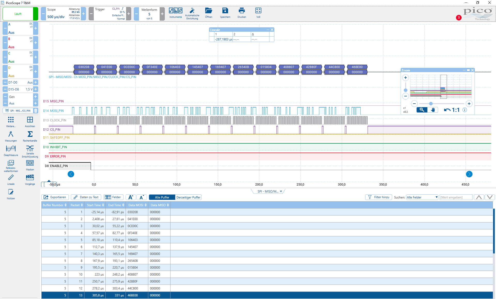

  

# iLLD_TC4D7_LK_ADS_QSPI_TLE9180D_2 
 
**This example demonstrates how to use TLE9180D software driver.**  

## Device  
The device used in this example is AURIX&trade; TC4D7XP_A-Step_MC_COM  

## Board  
The board used for testing is the AURIX&trade; TC4D7 Lite Kit (KIT_A3G_TC4D7_LITE)  

## Scope of work  
This example demonstrates how to use TLE9180D software driver. The QSPI3 is configured in master mode and used to send data to TLE9180D intelligent gate driver and to receive data from it.  

## Introduction  

The TLE9180D-31QK, an advanced gate driver IC, is used in motor control power board. The TLE9180D-31QK is dedicated to control 6 external N-channel MOSFETs forming an inverter for high current 3 phase motor drive application in the automotive sector.  An integrated Queued Synchronous Peripheral Interface (QSPI) interface is used to configure the TLE9180D-31QK for the application after power-up. After successful power-up, adjusting parameters, monitoring data, configuration and error registers can be read through QSPI interface. Cyclic redundancy check over data and address bits ensures safe communication and data integrity.

The QSPI enables synchronous serial communication with external devices based on the standardized SPI-bus signals: clock, data-in, data-out and slave select. 
The QSPI works in full duplex mode either as Master or Slave with up to 50 MBit/s. 

## Hardware setup  
This code example has been developed for the board TC4D7 Lite Kit board (KIT_A3G_TC4D7_LITE):   

  

## Implementation  

**QSPI Master initialization** 
   
The configuration of the QSPI communication is done once in the setup phase through the function *Qspi_initQspi()*.

The initialization of the QSPI master module is done by defining an instance of the *IfxQspi_SpiMaster_Config* structure. 
- The structure is filled with default values by the function *IfxQspi_SpiMaster_initModuleConfig()*. 
- Afterwards, the interface operation mode, the pins, ISR service provider and the priorities are set.
- The function *IfxQspi_SpiMaster_initModule()* is used to initialize the QSPI master module.  

A QSPI module controls 16 communication channels, which are individually programmable.  

In this example, the initialization of the channel is done using an instance of the structure *IfxQspi_SpiMaster_ChannelConfig*. Afterwards, the slave select channel number is set through the parameter *sls.output* and the baud rate is modified via the parameter *base.baudrate*.  

The function *IfxQspi_SpiMaster_initChannel()* is used to initialize the QSPI master channel.  

The above functions can be found in the iLLD header *IfxQspi_SpiMaster.h*.

**TLE9180 software driver initialization** 

The initialization of the TLE9180 software driver is done using an instance of the structure *IfxTLE9180_Config*. The GPIO pins are set and  proper QSPI channel assigned. The function *IfxTLE9180_init()* is used to initialize the TLE9180 software driver.  

Table below provides the predefined startup configuration of TLE9180D-31QK. More details about available registers can be found in datasheet of TLE9180D-31QK.

<table>
    <tbody>
        <tr>
            <td><b>Register short name</b></td>
            <td><b>Data [hex] </b></td>
            <td><b>Description </b></td>            
      </tr>
      <tr>
            <td>Conf_Sig </td>
            <td>AC </td>
            <td>CRC8 Signature Byte </td>            
      </tr>
            <tr>
            <td>Conf_Gen_1 </td>
            <td>81 </td>
            <td>140°C, Input Pattern Supervision Disabled, SPI Window Watchdog Disabled, Limp Home Mode Activation Disabled, VCC Supervision Enabled, VCC Monitoring Threshold - 5V selected as VCC supply voltage 
            </td>            
      </tr>
            <tr>
            <td>Conf_Gen_2 </td>
            <td>0F </td>
            <td>5V Overcurrent Detection Threshold, 0V BSx enabled, 0V LD enabled, 0V SD VDHP enabled, 3 VDH sense pins and 1 VDHP power pin enabled, Current Sense Amplifier 3 enabled, Current Sense Amplifier 2 enabled, Current Sense Amplifier and Reference Buffer enabled </td>            
      </tr>
            <tr>
            <td>Tl_vdh  </td>
            <td>70 </td>
            <td>48.18V VDHP Overvoltage Threshold, 3.96V VDHP Undervoltage Threshold </td>            
      </tr>
            <tr>
            <td>Tl_cbvcc </td>
            <td>9A </td>
            <td>9.99V CB Undervoltage Threshold, VCC Overvoltage Threshold is 10% of configured VCC supply voltage, VCC Undervoltage Threshold is 10% of configured VCC supply voltage </td>            
      </tr>
            <tr>
            <td>Fm_1  </td>
            <td>32 </td>
            <td>CB Undervoltage Failure Behavior - Warning, Overload Charge Pump 2 Failure Behavior - Shutdown of output stages, Undervoltage High-side Buffer Capacitor Failure Behavior - Auto Restart Error </td>            
      </tr>
            <tr>
            <td>Fm_3 </td>
            <td>2A </td>
            <td>Vs Undervoltage Failure - Auto Restart Error, VDHP Undervoltage Failure Behavior - Auto Restart Error, VCC Undervoltage Failure Behavior - Auto Restart Error </td>            
      </tr>
            <tr>
            <td>Fm_4 </td>
            <td>4A </td>
            <td>Vs Overvoltage Failure - Auto Restart Error, VDHP Overvoltage Failure Behavior - Auto Restart Error, VCC Overvoltage Failure Behavior - Auto Restart Error </td>            
      </tr>
            <tr>
            <td>Fm_6 </td>
            <td>2A </td>
            <td>Current Sense Amplifier 3 Overcurrent Failure Behavior - ARE, Current Sense Amplifier 2 Overcurrent Failure Behavior - ARE, Current Sense Amplifier 1 Overcurrent Failure Behavior - ARE </td>            
      </tr>
            <tr>
            <td>Op_gain_1  </td>
            <td>44 </td>
            <td>Current Sense Amplifier 1 Gain 1 - 30.81, Current Sense Amplifier 2 Gain 1 - 30.81 </td>            
      </tr>
            <tr>
            <td>Op_gain_2  </td>
            <td>44 </td>
            <td>Current Sense Amplifier 1 Gain 2 - 30.81, Current Sense Amplifier 2 Gain 2 - 30.81 </td>            
      </tr>
            <tr>
            <td>Op_gain_3  </td>
            <td>44 </td>
            <td>Current Sense Amplifier 3 Gain 2 - 30.81, Current Sense Amplifier 3 Gain 1 - 30.81 </td>            
      </tr>
      </tr>
            <tr>
            <td>Op_0cl  </td>
            <td>9F </td>
            <td>Zero Current Output Voltage Offset - 2.5V, Zero Current Output Voltage Offset Fine Adjustment - No adjustment </td>            
      </tr>
    </tbody>
</table>

The configuration table one can find in TLE9180.c file.

## Compiling and programming

Before testing this code example:  
- Power the board through the dedicated power connector 
- Connect the board to the PC through the USB interface
- Build the project using the dedicated Build button  or by right-clicking the project name and selecting "Build Project"
- To flash the device and immediately run the program, click on the dedicated Flash button   

## Run and Test   

After code compilation and flashing the device, observe the QSPI and GPIO pin states.

## References  

AURIX&trade; Development Studio is available online:  
- <https://www.infineon.com/aurixdevelopmentstudio>  
- Use the "Import..." function to get access to more code examples  

More code examples can be found on the GIT repository:  
- <https://github.com/Infineon/AURIX_code_examples>  

For additional trainings, visit our webpage:  
- <https://www.infineon.com/aurix-expert-training>  

For questions and support, use the AURIX&trade; Forum:  
- <https://community.infineon.com/t5/AURIX/bd-p/AURIX> 
