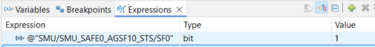

  

# iLLD_TC4D7_LK_ADS_SMU_IR_Alarm

**SMU_SAFE0 Software Alarm 0 triggers an interrupt request to CPU0**    

## Device  
The device used in this example is AURIX&trade; TC4D7XP_A-Step_CC_COM

## Board  
The board used for testing is the AURIX&trade; TC4D7XP_A-Step_CC_COM (KIT_A3G_TC4D7_LITE)

## Scope of work   
This code example shows how to configure a reaction for a safety alarm in the Safety and Security alarm Management Unit (SMU).
In particular, an interrupt is triggered which in turn activates one of the LEDs on the board.

## Introduction  
 - The SMU is a central and modular component of the safety architecture providing a generic interface to manage the behavior of the microcontroller under the presence of faults
 - The SMU centralizes all the alarm signals related to the different hardware safety mechanisms
 - Software Alarms can be triggered by software but behave in the same way as hardware alarms
 - Each alarm can be individually configured to trigger internal or external actions
 - In this example, the Software Alarm 0 is used to trigger an interrupt request to CPU0

In this example, the Software Alarm 0 of the instance SMU_SAFE0 is used to trigger the alarm handling in the SMU. The alarm handling for this alarm is configured by setting the corresponding bits in the *SAFEx_AGSFi_CONj* registers of the SMU. These registers are set to trigger an interrupt request IGCS0_REQ on the interrupt request line 0 (IRQ0) to the Interrupt Router (IR). The interrupt service routine then turns on the LED on P03.9.

## Hardware setup  
This code example has been developed for the board  KIT_TC4D7 Lite KIT (AURIX&trade; TC4D7 Lite KIT Board). A debugger is needed to step through the code and see when the software alarm is triggered.
 

## Implementation  
**Configuration of SMU and PORTS** 
- Configuration of the PORTS and SMU is performed in the function *configure_SMU()*
- The iLLD functions  _IfxPort*_  are used to configure the LED and to set the initial state
- The iLLD functions  _IfxSmu*_  are used to configure the alarm handling
- The iLLD functions  _IfxSrc*_  are used to configure the IR

**Triggering the software alarm**
- The function *trigger_SMU_alarm()* triggers the Software Alarm 0 by calling the iLLD function *IfxSmu_setSafetyAlarmStatus()*

**Interrupt service routine**
- The interrupt service routine is implemented in the function *ISR_SMU_Alarm()*
- The iLLD functions *IfxSmu_smuSafeClearAlarmStatus()* and *IfxSmu_clearSafetyAlarmExecutedStatus()* clear the software alarm 0 status flag and the alarm executed status flag
- The iLLD function *IfxPort_setPinState()* turns on the LED P03.9

## Compiling and programming

Before testing this code example:  
- Power the board through the dedicated power connector 
- Connect the board to the PC through the USB interface
- Build the project using the dedicated Build button  or by right-clicking the project name and selecting "Build Project"
- To flash the device and immediately run the program, click on the dedicated Flash button 

## Run and Test   
After code compilation and flashing the device, open a debug session and set a breakpoint at the function *trigger_SMU_alarm()* which is called inside *Cpu0_Main.c*.  
When running the code, observe that the LED P03.9 is initially turned off. Then, by allowing the code execution to continue after the breakpoint, observe that the LED P03.9 is turned on.  
By using the debugger it is also possible to check the SMU alarm status registers (i.e. *SAFE0_AGSF10_STS*) before and after triggering the software alarm 0.  
The bitfield *SF0* shows that the Software Alarm 0 has been raised.  

## References  

AURIX™ Development Studio is available online:  
- <https://www.infineon.com/aurixdevelopmentstudio>  
- Use the "Import..." function to get access to more code examples  

More code examples can be found on the GIT repository:  
- <https://github.com/Infineon/AURIX_code_examples>  

For additional trainings, visit our webpage:  
- <https://www.infineon.com/aurix-expert-training>  

For questions and support, use the AURIX™ Forum:  
- <https://community.infineon.com/t5/AURIX/bd-p/AURIX>  
