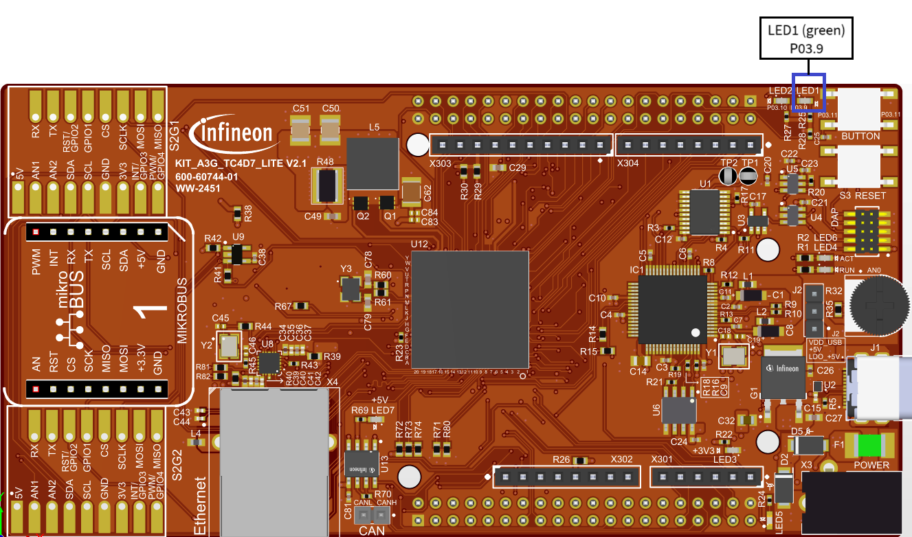

  

# iLLD_TC4D7_LK_ADS_STM_Interrupt 
**The STM is configured to trigger an interrupt every 500 ms. The interrupt toggles an LED.**  

## Device  
The device used in this example is AURIX&trade; TC4D7XP_A-Step_CC_COM  

## Board  
The board used for testing is the AURIX&trade; TC4D7 lite Kit (KIT_A3G_TC4D7_LITE)  

## Scope of work   
The STM is configured to trigger an interrupt every 500 ms. The interrupt toggles an LED.
The STM counts up and on reaching a preconfigured compare value, it triggers an interrupt. On each interrupt, the compare value is incremented and an LED is toggled. 

## Introduction  
- In AURIX&trade; TC4xx, the System Timer Module (STM) is a part of the CPU
- It is a free running 64-bit counter that can be used for timing applications requiring both high precision and long period
- Among other features, the STM has the capability to generate interrupts when its counter reaches a predefined compare value
- The comparison is flexible in terms of bit sets. Any of the 64 bits of the STM can be selected for comparison
 

## Hardware setup  
This code example has been developed for the board AURIX&trade; TC4D7 lite Kit (KIT_A3G_TC4D7_LITE)

  

## Implementation  

**Configure and control the LED**
- The LED is toggled by controlling the port pin to which it is connected using functions from the iLLD header *IfxPort.h*
- Inside the function *initPeripherals()*, the port pin is configured to push-pull output mode using the function *IfxPort_setPinMode()*
- During program execution, inside the interrupt service routine *isrSTM()*, the LED is switched on and off using the function *IfxPort_setPinState()*

**Configure the STM**
- Configuration of the STM is done inside the function *initSTM()* by initializing an
  instance of the *IfxStm_CompareConfig* structure with default values through the
  function *IfxStm_initCompareConfig()*
  
The following parameters are modified:
- *ticks* – the total amount of ticks to count before the interrupt generation
- *triggerPriority* – priority of the interrupt generated by the STM on compare match.
It can be a value from 0 to 255, with 0 meaning interrupt is disabled and 255 is the
  highest priority
- *typeOfService* – to define which service provider is responsible for handling the
  interrupt. This can be any of the available CPUs, DMA, GTM or the PPU
- The configuration is then applied to the STM via the function *IfxStm_initCompare*

The above functions can be found in the iLLD header *IfxStm.h*

**Note**: Please refer to the Virtualization disabled section in the CPU-STM chapter of the User manual to identify the STM register offsets for this example.

**Configure the Interrupt Service Routine **
- The method implementing the ISR (*isrSTM()*) needs to be assigned a priority via the
  macro *IFX_INTERRUPT(isr, vectabNum, priority)*
- When triggered, the ISR:
    - Instructs the STM to raise the next interrupt after a certain amount of time by
      updating its compare register with the function *IfxStm_increaseCompare()*
    - Toggles the LED by changing the state of the port pin using the function
     *IfxPort_setPinState()*
     
## Compiling and programming
Before testing this code example:  
- Power the board through the dedicated power connector 
- Connect the board to the PC through the USB interface
- Build the project using the dedicated Build button  or by right-clicking the project name and selecting "Build Project"
- To flash the device and immediately run the program, click on the dedicated Flash button        

## Run and Test   
After code compilation and flashing the device, observe the LED1(P03.9), which should be blinking at a frequency of about 1 Hz.
  

  

## References  

AURIX&trade; Development Studio is available online:  
- <https://www.infineon.com/aurixdevelopmentstudio>  
- Use the "Import..." function to get access to more code examples  

More code examples can be found on the GIT repository:  
- <https://github.com/Infineon/AURIX_code_examples>  

For additional trainings, visit our webpage:  
- <https://www.infineon.com/aurix-expert-training>  

For questions and support, use the AURIX&trade; Forum:  
- <https://community.infineon.com/t5/AURIX/bd-p/AURIX>  
