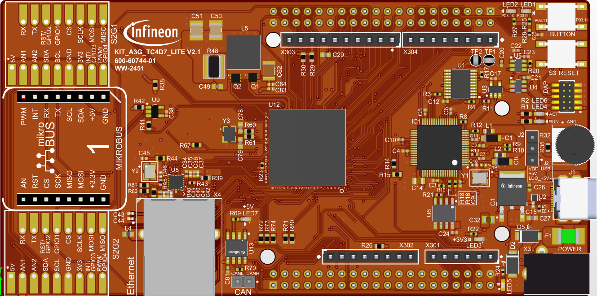

  

# iLLD_TC4D7_LK_ADS_TMADC_Single_Channel

**The TMADC is configured to continuously measure an analog signal, generating an interrupt request when a result is available.**

## Device  
The device used in this example is the AURIX&trade; TC4D7XP_A-Step_CC_COM    

## Board  
The board used for testing is the AURIX&trade; TC4D7 Lite Kit (KIT_A3G_TC4D7_LITE)    

## Scope of work  
An analog input channel of Time-Multiplexed Analog-to-Digital Converter (TMADC) will be continuously converted.
When a result is available, an interrupt service request is generated.  
The input value can be determined by the on-board potentiometer (R32) which is connected to AN0 pin.  
Two LEDs are used to indicate a voltage interval, thus depending on the conversion value, one or both LEDs are on.

## Introduction  
The Time-Multiplexed Analog-to-Digital Converter (TMADC) is based on a Successive Approximation Register (SAR) concept and provides 12-bit analog to digital conversion of up-to 16 external analog input channels using 2 SAR cores supporting a maximum output sample-rate of 4 MSPS.

The following features describe the functionality of the TMADC module:
- Analog supply voltage 5.0 V or 3.3 V
- Reference voltage monitoring support
- Input voltage range from analog reference ground (VAGND) up to analog reference supply voltage (VAREF)
- Each TMADC module supports up to 16 external analog input channels that can be mapped to 2 SAR cores
- Programmable sampling time on each input channel with 12.5 ns resolution
- Maximum output data rate up to 4 MSPS
- Flexible trigger source selection
- One shot or continuous conversion modes supported on single or multiple input channels
- Powerful result handling
- Configurable checking against programmable limits
- Service request generation based on result events and error events
- External analog multiplexer control support
- Built-in diagnostic features

More details can be found in User Manual and Data Sheet. 

## Hardware setup  
This code example has been developed for the AURIX&trade; TC4D7 Lite Kit board (KIT_A3G_TC4D7_LITE):   

  

## Implementation  
** Configuring the TMADC**

The configuration of the TMADC is done once in the setup phase by calling the initialization function *initTMADC()* with the following steps:

- Configuring the TMADC Module by calling the function *initTMADCModule()* with the following steps:
    - Enable ADC module by calling the iLLD function *IfxAdc_enableModule()*
    - The function *IfxAdc_Tmadc_initModuleConfig()* initializes an instance of the structure *IfxAdc_Tmadc_Config* with its default values
    - The *IfxAdc_Tmadc_Config* structure allows to set the following parameters to initialize the module:
        - *id* - Set Module ID (module 0)
        - *calEnable* - Enable calibration (enabled)
    - The *IfxAdc_Tmadc_InterruptConfig* structure allows to set the following parameters to initialize the interrupt configuration:
        - *node* - Select service request node (service request 0)
        - *eventOp* - Select service request event operation (service request generation on occurrence of all event)
        - *eventSel* - Select TMADC event (service request on result event)
        - *typeOfService* - Set interrupt provider (CPU0)
        - *vmId* - Set identifier of Virtual machine interrupt service provider
        - *priority* - Set Channel interrupt priority
    - The *IfxAdc_Tmadc_ServRequestConfig* structure allows to set the following parameters to initialize the module:
        - *intConfig[0]* - Register interrupt configuration  
        - *numServReqNodes* - Configure number of interrupt service requests 
    - Pre-initialized *IfxAdc_Tmadc_ServRequestConfig* structure is linked to *g_tmadcConfig.srvReqCfg*
    - The function *IfxAdc_Tmadc_initModule()* initializes the TMADC module with the given configuration

- Configuring the TMADC channel by calling the function *initTMADCChannel()* with the following steps:
    - The function *IfxAdc_Tmadc_initChannelConfig()* initializes an instance of the structure *IfxAdc_Tmadc_ChConfig* with its default values
    - The *IfxAdc_Tmadc_ChConfig* structure allows to set the following parameters to initialize the channel:
        - *id* - Select channel ID (Channel 0)
        - *moduleId* - Select TMADC module to which channel belongs (Module 0)
        - *samplingTimeNS* - Set sampling time period (100ns)
        - *mode* - Select operating mode (continuous)
        - *core* - Select TMADC SAR core (SAR core 0)
        - *resultCfg.resultReg* - Configure result register (Register 0)
        - *resultCfg.waitForRead* - Enable wait-for-read mode
    - The *IfxAdc_Tmadc_ChannelServReqConfig* structure allows to set the following parameters to initialize the channel:
        - *errorNode* - Configure Service request error node (disabled)
        - *boundaryNode* - Configure Service request boundary node  (disabled)
        - *resultNode* - Configure Service request result node (service request 0)
    - Pre-initialized *IfxAdc_Tmadc_ChannelServReqConfig* structure is linked to *g_tmadcChannel0Config.channelSrvReq*
    - The function *IfxAdc_Tmadc_initChannel()* initializes the TMADC channel with the given configuration

- Starting the TMADC module is done by calling the iLLD function *IfxAdc_Tmadc_runModule()* from *IfxAdc_Tmadc.c*.

**Initialization of the LEDs**

LEDs are used for indicating a voltage interval sensed by TMADC. LEDs are configured using *initLEDs()* function with the following steps:
- The LEDs port pin direction is set to output push-pull mode via the function *IfxPort_setPinMode()* 
- The LEDs port pin state is set ON or OFF with the functions *IfxPort_setPinHigh()* or *IfxPort_setPinLow()* from the *IfxPort.h*

**Indication of the conversion result value**

Indication of the conversion result value is done in *indicateCoversionValue()* function.  
Depending on the conversion value, one or both LEDs are turned on. 

**The TMADC Interrupt Service Routine (ISR)**

The TMADC ISR implemented in this example updates *g_result* variable with a new TMADC result value
by calling the iLLD function *IfxAdc_Tmadc_readChannelResult()* (iLLD source file *IfxAdc_Tmadc.c*).

## Compiling and programming

Before testing this code example:  
- Power the board through the dedicated power connector 
- Connect the board to the PC through the USB interface
- Build the project using the dedicated Build button  or by right-clicking the project name and selecting "Build Project"
- To flash the device and immediately run the program, click on the dedicated Flash button   
  
## Run and Test

After code compilation and flashing the device, verify the behavior of the LEDs (as described below) by adjusting the on-board potentiometer to change the voltage level.

Based on AN0 input voltage level correlating to the position of the potentiometer, following states of LED1 (P03.9) and LED2 (P03.10) are possible:

- If input voltage level is lower than 1.1V, then LED1 is turned on and LED2 is turned off
- If input voltage level is higher than 1.1V and lower than 2.2V, then LED1 is turned on and LED2 is turned on
- If input voltage level is higher than 2.2V, then LED1 is turned off and LED2 is turned on

## References  

AURIX&trade; Development Studio is available online:  
- <https://www.infineon.com/aurixdevelopmentstudio>  
- Use the "Import..." function to get access to more code examples  

More code examples can be found on the GIT repository:  
- <https://github.com/Infineon/AURIX_code_examples>  

For additional trainings, visit our webpage:  
- <https://www.infineon.com/aurix-expert-training>  

For questions and support, use the AURIX&trade; Forum:  
- <https://community.infineon.com/t5/AURIX/bd-p/AURIX>  
