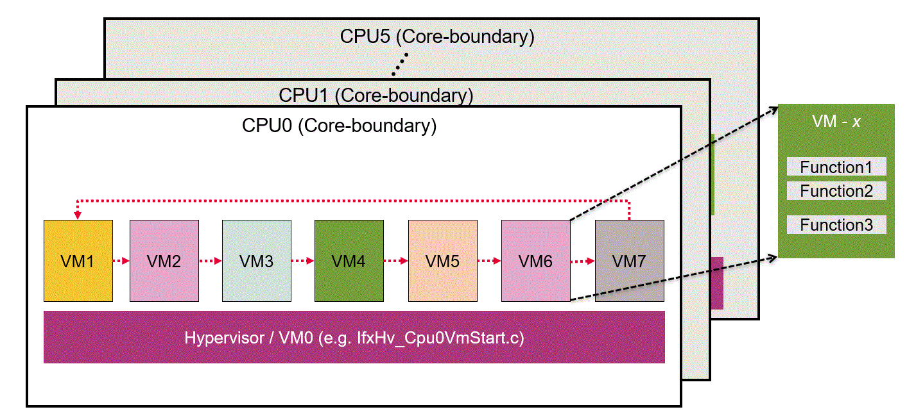
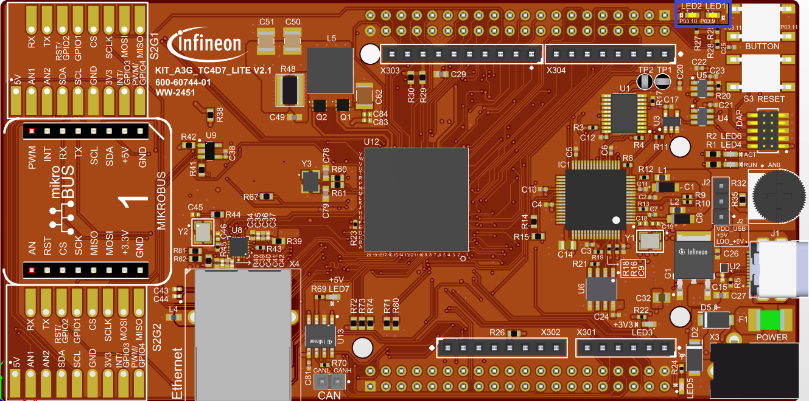

  

# iLLD_TC4D7_LK_ADS_Virtualization_Hypervisor

**TC4D7 Lite Kit Virtualization/Hypervisor Demonstrator**  

## Device  
The device used in this example is AURIX&trade; TC4D7XP_A-Step_CC_COM 

## Board  
The board used for testing is the AURIX&trade; TC4D7XP_A-Step_CC_COM (KIT_A3G_TC4D7_LITE) 

## Scope of work   
This project aims to provide a first user experience on new Virtualization/Hypervisor mechanism of TC4D7 Lite Kit.

## Introduction  
- Industry demands isolated execution of software for various reasons - e.g. to consolidate applications from multiple ECUs to a single ECU, or for legislative and/or security purposes, or for providing a way for users to introduce new features in a safe and secure way, etc.
- Virtualization is the key to enable isolated execution in a standardized way (acceptable to the industry) 
- AURIX&trade; TC4xx provides multiple HW enhancements to support Virtualization. These HW enhancements help in implementing Hypervisor SW with low overhead
- Major enhancement at CPU level is introduction of separate and replicated Hardware Resource sets (HR set) for SW execution
- Each HR set defines a CPU state and since it is replicated, it enables isolated execution of multiple SW applications
- Virtual Machines (VMs) are isolated containers running multiple SW applications in these HR-sets
- Because the HR sets are replicated, it allows fast switching of Virtual Machines (VMs), which is key to real-time response
- Hypervisor is responsible to schedule different VMs. Virtual Machine 0 (VM0) is dedicated to run the Hypervisor SW in special Hypervisor run-mode
- AURIX&trade; TC4xx devices target Type-1 Hypervisors, running on real time microcontrollers

Please refer the TC4xx Hardware Technical UM, CPU chapter for more details on Virtualization.

## Hardware setup  
This code example has been developed for the TC4D7XP_A-Step_CC_COM (KIT_A3G_TC4D7_LITE). 

## Implementation
Each AURIX&trade; TC4xx CPU supports 8 VMs (including the Hypervisor running on VM0). This Hypervisor code example can be used as a starting point by the user to implement different applications in each of these VMs. Below description should help the user in implementing a VM.

**Note**: The design details of the Hypervisor SW itself is beyond the scope of this code example documentation. It is assumed that the user knows, or has access to the TC4xx HW technical user manual, including the TC1.8 Architecture Manual Vol1, to understand the details in which Hypervisor is implemented. It is not expected that the user modifies the Hypervisor SW itself.

**Note**: The code example builds all VMs together, which may not be an industry practice. Such enhanced features (e.g. multi-ELF support) are not targeted as part of this code example.

**1) Configuring VM scheduling in the Hypervisor** 

The code example implements a round-robin logic to schedule the VMs on a CPU core, as shown in the figure below (file: *IfxHv_Cpu0VmSched.c*) [TBD]

The scheduling logic is provided with 2 options for context switch:

- Counter based: Context switch based on HVCALL CPU instruction to invoke Hypervisor (e.g. *IFX_CFG_HV0_TIME_BASED_SCHD* set to 0) after some counts (e.g. *HV_SCHEDULER_ACTIVATION_THS_VM1*)
- Timer-interrupt based: Context switch based on timer-interrupt to Hypervisor (e.g. *IFX_CFG_HV0_TIME_BASED_SCHD* set to 1)
- This configuration is defined individually for each CPU

**Note**: The code example is provided with counter based scheduling option. The timer based scheduling needs further validation, but the code is included for the user in advance

**2) Configuring a VM (i.e. implementing application code in a VM)**

- User can implement application in each file named as: *CpuZ_Main_VmY.c*, where Z is the CPU core number, and Y is the VM on that CPU core. E.g. *Cpu0_Main_Vm1.c* implements a while(1)-loop in which the user can implement functions to run in CPU0 VM1
    - in case of counter based switching: VM application code must be inserted inside the while(1)-loop **before** calling *Ifx__hvcall()* API
    - in case of timer-interrupt based switching: VM application code must be inserted inside the while(1)-loop
- The user can combine multiple VMs of each CPU to form a bigger application

**Note**: The user can also start an OS-scheduler as part of the application code. If it is a multi-core OS, then VMs across different CPUs can also be combined to form a multi-core multi-VM application.

**3) Initializing the application in a VM**

Upon a power-on-reset, the control enters Hypervisor (VM0), from where the other VMs are scheduled.

There is no specific initialization routine for each VM provided by the demonstrator, however the user can implement initialization routines ensuring that they run only once by appropriate means.

E.g. in function *core0_vm1_main()*, the code portion that appears before the while(1)-loop is executed only once, hence the VM initialization code can be inserted here.

**4) Configuring L2-MPU protection to a VM**

For configuring the L2-MPU protection, the Hypervisor uses a very basic configuration as follows:

- PRS0 (Protection Set 0) is used by hypervisor (VM0) and associated trap locations
- PRS1 is used by VM1
- PRS2 is used by VM2
- PRS3 is used by VM3
- PRS4 is used by VM4
- PRS5 is used by VM5
- PRS6 is used by VM6
- PRS7 is used by VM7

Naturally, L2 MPU must be implemented for each CPU core. Hence for details on the memory partitioning for data (read/write) and code (execute) access, please refer to the function *core_vm0_start()* in file *IfxHv_Cpu0VmSched.c* for the VMs scheduled in CPU0.

**Note**: L1-MPU protection is done within a VM and the code example does not set any L1-MPU registers.
      
    
**5) Configuring Access Protection (PROT/APU) for a VM**
 
Configuration of PROT/APU is very specific to the application and the resources it access during run-time.  
This code example only provides necessary hints to where in the execution such protection can be configured, however it does not implement any elaborate protection schemes.

Normally, the Hypervisor sets protection for all HW resources using PROT/APUs because the VM information during resource access is available on the interconnect. This code example however does not take any specific action to program the PROT/APU resources to partition HW resources to individual VMs. The user can implement such protection mechanisms in Hypervisor startup code *core_vmZ_start()* e.g. *core_vm0_start()* for CPU0, before the first VM (i.e. VM1) is started.

**Note**: PROT/APU access for CPU resources (e.g. core specific SFRs, DSPRs, DLMUs, etc.) are configured in *Ifx_Ssw_AP_Init()*. The code example provides no strict protection (i.e. all CPU VM's are allowed to access all the CPU resources).

**6) Configuring interrupts to a VM**

In AURIX&trade; TC4xx the interrupt mechanism is enhanced to support Virtualization (for details refer the AURIX&trade; TC4xx User's Manual):
* interrupts routed directly to VMs are possible (with AURIX&trade; TC4xx, the Interrupt Router Service Request Control Register (SRC) supports a VM bit-field (in addition to the TOS bit-field) in which the user can set the VM (of the CPU) to which the interrupt must be routed) 
* Base Interrupt Vector table pointer register (BIV) is replicated for each HR-set

The BIV for each VM is initialized with appropriate address by the Hypervisor before starting the VM itself. The vector table base addresses are defined in the linker script file.

E.g. BIV for CPU0 VM0 (i.e. the Hypervisor) is defined in the linker file as *LCF_INTVEC00_START*, BIV for CPU0 VM1 is defined as *LCF_INTVEC01_START*, etc.

Furthermore, this means that the ISR functions must be linked to the correct offsets from these base addresses.  
E.g. all ISR's for CPU0 VM1 must be allocated at appropriate offsets based on priority starting from *LCF_INTVEC01_START*. This is ensured by using the C-Macro *IFX_INTERRUPT()* available in iLLD file *CompilerTasking.h*.

**Alternative method for linking ISR's to different VM's** 

Normally, *IFX_INTERRUPT()* is the iLLD macro for TASKING compiler qualifier *__interrupt()*, but this is **not** adopted in this version of the Hypervisor project.  
An alternative method is used to ensure that a specific argument (or number) is passed for the C-Macro *IFX_INTERRUPT()* so that the ISR is located at the correct offset address in the VMs interrupt vector table.  
The rule is described as follows:

C-Macro *IFX_INTERRUPT(isr, vectabNum, prio)* accepts 3 arguments:
- *isr* - which is the ISR function name
- *vectabNum* - which is a mapping number to ensure proper allocation of ISR in the vector table allocated for a VM (0 to 47)
- *prio* - which is the priority of the interrupt (0 to 255)

*vectabNum* can take 48 values because each CPU can host 7 VM's plus the Hypervisor and there are 6 CPUs.  
The mapping of *vectabNum* to a VM is as follows:  

  

The linker interrupt address section is calculated by using *vectabNum* and *prio*: *intvec_tc<vectabNum>_<prio>*

E.g. In *IFX_INTERRUPT(Cpu0_Vm7_Isr, 36, IFX_VM7_ISR_PRIORITY)* the argument *vectabNum* is **36** and the argument *prio* is **IFX_VM7_ISR_PRIORITY = 2**, therefore the ISR *Cpu0_Vm7_Isr()* is allocated for CPU0 VM7 in section *intvec_tc36_2*, which corresponds to the linker address definition *(INTTAB07)+<offset-address>* = *(0x803FE000)+0x40* = *0x803FE040*.  
Note: all interrupts that must be serviced by CPU0 VM7 must have the *vectabNum* as 36.  

It should be noted that this project builds all VMs source code to a single ELF file, hence such an alternative method was needed. However, this may not be the case for real applications where the VMs are built as separate binary files in different build environments. Their integration with the Hypervisor needs then to follow a different method that is generally described by the Hypervisor SW vendors. 

** STM interrupt to VMs example **

As a special case, this project provides an example where the user can enable/disable STM interrupts to each VM using a specific *#define*.  
e.g. *IFX_CFG_TC0_VM1_INT* enables the STM interrupt to CPU0, VM1.

To enable interrupts to non-running VMs, a preemptive Hypervisor scheduler is also implemented by function *Hv_Vm_PreEmptionScheduler()*.

**7) Addendum: **

** Notes on Linker Script file configuration**  

A specific linker file (.lsl) has been created for defining a possible memory layout suitable for handling all VMs. 
 
This code example only supports CPU0 as the default host for all the global variables (see figure below).

The linker file is organized to handle the memory definitions separately for all VMs and all Cores. The used notation considers reference to both the CORE_X (X = 0, ..., 5) and VM_Y (Y = 0, ...,7).

The memory partitioning for each VMs is proposed to allocate:  

 - The CSA, USTACK and ISTACK 

 - The start-up code allocation 

 - The DSPR allocation

 - The CSA allocation 

 - The Interrupt Table allocation 

 - The TRAP Table allocation
 
 - The Program FLASH allocation

**Note**: there is a dependency between the linker file definition and the Hypervisor SW execution. Therefore, if the linker file needs to be modified, it must be aligned with the Hypervisor SW.

** Notes on iLLD modifications **  
This project is based on the original version of iLLD 2.2.0  
However following files have been adapted for supporting virtualization features:

 - Libraries/Infra/Platform/Tricore/Compilers/CompilerGhs.h
 - Libraries/Infra/Platform/Tricore/Compilers/CompilerHighTec.h
 - Libraries/Infra/Platform/Tricore/Compilers/CompilerTasking.h
 - Libraries/Infra/Ssw/TC4DA/Tricore/Ifx_Ssw_CompilersGhs.h
 - Libraries/Infra/Ssw/TC4DA/Tricore/Ifx_Ssw_CompilersGnuc.h
 - Libraries/Infra/Ssw/TC4DA/Tricore/Ifx_Ssw_CompilersHighTec.h
 - Libraries/Infra/Ssw/TC4DA/Tricore/Ifx_Ssw_CompilersTasking.h
 - Libraries/Infra/Ssw/TC4DA/Tricore/Ifx_Ssw_IntrinsicsTasking.h
 - Libraries/Infra/Ssw/TC4DA/Tricore/Ifx_Ssw_Infra.h
 - Libraries/Infra/Ssw/TC4DA/Tricore/Ifx_Ssw_Tc0.c
 - Libraries/Infra/Ssw/TC4DA/Tricore/Ifx_Ssw_Tc1.c
 - Libraries/Infra/Ssw/TC4DA/Tricore/Ifx_Ssw_Tc2.c
 - Libraries/Infra/Ssw/TC4DA/Tricore/Ifx_Ssw_Tc3.c
 - Libraries/Infra/Ssw/TC4DA/Tricore/Ifx_Ssw_Tc4.c
 - Libraries/Infra/Ssw/TC4DA/Tricore/Ifx_Ssw_Tc5.c   
  
 
## Compiling and programming
Before testing this code example:  
- Power the board through the dedicated power connector 
- Connect the board to the PC through the USB interface
- Build the project using the dedicated Build button  or by right-clicking the project name and selecting "Build Project"
- To flash the device and start a debug session, click on the Debug button  and create a configuration for a debugger (double clicking on the debugger name, a default configuration is created)

## Run and Test   
After code compilation and flashing the device, providing a PORST the LEDs blink status on the board appears as shown in the image below:

  

 - LED P03.9 appears ON means that CPU0 VM1 has been properly scheduled by HV
 - LED P03.10 appears ON means that CPU0 VM2 has been properly scheduled by HV
 
**DISCLAIMER**: Below mentioned LED are **not** applicable for TC4D Lite KIT. Please use the respective core virtual machines global counters (see below) to check the functionality. 
 - LED P33.4 appears ON means that CPU0 VM3 has been properly scheduled by HV
 - LED P33.5 appears ON means that CPU0 VM4 has been properly scheduled by HV
 - LED P13.0 appears ON means that CPU0 VM5 has been properly scheduled by HV
 - LED P13.1 appears ON means that CPU0 VM6 has been properly scheduled by HV  
 - LED P13.2 appears ON means that CPU0 VM7 has been properly scheduled by HV 

**Note**: Above LED activations have been obtained by configuring the Scheduler with *IFX_CFG_HV0_TIME_BASED_SCHD* set to 0 and setting the HV activation counters *IFX_CFG_HV_ACTIVATION_VMx* to *0xFFFFFF* for each VMx.
          *IFX_CFG_HV_ACTIVATION_VMx* is defined in file *Ifx_Cfg.h* and sets the wait counter used by each VMx before invoking the HV. 

By using a debugger it is possible to watch the following global counters for each VM:

   - *tc<X>vm<Y>main_ctr* : this counter counts the number of activations of the main function running on *Core<X>* and *VM<Y>*
  
   - *tc<X>_vm<Y>_scheduler_ctr* : this counter counts the number of activations of the main function running on *Core<X>* and *VM<Y>* needed before invoking the HVCALL function (with scheduler configured as Counter-based mode) 
  
   - *tc<X>_vm<Y>_isr_ctr* : this counter counts the number of interrupts received by *Core<X>* and *VM<Y>* (with scheduler configured as Timer-interrupt mode)

 

## References  

AURIX™ Development Studio is available online:  
- <https://www.infineon.com/aurixdevelopmentstudio>  
- Use the "Import..." function to get access to more code examples  

More code examples can be found on the GIT repository:  
- <https://github.com/Infineon/AURIX_code_examples>  

For additional trainings, visit our webpage:  
- <https://www.infineon.com/aurix-expert-training>  

For questions and support, use the AURIX™ Forum:  
- <https://community.infineon.com/t5/AURIX/bd-p/AURIX>  

