  

# iLLD_TC4D7_LK_ADS_Virtualization_Hypervisor

**TC4D7 Lite Kit Virtualization/Hypervisor Demonstrator**  

## Device  
The device used in this example is AURIX&trade; TC4D7XP_A-Step_CC_COM 

## Board  
The board used for testing is the AURIX&trade; TC4D7XP_A-Step_CC_COM (KIT_A3G_TC4D7_LITE) 

## Scope of work   
This project aims to provide a first user experience on new Virtualization/Hypervisor mechanism of TC4D7 Lite Kit.

## Introduction  
This project could be configured in two modes:

1. "**Hypervisor All-In-One**" mode: this mode shows the behaviour of a virtualized system where a hypervisor (HV) schedules all Virtual Machines (VMs) implemented within the same project.  
2. "**Hypervisor Stand-Alone**" mode: this mode shows the behaviour of a virtualized system where a hypervisor (HV) schedules 2 guest Virtual Machines (VMs), out of 7, implemented by 2 external Aurix Development Studio (ADS) projects. This is also popularly known as "multi-ELF" approach.

The project mode configuration could be decided by setting following items:

1. The configuration symbol *IFX_CFG_HYPERVISOR_STANDALONE* and *LCF_STAND_ALONE* available into file *Ifx_Cfg.h* and *Lcf_Gcc_Tricore_Tc.lsl* file respectively.
 
then for setting "Hypervisor All-In-One" mode, the requested settings are

1. *IFX_CFG_HYPERVISOR_STANDALONE* = 0  and *LCF_STAND_ALONE* set as *0*
 
then for setting "Hypervisor Stand-Alone" mode, the requested settings are

1. *IFX_CFG_HYPERVISOR_STANDALONE* = 1  and *LCF_STAND_ALONE* set as *1*

The "Hypervisor Stand-Alone" mode project must be used in combination of 2 other ADS projects:

1. "iLLD_TC4D7_LK_ADS_Blinky_LED_Virtualized"
2. "iLLD_TC4D7_LK_ADS_CAN_Loop_Back_Mode_Virtualized" 

This project is released by default as "Hypervisor All-in-one" mode in order to be executed directly without any hosted virtual machines.
 
Note: The default Linker File *Lcf_Gcc_Tricore_Tc.lsl* is included into the project. Please contact IFX representative for TASKING Linker file. 

## Procedure for "Hypervisor Stand-Alone" mode

The Hypervisor Standalone project must be used in combination of 2 other ADS projects:

1. "iLLD_TC4D7_LK_ADS_Blinky_LED_Virtualized": it is the original "iLLD_TC4D7_LK_ADS_Blinky_LED" ADS project ported to AURIX&trade; TC4D7 Lite KIT and adapted to be executed into the Virtual Machine (VM1) of CPU0 and scheduled by the Hypervisor implemented by this project
2. "iLLD_TC4D7_LK_ADS_CAN_Loop_Back_Mode_Virtualized": The project AURIX&trade; TC4D7 Lite KIT meant to be executed into the Virtual Machine (VM2) of CPU0 and scheduled by the Hypervisor implemented by this project

   

With respect to Hypervisor All-In-One mode, where all Virtual Machine applications have been implemented in one single project, the VM1 and VM2 implementation belong now to two external projects that shall be compiled and linked separately (multi-ELF approach). The other Virtual Machines (VM3,...,VM7) remain still implemented into ADS HV projects as in All-In-One mode. 

Please note that the same virtual machine has been used on each core involved into the guest applications, so:
- Only VM1 will be used for all Cores involved into "iLLD_TC4D7_LK_ADS_Blinky_LED_Virtualized" (CPU0-VM1, CPU1-VM1, ..., CPU5-VM1) 
- Only VM2 will be used for all Cores involved into "iLLD_TC4D7_LK_ADS_CAN_Loop_Back_Mode_Virtualized" (CPU0-VM2, CPU1-VM2, ..., CPU5-VM2) 

By default the external applications are mapped on VM1 and VM2 but It is also possible to select other VMs for hosting external applications by using following symbol configurations into file *Ifx_Cfg.h*: 

1. *IFX_CFG_VM1_SEPARATE_BINARY*: set to 1, then a separate binary for CPUx VM1 is expected  
2. *IFX_CFG_VM2_SEPARATE_BINARY*: set to 1, then a separate binary for CPUx VM2 is expected 
3. *IFX_CFG_VM3_SEPARATE_BINARY*: set to 1, then a separate binary for CPUx VM3 is expected 
4. *IFX_CFG_VM4_SEPARATE_BINARY*: set to 1, then a separate binary for CPUx VM4 is expected
5. *IFX_CFG_VM5_SEPARATE_BINARY*: set to 1, then a separate binary for CPUx VM5 is expected
6. *IFX_CFG_VM6_SEPARATE_BINARY*: set to 1, then a separate binary for CPUx VM6 is expected
7. *IFX_CFG_VM7_SEPARATE_BINARY*: set to 1, then a separate binary for CPUx VM7 is expected

Note: In this code example the macros *IFX_CFG_VM1_SEPARATE_BINARY* and *IFX_CFG_VM2_SEPARATE_BINARY* are set to 1 by default, since the *Lcf_Gcc_Tricore_Tc.lsl* OR *Lcf_Gcc_Tricore_Tc.lsl* is currently implemented for hosting external applications in VM1 and VM2 only.

## Hardware setup  
This code example has been developed for the TC4D7XP_A-Step_CC_COM (KIT_A3G_TC4D7_LITE). 

## Implementation

To support "Hypervisor Stand-Alone" mode the following files have been modified:

<table class="tg">
<thead>
  <tr>
    <th class="tg-qvuz">#</th>
    <th class="tg-qvuz">File</th>
    <th class="tg-qvuz">Change</th>
    <th class="tg-qvuz">Reason</th>
  </tr>
</thead>
<tbody>
  <tr>
    <td class="tg-0thz">1</td>
    <td class="tg-za14"><i>Ifx_Cfg.h</i></td>
    <td class="tg-za14">Introduced configuration symbol <i>IFX_CFG_HYPERVISOR_STANDALONE</i></td>
    <td class="tg-za14">This configuration symbol is used for switching the Hypervisor mode.  It is needed at project level since must be visible by source code and linker script.  <i>IFX_CFG_HYPERVISOR_STANDALONE</i> = 0 -&gt; "All-In-One" mode  <i>IFX_CFG_HYPERVISOR_STANDALONE</i> = 1 -&gt; "Stand-Alone mode" </td>
  </tr>
  <tr>
    <td class="tg-0thz">2</td>
    <td class="tg-za14"><i>Ifx_Cfg.h</i></td>
    <td class="tg-za14">Set <i>IFX_VM0_INTERRUPT_INTERVAL</i> to value 0.05 seconds</td>
    <td class="tg-za14">This interval determines how often the Hypervisor is called via Interrupt routine to schedule a VM in a Round-Robin flavour. This value has been selected for showing better the LED toggling handled by each VM.</td>
  </tr>
  <tr>
    <td class="tg-0thz">3</td>
    <td class="tg-za14"><i>Ifx_Cfg.h</i> </td>
    <td class="tg-za14">Set <i>IFX_CFG_HVx_TIME_BASED_SCHD</i>  to 1 for all cores (x=0..5)</td>
    <td class="tg-za14">This is an important change. The Hypervisor is interrupted on time based driven by a periodic interrupt routine.    Since the Blinky-LED and CAN loop-back projects do not call Hypervisor (e.g. using <i>HVCALL</i>), it is necessary that the HV is interrupted periodically to schedule the VMs. Hence, this change.
        So setting <i>IFX_CFG_HYPERVISOR_STANDALONE</i> = 1 we could set by default the scheduling based on a "timer-interrupt based switching", otherwise the default mode is "counter based switching"</td>
  </tr>
  <tr>
    <td class="tg-j6zm">4</td>
    <td class="tg-7zrl"><i>Ifx_Ssw_Tc0.c</i>
     <i>Ifx_Ssw_TcX.c</i>
     
    </td>
    <td class="tg-7zrl">Removed from compilation the function "<i>core_vm1_start()</i>" Removed from compilation the function "<i>coreX_vm1_start()</i>" (<i>X=1,...,5</i>)</td>
    <td class="tg-7zrl">This is an important change for supporting the feature of de-linking the local functions for VM1 and VM2 and linking to the virtualized blinky-LED and CAN loop-back projects. 
    These functions have been removed for all cores since they must be implemented into the guest VM1 related project iLLD_TC4D7_LK_ADS_Blinky_LED_Virtualized. The removal has been performed by using the project symbol <i>IFX_CFG_HYPERVISOR_STANDALONE</i> set to 1.</td>
  </tr>
  <tr>
    <td class="tg-j6zm">5</td>
    <td class="tg-7zrl"><i>Ifx_Ssw_Tc0.c</i> <i>Ifx_Ssw_TcX.c</i></td>
    <td class="tg-7zrl">Removed from compilation the function "<i>core_vm2_start()</i>" Removed from compilation the function "<i>coreX_vm2_start()</i>" (<i>X=1,...,5</i>)</td>
    <td class="tg-7zrl">This is an important change for supporting the feature of de-linking the local functions for VM1 and VM2 and linking to the virtualized blinky-LED and CAN loop-back projects. These functions have been removed for all cores since they must be implemented into the guest VM2 related project iLLD_TC4D7_LK_ADS_CAN_Loop_Back_Mode_Virtualized. The removal has been performed by using the project symbol <i>IFX_CFG_HYPERVISOR_STANDALONE</i> set to 1.</td>
  </tr>
  <tr>
    <td class="tg-j6zm">6</td>
    <td class="tg-7zrl"><i>Ifx_Ssw_Tc0.c</i> <i>Ifx_Ssw_TcX.c</i></td>
    <td class="tg-7zrl">Removed from compilation the function "<i> _START01()</i>". Removed from compilation the function " <i>_STARTX1()</i>".  (<i>X=1,...,5</i>)</td>
    <td class="tg-7zrl">This is an important change for supporting the feature of de-linking the local functions for VM1 and VM2 and linking to the virtualized blinky-LED and CAN loop-back projects. These functions have been removed for all cores since they must be implemented into the guest VM1 related project iLLD_TC4D7_LK_ADS_Blinky_LED_Virtualized. The removal has been performed by using the project symbol <i>IFX_CFG_HYPERVISOR_STANDALONE</i> set to 1.</td>
  </tr>
  <tr>
    <td class="tg-j6zm">7</td>
    <td class="tg-7zrl"><i>Ifx_Ssw_Tc0.c Ifx_Ssw_TcX.c</i></td>
    <td class="tg-7zrl">Removed from compilation the function "<i>_START02()</i>". Removed from compilation the function "<i>_STARTX2()</i>".  (<i>X=1,...,5</i>)</td>
    <td class="tg-7zrl">This is an important change for supporting the feature of de-linking the local functions for VM1 and VM2 and linking to the virtualized blinky-LED and CAN loop-back projects. These functions have been removed for all cores since they must be implemented into the guest VM2 related project iLLD_TC4D7_LK_ADS_CAN_Loop_Back_Mode_Virtualized. The removal has been performed by using the project symbol <i>IFX_CFG_HYPERVISOR_STANDALONE</i> set to 1.</td>
  </tr>
  <tr>
    <td class="tg-j6zm">8</td>
    <td class="tg-7zrl"><i>Cpu0_Main_Vm1.c</i> <i>CpuX_Main_Vm1.c</i></td>
    <td class="tg-7zrl">Body function of <i>core0_vm1_main()</i> has been removed from compilation Body function of <i>coreX_vm1_main()</i> has been removed from compilation (<i>X=1,...,5</i>) </td>
    <td class="tg-7zrl">This is an important change for supporting the feature of de-linking the local functions for VM1 and VM2 and linking to the virtualized blinky-LED and CAN loop-back projects. The main functions for VM1 is not needed for all cores since implemented into the guest VM1 related project iLLD_TC4D7_LK_ADS_Blinky_LED_Virtualized. The removal has been performed by using the project symbol <i>IFX_CFG_HYPERVISOR_STANDALONE</i> set to 1.</td>
 </tr>
 <tr>
  <td class="tg-j6zm">9</td>
  <td class="tg-7zrl"><i>Cpu0_Main_Vm2.c</i> <i>CpuX_Main_Vm2.c</i></td>
  <td class="tg-7zrl">Body function of <i>core0_vm2_main()</i> has been removed from compilation Body function of <i>coreX_vm2_main()</i> has been removed from compilation (<i>X=1,...,5</i>) </td>
  <td class="tg-7zrl">This is an important change for supporting the feature of de-linking the local functions for VM1 and VM2 and linking to the virtualized blinky-LED and CAN loop-back projects. The main functions for VM2 is not needed for all cores since implemented into the guest VM2 related project iLLD_TC4D7_LK_ADS_CAN_Loop_Back_Mode_Virtualized. The removal has been performed by using the project symbol <i>IFX_CFG_HYPERVISOR_STANDALONE</i> set to 1.</td>
 </tr>
 <tr>
 <td class="tg-j6zm">10</td>
 <td class="tg-7zrl"><i>Lcf_Tasking_Tricore_Tc.lsl</i></td>
 <td class="tg-7zrl">Added new linker file to be used for "Hypervisor" standalone mode.</td>
 <td class="tg-7zrl">The linker has been added to properly allocates memory space needed by VM1 and VM2.   For the "standalone mode" the linker file shall produce an ELF/HEX binary file by reserving space in RAM and FLASH to be used by guest projects ELF binary files of iLLD_TC4D7_LK_ADS_Blinky_LED_Virtualized and iLLD_TC4D7_LK_ADS_CAN_Loop_Back_Mode_Virtualized respectively.
   So all memory sections labeled with suffix (<i>_x1</i> or <i>_x2,</i> <i>x = 0,1,...5</i>) and referring to VM1 and VM2 of <i>Core_x (x=0,1...5)</i>.</td>
 </tr>
</tbody>
</table>

**Configuring VM scheduling in the Hypervisor**

As in "All-In-One" mode, the "Stand-Alone" mode code example implements a round-robin logic to schedule the VMs on a CPU core.
The scheduling logic provided by default for the context switch is Timer-interrupt base where the context switch based on timer-interrupt to Hypervisor (activated by configuration symbols *IFX_CFG_HV0_TIME_BASED_SCHD* set to 1), this configuration is defined individually for each CPU. This supporting that Guest VM application could be scheduled without the need of usage if *HVCALL* instruction, but an HV interrupt that periodically triggers the HV for scheduling the next VM. 

**Linker**

The Linker file for the  for "Hypervisor" standalone mode needs to be modified in order to reserve all memory sections needed to host the guest applications code to be executed by VM1 or VM2 and implemented by external projects.
As shown in figure below all the memory sections referring to VM1 and VM2 must not be used by the VM0 (Hypervisor) or VM3..VM7 applications, then all this area and related linker definitions have been marked as "reserved" or removed into the linker file. 

The linker file is also important for defining the allocation of all start-up functions of each guest VMs by defining properly following definitions:
 - VM1 : *LCF_STARTPTR_NC_CPU01*
 - VM2 : *LCF_STARTPTR_NC_CPU02*

these definitions must be set on according to the guest projects, for example by checking into the *.map* files of the guest projects the start-up code address.    

 

**Start-up function**

The below flow diagram shows how the start-up function works between the Hypervisor (VM0) and a guest VM (in this case VM1, but the schema is the same for all guest VMs).
The start-up function is conceptually the same used also into All-In-One mode where the VM1 start-up code, triggered by VM0, is resident in the same project.
Here the challenge is to trigger a guest VM1 start-up code implemented by external project.
The Hypervisor must know where the start-up code of VM1 is located in memory and this will be set by the linker file of the Hypervisor.

The Hypervisor start-up procedure then involves following steps:

- After boot CPU0 executes SSW code implemented by function *_START()* implemented into *Ifx_Ssw_Tc0.c*
- During the SSW the VM0 of all cores is triggered to start via function *Core0_vm0_start()*
- VM0 then triggers the start-up of VM1 using function *Core0_vm1_start()*, this function basically:
    - Sets the start-up function of VM1 (*__START01*) address to core register A11, this address is defined by the linker file of Hypervisor (e.g. see LCF_STARTPTR_NC_CPU01 definition into the linker file)
    - Invokes the instruction RFH to trigger effectively the start-up of VM1 code implemented by guest project allocated in reserved allocation (see Linker section)
- The VM1 then executes own initialization and starts own *Core0_main()* function 
- The Hypervisor takes back the control once a periodic ISR triggers HV Scheduler according to the time-based scheduled configured Stand-Alone mode   
  
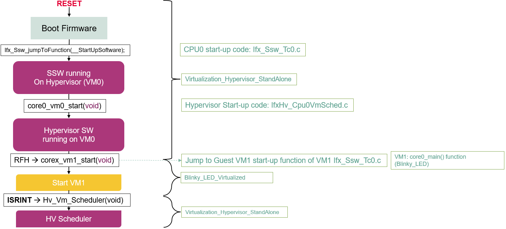 

The same flow also holds good for VM2 which implements the CAN demo project.
 
## Compiling and programming 
Before testing this code example:  
- Power the board through the dedicated power connector 
- Connect the board to the PC through the USB interface
- Import into the ADS workspace the projects: *iLLD_TC4D7_LK_ADS_Blinky_LED_Virtualized* and *iLLD_TC4D7_LK_ADS_CAN_Loop_Back_Mode_Virtualized* as shown in the Figure below
 
     

- Build the 3 projects reported in Figure above separately so obtaining 3 different ELF/HEX output binary files. Build each selected project by using the dedicated Build button  or by right-clicking the project name and selecting "Build Project".

- Flash the 3 ELF/HEX files in the following order:

    - iLLD_TC4D7_LK_ADS_Virtualization_Hypervisor.hex
    - iLLD_TC4D7_LK_ADS_Blinky_LED_Virtualized.hex
    - iLLD_TC4D7_LK_ADS_CAN_Loop_Back_Mode_Virtualized.hex

 
 **Note 1**: In order to flash the device please select in order as "active project" each above projects and then click on Aurix Flasher button 
 
 **Note 2**: In order debug each single project, for each active project click on the Debug button  and create a configuration for a debugger (double clicking on the debugger name, a default configuration is created)
 
 **Note 3**: Due to a limitation of ADS debugger tool, only symbols of each project could be downloaded and debugged separetly. So for debugging by using symbols of all 3 projects (i.e. VM1, VM2 and HV) please use an external debugger that allows project symbols from multiple-ELF files to be loaded and debugged. In below section we have used an external debugger to show you the results.   
 
 **Note 4**: Hosted ADS projects *iLLD_TC4D7_LK_ADS_Blinky_LED_Virtualized* and *iLLD_TC4D7_LK_ADS_CAN_Loop_Back_Mode_Virtualized* must be compiled by configuring each project to be executed as hosted Virtual machines. Pleae set LCF_VM1_SEPARATE_BINARY and LCF_VM2_SEPARATE_BINARY to 1 in *Lcf_Gcc_Tricore_Tc.lsl* and then compile separetly.
 
## Run and Test   
After flashing all 3 projects listed into the previous section and then providing a Power on Reset (PORST), the LEDs status on the board appears as shown in the image below:

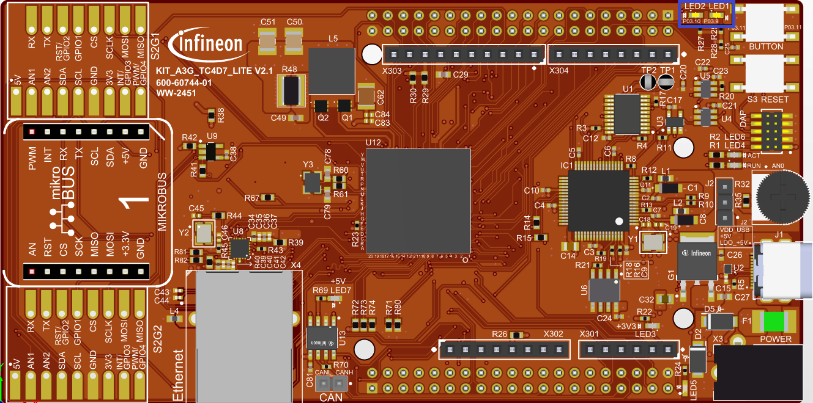  

 - LED P03.9 is toggling means that guest CPU0 VM1 has been properly scheduled by HV and the **Blinky_LED** application is actually toggling the LED.
 - LED P03.10 is toggling means that guest CPU0 VM2 has been properly scheduled by HV and the **CAN_Loop_Back** application has transmitted/received a message
 

**Note**: Above LED activations have been obtained by configuring the Scheduler with *IFX_CFG_HV0_TIME_BASED_SCHD* set to 0 and setting the HV activation counters *IFX_CFG_HV_ACTIVATION_VMx* to *0xFFFFFF* for each VMx.
          *IFX_CFG_HV_ACTIVATION_VMx* is defined in file *Ifx_Cfg.h* and sets the wait counter used by each VMx before invoking the HV. 

By using a debugger it is possible to watch the following global counters for each VM:

   - *tc<X>vm<Y>main_ctr* : this counter counts the number of activations of the main function running on *Core<X>* and *VM<Y>*
  
   - *tc<X>_vm<Y>_scheduler_ctr* : this counter counts the number of activations of the main function running on *Core<X>* and *VM<Y>* needed before invoking the HVCALL function (with scheduler configured as Counter-based mode) 
  
   - *tc<X>_vm<Y>_isr_ctr* : this counter counts the number of interrupts received by *Core<X>* and *VM<Y>* (with scheduler configured as Timer-interrupt mode)

**Variable watch from external Debugger (Hosting Blinky & CAN as guest VMs)**

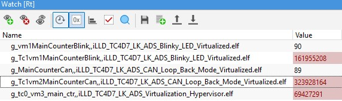 

## Procedure for "Hypervisor All-In-One" mode

## Hardware setup  
This code example has been developed for the TC4D7XP_A-Step_CC_COM (KIT_A3G_TC4D7_LITE). Similar to "Hypervisore Stand-Alone mode".

## Implementation
Each AURIX&trade; TC4xx CPU supports 8 VMs (including the Hypervisor running on VM0). This Hypervisor code example can be used as a starting point by the user to implement different applications in each of these VMs. Below description should help the user in implementing a VM.

**Note**: The design details of the Hypervisor SW itself is beyond the scope of this code example documentation. It is assumed that the user knows, or has access to the TC4xx HW technical user manual, including the TC1.8 Architecture Manual Vol1, to understand the details in which Hypervisor is implemented. It is not expected that the user modifies the Hypervisor SW itself.

**Note**: The code example builds all VMs together, which may not be an industry practice. Such enhanced features (e.g. multi-ELF support) are not targeted as part of this code example.

**1) Configuring VM scheduling in the Hypervisor** 

The code example implements a round-robin logic to schedule the VMs on a CPU core, as shown in the figure below (file: *IfxHv_Cpu0VmSched.c*)

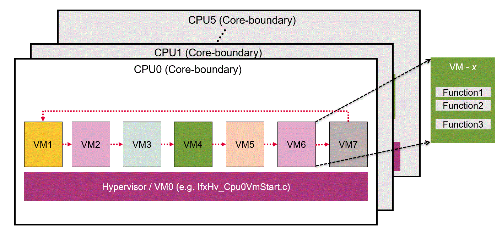

The scheduling logic is provided with 2 options for context switch:

- Counter based: Context switch based on HVCALL CPU instruction to invoke Hypervisor (e.g. *IFX_CFG_HV0_TIME_BASED_SCHD* set to 0) after some counts (e.g. *HV_SCHEDULER_ACTIVATION_THS_VM1*)
- Timer-interrupt based: Context switch based on timer-interrupt to Hypervisor (e.g. *IFX_CFG_HV0_TIME_BASED_SCHD* set to 1)
- This configuration is defined individually for each CPU

**Note**: The code example is provided with counter based scheduling option. The timer based scheduling needs further validation, but the code is included for the user in advance

**2) Configuring a VM (i.e. implementing application code in a VM)**

- User can implement application in each file named as: *CpuZ_Main_VmY.c*, where Z is the CPU core number, and Y is the VM on that CPU core. E.g. *Cpu0_Main_Vm1.c* implements a while(1)-loop in which the user can implement functions to run in CPU0 VM1
    - in case of counter based switching: VM application code must be inserted inside the while(1)-loop **before** calling *Ifx__hvcall()* API
    - in case of timer-interrupt based switching: VM application code must be inserted inside the while(1)-loop
- The user can combine multiple VMs of each CPU to form a bigger application

**Note**: The user can also start an OS-scheduler as part of the application code. If it is a multi-core OS, then VMs across different CPUs can also be combined to form a multi-core multi-VM application.

**3) Initializing the application in a VM**

Upon a power-on-reset, the control enters Hypervisor (VM0), from where the other VMs are scheduled.

There is no specific initialization routine for each VM provided by the demonstrator, however the user can implement initialization routines ensuring that they run only once by appropriate means.

E.g. in function *core0_vm1_main()*, the code portion that appears before the while(1)-loop is executed only once, hence the VM initialization code can be inserted here.

**4) Configuring L2-MPU protection to a VM**

For configuring the L2-MPU protection, the Hypervisor uses a very basic configuration as follows:

- PRS0 (Protection Set 0) is used by hypervisor (VM0) and associated trap locations
- PRS1 is used by VM1
- PRS2 is used by VM2
- PRS3 is used by VM3
- PRS4 is used by VM4
- PRS5 is used by VM5
- PRS6 is used by VM6
- PRS7 is used by VM7

Naturally, L2 MPU must be implemented for each CPU core. Hence for details on the memory partitioning for data (read/write) and code (execute) access, please refer to the function *core_vm0_start()* in file *IfxHv_Cpu0VmSched.c* for the VMs scheduled in CPU0.

**Note**: L1-MPU protection is done within a VM and the code example does not set any L1-MPU registers.
      
    
**5) Configuring Access Protection (PROT/APU) for a VM**
 
Configuration of PROT/APU is very specific to the application and the resources it access during run-time.  
This code example only provides necessary hints to where in the execution such protection can be configured, however it does not implement any elaborate protection schemes.

Normally, the Hypervisor sets protection for all HW resources using PROT/APUs because the VM information during resource access is available on the interconnect. This code example however does not take any specific action to program the PROT/APU resources to partition HW resources to individual VMs. The user can implement such protection mechanisms in Hypervisor startup code *core_vmZ_start()* e.g. *core_vm0_start()* for CPU0, before the first VM (i.e. VM1) is started.

**Note**: PROT/APU access for CPU resources (e.g. core specific SFRs, DSPRs, DLMUs, etc.) are configured in *Ifx_Ssw_AP_Init()*. The code example provides no strict protection (i.e. all CPU VM's are allowed to access all the CPU resources).

**6) Configuring interrupts to a VM**

In AURIX&trade; TC4xx the interrupt mechanism is enhanced to support Virtualization (for details refer the AURIX&trade; TC4xx User's Manual):
* interrupts routed directly to VMs are possible (with AURIX&trade; TC4xx, the Interrupt Router Service Request Control Register (SRC) supports a VM bit-field (in addition to the TOS bit-field) in which the user can set the VM (of the CPU) to which the interrupt must be routed) 
* Base Interrupt Vector table pointer register (BIV) is replicated for each HR-set

The BIV for each VM is initialized with appropriate address by the Hypervisor before starting the VM itself. The vector table base addresses are defined in the linker script file.

E.g. BIV for CPU0 VM0 (i.e. the Hypervisor) is defined in the linker file as *LCF_INTVEC00_START*, BIV for CPU0 VM1 is defined as *LCF_INTVEC01_START*, etc.

Furthermore, this means that the ISR functions must be linked to the correct offsets from these base addresses.  
E.g. all ISR's for CPU0 VM1 must be allocated at appropriate offsets based on priority starting from *LCF_INTVEC01_START*. This is ensured by using the C-Macro *IFX_INTERRUPT()* available in iLLD file *CompilerTasking.h*.

**Alternative method for linking ISR's to different VM's** 

When the Hypervisor and all VMs are built together as a single project, the normally used macro *IFX_INTERRUPT()* can not be used because each VM gets its own vector table. For this reason, this project defines a new macro defined as *IFX_INTERRUPT_VM()* to configure ISRs to a VM. The new macro uses the following arguments: the vector table number (*vectabNum*), the virtual machine index (*vm*) and the priority interrupt (*prio*) (more details have been reported into the note below).  

The linker interrupt address section is calculated by the linker using input *vectabNum*, *vm* and *prio* as *inttab<vectabNum>.vm<vm>.intvec.<prio>*.

E.g. In *IFX_INTERRUPT_VM(Cpu0_Vm7_Isr, CPU0, VM7, IFX_VM7_ISR_PRIORITY)* the argument *vectabNum* is *CPU0 = 0* and the argument *vm* is *VM7 = 7* and the argument *prio* is *IFX_VM7_ISR_PRIORITY = 2*, therefore the ISR *Cpu0_Vm7_Isr()* is allocated for CPU0 VM7 in section *inttab0.vm7.intvec.002*, which corresponds to the linker address definition *(INTTAB07)+<offset-address>* = *(0x803FE000)+0x40* = *0x803FE040*.  

It should be noted that this project builds the source code of all VMs to a single ELF file, hence such an alternative method was needed. However, this may not be the case for real applications where the VMs are built as separate binary files in different build environments. Their integration with the Hypervisor needs then to follow a different method that is generally described by the Hypervisor SW vendors.
 
**Note**

Following new macros have been defined to accept 4 arguments for setting an interrupt *isr*, a virtual machine *vm* belonging, a core *cpu*, and a selected priority *prio*: 

- *#define IFX_INTERRUPT_VM(isr, cpu, vm, prio) IFX_INTERRUPT_VM_INTERNAL(isr, cpu, vm, prio)*: this macro could be used for any internal interrupt definition with target virtual machine   

- *#define IFX_INTERRUPT_VM_RFH(isr, cpu, vm, prio) IFX_INTERRUPT_VM_RFH_INTERNAL(isr, cpu, vm, prio)*: this macro could be used for the internal Hypervisor definition, it handles properly the interrupt epilog in case the interrupt is generated during Hypervisor execution with target the Hypervisor itself (used *RFE* as last instruction) or if the interrupt is triggered externally by Hypervisor and it is needed to return back to a virtual machine (used *RFH* as last instruction)     

In order to use above macros with TASKING compiler, following qualifiers have been used: 
- *#define IFX_INTERRUPT_VM_INTERNAL(isr, cpu, vm, prio) void __vm(vm)__interrupt(prio) __vector_table(cpu) isr(void)*
- *#define IFX_INTERRUPT_VM_RFH_INTERNAL(isr, cpu, vm, prio) void __hvinterrupt(prio) __vector_table(cpu) isr(void)* 

** STM interrupt to VMs example **

As a special case, this project provides an example where the user can enable/disable STM interrupts to each VM using a specific *#define*.  
e.g. *IFX_CFG_TC0_VM1_INT* enables the STM interrupt to CPU0, VM1.

To enable interrupts to non-running VMs, a preemptive Hypervisor scheduler is also implemented by function *Hv_Vm_PreEmptionScheduler()*.

**7) Addendum: **

** Notes on Linker Script file configuration** 

A specific linker file (*Lcf_Tasking_Tricore_Tc_HvDemo.lsl*) has been created for defining a possible memory layout suitable for handling all VMs. 
 
This code example only supports CPU0 as the default host for all the global variables (see figure below).

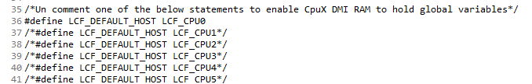  

The linker file is organized to handle the memory definitions separately for all VMs and all Cores. The used notation considers reference to both the CORE_X (X = 0, ..., 5) and VM_Y (Y = 0, ...,7).

The following definitions are used in the file:
    
   - *#define LCF_CSAXY_SIZE*
   - *#define LCF_USTACKXY_SIZE*
   - *#define LCF_ISTACKXY_SIZE*
   - *#define LCF_DSPRXY_START*
   - *#define LCF_DSPRXY_SIZE *
   - *#define LCF_CSAXY_OFFSET*
   - *#define LCF_ISTACKXY_OFFSET*
   - *#define LCF_USTACKXY_OFFSET*
   - *#define LCF_HVTRAPVECX0*
   - *#define LCF_INTVECXY_START*
   - *#define LCF_TRAPVECXY_START*
   - *#define LCF_STARTPTR_CPUXY*
   - *#define INTTABXY*
   - *#define TRAPTABXY*
   - *#define TRAPTABHV_CPUX0*
    
and the following Memory Sections are defined and used by each cores and VM:
    
   - *memory dsramXY*
   - *memory psramXY*
   - *memory pflsXY*

The memory partitioning for each VM is proposed as follows in the linker file:  

 - The Context Switch Area (CSA), User Stack (USTACK) and Interrupt Stack (ISTACK) sizes are 

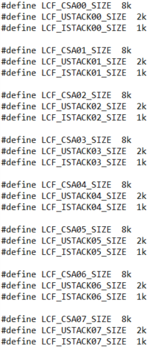

 - The start-up code allocation is 

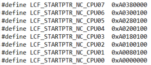

 - The DSPR allocation is 

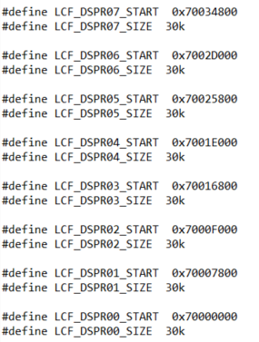

 - The CSA allocation is 

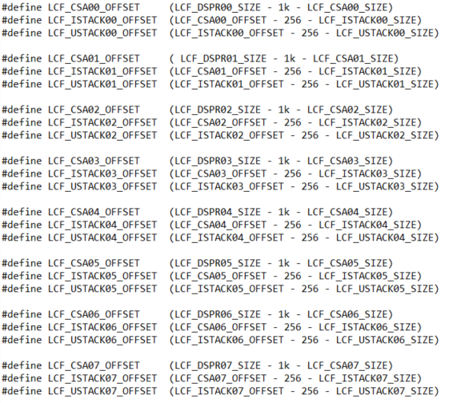  

 - The Interrupt Table allocation is 

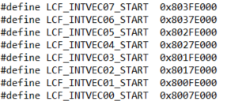 

 - The TRAP Table allocation is 

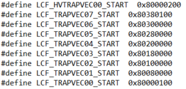 

 - The Heap allocation is 

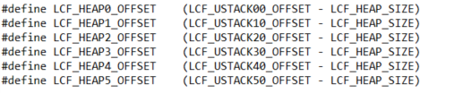 

**Note**: There is a dependency between the linker file definition and the Hypervisor SW execution. Therefore, if the linker file needs to be modified, it must be aligned with the Hypervisor SW.

Figure below describes the conceptual memory partition split needed to separate memory usage for each Virtual Machines:  

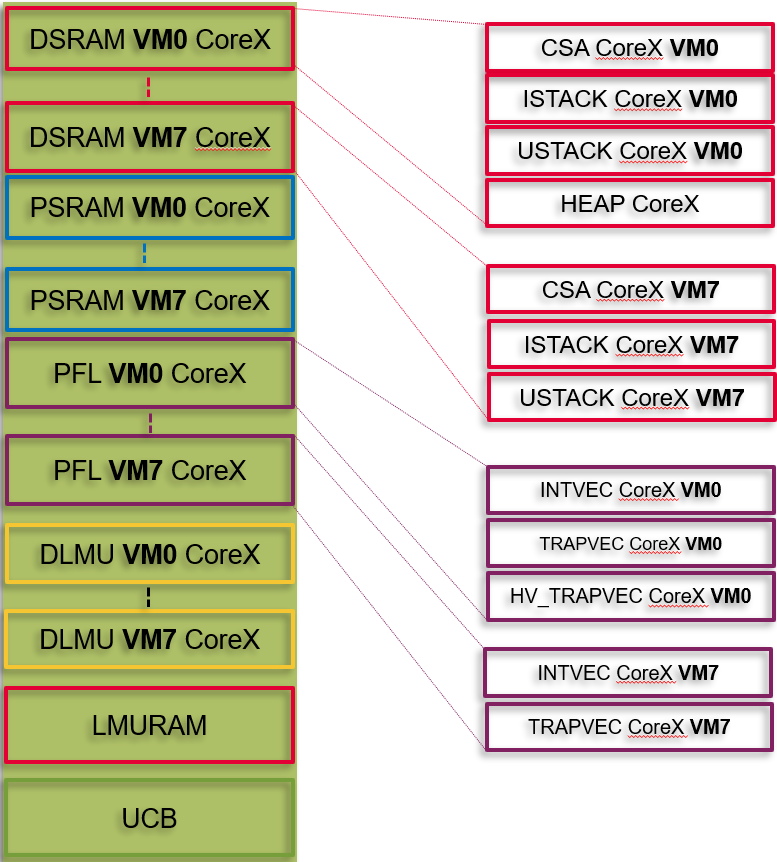 

** Notes on iLLD modifications **  
This project is based on the original version of iLLD 2.3.0  
However following files have been adapted for supporting virtualization features:

 - Libraries/Infra/Platform/Tricore/Compilers/CompilerGhs.h
 - Libraries/Infra/Platform/Tricore/Compilers/CompilerHighTec.h
 - Libraries/Infra/Platform/Tricore/Compilers/CompilerTasking.h
 - Libraries/Infra/Ssw/TC4DA/Tricore/Ifx_Ssw_CompilersGhs.h
 - Libraries/Infra/Ssw/TC4DA/Tricore/Ifx_Ssw_CompilersGnuc.h
 - Libraries/Infra/Ssw/TC4DA/Tricore/Ifx_Ssw_CompilersHighTec.h
 - Libraries/Infra/Ssw/TC4DA/Tricore/Ifx_Ssw_CompilersTasking.h
 - Libraries/Infra/Ssw/TC4DA/Tricore/Ifx_Ssw_IntrinsicsTasking.h
 - Libraries/Infra/Ssw/TC4DA/Tricore/Ifx_Ssw_Infra.h
 - Libraries/Infra/Ssw/TC4DA/Tricore/Ifx_Ssw_Tc0.c
 - Libraries/Infra/Ssw/TC4DA/Tricore/Ifx_Ssw_Tc1.c
 - Libraries/Infra/Ssw/TC4DA/Tricore/Ifx_Ssw_Tc2.c
 - Libraries/Infra/Ssw/TC4DA/Tricore/Ifx_Ssw_Tc3.c
 - Libraries/Infra/Ssw/TC4DA/Tricore/Ifx_Ssw_Tc4.c
 - Libraries/Infra/Ssw/TC4DA/Tricore/Ifx_Ssw_Tc5.c   
  
 
## Compiling and programming
Before testing this code example:  
- Power the board through the dedicated power connector 
- Connect the board to the PC through the USB interface
- Build the project using the dedicated Build button  or by right-clicking the project name and selecting "Build Project"
- To flash the device and start a debug session, click on the Debug button  and create a configuration for a debugger (double clicking on the debugger name, a default configuration is created)
- Build the 3 projects reported in Figure above separately so obtaining 3 different ELF/HEX output binary files. Build each selected project by using the dedicated Build button  or by right-clicking the project name and selecting "Build Project".

- Flash the 3 ELF/HEX files not together as it works as three different independent projects:

    - iLLD_TC4D7_LK_ADS_Virtualization_Hypervisor.hex
    - iLLD_TC4D7_LK_ADS_Blinky_LED_Virtualized.hex
    - iLLD_TC4D7_LK_ADS_CAN_Loop_Back_Mode_Virtualized.hex

## Run and Test   
After code compilation and flashing the device, providing a PORST the LEDs blink status on the board appears as shown in the image below:

  

 - LED P03.9 appears ON means that CPU0 VM1 has been properly scheduled by HV
 - LED P03.10 appears ON means that CPU0 VM2 has been properly scheduled by HV
 

**Note**: Above LED activations have been obtained by configuring the Scheduler with *IFX_CFG_HV0_TIME_BASED_SCHD* set to 0 and setting the HV activation counters *IFX_CFG_HV_ACTIVATION_VMx* to *0xFFFFFF* for each VMx.
          *IFX_CFG_HV_ACTIVATION_VMx* is defined in file *Ifx_Cfg.h* and sets the wait counter used by each VMx before invoking the HV. 

By using a debugger it is possible to watch the following global counters for each VM:

   - *tc<X>vm<Y>main_ctr* : this counter counts the number of activations of the main function running on *Core<X>* and *VM<Y>*
  
   - *tc<X>_vm<Y>_scheduler_ctr* : this counter counts the number of activations of the main function running on *Core<X>* and *VM<Y>* needed before invoking the HVCALL function (with scheduler configured as Counter-based mode) 
  
   - *tc<X>_vm<Y>_isr_ctr* : this counter counts the number of interrupts received by *Core<X>* and *VM<Y>* (with scheduler configured as Timer-interrupt mode) 

## References  

AURIX™ Development Studio is available online:  
- <https://www.infineon.com/aurixdevelopmentstudio>  
- Use the "Import..." function to get access to more code examples  

More code examples can be found on the GIT repository:  
- <https://github.com/Infineon/AURIX_code_examples>  

For additional trainings, visit our webpage:  
- <https://www.infineon.com/aurix-expert-training>  

For questions and support, use the AURIX™ Forum:  
- <https://community.infineon.com/t5/AURIX/bd-p/AURIX>  

