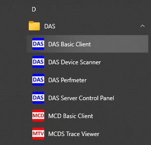
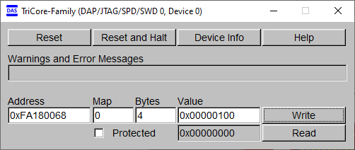

  

# iLLD_TC4D7_LK_ADS_Watchdog  
**The watchdog is serviced with correct password in order to prevent a reset.**  

## Device  
The device used in this example is AURIX&trade; TC4D7XP_A-Step_CC_COM 

## Board  
The board used for testing is the AURIX&trade; TC4D7XP_A-Step_CC_COM (KIT_A3G_TC4D7_LITE)

## Scope of work   
This example shows how to initialize and service the CPU0 Watchdog.  
The Watchdog is configured to trigger a reset after approximately 1.3s if not serviced.  
Pressing the on-board button stops the Watchdog from being serviced by the CPU, which then resets the device when the Watchdog timer expires.   
This example also shows how to implement logical monitoring using or without using automatic password sequencing provided by WDT. In this case if a button is pressed a wrong password is provided to WDT which then resets the device.  

## Introduction
This project is made modifying the original project "iLLD_TC4D9_ADS_Watchdog".  

Watchdog Timer Unit (WTU) provides several independent watchdog timers (WDTs). The main system use of the WDT functions is Program Flow Monitoring (PFM), tracking if the software is executing in the right order and is not stuck in a specific operation.  

The WTU consists of Universal Bus Slave (UBS) on the SPB FPI interface and a total of 8 independent Watchdog Timer (WDT) modules:  
- WDTCPU0-5: One watchdog timer per lock-stepped CPU (6 total)
- WDTSEC: One watchdog timer for CSRM security CPU (1 total)
- WDTSYS: One system watchdog timer (1 total)

The individual CPU watchdog timer functions (WDTCPU0-5) provide the ability to monitor separate CPU execution threads without the need for software to coordinate the shared use of a common system watchdog.  
Each CPU WDT (WDTCPU0-5) has separate SMU alarm signaling, and reaction to each is configurable within the SMU.

Security watchdog timer (WDTSEC) is designated to monitor temporal and logical code execution for CSRM security CPU (CPUcs).  

The system WDT (WDTSYS) is not fixed to a certain CPU, application reset disables the WDTSYS, but during Boot-FW it gets enabled in normal mode.  

**Add on feature for better testability**

When compared to the original project, additional code is provided to implement logical monitoring using WDT passwords.

## Hardware setup  
This code example has been developed for the board AURIX&trade; TC4D7XP_A-Step_CC_COM (KIT_A3G_TC4D7_LITE).
 
/>  

## Implementation  
**Initialization of the CPU0 Watchdog**  
The configuration of the CPU0 Watchdog is done inside the function *initWatchdog()*, declared in the *Watchdog.h* header file.  
an instance of the *IfxWtu_Config* structure is firstly initialized with default values with the function *IfxWtu_initConfig()*, then the following parameter is modified:
- *reload*: to set the value with which the timer is reset when the Watchdog is serviced

Finally, the configuration is applied via the function *IfxWtu_initCpuWatchdog()*.  
The functions used to initialize the WTU can be found in the iLLD header *IfxWtu.h*.    
If AUTOMATIC_PASSWORD_SEQUENCING==1, the function initWatchdog() also enable automatic password sequencing.

**Watchdog timeout calculation**  
To calculate the CPU0 Watchdog timeout, the following formula can be used:  

    timeout ~(0xFFFF - REL) / (fSPB/ WDTCPU0_STAT.IFS ) = (0xFFFF - 0xE000) / (100 MHz / 16384)

**Note**: the value 16384 depends on the configuration of the CPU0 Watchdog STAT register.  

**Service the CPU0 Watchdog**  
The CPU0 Watchdog is serviced inside the *while(1)* loop in the *Cpu0_Main.c* file with the function *IfxWtu_serviceCpuWatchdog()*.  
Servicing the Watchdog replaces the *TIM* bitfield value of the CPU related *STAT* register with the reload value that has been set during initialization.

**Initialization of the port pins**  
The function *initGPIOs()* configures two port pins to control two LEDs and one port pin to check the button's state.
- The port pins with the connected LEDs are configured to push-pull output by calling the function *IfxPort_setPinMode()* with the function parameter *IfxPort_Mode_outputPushPullGeneral* (enumerated type value)
- The port pin connected to the push button is set to input direction with an internal weak pull-up by calling *IfxPort_setPinMode()* with the function parameter *IfxPort_Mode_inputPullUp*   

**Controlling the LED**  
- The button's port pin state is read by calling the function *IfxPort_getPinState()*
- The LEDs port pins are set to low or high by using the functions *IfxPort_setPinLow()* / *IfxPort_setPinHigh()* / *IfxPort_togglePin()*  

The functions used to initialize and control the port pins are provided by the iLLD header *IfxPort.h*. 

**Automatic password sequencing** 

  
If AUTOMATIC_PASSWORD_SEQUENCING==1 automatic function sequencing provided by WDT is enabled and the code shows how to use this feature to implement logical monitoring. In Cpu0_Main.c, after WDT initialization, are computed all passwords used to access WDT in while loop.  These passwords are saved in the correct order in wdt_pwd_table. Each password is computed with function *IfxWtu_calculateLfsr()*.  
After password table creation there is a first service of WDT using wdt_password_table[0]. After this service the correct password becomes wdt_password_table[1] by hardware.

In while Loop is checked the button state, if pressed the variable "jump_code" becomes TRUE. Then:    

- * IfxWtu_changeCpuWatchdogReload(wdt_pwd_table[1],IfxWtu_getCpuWatchdogTim())* changes the value of CTRLB.TIMR  with the current value of STAT.TIM
- *IfxWtu_serviceCpuWatchdog(wdt_pwd_table[2])* services the WDT using the correct password. Because of the previous reload this is not a real service.
- *IfxPort_togglePin(LED1)* Changes the status of the LED P03.9 (LED1).

The three instructions above are repeated three times.  
The third time REL_VAL is reloaded to perform real service for temporal monitoring. Also password is changed to restart with the first value.      
If the button is pressed, the second time is not executed. So the next Reload is performed giving the wrong password to WDT resulting in alarm to SMU.  

 **Manual password sequencing** 
 
 if MANUAL_PASSWORD_SEQUENCING==1 logical monitoring is performed without using  automatic function sequencing provided by WDT.     
 In while Loop is checked the button state, if pressed the variable "jump_code" becomes TRUE. Then:    
 - *IfxWtu_changeCpuWatchdogPassword(IfxWtu_getCpuWatchdogPassword(),0xA0)* change the current password with 0xA0
 - *IfxPort_togglePin(LED1)* Changes the status of the LED P03.10 (LED2).
- *IfxWtu_changeCpuWatchdogReload(0xA0,IfxWtu_getCpuWatchdogTim())* changes the value of CTRLB.TIMR  with the current value of STAT.TIM.
- *IfxWtu_serviceCpuWatchdog(0xA0)* services the watchdog giving correct password. Because of the previous reload this is not a real service.    

The four instructions above are repeated four times.  
The last time REL_VAL is reloaded to perform real service for temporal monitoring.
If the button is pressed, the second time is not executed. So the next Reload is performed giving the wrong password to WDT resulting in alarm to SMU.  

**Modifications to project files to implement logical monitoring in (and to virtualize) the original Watchdog_1_KIT_TC499_STD_TRB project**

Following changes shall be performed to implement logical monitoring: 

<table class="tg">
<thead>
  <tr>
    <th class="tg-qvuz">#</th>
    <th class="tg-qvuz">File</th>
    <th class="tg-qvuz">Change</th>
    <th class="tg-qvuz">Reason</th>
  </tr>
</thead>
<tbody>
  <tr>
    <td class="tg-0thz">1</td>
    <td class="tg-za14"><i>Watchdog.h</i></td>
    <td class="tg-za14">Added configuration symbol <i>AUTOMATIC_PASSWORD_SEQUENCING</i></td>
    <td class="tg-za14">This configuration symbol is used to implement logical monitoring using  automatic password sequencing 15-bit Fibonacci LFSR provided by WDT. </td>
  </tr>
    <tr>
    <td class="tg-0thz">2</td>
    <td class="tg-za14"><i>Watchdog.h</i></td>
    <td class="tg-za14">Added configuration symbol <i>MANUAL_PASSWORD_SEQUENCING </i></td>
    <td class="tg-za14">This configuration symbol is used to implement logical monitoring WITHOUT using  automatic password sequencing 15-bit Fibonacci LFSR provided by WDT. </td>
  </tr>
    </tr>
    <tr>
    <td class="tg-0thz">3</td>
    <td class="tg-za14"><i>Watchdog.c</i></td>
    <td class="tg-za14"> Modified function <i> initWatchdog </i> adding line <i> conf.enableAutomaticPasswordChange=TRUE;</i></td>
    <td class="tg-za14">This modification is needed to enable automatic password sequencing in WDT. </td>
  </tr>
</tbody>
</table>
  

## Compiling and programming
Before testing this code example:  
- Power the board through the dedicated power connector 
- Connect the board to the PC through the USB interface
- Build the project using the dedicated Build button  or by right-clicking the project name and selecting "Build Project"
- To flash the device and immediately run the program, click on the dedicated Flash button   

## Run and Test   
After code compilation and flashing the device, the LED on P03.9 (LED1) starts blinking very fast.  

Since the On-Chip Debug System (OCDS) is enabled by default via the user configuration of the device, it needs to be disabled to start the Watchdog.  
To disable the OCDS, open a DAS Basic Client window and connect the device.  

  

Then, write the value *0x00000100* on the *CBS_OEC* register (write 1 on the *DS* bitfield of the register, used to disable the OCDS), at the address *0xFA180068*.  

  

After writing the *CBS_OEC* register, the OCDS gets disabled and the CPU0 Watchdog starts running (the OCDS is re-enabled after a PORST reset).  

Pressing the button P03.11 on the board (BUTTON) turns on the LED on P03.10 (LED2) and prevents the CPU0 from servicing its Watchdog, which then resets the device after approximately 1.3 seconds. When the device is reset, the RST LED on the board (LED5) turns on for a very brief moment, the program is restarted and LED on P03.9 (LED1) starts blinking very fast again. Pressing the button P03.11 on the board (BUTTON) a second time turns on the LED on P03.10 (LED2) and prevents the CPU0 from servicing its Watchdog, which then resets the device after approximately 1.3 seconds. When the device is reset, the RST LED on the board (LED5) turns on and remain on.

  

**Note**: while the OCDS is enabled, servicing the CPU Watchdog does not have any effect, therefore its timer is not updated with the new reload value. For this reason, when the OCDS is disabled via DAS, the CPU has less than a millisecond to service the Watchdog before reaching the timeout at the first cycle (the Watchdog starts counting up from the reset value: *0xFFFC*).

**Automatic password sequencing** 

For automatic password sequencing, LED on P03.9 (LED1) is used as status LED but P03.10 (LED2) is not used and remains Off. After code compilation and flashing the device, LED on P03.9 (LED1) will start blinking with 80ms interval. The 80ms delay interval is added to easily observe the LEDs status. Pressing the button P03.11 on the board (BUTTON) makes sure CPU0 gives wrong password to Watchdog, which then resets the device instantaneously. When the device is reset, the RST LED on the board (LED5) turns on and remains on.

**Manual password sequencing** 

For automatic password sequencing, LED on P03.10 (LED2) is used as status LED but P03.9 (LED1) is not used and remains Off. After code compilation and flashing the device, LED on P03.10 (LED2) will start blinking with 80ms interval. The 80ms delay interval is added to easily observe the LEDs status. Pressing the button P03.11 on the board (BUTTON) makes sure CPU0 gives wrong password to Watchdog, which then resets the device instantaneously. When the device is reset, the RST LED on the board (LED5) turns on and remains on.

## References  

AURIX&trade; Development Studio is available online:  
- <https://www.infineon.com/aurixdevelopmentstudio>  
- Use the "Import..." function to get access to more code examples  

More code examples can be found on the GIT repository:  
- <https://github.com/Infineon/AURIX_code_examples>  

For additional trainings, visit our webpage:  
- <https://www.infineon.com/aurix-expert-training>  

For questions and support, use the AURIX&trade; Forum:  
- <https://community.infineon.com/t5/AURIX/bd-p/AURIX>  
