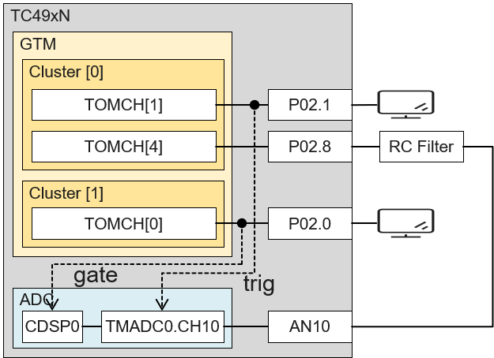

  

# iLLD_TC4D7_LiteKit_ADS_TMADC_CDSP_FC6_Filtering_1

**This example provides the configuration of CDSP with FC6 filter chain to perform Fast Fourier Transform on the given signal at TMADC input.**  

## Device  
The device used in this example is AURIX&trade; TC4D7XP_A-Step_MC_COM    

## Board  
The board used for testing is the AURIX&trade; TC4D7 lite Kit (KIT_A3G_TC4D7_LITE)  

## Scope of work  
To illustrate signal filtering by CDSP for Fast Fourier Transform (FFT), this example connects TMADC and CDSP FC6, where few Signal Patterns are used as input signal and corresponding FFT output is observed.  

## Introduction  
Main Objective of this example is to show the usage of **C**onverter **D**igital **S**ignal **P**rocesser (CDSP). The usecases of such DSPs are to offload the main CPUs from performing the DSP operations on the signals that are converted from ADCs. With the AURIX&trade; TC4x microcontrollers, there are number of CDSPs made available. For TC4Dx devices there are 2 CDSPs. Each of CDSPs could be connected to conversion results of either **T**ime **M**ultiplexed **A**nalog-to-**D**igital **C**onverters (TMADC) or **D**elta-**S**igma **A**nalog-to-**D**igital **C**onverters (DSADC) including **EX**ternal **MOD**ulators (EXMOD). Additionally the CDSPs are also handling the inputs coming from dedicated **G**eneral **P**urpose (GP) registers.
This example is prepared to show the CDSP usage for signal processing towards **F**ast **F**ourier **T**ransform (FFT).

**CDSP Filterchain FC6**  
CDSP Firmware is pre-built executable image, that is loaded on the CDSP Program Memory by the application during initialization. CDSP Firmware supports different filterchains, which are unique combinations of Filter Blocks concatenated to fulfill different application requirements. Please refer to AURIX&trade; TC4xx CDSP Software User Manual for more details.  
FC6 filter chain consists of only FFT block as shown in the picture "Filter-chain FC6" below. This example shows how to use this filterchain.  
 

 
 <figcaption>
<i>Filter-chain FC6</i>
</figcaption>
 

As it is known, FFT blocks are basically used to find the frequency spectrum of the input signal. This example provides possibility to connect either (A) signal with known sinusoidal components or (B) pulsetrain signal as input. Such signals are updated during run with the tool Infineon GUI Designer.  
- When the input is (A) signal with known sinusoidal components, user could configure up to three sinusoidal signals that are superimposed on each other. User could also change the individual frequencies and amplitudes of these components. In this case expected FFT output shall show the spectrum with frequencies and amplitudes of such components.
- When the input is (B) pulsetrain signal, user could configure the frequency of the pulsetrain. The expected FFT shall show the pulsetrain frequency as base and harmonics of the base.

In both cases above, there would be a DC amplitude, which is also reflected in the FFT bin with index 0. 

## Hardware setup  
**Hardware setup overview**  
An input signal pattern is converted by the TMADC. Objective is to demonstrate the CDSP filter chain to perform FFT operation to get the frequency components of the input signal.
The connection is summarized as: GTM.TOM0.CH4 (P02.8) &rarr; RC Filter &rarr; TMADC.CH10 (AN10) &rarr; CDSP0.FC6. As CDSP0 can be connected to either TMADC0.RES0 or TMADC0.RES1, the TMADC is configured to get the conversion from CH10 to RES1.  
Below picture shows the internal setup within microcontroller and external connection together as block diagram with exact microcontroller resources used.
 

 
 <figcaption>
<i>Connection Overview</i>
</figcaption>
 

Below picture "Board Connections" shows Triboard, IO-board, Extra-components and also the connections required to run this demo.   
 

 
 <figcaption>
<i>Board Connections</i>
</figcaption>
 

## Implementation  
Implementation is done basically using **i**nfineon **L**ow **L**evel **D**rivers (iLLD). Therefore most of the register access information is encapsulated under the driver APIs. To understand what is done under the hood of iLLDs, please refer to the iLLD documentation and code sources. ILLDs are static driver libraries and the initialization APIs provide configuration for the application requirements. Following tables provide, not all but, the important configuration values.  

**Configuration Requirements**  
The implementation of Signal Generation using PWM + RC filter is done in the file <mark>PWM_SignalGenerator.c</mark>. As mentioned earlier, in this example, it is possible to change the input either as (A) signal with known three sinusoidal components or (B) pulsetrain signal as input.  
Below table show the configuration to generate the test signal as output of RC filter. The output is switched between (A) sinusoidal or (B) pulsetrain at Infineon GUI Designer.  

<table>
    <tr>
        <td colspan="3"><b>PWM Configurations for Sinusoidal Components</b></td>
    </tr>
    <tr>
        <td rowspan="3"><b>PWM Carrier</b></td>
        <td><b>Frequency</b></td>
        <td>50 kHz</td>
    </tr>
    <tr>
        <td><b>Timer</b></td>
        <td>EGTM.TOM0.CH4</td>
    </tr>
    <tr>
        <td><b>Output Pin</b></td>
        <td>P02.8</td>
    </tr>
    <tr>
        <td rowspan="8"><b>Output Signals at RC Filter</b></td>
        <td rowspan="7"><b>(A) Sinusoidal Signals</b></td>
    </tr>
    <tr>
        <td><b>Base Signal </b></td>
        <td><b>Type</b></td>
        <td>Sinusoidal</td>
    </tr>
    <tr>
        <td></td>
        <td><b>Frequency</b></td>
        <td>200 Hz (user could change)</td>
    </tr>
    <tr>
        <td><b>Signal A</b></td>
        <td><b>Type</b></td>
        <td>Sinusoidal</td>
    </tr>
    <tr>
        <td></td>
        <td><b>Frequency</b></td>
        <td> 400 Hz (user could change)</td>
    </tr>
    <tr>
        <td><b>Signal B</b></td>
        <td><b>Type</b></td>
        <td>Sinusoidal</td>
    </tr>
    <tr>
        <td></td>
        <td><b>Frequency</b></td>
        <td> 800 Hz (user could change)</td>
    </tr>
    <tr>
        <td><b>(B) Pulse Train Signal</b></td>
        <td><b>Frequency</b></td>
        <td>200 Hz (user could change)</td>
    </tr>
</table>

The Configuration of Signal acquisition is done in the file <mark>TMADC_Setup.c</mark>  

<table>
    <tr>
        <td colspan="2"><b>TMADC Configurations</b></td>
    </tr>
    <tr>
        <td><b>TMADC Module</b></td>
        <td>0</td>
    </tr>
    <tr>
        <td><b>Input Pin</b></td>
        <td>AN10</td>
    </tr>
    <tr>
        <td><b>Result Register</b></td>
        <td>RES1</td>
    </tr>
    <tr>
        <td><b>Sample Time</b></td>
        <td>100ns</td>
    </tr>
    <tr>
        <td rowspan="4"><b>Trigger Signal</b></td>
        <td><b>Timer</b></td>
        <td>EGTM.TOM0.CH1</td>
    </tr>
    <tr>
        <td><b>Output Pin (Test)</b></td>
        <td>P02.1</td>
    </tr>
    <tr>
        <td><b>Frequency</b></td>
        <td>10 kHz</td>
    </tr>
    <tr>
        <td><b>Duty</b></td>
        <td>50%</td>
    </tr>
</table>

As mentioned in the above table, AN10 results are directed to RES1 because the CDSP can only accept either RES0 or RES1 as inputs.

The Configuration of Filtering via CDSP Firmware is done in the file <mark>CDSP_Filtering.c</mark>  
In this example following (rather hypothetical) usecase is considered to showcase CDSP SW for **F**ast **F**ourier **T**ransform (FFT) block.  

<table>
    <tr>
        <td><b>CDSP Configurations</b></td>
    </tr>
    <tr>
        <td><b>CDSP Module</b></td>
        <td>0</td>
    </tr>
    <tr>
        <td><b>Input</b></td>
        <td>TMADC0 RES1</td>
    </tr>
    <tr>
        <td><b>Filter-chain</b></td>
        <td>FC6 (FFT)</td>
    </tr>
    <tr>
        <td colspan="2"><b>Fast Fourier Transform Block</b></td>
    </tr>
    <tr>
        <td><b>Number of samples</b></td>
        <td>256</td>
    </tr>
    <tr>
        <td><b>Windowing Technique</b></td>
        <td>Hann Window</td>
    </tr>
    <tr>
        <td rowspan="4"><b>Gate Signal</b></td>
        <td><b>Timer</b></td>
        <td>EGTM.TOM1.CH0</td>
    </tr>
    <tr>
        <td><b>Output Pin (Test)</b></td>
        <td>P02.0</td>
    </tr>
    <tr>
        <td><b>Frequency</b></td>
        <td>35 Hz</td>
    </tr>
    <tr>
        <td><b>Duty</b></td>
        <td>90%</td>
    </tr>
</table>

For the above parameters expected output shall look as below:  

(A) Expected FFT for three sinusoidal components:
 

 
 <figcaption>
<i>Expected FFT for Sinusoidal Signals</i>
</figcaption>
 

 
(B) Expected FFT for Pulsetrain (symmetric with y axis, positive half is shown here) :
 

 
 <figcaption>
<i>Expected FFT for Pulsetrain</i>
</figcaption>
 

CDSP FC6 blocks always waits for configured number of samples, 256 in our example, to be acquired. For 10 kHz TMADC Sampled signals, it takes 25.6 ms. The CDSP gate shall be kept open for this duration as minimum on time. Additionally, FC6 block needs 32241 clocks @160MHz of CDSP clock source, which is 202 uS, where gate signal shall not reopen. Considering safest gate frequency to be 35 Hz and 90% duty to acquire 256 samples, above configurations are considered for TMADC and CDSP.

Below picture shows the timing diagram of the execution and activities:

 

 
 <figcaption>
<i>Timing Diagram of the Complete Process</i>
</figcaption>
 

  

## Compiling and programming
Note: Currently this example is only tested with <mark>GCC Compiler</mark> that is default with ADS. If any other compiler is used this example should work in theory. Please make sure to configure the build configuration for the used compiler.
Connect the board to the PC through the USB interface   
- Build the project using the dedicated Build button  or by right-clicking the project name and selecting "Build Project"  
- To flash the device and immediately run the program, click on the dedicated Flash button   
- Open <mark>CDSP_FFT_Demo.OneEye</mark> to open the GUI for control and view of the demo (Note: Infineon GUI Designer Version 2.72.0 or latest required to open this file)

## Run and Test   
To Run the test make sure that  
- RC filter circuit components are connected as shown in the picture "Board Connections" above  
- OneEye is running and connected to the application

Below picture, from Infineon GUI Designer tool, show the filter in action, for the above parameters is as below:  

(A) Resulting FFT for three sinusoidal components:
 

 
 <figcaption>
<i> FFT Output for Sinusoidal Signals</i>
</figcaption>
 

 
(B) Resulting FFT for Pulsetrain:
 

 
 <figcaption>
<i>FFT Output for Pulsetrain</i>
</figcaption>
 

You could play around the signal using following GUI fields:  

The button at the top show either Sinusoidal or Pulsetrain as it is toggled upon the click. The GUI fields adapt according to the selection of this button. Please note that there is only one button which is morphed to one of the tow modes.  
Below two tables show each options separately.

**(A) Fields for the button option "Sinusoidal"**  

<table>
    <tr>
        <th>Field</td>
        <th>Unit</td>
        <th>Description</td>
        <th>Remark</td>
    </tr>
    <tr>
        <td><b>Base Frequency </b></td>
        <td>Hz</td>
        <td>Frequency of the base signal</td>
        <td>Frequency of the base signal <= 3000 Hz</td>
    </tr>
    <tr>
        <td><b>Signal Amplitude</b></td>
        <td>% Factor</td>
        <td>Amplitude of the signal 0 % is 0 V and 100 % is full amplitude</td>
        <td>% of (Base + Signal A + Signal B + Offset) <= 100 %</td>
    </tr>
    <tr>
        <td><b>Signal A Frequency </b></td>
        <td>Hz</td>
        <td>Frequency of the Signal A</td>
        <td>Frequency of the Signal A <= 3000 Hz</td>
    </tr>
    <tr>
        <td><b>Signal A Amplitude</b></td>
        <td>% Factor</td>
        <td>Amplitude of the signal A 0 % is 0 V and 100 % is full amplitude</td>
        <td>% of (Base + Signal A + Signal B + Offset) <= 100 %</td>
    </tr>
    <tr>
        <td><b>Signal B Frequency </b></td>
        <td>Hz</td>
        <td>Frequency of the Signal B</td>
        <td>Frequency of the Signal B <= 3000 Hz</td>
    </tr>
        <td><b>Signal B Amplitude</b></td>
        <td>% Factor</td>
        <td>Amplitude of the signal B 0 % is 0 V and 100 % is full amplitude</td>
        <td>% of (Base + Signal A + Signal B + Offset) <= 100 %</td>
    </tr>
    <tr>
        <td><b>Signal Offset</b></td>
        <td>% Factor</td>
        <td>Offset of the signals 0 % is 0 V and 100 % is full amplitude</td>
        <td>% of (Signal amplitude + Noise Amplitude) < 100%</td>
    </tr>
</table>  

**(B) Fields for the button option "Pulsetrain"**  

<table>
    <tr>
        <th>Field</td>
        <th>Unit</td>
        <th>Description</td>
        <th>Remark</td>
    </tr>
    <tr>
        <td><b>Pulse Frequency</b></td>
        <td>Hz</td>
        <td>Frequency of the Pulsetrain</td>
        <td>Frequency of the Pulsetrain <= 2000 Hz</td>
    </tr>
</table> 

## References  

AURIX&trade; Development Studio is available online:  
- <https://www.infineon.com/aurixdevelopmentstudio>  
- Use the "Import..." function to get access to more code examples  

More code examples can be found on the GIT repository:  
- <https://github.com/Infineon/AURIX_code_examples>  

For additional trainings, visit our webpage:  
- <https://www.infineon.com/aurix-expert-training>  

For questions and support, use the AURIX&trade; Forum:  
- <https://community.infineon.com/t5/AURIX/bd-p/AURIX>  
