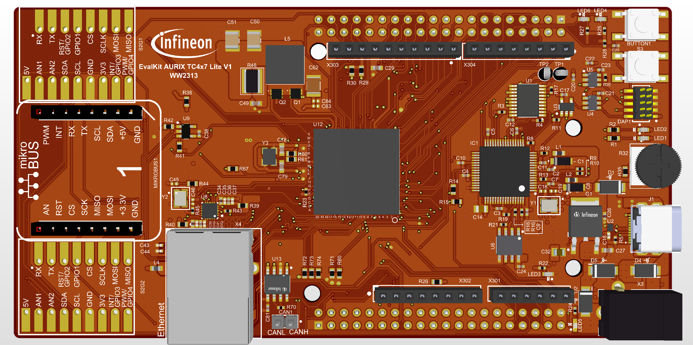

  

# iLLD_TC4D7_lite_kit_ADS_ETH_Demo

**This code example implements an ethernet echo server (raw Ethernet) using GETH port 0.**

## Device  
The device used in this example is TC4D7XP_A-Step_CC_COM.

## Board  
The board used for testing is the AURIX™ TC4D7 lite Kit (KIT_A3G_TC4D7_LITE).

## Scope of work  
This code example implements an ethernet echo server replying to Layer 2 packets. The demo configures GETH module using DMA Channel 0 and Tx/Rx Queues 0.

## Introduction  

The GETH DMA (Direct Memory Access) is a peripheral that allows for efficient data transfer between the GETH module and the system memory. The GETH DMA is responsible for transferring data packets between the GETH module and the system memory, without the need for CPU intervention.
The GETH DMA supports the following features:
    - Scatter-gather DMA: allows for efficient data transfer between non-contiguous memory regions
    - Descriptor-based DMA: allows for flexible and efficient data transfer using DMA descriptors
    - Interrupt and error handling: allows for efficient handling of DMA-related interrupts and errors

The GETH MAC (Media Access Controller) layer is a part of the GETH module that provides the interface to the Ethernet physical layer (PHY). The MAC layer is responsible for managing the data transfer between the GETH module and the Ethernet network.
The GETH MAC layer supports the following features:
    - IEEE 802.3 compliant MAC
    - Full-duplex and half-duplex operation
    - VLAN (Virtual Local Area Network) support
    - QoS (Quality of Service) support
    - Error detection and correction

## Hardware setup  
  

## Implementation  

1. Initialization of resources
    - BOARD_USER_LED_1 turned off
    - Serial communication interface using 8N1 115200
    - HSPHY port 0 configuration
    - MDIO initialization
    - PHY initialization
    
2. GETH configuration
    - Enable Tx/Rx Queue 0 
        - 4kB queue size
    - Enable Tx/Rx DMA Channel 0
        - 1528B buffer size
        - 8 descriptors per channel
    - Enable interruptions for Tx/Rx
    - Configure the bridge in single port mode
    
3. Configure STM module

4. It goes into an infinite loop in which 
    - every LED_TOGGLE_MS
        - It toggles the BOARD_USER_LED_1
        - It checks the phy link status and configures the link speed
    - if there are any descriptors own by the application,
        - sends back a copy of the packet
        - shuffles Tx and Rx descriptors

## Compiling and programming
Before testing this code example:  
- Power the board through the dedicated power connector 
- Connect the board to the PC through the USB interface
- Open a serial terminal inside the AURIX&trade; Development Studio using the following icon:  

    

  The serial terminal must be configured with the following parameters to enable the communication between the board and the PC:
    - Serial port: Select the COM port assigned to your hardware
    - Speed (baud): 115200
    - Data bits: 8
    - Stop bit: 1

- Build the project using the dedicated Build button  or by right-clicking the project name and selecting "Build Project"
- To flash the device and immediately run the program, click on the dedicated Flash button   
- To flash the device and start a debug session, click on the Debug button  and create a configuration for a debugger (double clicking on the debugger name, a default configuration is created)

## Run and Test   

To validate the code example send any packet with destination MAC Address 00:03:19:00:00:00 to the target device and it will simply reply to it.
You can use tools like [scapy](https://scapy.readthedocs.io/en/latest/usage.html). Alternatively, In Wireshark [wiki](https://gitlab.com/wireshark/wireshark/-/wikis/Tools#traffic-generators) there are several tools mentioned for traffic generators. You can use any to replay the pcap available in the folder *Data*.

## References  

AURIX&trade; Development Studio is available online:  
- <https://www.infineon.com/aurixdevelopmentstudio>  
- Use the "Import..." function to get access to more code examples  

More code examples can be found on the GIT repository:  
- <https://github.com/Infineon/AURIX_code_examples>  

For additional trainings, visit our webpage:  
- <https://www.infineon.com/aurix-expert-training>  

For questions and support, use the AURIX&trade; Forum:  
- <https://community.infineon.com/t5/AURIX/bd-p/AURIX>  
