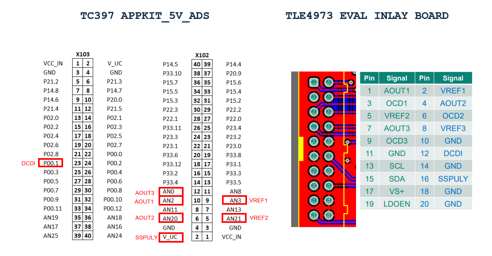
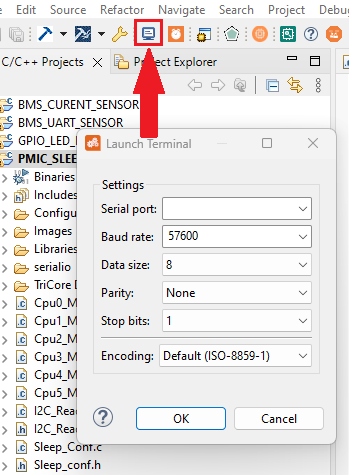
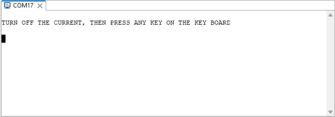
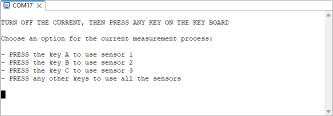
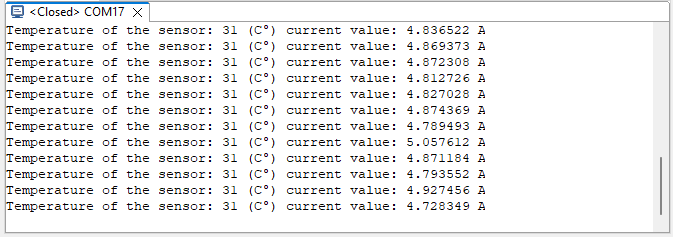

  

# iLLD_tc397_APPKIT_5V_ADS_TLE4973_Current_Sensor

**This code example provides a user interface for current measurement using the TLE4973 EVALUATION BOARD**  

## Device 
The device used in this example is AURIX&trade; TC39xXX_B-Step

## Board  

The board used for testing is the APPLICATION KIT TC3x7 V2.0 (KIT_A2G_TC397_5V_TFT)

## Scope of work  

This code example uses the UART interface of the microcontroller to interact with 3 TLE4973 sensors (TLE4973 evaluation board). It offers the choice to the user to measure the current of one the 3 sensors of the evaluation board.

## Introduction  

**TLE4973 current sensor**  

The TLE4973 is a magnetic current sensor for AC and DC measurments with analog voltage interface and fast over-current detection. All the user-programmable parameter are stored in a embedded EEPROM memory. The communication with the sensor is guarantee by the DCDI interface, the user can send a read/write UART request to the internal register through this interface. Accessing the internal registers allowed the user to read the temperature of the sensor or to modify the EEPROM content. The access to the EEPROM is protected by a safety process. Before sending a read or write request to its register, the EEPROM should be unlock and the state machine disable. The analog output of the sensor can be changed to the following output mode:

 
 
 
For more detailed information check the sensor datasheet, link in the Reference section.

## Hardware setup  

This code example has been developed for the board KIT_A2G_TC397_5V_TFT_BD_Step 

  

    Application kit bottom side
     
    
The evaluation board used along with the microcontroller was, the TLE4973 EVAL INLAY board. It contains 3 current sensors

  

    TLE4973 EVAL INLAY

## Implementation 

**Project overview**  

The purpose of this code example is to measure the current using the TLE4973 sensor. The USB interface of the demoboard is used along with the terminal of the computer to display information for the user and let him choose which sensor will be used for the measurement. The selection of the measurement parameter and the main code is located in the *Main_Config.c* file. To communicate with the sensor and send information to the terminal, two UART interfaces will be used in this code (*UART_Config.c*). The reading of current value will be available on the voltage analog path. To read this voltage value, the EDSADC (Enhanced Delta-Sigma Analog-to-Digitl Converter) module will be used in this code (*EDSADC.c*). The remaining *EEPROM.c* and *TLE4973.c* files contain functions related to the EEPROM writing and reading procedure and to the sensor functionnalities enablement.

**Initialization of the sensor**  

The function *initialisation()* in *Main_Config.c* initializes all the module and also configure the sensor depending on the selected parameters. 

 

    - g_MeasureTime is the period between each measurement.
    - g_NominalSense is the measurement range for the sensitivity (cf TLE4973 datasheet).
    - l_outPutM is the type of analog output (cf TLE4973 datasheet).
      

**EDSADC module**

The EDSADC Module configures three channels for each sensors. Depending of the output mode the channel configurations will be changed.

**ASCLIN module**

The ASCLIN Module configures the asclin0 (USB interface) and asclin2 (TLE4973 interface). It uses the asclin interrupt to received and send data to the sensor and computer terminal.

**Calibration process**

Before measuring the current, a calibration process is triggred. This process is used for the offset calibration of each sensors. It will ask the user to turn off the current source of the sensing device (the sensor must measure 0A).

**GET Diagnostic**

The function *getDiag()* send a read request to get the temperature value of the TLE4973 sensor. It is called before each current measurement conversion.

**Measurement Process**

There are 2 measurement functions (*measureCurrent()* and *multiMeasureCurrent()*). *measureCurrent()* will display the result of the EDSADC conversion of one sensor of the evaluation board. *multiMeasureCurrent()* will display the result of the EDSADC conversion of all the sensors of the evaluation board. The  sensitivity of result depends on the measurement range (g_NominalSense). 

## Pin configuration

The following pins on the Application kit need to be plug on the the TLE4973 board:

**NB**: The third sensor (AOUT3) is linked to the channel 3 of the microcontroller. This channel cannot be configure in fully differential mode so this sensor only work in single ended mode.

## Compiling and programming

Before testing this code example:  

- Power the board through the dedicated power connector. 
- Connect the board to the PC through the USB interface.
- Build the project using the dedicated Build button  or by right-clicking the project name and selecting "Build Project".
- To flash the device and immediately run the program, click on the dedicated Flash button . 

## Run and Test  

Before code compilation and flashing the device open the terminal.

The serial terminal must be configure with the following parameter:
- Baud rate: 57600
- Data bits: 8
- Stop bit: 1
 
After compiling and flashing the device, you can see the following message on the terminal:

 

Turn off any current source link to the sensors for the offset calibration, then press any key on the keyboard.
Affer pressing a key, this new message should appear on the terminal:

 

Press a key on the keyboard to select one of the option. 
The system will measure continuously the current after selecting one of the options. Here is a view of the terminal after selecting the first option:

 

 
## References

AURIX&trade; Development Studio is available online:

-<https://www.infineon.com/aurixdevelopmentstudio>
(Use the "Import..." function to get access to more code examples)
 
More code examples can be found on the GIT repository:

-<https://github.com/Infineon/AURIX_code_examples>

For additional trainings, visit our webpage:

-<https://www.infineon.com/aurix-expert-training> 
  
For questions and support, use the AURIX™ Forum:

-<https://community.infineon.com/t5/AURIX/bd-p/AURIX>

TLE4973 sensor's datasheet:

-<https://www.infineon.com/dgdl/Infineon-TLE4973_magnetic_current_sensor-UserManual-v05_00-EN.pdf?fileId=8ac78c8c8929aa4d01898c19519a5225&da=t>